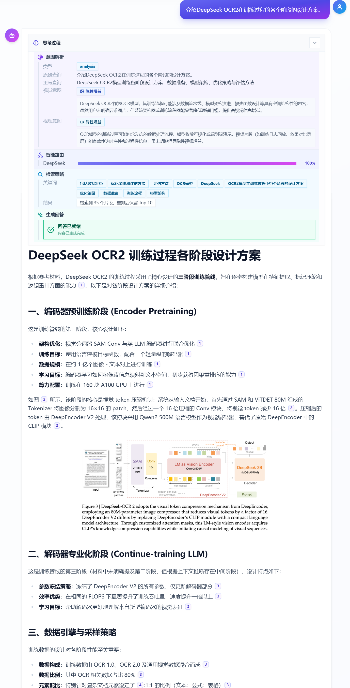
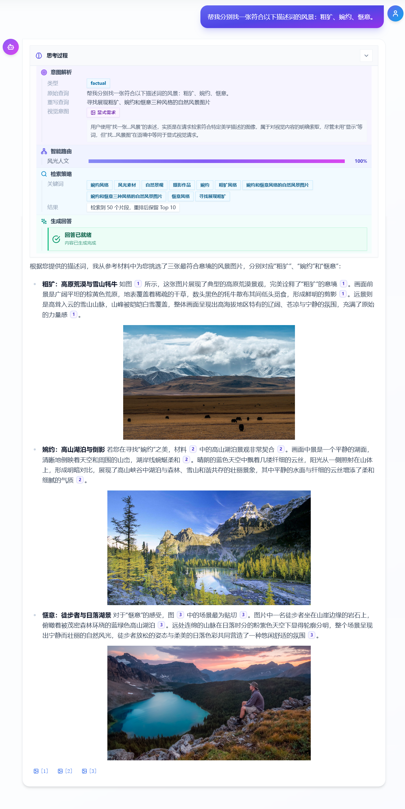
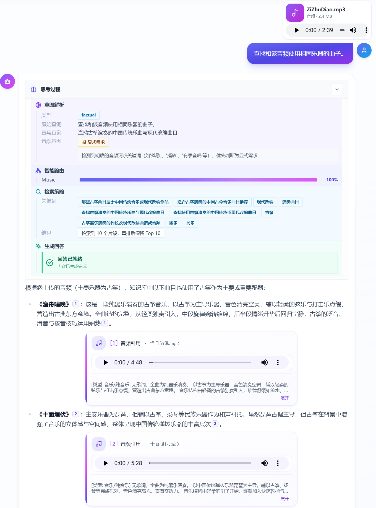
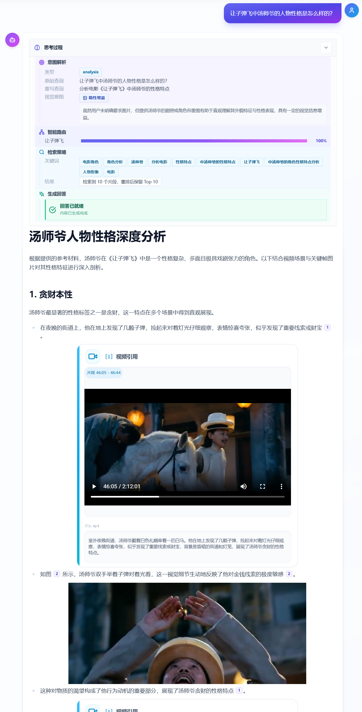
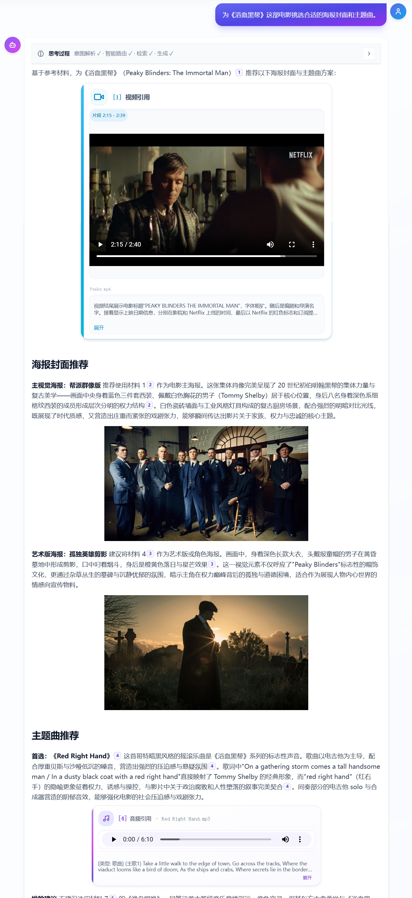
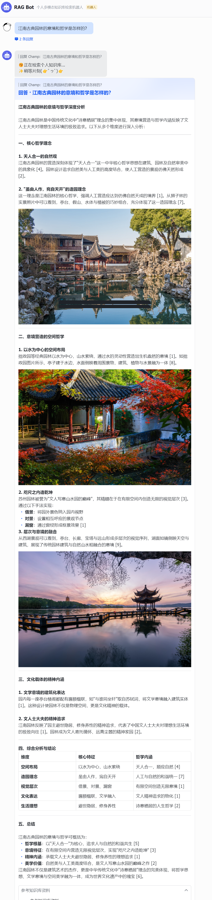

<p align="center">
  
</p>

# Nexus — Multi-Modal Agentic RAG: Intelligent routing & extensible multimodal knowledge base

<p align="center"><strong>English | <a href="README.md">简体中文</a></strong></p>

**Nexus** is a **multimodal Agentic RAG** knowledge-base stack you can self-host: documents, images, and optional audio/video pipelines share one **ingest → portrait routing → hybrid retrieval → streaming generation** path—rather than bolting modalities onto a text-only RAG after the fact. Design goals in three words: **pick the right knowledge bases**, **retrieve evidence across modalities**, **answer with explainable, traceable citations**.

### Nexus at a glance

- **Multi-KB first**: LLM topic summaries plus sub-topic clustering build per-KB portraits; online semantic weighting and thresholds choose single-KB, multi-KB, or full-corpus search and cut wasted scans.
- **Hybrid retrieval + two-stage ranking**: **Dense + BGE-M3 sparse + Visual** at the core; when intent and data allow, audio/video vector search joins in; **weighted RRF** for coarse fusion and **Cross-Encoder** for fine ranking across incomparable scores.
- **One-pass intent**: One structured LLM call yields intent, rewrite, keywords / multi-view queries, and `visual` / `audio` / `video` flags—fewer chained calls, lower latency and cost.
- **Glass-box chat**: SSE streams the reasoning chain (intent, routing, retrieval); answers support hover-to-source citations and `context_window` peeks for debugging and trust.
- **Modular & swappable**: DDD-style backend (Ingestion / Knowledge / Retrieval / Generation); `LLMManager` routes vendors and tasks; data plane MinIO, Qdrant, Redis with Docker Compose for local and team setups.
- **Optional enterprise channel**: Same pipeline for the web UI or **Feishu IM** (long connection, cards, etc.); see the Feishu doc in the index below.

End-to-end RAG for multi-KB, multimodal use: unified document and image retrieval and generation, with audio/video pipelines behind configuration; portrait-based routing; **Dense + BGE-M3 sparse + Visual** hybrid search with **RRF + Cross-Encoder**; SSE for an explainable chain and `context_window`-aware citations.

**Who it’s for**: Developers who want to run a multimodal knowledge base and conversational retrieval locally or in Docker. Configure via [`backend/.env`](backend/.env) (copy from [`backend/.env.example`](backend/.env.example)). Architecture: **[MMA_ARCHITECTURE](docs/MMA_ARCHITECTURE.md)**. Secrets: **[SECURITY](SECURITY.md)**.

## 📑 Contents

- [✨ Features](#features)
- [💬 Chat & retrieval examples](#chat--retrieval-examples)
- [🧩 Core modules](#core-modules)
- [🚀 Quick start](#quick-start)
- [🔧 Optional system dependencies](#optional-system-dependencies)
- [📘 Documentation index](#documentation-index)

<h2 id="features">✨ Features</h2>

### 🎯 Capabilities

- **Multimodal ingestion**: Parse documents (PDF, PPTX, Word, Markdown, etc.), images, audio, and video; inline figures get VLM captions merged back before chunking; uploads, URLs, folder import, trending feeds, and more. Details: **[Multimodal image / audio / video spec](docs/MULTIMODAL_IMAGE_AUDIO_VIDEO_TECHNICAL_SPEC.md)**.
- **Intelligent KB routing**: Portrait generation from LLM topic summaries and sub-topic clustering; weighted aggregation per KB to decide which bases to query.
- **Multimodal hybrid retrieval**: **Dense** (e.g. Qwen3-Embedding) + **Sparse** (BGE-M3) + **Visual** (CLIP + VLM text in the index); with `audio_intent` / `video_intent` and data ready, audio/video vectors join search. **Weighted RRF** + **Cross-Encoder** reranking.
- **One-pass intent**: One LLM call outputs a structured `IntentObject`—intent class, rewrite, keywords / multi-view queries, and `visual` / `audio` / `video` intent.
- **Visible reasoning & citations**: SSE thought stream (intent, routing, retrieval); hover citations and `context_window` context in answers.
- **Feishu integration**: Optional Feishu IM (long connection, cards, Open Platform APIs). Setup: **[FEISHU_BOT_SETUP](docs/FEISHU_BOT_SETUP.md)**; env vars `FEISHU_*` in `backend/.env.example`; code under `backend/app/integrations/`.

### 🏗️ Technical stack

| Layer | Notes |
|------|------|
| **Backend** | FastAPI + Python 3.12; DDD modules (Ingestion / Knowledge / Retrieval / Generation); Core LLM Manager, BGE-M3 sparse encoder, etc. |
| **Frontend** | React + TypeScript + Vite, Tailwind CSS; chat, KB, architecture, debug pages. |
| **Data plane** | MinIO (objects), Qdrant (vectors + sparse), Redis (cache & Celery broker). |
| **Models** | `LLMManager` task routing; SiliconFlow, OpenRouter, Alibaba Bailian, DeepSeek, etc.; embedding / rerank / VLM / CLIP / CLAP as configured. |
| **Deployment** | `docker-compose.yml` for backend deps; frontend dev or standalone build. |

### 📐 Architecture diagram

Layers and major components (see **[MMA_ARCHITECTURE](docs/MMA_ARCHITECTURE.md)** or http://localhost:3000/architecture after startup).


<h2 id="chat--retrieval-examples">💬 Chat & retrieval examples</h2>

Illustrative **web chat** and **Feishu IM (optional)** runs—actual KB content and model answers depend on your deployment.

### 📄 Document retrieval
Query: `Summarize DeepSeek OCR2’s training pipeline design across stages.`



### 🖼️ Image retrieval
Query: `Find one landscape image for each mood: rugged, delicate, relaxed.`



### 🎵 Audio retrieval
Query: `Find pieces that use the same instrument as this audio.` (Example attachment: guzheng piece *Purple Bamboo Melody*.)



### 🎬 Video retrieval
Query: `What is Tang Shiye’s personality in Let the Bullets Fly?`



### 🔀 Multimodal mix (multiple modalities & KBs)
Query: `Pick a suitable poster and theme song for the show Peaky Blinders.`



### 📱 Feishu (optional)

Follow **[FEISHU_BOT_SETUP](docs/FEISHU_BOT_SETUP.md)**. With the bot and websocket enabled, groups and DMs use the same retrieval/generation stack as the web UI; UI may be cards, Posts, etc. (`FEISHU_*` in `backend/.env.example`).



<h2 id="core-modules">🧩 Core modules</h2>

### 1. 📥 Ingestion (ingest & storage)

- **Role**: Parse files and multi-source content, chunk documents, embed, write to object store and vector DB for retrieval and portraits.
- **Parsing**: `ParserFactory` by type—**PDF / DOCX / PPTX**: MinerU; figures go through VLM then merge into text before chunking; **TXT / Markdown**, **images** (PIL / `ImageParser`); **audio** (`AudioParser`: `mp3`/`wav`/`m4a`/`flac`, metadata via `soundfile`/`librosa`); **video** (`VideoParser`: `mp4`/`avi`/`mov`/`mkv`, OpenCV metadata; segmenting and audio extraction need **FFmpeg**, see [optional dependencies](#optional-system-dependencies)). Inline images: VLM caption → MinIO → placeholder in source → unified chunking.
- **Chunking**: **Documents**—recursive semantic chunks (paragraph/sentence first, min/max length, overlap); each chunk has `context_window` (neighbor chunk IDs). **Image / audio / video**—one **record** per asset (single image; whole audio clip; video as multiple points per scene/keyframe).
- **Embedding**:
  - **Documents**: Qwen3-Embedding-8B (dense 4096) + BGE-M3 sparse → `text_chunks`.
  - **Images**: VLM caption → `text_vec` (4096) + CLIP → `clip_vec` (768) → `image_vectors`.
  - **Audio**: ASR + LLM description → text for dense (optional BGE-M3 sparse) + **CLAP** (`clap_vec`, 512) → `audio_vectors`.
  - **Video**: MLLM scene/keyframe plan → `video_vectors` per keyframe (`scene_vec` / `frame_vec` with descriptions; CLIP on frames → `clip_vec`); long-video segmentation; optional audio track extract to `audios/` + ASR. See **[MULTIMODAL_IMAGE_AUDIO_VIDEO_TECHNICAL_SPEC.md](docs/MULTIMODAL_IMAGE_AUDIO_VIDEO_TECHNICAL_SPEC.md)**.
- **Storage**: MinIO per-KB buckets; prefixes `documents/`, `images/`, `audios/`, `videos/` (including `videos/{file_id}/keyframes/`). Qdrant: `text_chunks`, `image_vectors`, `audio_vectors`, `video_vectors`; portraits in `kb_portraits` (Knowledge).
- **Sources & async**: URLs, folders, Tavily trends, media downloads, etc.; heavy jobs via Celery + Redis; frontend polls or streams progress.
- **Entry points**: `modules/ingestion/service.py`, `parsers/factory.py`, `sources/`, `storage/minio_adapter.py`, `storage/vector_store.py`.

### 2. 📚 Knowledge (KB management & portraits)

- **Role**: KB CRUD, portrait build/update, online portrait-based routing when no KB is pinned.
- **KB CRUD**: Create/read/update/delete; routing skipped if the user selects a KB.
- **Portraits**: Sample Text/Image/Audio/Video collections; K-Means (K ≈ sqrt(N/2), capped by config); per-cluster LLM `topic_summary` → embed → `kb_portraits`; replace strategy (delete old portraits for that KB, then insert).
- **Routing**: Dense embedding of `refined_query` against global TopN on `kb_portraits`; aggregate by `kb_id`, position decay, normalize; below threshold → all KBs; else single or top-two by score gap.
- **Entry points**: `modules/knowledge/service.py`, `portraits.py`, `router.py`.

### 3. 🔍 Retrieval (intent & hybrid search)

- **Role**: After One-Pass intent and target KBs, hybrid retrieval and two-stage rerank → Top-K for generation.
- **One-pass intent**: One LLM call → `IntentObject` (`refined_query`, `sparse_keywords`, `multi_view_queries`, `visual_intent` / `audio_intent` / `video_intent`, …); fallback defaults on parse failure.
- **Hybrid search**: Dense (main + multi-view), Sparse (BGE-M3), Visual (dual text_vec/clip_vec on `image_vectors`); optional `audio_vectors` / `video_vectors`; dedupe, weighted RRF.
- **Rerank**: Build (query, content) pairs for Cross-Encoder; merge with RRF for `final_top_k`; quota guards (e.g. images) for `implicit_enrichment`.
- **Entry points**: `modules/retrieval/service.py`, `processors/intent.py`, `processors/rewriter.py`, `search_engine.py`, `reranker.py`.

### 4. 💬 Generation (context & streaming)

- **Role**: Reranked hits → reference map + multimodal prompt → LLM; SSE for thoughts, citations, and tokens.
- **Context**: ReferenceMap (index, `content_type`, `presigned_url`, metadata with `chunk_id`, …); limits `max_context_length`, `max_chunks`, `max_images`, AV caps; Type A/B slots in the prompt.
- **Prompts**: `core/llm/prompt.py`; `[id]` citations and multimodal formatting.
- **Stream**: `thought` / `citation` / `message`; UI: ThinkingCapsule, CitationPopover, lightbox/player.
- **Entry points**: `modules/generation/service.py`, `context_builder.py`, `templates/multimodal_fmt.py`, `stream_manager.py`.

### 5. 🤖 LLM Manager

- **Role**: Route chat/embed/rerank (and more) to models and providers; unify vendor APIs and prompts.
- **Tasks**: e.g. `intent_recognition`, `image_captioning`, `final_generation`, `reranking`, `kb_portrait_generation` → configured models; callers pass `task_type` and params.
- **APIs**: chat, embed, rerank; providers mostly OpenAI-compatible.
- **Providers**: SiliconFlow, OpenRouter, Alibaba Bailian, DeepSeek, …; timeouts and failover configurable.
- **Other Core**: `sparse_encoder.py`, `portrait_trigger.py`, `keyword_extract.py`, etc.
- **Entry points**: `core/llm/manager.py`, `core/llm/__init__.py` (LLMRegistry), `prompt.py`, `prompt_engine.py`, `providers/`.

More design detail: **[MMA_ARCHITECTURE](docs/MMA_ARCHITECTURE.md)**.

<h2 id="quick-start">🚀 Quick start</h2>

**Targets**: Linux, WSL, macOS.

### 🛠️ Requirements

| Dependency | Purpose |
|------------|---------|
| Docker & Docker Compose | MinIO, Qdrant, Redis, … |
| Node.js 20.20.1 | Frontend (npm or pnpm) |
| Python 3.12 | Backend locally |
| LibreOffice | Office → PDF for in-app preview; see [optional dependencies](#optional-system-dependencies) |
| FFmpeg | Video segmenting / audio extract; see [optional dependencies](#optional-system-dependencies) |

### 📦 1. Clone & configure

```bash
git clone https://github.com/Champ-X/MMA-RAG.git
cd MMA-RAG
cp backend/.env.example backend/.env
# Edit backend/.env: fill at least the required keys below (see backend/.env.example)
```

#### Required environment variables

Used for default model routing, multi-provider setup, and MinerU parsing. If local Docker ports match the sample, you can keep Redis/Qdrant/MinIO values from `backend/.env.example`. **For the full experience, configure all listed API keys.**

| Variable | Notes |
|----------|--------|
| `SILICONFLOW_API_KEY` | **SiliconFlow**: default LLM, embedding, rerank, etc. (OpenAI-compatible). Create a key in the [SiliconFlow console](https://cloud.siliconflow.cn/). |
| `OPENROUTER_API_KEY` | **OpenRouter**: when tasks route to OpenRouter models (`core/llm/providers/openrouter.py`, etc.). Keys: [openrouter.ai/keys](https://openrouter.ai/keys). |
| `ALIYUN_BAILIAN_API_KEY` | **Alibaba Bailian (DashScope)**: Tongyi and other Bailian models. [Bailian console](https://bailian.console.aliyun.com/); [API key help](https://help.aliyun.com/zh/model-studio/get-api-key). |
| `MINERU_TOKEN` | **MinerU cloud**: auth for PDF/Word via MinerU API (`ParserFactory`). Apply at [mineru.net](https://mineru.net/) or MinerU/OpenDataLab docs. |

#### Optional environment variables

Omit for defaults/degraded paths; add when you need the feature. Full list: [`backend/.env.example`](backend/.env.example).

| Variable | Notes |
|----------|--------|
| `DEEPSEEK_API_KEY` | **DeepSeek** API when routed. [platform.deepseek.com](https://platform.deepseek.com/) → API keys. |
| `PADDLEOCR_API_URL` / `PADDLEOCR_TOKEN` | **PaddleOCR** layout/VL in PDF paths. Service + token often from [AI Studio](https://aistudio.baidu.com/) or self-hosted; [PaddleOCR docs](https://www.paddleocr.ai/). |
| `TAVILY_API_KEY` | **Tavily** search / trending import. [tavily.com](https://tavily.com/). |
| `SERPAPI_KEY` | **SerpAPI** (e.g. image search import). [serpapi.com/manage-api-key](https://serpapi.com/manage-api-key). |
| `PIXABAY_API_KEY` | **Pixabay** image import. [Pixabay API](https://pixabay.com/api/docs/). |
| `FEISHU_APP_ID` / `FEISHU_APP_SECRET` and other `FEISHU_*` | **Feishu Open Platform**: bot websocket, cards, etc.; align `FEISHU_WS_ENABLED` with docs. [open.feishu.cn/app](https://open.feishu.cn/app). |

### 🐍 2. Python venv & backend deps

From the repo root (isolated venv):

```bash
python3 -m venv .venv
source .venv/bin/activate          # Linux / WSL / macOS
pip install -U pip
pip install -r backend/requirements.txt
```

### ▶️ 3. Start the dev stack

```bash
source .venv/bin/activate           # same venv as above
chmod +x start-dev.sh
./start-dev.sh
```

The script checks `backend/.env`, starts MinIO/Qdrant/Redis via Docker Compose, then runs backend and frontend locally. First run may install LibreOffice/FFmpeg (if the script does) and download CLIP, CLAP, BGE-M3, etc. (see `PRELOAD_LOCAL_MODELS_ON_STARTUP`)—can take a while.

### 🌐 4. URLs

| Service | URL |
|---------|-----|
| Web UI | http://localhost:3000 |
| Backend API | http://localhost:8000 |
| API docs | http://localhost:8000/docs |
| MinIO console | http://localhost:9001 (credentials in `backend/.env` / `docker-compose.yml`; often `minioadmin` locally) |
| Qdrant dashboard | http://localhost:6333/dashboard (port from `QDRANT_PORT` / compose; default `6333`) |


<h2 id="optional-system-dependencies">🔧 Optional system dependencies</h2>

### 📄 Office preview (PPTX / DOCX)

- In-page preview can convert to PDF for iframe viewing.
- Without LibreOffice, UI falls back to text/chunk preview. Linux / WSL:

```bash
sudo apt-get update && sudo apt-get install -y libreoffice
```

### 🎬 Video (FFmpeg)

- Segmenting and audio extraction need `ffmpeg`; missing binary may degrade or error.
- Linux / WSL:

```bash
sudo apt-get update && sudo apt-get install -y ffmpeg
```

- If not on `PATH`, set `FFMPEG_PATH=/your/path/to/ffmpeg` in `backend/.env`.

<h2 id="documentation-index">📘 Documentation index</h2>

| Doc | Description |
|-----|-------------|
| [MMA_ARCHITECTURE](docs/MMA_ARCHITECTURE.md) | Architecture and implementation notes |
| [MULTIMODAL_IMAGE_AUDIO_VIDEO_TECHNICAL_SPEC](docs/MULTIMODAL_IMAGE_AUDIO_VIDEO_TECHNICAL_SPEC.md) | Image / audio / video technical spec |
| [FEISHU_BOT_SETUP](docs/FEISHU_BOT_SETUP.md) | Feishu bot: Open Platform and `FEISHU_*` env |
| [SECURITY.md](SECURITY.md) | Secrets and sensitive data |

---

**Quick try**: `./start-dev.sh` → http://localhost:3000 → create a KB, upload docs or images → chat with citations.

**Value**: unified multimodal retrieval, intelligent KB routing, explainable reasoning, traceable references.
