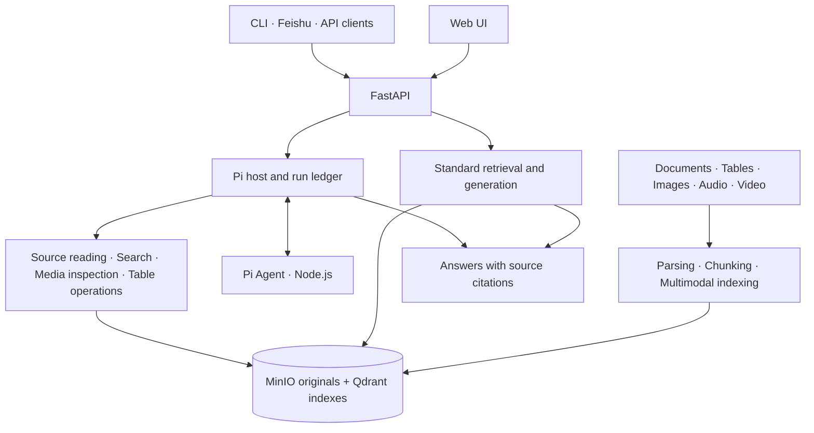

<p align="center">
  
</p>

<h1 align="center">Tessmora</h1>

<p align="center"><strong>Search every modality. Research with an agent. Follow the sources.</strong></p>
<p align="center">Every fragment finds its place.</p>

<p align="center">
  <a href="README.md">简体中文</a> · <strong>English</strong>
</p>

<p align="center">
  <a href="#quick-start">Quick start</a> ·
  <a href="#agent-mode">Agent Mode</a> ·
  <a href="#documentation">Documentation</a> ·
  <a href="#contributing">Contributing</a> ·
  <a href="https://github.com/Champ-X/MMA-RAG/issues">Report an issue</a>
</p>

<p align="center">
  
  
  <a href="https://github.com/Champ-X/MMA-RAG/issues"></a>
</p>

**Tessmora is a self-hosted multimodal RAG workspace with an autonomous research agent.** Bring documents, spreadsheets, images, audio, and video into a knowledge base, search and compare them in natural language, then check answers against source text, image previews, and media segments. The repository and CLI retain the names `MMA-RAG` / `mma-rag`.

Use it to explore research materials, find images and music in a media library, or let an agent investigate a complex question through search, source reading, and evidence gathering.


## What you can do

| Your workflow | How Tessmora supports it |
| --- | --- |
| **Search across formats** | Source-preserving Agentic Chunking for documents, header-preserving row blocks for spreadsheets, and dedicated semantic and vector indexes for images, audio, and video |
| **Find more than keywords** | The standard retrieval pipeline combines Dense, BGE-M3 Sparse, CLIP, and CLAP channels with intent-aware fusion and reranking; topic profiles route queries when no knowledge base is selected |
| **Research complex questions** | Independent Pi Agent Mode chooses when to search, read sources, expand context, inspect media, or calculate over tables before submitting an answer with citations |
| **Check the sources** | Citations link to original files, text context, images, and audio/video time ranges; the agent trace shows actual tool calls, evidence, timing, and errors |
| **Control materials and scope** | Reference knowledge-base files or local attachments with `@`; use knowledge-base and file selectors to constrain search |
| **Connect existing workflows** | Web UI, retrieval and chat APIs, a bundled CLI / Codex Skill, and optional Feishu IM and Docx/Wiki import |

<details>
<summary><strong>View screenshots: documents, images, audio, video, and cross-modal answers</strong></summary>

These existing Web / Feishu examples show retrieval results and media citations. Pi Agent Mode is described separately below. The screenshots use the Chinese interface.

### Document questions

“Summarize the design of each stage in DeepSeek OCR2 training.”


### Image search

“Find one landscape image for each mood: rugged, delicate, and relaxed.”


### Audio search

“Find music that uses the same instrument as this audio.”


### Video questions

“What is Tang Shiye's personality in Let the Bullets Fly?”


### Cross-modal selection

“Choose a suitable poster and theme song for Peaky Blinders.”


### Feishu IM


</details>

## Quick start

The recommended development setup runs **the frontend and backend locally, with storage services in Docker**. The commands below target macOS / Linux; Windows users can use WSL2. The current Compose file does not include the frontend or Pi Node runtime, so it does not start the full product on its own.

### 1. Prerequisites

| Dependency | Requirement and purpose |
| --- | --- |
| Python | **3.11 or 3.12**; the commands below use 3.12 |
| Node.js / npm | **Node.js ≥ 22.19**, meeting both Vite and Pi SDK requirements |
| Docker + Compose | A running Docker daemon for MinIO, Qdrant, and Redis |
| FFmpeg / ffprobe | Audio/video inspection, conversion, and frame extraction |
| LibreOffice | DOCX/PPTX conversion to PDF and previews; `fonts-noto-cjk` is recommended for Chinese documents on Linux |

### 2. Clone and configure providers

```bash
git clone https://github.com/Champ-X/MMA-RAG.git
cd MMA-RAG
cp backend/.env.example backend/.env
```

Edit `backend/.env` with the credentials you need. **Clear the `your_...` placeholder values for unused services.** The current default routes use:

| Setting | Default use |
| --- | --- |
| `SILICONFLOW_API_KEY` | Text embeddings and reranking: Qwen3 Embedding / Reranker |
| `DEEPSEEK_API_KEY` | Text answers, intent recognition, document chunking, and the Pi main model: `deepseek-flash` |
| `ALIYUN_BAILIAN_API_KEY` | Default image understanding, audio transcription, video parsing, and Pi media inspection |
| `MINERU_TOKEN` | Optional MinerU cloud document parsing; local and alternative parsing paths depend on file type and installed dependencies |
| `OPENROUTER_API_KEY` | Optional; required when selecting OpenRouter models |

For a first Markdown / TXT document query, start with SiliconFlow and DeepSeek; add Bailian for the default media capabilities. See the [environment example](backend/.env.example) for other parsers, import sources, and Feishu settings. Standard model routes can be changed in the settings UI; Pi uses [separate configuration](docs/PI_AGENT_MODE.md).

**Self-hosted does not mean offline inference.** MinIO / Qdrant store your original files and indexes locally, while default parsing and model calls may send content to your configured providers and incur API charges.

### 3. Install and start

Run from the repository root. For Python 3.11, replace the first command with `python3.11 -m venv .venv`.

```bash
python3.12 -m venv .venv
source .venv/bin/activate
python -m pip install --upgrade pip
python -m pip install -r backend/requirements.txt
npm --prefix frontend ci
npm --prefix agent-runtime ci
./start-dev.sh
```

The script checks or attempts to install FFmpeg / LibreOffice, starts the three storage services, then starts FastAPI and Vite. It does not start Celery workers or Flower by default. First use downloads local models such as BGE-M3, CLIP, and CLAP; the example configuration enables startup preloading, so allow time, disk space, and memory for model loading.

| Entry point | Default URL |
| --- | --- |
| Web UI | [localhost:3000](http://localhost:3000) |
| API documentation | [localhost:8000/docs](http://localhost:8000/docs) |
| Service health | [localhost:8000/health](http://localhost:8000/health) |
| MinIO Console | [localhost:9001](http://localhost:9001) |
| Qdrant Dashboard | [localhost:6333/dashboard](http://localhost:6333/dashboard) |

### 4. Get your first cited answer

1. Open the Web UI and create a knowledge base.
2. Upload your own document, or use the repository's synthetic Chinese example [`ops-rollback.md`](evals/baseline_v1/corpus/ops-rollback.md). Wait for processing to finish.
3. Select that knowledge base and use Direct retrieval to ask: **“什么情况下必须回滚？回滚后如何验证？”** (“When is rollback required, and how should it be verified?”).
4. Open the answer's citations and check the source's trigger conditions, three `/ready` checks, and 15-minute observation period.
5. Toggle `π` on the left of the composer to try Agent Mode, then expand its trace to inspect the sources and tools it actually used.

A successful `/health` response only confirms that the API has started. Complete an upload, retrieval, and citation check to verify the path you intend to use.

<details>
<summary>Startup troubleshooting and restored data</summary>

- **The page does not open:** check the Vite URL in your terminal; it may select another port if 3000 is busy. The API defaults to 8000.
- **A model or tool call fails:** check provider credentials, account balance, and model access. Pi also requires the `agent-runtime` dependencies and a supported Node.js version.
- **The first startup is slow:** inspect model download logs and `HF_ENDPOINT`. Setting `PRELOAD_LOCAL_MODELS_ON_STARTUP=false` defers loading until first use; it does not remove the model dependencies.
- **Media previews fail:** make sure `MINIO_PUBLIC_ENDPOINT` is reachable from the browser, rather than a container-only address such as `minio:9000`.
- **Restoring an existing local dataset:** use `./scripts/start-restored.sh` only with the corresponding restored MinIO/Qdrant storage directories. Its default Web port is 3001, and startup does not trigger re-ingestion. See the [local migration notes](docs/local-data-migration.md).

</details>

## Agent Mode

Tessmora has two independent answering paths that can be switched within a conversation:

| Path | Behavior | Entry points |
| --- | --- | --- |
| **Standard retrieval** | `direct` retrieves in one round; `agent` gathers more evidence within round, query, and evidence budgets; `auto` chooses between them | Web, `/api/chat/*`, `mma-rag ask` |
| **Pi Agent Mode** | Uses the [Pi Agent SDK](https://github.com/earendil-works/pi) to plan, select tools, and write answers independently of standard retrieval orchestration | Web composer `π`, `/api/pi/*` |

Pi can list sources, perform exact or hybrid search, read paginated source text, expand adjacent context, recall evidence, inspect images/PDF pages/audio/video segments, and perform deterministic filtering, grouping, and calculations on CSV/TSV/XLSX files. Source-access tools are read-only; arbitrary shell and code execution are not exposed.

`@` materials support reading and comparison; **they do not automatically expand search scope**. A local ledger stores run events, evidence, and attachments for cancellation, event reconnection, and history recovery. A server restart marks unfinished runs as interrupted instead of automatically executing them again.

Pi currently has **no application-level per-run cap on duration, tokens, or total tool calls**. Long tasks remain subject to model context, provider, and machine limits and can be stopped by the user. Citation checks validate evidence identity and numbering; answer completeness and source support still need review. See the [Pi mode guide](docs/PI_AGENT_MODE.md) for configuration, tool contracts, and known limitations.

## Architecture


```mermaid
flowchart TB
    Files[Documents · Tables · Images · Audio · Video] --> Ingest[Parsing · Chunking · Multimodal indexing]
    Ingest --> Storage[(MinIO originals + Qdrant indexes)]
    Web[Web UI] --> API[FastAPI]
    Integrations[CLI · Feishu · API clients] --> API
    API --> Classic[Standard retrieval and generation]
    API --> Host[Pi host and run ledger]
    Host <--> Pi[Pi Agent · Node.js]
    Classic --> Storage
    Host --> Tools[Source reading · Search · Media inspection · Table operations]
    Tools --> Storage
    Classic --> Answer[Answers with source citations]
    Host --> Answer
```

The frontend uses React / TypeScript, the backend uses FastAPI / Python, and the Pi SDK runs in separate Node processes. Both answering paths reuse existing knowledge data while retaining their own orchestration and retrieval logic.

| Source directory | Responsibility |
| --- | --- |
| [`frontend/`](frontend/) | Knowledge bases, chat, media citations, and agent traces |
| [`backend/app/modules/ingestion/`](backend/app/modules/ingestion/) | Parsing, source-preserving chunking, and multimodal vectorization |
| [`backend/app/modules/retrieval/`](backend/app/modules/retrieval/) · [`agent/`](backend/app/modules/agent/) | Standard hybrid retrieval, reranking, and bounded multi-round agents |
| [`backend/app/modules/pi_agent/`](backend/app/modules/pi_agent/) · [`agent-runtime/`](agent-runtime/) | Pi host, source tools, persistent ledger, and agent loop |
| [`backend/app/modules/generation/`](backend/app/modules/generation/) · [`core/llm/`](backend/app/core/llm/) | Standard answer generation, providers, and task routing |

## API and integrations

Use the read-only retrieval API to obtain `doc | image | audio | video` evidence. Replace `KB_ID` with a real knowledge-base ID:

```bash
curl -X POST http://localhost:8000/api/v1/retrieval/search \
  -H 'Content-Type: application/json' \
  -d '{"query":"什么情况下必须回滚？","knowledge_base_ids":["KB_ID"],"top_k":5}'
```

Standard chat uses `/api/chat/message` or `/api/chat/stream`. Pi creates tasks through `/api/pi/runs` and exposes their progress through its event endpoint. Inspect the request schemas in [OpenAPI](http://localhost:8000/docs) after startup.

The bundled CLI runs directly from the repository. To install the Codex Skill, run `./scripts/install-codex-skill.sh`:

```bash
skills/mma-rag/scripts/mma-rag health
skills/mma-rag/scripts/mma-rag kb list
skills/mma-rag/scripts/mma-rag search --query "When is rollback required?" --kb-id KB_ID
skills/mma-rag/scripts/mma-rag ask --query "Summarize the rollback procedure" --kb-id KB_ID --agent-mode auto
```

The CLI's `--agent-mode` selects standard `direct / auto / agent` behavior, not Pi. Feishu IM currently uses Direct retrieval. See the [CLI reference](skills/mma-rag/references/cli-reference.md) and [Feishu setup guide](docs/FEISHU_BOT_SETUP.md).

## Verification and evaluation

The repository includes automated tests, an isolated RAG evaluation runner, and Pi verification reports that preserve candidate results. The public baseline contains **7 synthetic documents and 8 questions**. It supports retrieval and generation regression checks, rather than establishing general multimodal accuracy or production performance guarantees.

With the backend virtual environment activated, run these basic checks from the repository root:

```bash
npm --prefix frontend test
npm --prefix frontend run build
npm --prefix agent-runtime test
./scripts/rag-eval validate
```

Select backend tests for the modules you change. The [recent regression record](docs/qa/pi-agent-publication-2026-10-07.md) includes actual commands and coverage; some tests require storage services. See the [RAG evaluation guide](docs/RAG_EVALUATION.md) for metrics, independent judging, data isolation, and report comparison, and the [Pi verification record](docs/PI_AGENT_VERIFICATION.md) for functional checks and failed cases.

## Deployment boundaries

- **Designed for a local single-user workspace or trusted network.** The application does not yet provide complete user authentication, tenant isolation, or knowledge-base ACLs; standard API CORS allows all origins. Public access requires an authentication gateway, TLS, origin restrictions, and rate limits. See [SECURITY.md](SECURITY.md).
- **Pi has separate access controls.** It defaults to local access and supports a server-side access token and knowledge-base allowlist. These do not replace application-wide user authorization.
- **Persistence differs by path.** Pi uses a local SQLite ledger with one host holding the lock per data directory. Standard backend sessions and some statistics remain in process memory; the application is not ready for stateless horizontal scaling.
- **Retrieval and media interpretation can be wrong.** Traceable citations do not prove semantic correctness, and sampled video frames are not exhaustive observation. Check important conclusions against original sources.

## Documentation

Most detailed guides are currently in Chinese; the CLI reference and security policy are in English.

| Guide | Contents |
| --- | --- |
| [Pi Agent Mode](docs/PI_AGENT_MODE.md) | Autonomous research, source tools, configuration, and run semantics |
| [Architecture](docs/MMA_ARCHITECTURE.md) | Ingestion and standard retrieval/generation; use the separate guide for Pi |
| [Multimodal specification](docs/MULTIMODAL_IMAGE_AUDIO_VIDEO_TECHNICAL_SPEC.md) | Image, audio, and video parsing units, fields, and indexes |
| [Inline references and attachments](docs/chat-inline-references.md) | `@` materials, editing, and citation previews |
| [Model-call reliability](docs/MODEL_CALL_RELIABILITY.md) | Model routing, health, and fallback behavior |
| [CLI reference](skills/mma-rag/references/cli-reference.md) · [Feishu setup](docs/FEISHU_BOT_SETUP.md) | External workflows and configuration |
| [RAG evaluation](docs/RAG_EVALUATION.md) · [Pi verification](docs/PI_AGENT_VERIFICATION.md) | Reproduction, coverage, and result boundaries |
| [Jev experiment decisions](docs/research/JEV-DECISIONS.md) | Optional semantic judgment and citation diagnostics; disabled by default |
| [Security](SECURITY.md) · [Historical changelog](CHANGELOG.md) | Deployment requirements and recorded changes |

## Contributing

Use [Issues](https://github.com/Champ-X/MMA-RAG/issues) to report bugs or suggest improvements, and [Pull Requests](https://github.com/Champ-X/MMA-RAG/pulls) to submit changes. Chinese and English are both welcome.

- **Report a bug:** include the commit SHA, OS, runtime versions, selected mode, minimal reproduction, and redacted logs. Describe expected and actual behavior.
- **Submit a change:** focus on one problem and explain the purpose, validation commands, and results. Include screenshots for UI changes and reproducible inputs and sources for model or retrieval changes.
- **Improve documentation:** keep feature and setup instructions aligned across both READMEs; distinguish experimental candidates from delivered behavior.
- **Protect data:** do not commit API keys, `.env` files, user knowledge bases, or unredacted run artifacts. Report security issues privately as described in the [security policy](SECURITY.md#reporting).

## License

The repository does not currently include a `LICENSE` file or declare an open-source license. Confirm permission with the maintainers before using, modifying, or redistributing the code.

## Acknowledgments

Tessmora builds on projects including [Pi](https://github.com/earendil-works/pi), [Qdrant](https://github.com/qdrant/qdrant), [MinIO](https://github.com/minio/minio), [FlagEmbedding](https://github.com/FlagOpen/FlagEmbedding), [CLIP](https://github.com/openai/CLIP), [CLAP](https://github.com/LAION-AI/CLAP), [FastAPI](https://github.com/fastapi/fastapi), and [React](https://github.com/facebook/react). Thanks to their maintainers and contributors.
