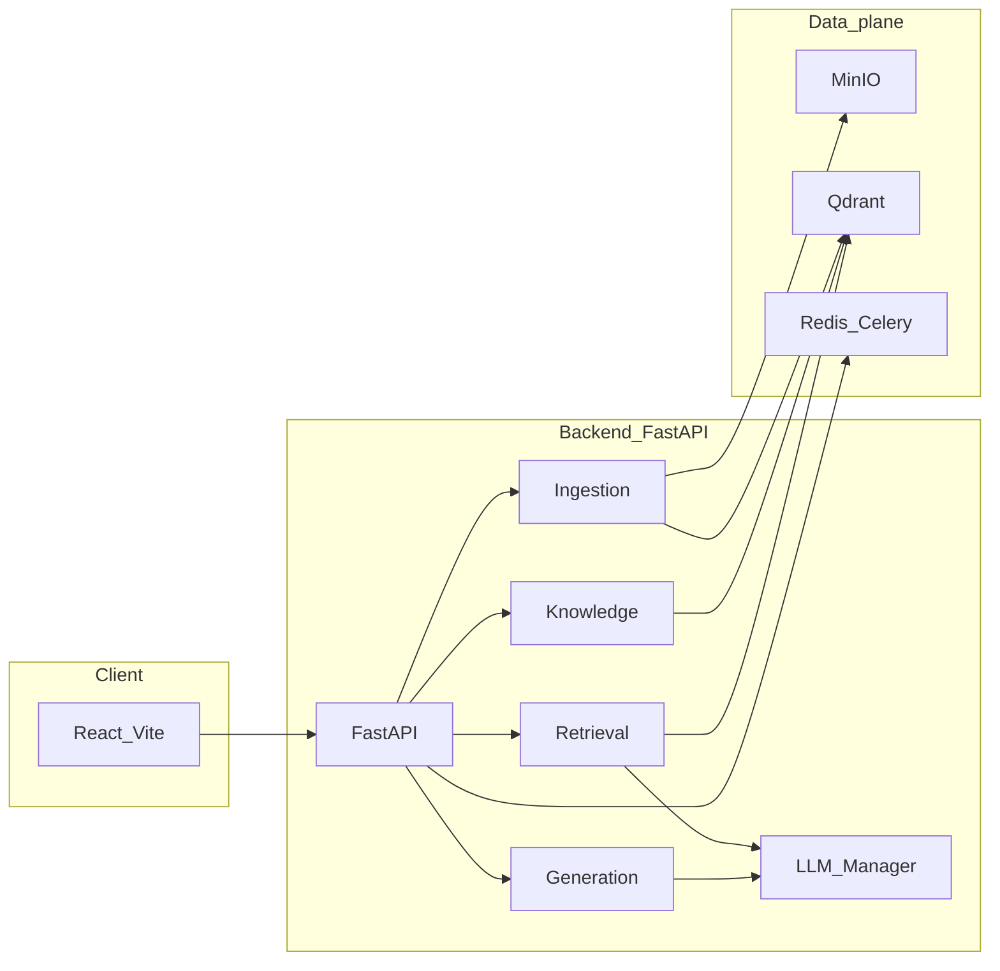

# MMA · Multi-Modal 智能路由可扩展知识库 RAG Agent

面向多知识库、多模态场景的 RAG（Retrieval-Augmented Generation）系统：在文档与图像统一检索与生成之上，可按配置扩展音频与视频流水线；基于知识库画像做智能路由；以 **Dense + BGE-M3 稀疏 + Visual** 为主干做三路混合检索，辅以 **RRF 粗排与 Cross-Encoder 精排**；通过 SSE 推送可解释思考链与带 `context_window` 的引用。

**适用场景**：希望在本地或 Docker 中自建多模态知识库与对话式检索的开发者。配置入口为 [`backend/.env`](backend/.env)（由 [`backend/.env.example`](backend/.env.example) 复制），设计细节见 **[docs/MMA_ARCHITECTURE.md](docs/MMA_ARCHITECTURE.md)**，密钥管理见 **[SECURITY.md](SECURITY.md)**。

## 目录

- [项目特色](#项目特色)
- [系统架构概览](#系统架构概览)
- [项目结构](#项目结构)
- [核心模块概览](#核心模块概览)
- [快速开始](#快速开始)
- [Docker 部署](#docker-部署)
- [配置要点](#配置要点)
- [故障排除](#故障排除)
- [测试与调试](#测试与调试)
- [可选系统依赖](#可选系统依赖)
- [文档索引](#文档索引)
- [许可证与联系](#许可证与联系)

## 项目特色

### 核心能力

- **多模态数据处理**：PDF、Word、TXT、Markdown、图片等解析；文档内嵌图经 VLM 描述后插回原文再分块；支持本地上传、URL、文件夹、热点订阅等多来源接入。音频、视频解析与向量化见 **[docs/MULTIMODAL_IMAGE_AUDIO_VIDEO_TECHNICAL_SPEC.md](docs/MULTIMODAL_IMAGE_AUDIO_VIDEO_TECHNICAL_SPEC.md)**。
- **智能知识库路由**：基于 K-Means + LLM 主题摘要的画像生成，TopN 检索 + 按知识库加权聚合，自动决策单库 / 多库 / 全库。
- **混合检索与两阶段重排**：**Dense**（如 Qwen3-Embedding）+ **Sparse**（BGE-M3）+ **Visual**（CLIP + VLM 描述写入索引）；在 `audio_intent` / `video_intent` 与数据就绪时并入音频、视频向量检索。**加权 RRF 粗排** + **Cross-Encoder 精排**。
- **One-Pass 意图识别**：意图分类、查询改写、关键词 / 多视角生成与 `visual` / `audio` / `video` 意图在一次 LLM 调用中输出结构化 `IntentObject`。
- **可解释与调试**：SSE 推送思考链（意图、路由、检索策略）；引用悬浮与 `context_window` 前后文透视。
- **可选集成**：飞书 IM（长连接、卡片、开放平台 API）为可选部署能力，详见 `backend/app/integrations/` 与 `backend/.env.example` 中相关变量。

### 技术架构

| 层级 | 说明 |
|------|------|
| **后端** | FastAPI + Python 3.9+；DDD 模块化（Ingestion / Knowledge / Retrieval / Generation）；Core 层 LLM Manager、BGE-M3 稀疏编码等。 |
| **前端** | React + TypeScript + Vite，Tailwind CSS；对话、知识库、架构说明、调试等页面。 |
| **数据平面** | MinIO（对象）、Qdrant（向量与稀疏索引）、Redis（缓存与 Celery 队列）。 |
| **模型** | LLMManager 按任务路由；支持 SiliconFlow、OpenRouter、阿里云百炼、DeepSeek 等；Embedding / Rerank / VLM / CLIP / CLAP 等按配置启用。 |
| **部署** | `docker-compose.yml` 编排后端与依赖；前端可本地开发或单独构建。 |

### 系统架构概览



## 项目结构

```
MMA-RAG/
├── backend/                    # 后端 (Python / FastAPI)
│   ├── app/
│   │   ├── api/                # 接口层：chat、upload、knowledge、import、debug 等
│   │   ├── core/               # 配置、LLM Manager、sparse_encoder、portrait_trigger
│   │   ├── modules/            # 业务模块
│   │   │   ├── ingestion/      # 解析、分块、向量化、sources、MinIO/Qdrant
│   │   │   ├── knowledge/      # 知识库 CRUD、画像生成、路由
│   │   │   ├── retrieval/      # 意图、改写、混合检索、重排
│   │   │   └── generation/     # 上下文构建、流式输出
│   │   ├── integrations/       # 可选：飞书等外部通道
│   │   └── tasks/              # 定时/异步任务（如热点导入）
│   ├── celery_app.py
│   ├── requirements.txt
│   ├── Dockerfile
│   └── .env.example            # 复制为 .env 并填写密钥（勿提交 .env）
├── frontend/                   # 前端 (React / TypeScript / Vite)
│   ├── src/
│   │   ├── components/         # chat、knowledge、architecture、settings、debug
│   │   ├── data/               # 架构页数据等
│   │   ├── services/           # API、SSE
│   │   ├── store/
│   │   ├── hooks/
│   │   └── pages/
│   ├── package.json
│   └── vite.config.ts
├── docs/                       # 架构与设计文档
│   ├── MMA_ARCHITECTURE.md
│   └── MULTIMODAL_IMAGE_AUDIO_VIDEO_TECHNICAL_SPEC.md
├── docker-compose.yml
├── start-dev.sh                # 开发环境启动（Docker 依赖 + 本地前后端）
└── README.md
```

## 核心模块概览

### 1. Ingestion（数据输入处理与存储）

- **职责**：将各类文件与多来源内容解析、分块、向量化后写入对象存储与向量库，为检索与画像提供数据基础。
- **解析**：`ParserFactory` 按类型调度——**PDF**：MinerU API → 本地 MinerU 2.5 → PaddleOCR-VL-1.5 → PyMuPDF 兜底；**DOCX / PPTX**：MinerU API → 本地 MinerU → python-docx / python-pptx（部分路径依赖 LibreOffice）；TXT/Markdown、图片（PIL）。文档内嵌图先 VLM 描述并上传 MinIO，再将 caption 插回原文占位符后统一分块。
- **分块**：递归语义分块（段落/句子优先，max/min 长度与重叠窗口）；每个 chunk 带 `context_window`（前后 chunk ID）便于调试。
- **向量化**：文档——Qwen3-Embedding-8B（Dense 4096 维）+ BGE-M3 稀疏，写入 `text_chunks`；图片——VLM caption 的 `text_vec` + CLIP `clip_vec`，写入 `image_vectors`；音频 / 视频见多模态文档与 `vector_store` 中对应集合。
- **存储**：MinIO 按知识库与类型组织路径；Qdrant 存 `text_chunks`、`image_vectors` 等；画像由 Knowledge 写入 `kb_portraits`。
- **多来源与异步**：sources 层支持 URL、文件夹、Tavily 热点、媒体下载等；大任务经 Celery + Redis，前端可轮询或流式查进度。
- **代码入口**：`modules/ingestion/service.py`、`parsers/factory.py`、`sources/`、`storage/minio_adapter.py`、`storage/vector_store.py`。

### 2. Knowledge（知识库管理与画像）

- **职责**：知识库 CRUD、画像生成与更新、基于画像的在线路由（未指定知识库时自动选库）。
- **知识库 CRUD**：创建/查询/更新/删除；用户指定知识库时可跳过路由。
- **画像生成**：从该 KB 的 Text、Image、Audio、Video 等集合按比例采样；K-Means（K = sqrt(N/2)，受配置上限约束）；每簇抽样经 LLM 生成 `topic_summary` 后向量化写入 `kb_portraits`；Replace 策略（先删该 KB 旧画像再插入）。
- **路由决策**：`refined_query` 的 Dense 向量在 `kb_portraits` 上全局 TopN；按 `kb_id` 聚合、位置衰减加权、归一化；低于阈值则全库，否则按分差决定单库或前两库。
- **代码入口**：`modules/knowledge/service.py`、`portraits.py`、`router.py`。

### 3. Retrieval（语义路由与混合检索）

- **职责**：One-Pass 意图、目标知识库确定后的混合检索与两阶段重排，输出供生成的 Top-K。
- **One-Pass 意图**：一次 LLM 调用输出 `IntentObject`（含 `refined_query`、`sparse_keywords`、`multi_view_queries`、`visual_intent` / `audio_intent` / `video_intent` 等）；解析失败时回退默认意图。
- **混合检索**：Dense（主查询 + 多视角融合）、Sparse（BGE-M3）、Visual（`image_vectors` 上 text_vec/clip_vec 双路）；在意图与数据允许时检索 `audio_vectors`、`video_vectors`；多路结果去重后加权 RRF 粗排。
- **两阶段重排**：候选构建 (query, content) 对送 Cross-Encoder；与 RRF 分加权合并得 `final_top_k`；`implicit_enrichment` 等场景可做图片等配额保护。
- **代码入口**：`modules/retrieval/service.py`、`processors/intent.py`、`processors/rewriter.py`、`search_engine.py`、`reranker.py`。

### 4. Generation（上下文构建与生成）

- **职责**：重排结果 → 引用映射与多模态 Prompt → LLM 生成；SSE 推送思考链、引用与正文。
- **上下文构建**：ReferenceMap（序号、`content_type`、`presigned_url`、metadata 含 `chunk_id` 等）；按 `max_context_length`、`max_chunks`、`max_images` 及音视频上限控制长度；Type A/B 插槽填入 Prompt。
- **提示词**：`core/llm/prompt.py` 集中管理；规定 `[id]` 引用与多模态描述方式。
- **流式输出**：`thought` / `citation` / `message`；前端 ThinkingCapsule、CitationPopover、灯箱/播放器等。
- **代码入口**：`modules/generation/service.py`、`context_builder.py`、`templates/multimodal_fmt.py`、`stream_manager.py`。

### 5. LLM Manager（模型管理与路由）

- **职责**：按任务类型将 chat/embed/rerank 等请求路由到对应模型与 Provider；统一多厂商 API 与提示词。
- **任务路由**：如 `intent_recognition`、`image_captioning`、`final_generation`、`reranking`、`kb_portrait_generation` 等映射到具体模型；业务层传 `task_type` 与参数即可。
- **统一接口**：chat、embed、rerank；Provider 侧多为 OpenAI 兼容协议。
- **多厂商**：SiliconFlow、OpenRouter、阿里云百炼、DeepSeek 等；可配置超时与故障转移。
- **其它 Core**：`sparse_encoder.py`、`portrait_trigger.py`、`keyword_extract.py` 等。
- **代码入口**：`core/llm/manager.py`、`core/llm/__init__.py`（LLMRegistry）、`prompt.py`、`prompt_engine.py`、`providers/`。

更细的设计与边界说明见 **[docs/MMA_ARCHITECTURE.md](docs/MMA_ARCHITECTURE.md)**。

## 快速开始

### 环境要求

| 依赖 | 说明 |
|------|------|
| Docker & Docker Compose | 启动 MinIO、Qdrant、Redis 等 |
| Node.js 18+ | 前端（npm 或 pnpm） |
| Python 3.9+ | 本地运行后端时 |
| LibreOffice | 可选：Office 预览转 PDF，见 [可选系统依赖](#可选系统依赖) |
| FFmpeg | 可选：视频解析/切段，见 [可选系统依赖](#可选系统依赖) |

### 1. 克隆与配置

```bash
git clone <repository-url>
cd MMA-RAG
cp backend/.env.example backend/.env
# 编辑 backend/.env：至少填写 SILICONFLOW_API_KEY（必填）
```

**必填与常用环境变量（完整列表见 `backend/.env.example`）**

| 变量 | 说明 |
|------|------|
| `SILICONFLOW_API_KEY` | 必填。默认 LLM/Embedding 等多走 SiliconFlow；也可改用其他 Provider 并填对应 Key。 |
| `REDIS_URL` | 本地开发常为 `redis://localhost:6379/0`（与 Docker 内 Redis 一致）。 |
| `QDRANT_HOST` / `QDRANT_PORT` | 本地一般为 `localhost` / `6333`。 |
| `MINIO_*` | 本地 Docker 默认 `minioadmin` / `minioadmin`；生产务必修改。 |

可选：`DEEPSEEK_API_KEY`、`OPENROUTER_API_KEY`、`ALIYUN_BAILIAN_API_KEY`、`TAVILY_API_KEY`、飞书相关变量等。

前端默认请求 `http://localhost:8000/api`；构建时可通过环境变量 `VITE_API_BASE_URL` 覆盖（见 [`frontend/src/services/api_client.ts`](frontend/src/services/api_client.ts)）。

### 2. 启动开发环境

```bash
chmod +x start-dev.sh
./start-dev.sh
```

脚本会检查 `backend/.env` 是否存在，用 `docker compose --env-file backend/.env` 启动依赖，再在本地启动后端与前端。

### 3. 访问

| 服务 | 地址 |
|------|------|
| 前端 | http://localhost:3000 |
| 后端 API | http://localhost:8000 |
| Swagger 文档 | http://localhost:8000/docs |
| MinIO 控制台 | http://localhost:9001（账号密码与 `backend/.env` 或 `docker-compose.yml` 一致，本地多为 `minioadmin`） |

## Docker 部署

必须使用 `backend/.env` 注入 `SILICONFLOW_API_KEY` 等变量：

```bash
docker compose --env-file backend/.env up -d
docker compose --env-file backend/.env ps
docker compose --env-file backend/.env logs -f
```

主要服务：`backend`、`minio`、`qdrant`、`redis`、`celery_worker`；可选 `celery_flower`（Celery 监控）。**前端**需单独 `npm run dev` / `npm run build` 或使用自己的静态托管。

## 配置要点

- **后端**：[`backend/app/core/config.py`](backend/app/core/config.py) 从 **`backend/.env`** 加载（无文件时可依赖进程环境变量）；模型与任务路由见 Core LLM 层。
- **前端**：API 基地址见 [`frontend/src/services/api_client.ts`](frontend/src/services/api_client.ts)（`VITE_API_BASE_URL`）。
- **勿将真实 `backend/.env` 提交到 Git**；以 [`backend/.env.example`](backend/.env.example) 为模板。

## 故障排除

| 现象 | 处理 |
|------|------|
| 启动报错缺少 `SILICONFLOW_API_KEY` | 已创建并填写 `backend/.env` 后重启后端。 |
| 未找到 `backend/.env` | 执行 `cp backend/.env.example backend/.env` 后再启动。 |
| Compose 容器内无 API Key | 必须使用 `docker compose --env-file backend/.env`，勿仅依赖项目根目录 `.env`。 |

## 测试与调试

- **后端测试**：`cd backend && pytest tests/ -v`（若存在 `tests/`）。
- **端到端**：前端对话页 + 内置架构页中的「RAG 请求链路」；引用与 Inspector 查看调试字段。

## 可选系统依赖

### Office 预览（PPTX / DOCX）

- 页内预览 `pptx`/`docx` 时，后端可先转 PDF 再供 iframe 展示。
- 未安装 LibreOffice 时会回退到文本/分块预览。Linux / WSL 示例：

```bash
sudo apt-get update && sudo apt-get install -y libreoffice
```

### 视频（FFmpeg）

- 视频切段、音轨抽取等依赖系统 `ffmpeg`；未安装时相关流程可能降级或报错。
- Linux / WSL 示例：

```bash
sudo apt-get update && sudo apt-get install -y ffmpeg
```

- 若不在 `PATH` 中，可在 `backend/.env` 设置 `FFMPEG_PATH=/your/path/to/ffmpeg`。

## 文档索引

| 文档 | 说明 |
|------|------|
| [docs/MMA_ARCHITECTURE.md](docs/MMA_ARCHITECTURE.md) | 架构设计与实现要点 |
| [docs/MULTIMODAL_IMAGE_AUDIO_VIDEO_TECHNICAL_SPEC.md](docs/MULTIMODAL_IMAGE_AUDIO_VIDEO_TECHNICAL_SPEC.md) | 图 / 音 / 视多模态技术说明 |
| [SECURITY.md](SECURITY.md) | 密钥与敏感信息 |

## 许可证与联系

- **许可证**：若对外开源，建议在仓库根目录添加 `LICENSE` 文件（例如 MIT）并在此 README 中更新说明。
- **反馈**：欢迎通过 Issues / Discussions 反馈问题与建议。

---

**快速体验**：`./start-dev.sh` → 打开 http://localhost:3000 → 创建知识库并上传文档或图片 → 对话与引用溯源。

**核心价值**：多模态统一检索、知识库智能路由、思考过程可解释、引用可追溯。
