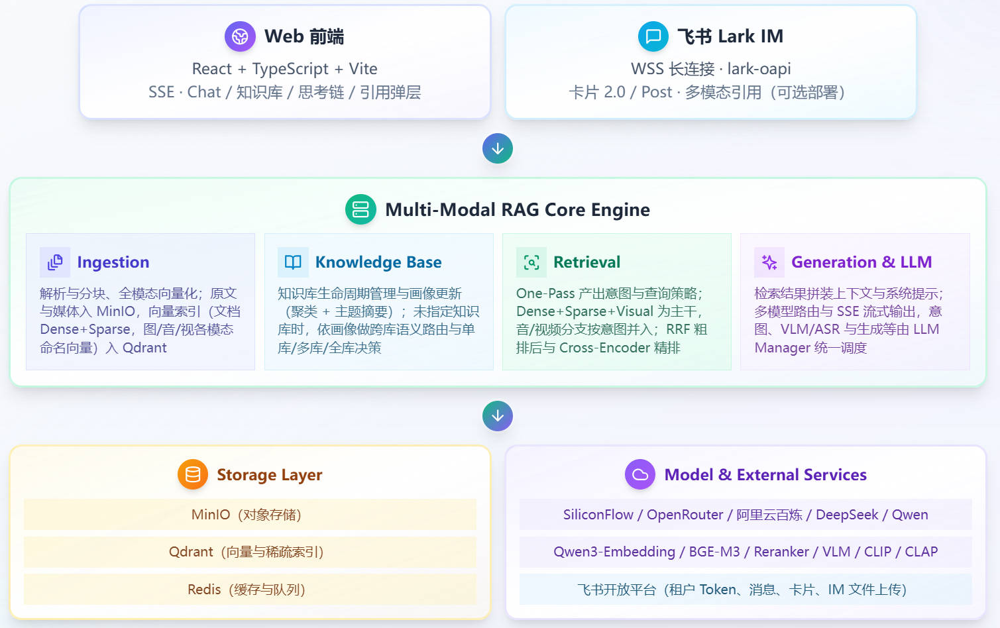
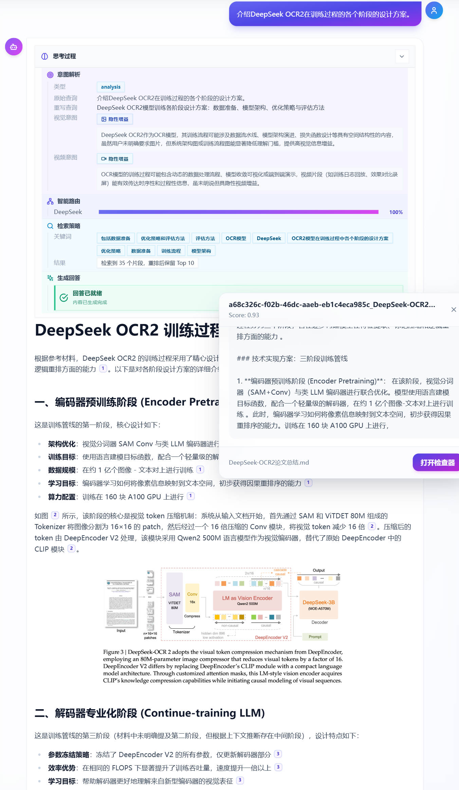
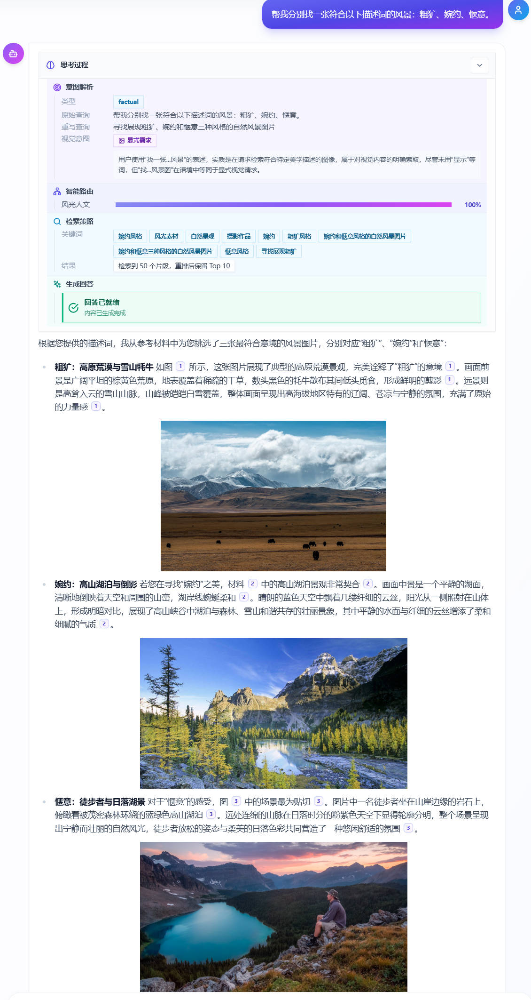
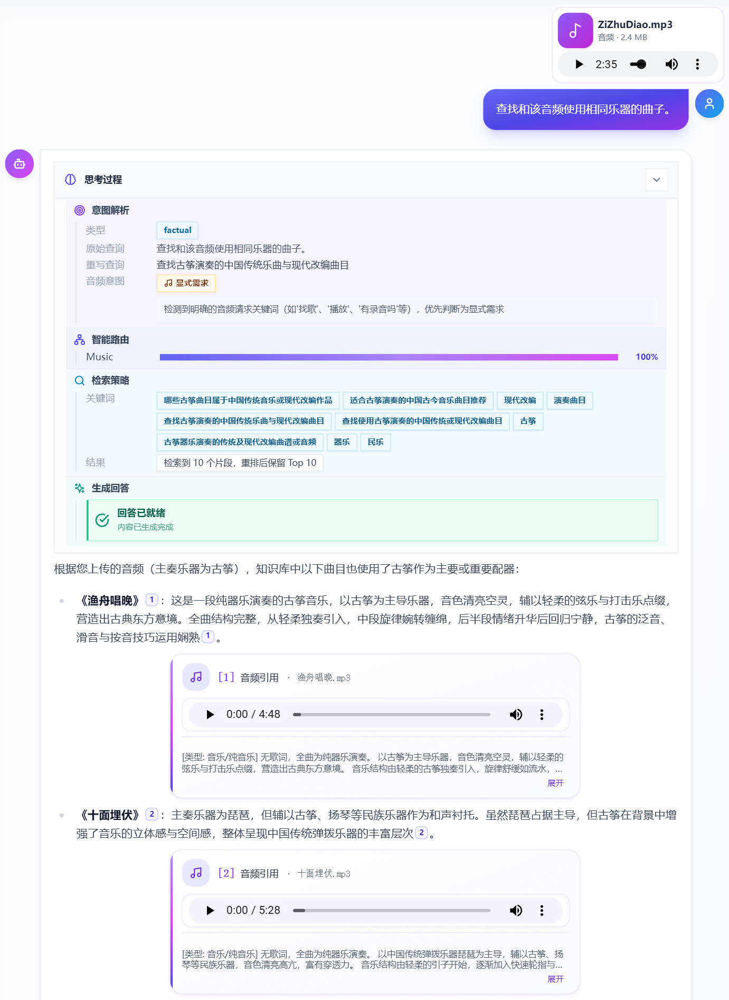
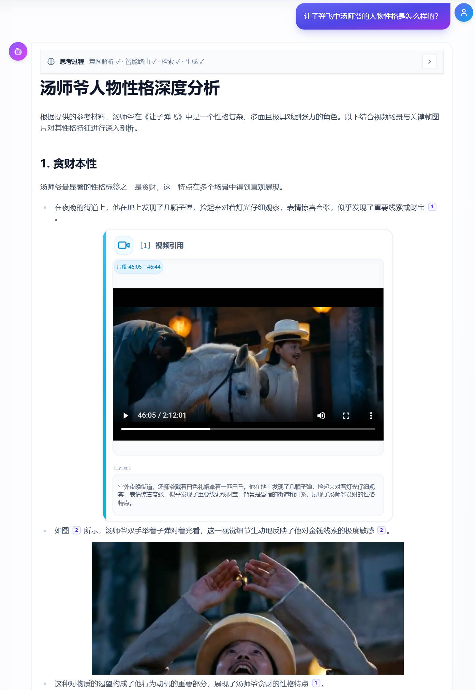
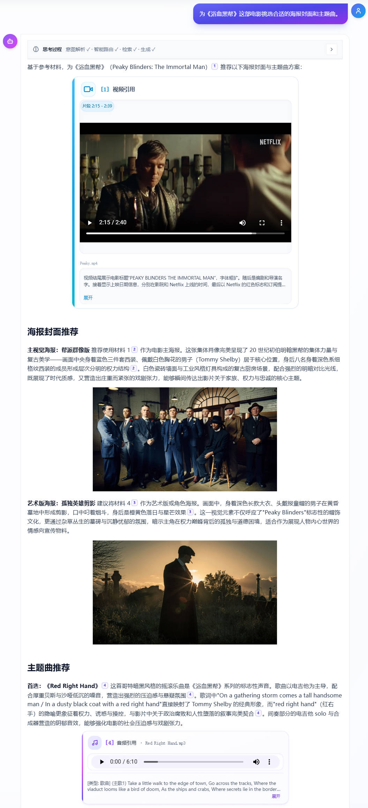

# MMA · Multi-Modal Agentic RAG: 智能路由可扩展知识库

面向多知识库、多模态场景的 RAG（Retrieval-Augmented Generation）系统：在文档与图像统一检索与生成之上，可按配置扩展音频与视频流水线；基于知识库画像做智能路由；以 **Dense + BGE-M3 稀疏 + Visual** 为主干做三路混合检索，辅以 **RRF 粗排与 Cross-Encoder 精排**；通过 SSE 推送可解释思考链与带 `context_window` 的引用。

**适用场景**：希望在本地或 Docker 中自建多模态知识库与对话式检索的开发者。配置入口为 [`backend/.env`](backend/.env)（由 [`backend/.env.example`](backend/.env.example) 复制），设计细节见 **[ARCHITECTURE](docs/MMA_ARCHITECTURE.md)**，密钥管理见 **[SECURITY](SECURITY.md)**。

## 目录

- [项目特色](#项目特色)
- [对话与检索示例](#对话与检索示例)
- [核心模块概览](#核心模块概览)
- [快速开始](#快速开始)
- [可选系统依赖](#可选系统依赖)
- [文档索引](#文档索引)

## 项目特色

### 核心能力

- **多模态数据处理**：文档（PDF、PPTX、Word、Markdown等）、图片、音频、视频的解析；文档内嵌图经 VLM 描述后插回原文再分块；支持本地上传、URL、本地文件夹解析导入、热点联网订阅等多来源接入。图片、音频、视频解析与向量化见 **[多模态数据解析处理细节](docs/MULTIMODAL_IMAGE_AUDIO_VIDEO_TECHNICAL_SPEC.md)**。
- **智能知识库路由**：基于LLM的知识库主题摘要+知识库子主题聚类的画像生成，按知识库加权聚合，根据用户查询自动决策检索哪些知识库。
- **多模态混合检索**：**Dense**（如 Qwen3-Embedding）+ **Sparse**（BGE-M3）+ **Visual**（CLIP + VLM 描述写入索引）；在 `audio_intent` / `video_intent` 与数据就绪时并入音频、视频向量检索。**加权 RRF 粗排** + **Cross-Encoder 精排**。
- **One-Pass 意图识别**：意图分类、查询改写、关键词 / 多视角生成与 `visual` / `audio` / `video` 意图在一次 LLM 调用中输出结构化 `IntentObject`。
- **推理链路可视以及回答引用溯源**：SSE 推送思考链（意图、路由、检索策略）；回答中引用悬浮溯源与 `context_window` 前后文透视。
- **飞书平台集成**：飞书 IM（长连接、卡片、开放平台 API）为可选部署能力，详见 `backend/app/integrations/` 与 `backend/.env.example` 中相关变量。

### 技术架构

| 层级 | 说明 |
|------|------|
| **后端** | FastAPI + Python 3.12；DDD 模块化（Ingestion / Knowledge / Retrieval / Generation）；Core 层 LLM Manager、BGE-M3 稀疏编码等。 |
| **前端** | React + TypeScript + Vite，Tailwind CSS；对话、知识库、架构说明、调试等页面。 |
| **数据平面** | MinIO（对象）、Qdrant（向量与稀疏索引）、Redis（缓存与 Celery 队列）。 |
| **模型** | LLMManager 按任务路由；支持 SiliconFlow、OpenRouter、阿里云百炼、DeepSeek 等；Embedding / Rerank / VLM / CLIP / CLAP 等按配置启用。 |
| **部署** | `docker-compose.yml` 编排后端与依赖；前端可本地开发或单独构建。 |

### 系统架构概览

下图概括整体分层与主要组件关系；更细的模块说明见 **[docs/MMA_ARCHITECTURE.md](docs/MMA_ARCHITECTURE.md)** 或项目启动之后http://localhost:3000/architecture。



## 对话与检索示例

以下为 Web 对话界面中的多模态检索与回答示意（知识库内容与模型回答以实际部署为准）。

### 文档检索
Query: `介绍DeepSeek OCR2在训练过程的各个阶段的设计方案。`


### 图片检索
Query: `帮我分别找一张符合以下描述词的风景：粗犷、婉约、惬意。` 


### 音频检索
Query: `查找和该音频使用相同乐器的曲子。PS:带音频附件`（一个古筝曲子：紫竹调）的检索。


### 视频检索
Query: `让子弹飞中汤师爷的人物性格是怎么样的？`


### 多模态混合（跨多个模态多个知识库的混合检索）
Query: `为《浴血黑帮》这部电影挑选合适的海报封面和主题曲。`


## 核心模块概览

### 1. Ingestion（数据输入处理与存储）

- **职责**：将各类文件与多来源内容解析、分块（文档）、向量化后写入对象存储与向量库，为检索与画像提供数据基础。
- **解析**：`ParserFactory` 按类型调度——**PDF / DOCX / PPTX**：MinerU解析，文档中的图片会VLM之后反嵌入文本再做分块；**TXT / Markdown**、**图片**（PIL / `ImageParser`）；**音频**（`AudioParser`：`mp3`/`wav`/`m4a`/`flac` 等，元数据优先 `soundfile`/`librosa`）；**视频**（`VideoParser`：`mp4`/`avi`/`mov`/`mkv` 等，OpenCV 读元数据；长视频切段、音轨抽取依赖 **FFmpeg**，见 [可选系统依赖](#可选系统依赖)）。文档内嵌图先 VLM 描述并上传 MinIO，再将 caption 插回原文占位符后统一分块。
- **分块**：**文档**为递归语义分块（段落/句子优先，max/min 长度与重叠窗口），每个 chunk 带 `context_window`（前后 chunk ID）便于调试。**图片 / 音频 / 视频**不以传统 chunk 切分，而以**单条记录**为单位入库（图片单张；音频整段；视频按场景/关键帧生成多条向量点，见下）。
- **向量化**：
  - **文档**：Qwen3-Embedding-8B（Dense 4096 维）+ BGE-M3 稀疏 → `text_chunks`。
  - **图片**：VLM caption → `text_vec`（4096）+ CLIP → `clip_vec`（768）→ `image_vectors`。
  - **音频**：ASR 转写 + LLM 内容描述 → 拼接文本做 Dense（及可选 BGE-M3 稀疏）+ **CLAP**（`clap_vec`，512 维）→ `audio_vectors`。
  - **视频**：MLLM 场景与关键帧规划 → 每关键帧写入 `video_vectors`（`scene_vec` / `frame_vec` 与场景、帧描述对应；帧图经 CLIP 得 `clip_vec`）；长视频分段处理；可选从音轨抽音频文件至 `audios/` 再走 ASR。细节见 **[docs/MULTIMODAL_IMAGE_AUDIO_VIDEO_TECHNICAL_SPEC.md](docs/MULTIMODAL_IMAGE_AUDIO_VIDEO_TECHNICAL_SPEC.md)**。
- **存储**：MinIO 按知识库分桶，路径前缀含 `documents/`、`images/`、`audios/`、`videos/`（含 `videos/{file_id}/keyframes/` 关键帧图）。Qdrant 集合包括 `text_chunks`、`image_vectors`、`audio_vectors`、`video_vectors`（画像由 Knowledge 写入 `kb_portraits`）。
- **多来源与异步**：sources 层支持 URL、文件夹、Tavily 热点、媒体下载等；大任务经 Celery + Redis，前端可轮询或流式查进度。
- **代码入口**：`modules/ingestion/service.py`、`parsers/factory.py`、`sources/`、`storage/minio_adapter.py`、`storage/vector_store.py`。

### 2. Knowledge（知识库管理与画像）

- **职责**：知识库 CRUD、画像生成与更新、基于画像的在线路由（未指定知识库时自动选库）。
- **知识库 CRUD**：创建/查询/更新/删除；用户指定知识库时可跳过路由。
- **画像生成**：从该 KB 的 Text、Image、Audio、Video 等集合按比例采样；K-Means（K = sqrt(N/2)，受配置上限约束）；每簇抽样经 LLM 生成 `topic_summary` 后向量化写入 `kb_portraits`；Replace 策略（先删该 KB 旧画像再插入）。
- **路由决策**：`refined_query` 的 Dense 向量在 `kb_portraits` 上全局 TopN；按 `kb_id` 聚合、位置衰减加权、归一化；低于阈值则全库，否则按分差决定单库或前两库。
- **代码入口**：`modules/knowledge/service.py`、`portraits.py`、`router.py`。

### 3. Retrieval（语义路由与混合检索）

- **职责**：One-Pass 意图、目标知识库确定后的混合检索与两阶段重排，输出供生成的 Top-K。
- **One-Pass 意图**：一次 LLM 调用输出 `IntentObject`（含 `refined_query`、`sparse_keywords`、`multi_view_queries`、`visual_intent` / `audio_intent` / `video_intent` 等）；解析失败时回退默认意图。
- **混合检索**：Dense（主查询 + 多视角融合）、Sparse（BGE-M3）、Visual（`image_vectors` 上 text_vec/clip_vec 双路）；在意图与数据允许时检索 `audio_vectors`、`video_vectors`；多路结果去重后加权 RRF 粗排。
- **两阶段重排**：候选构建 (query, content) 对送 Cross-Encoder；与 RRF 分加权合并得 `final_top_k`；`implicit_enrichment` 等场景可做图片等配额保护。
- **代码入口**：`modules/retrieval/service.py`、`processors/intent.py`、`processors/rewriter.py`、`search_engine.py`、`reranker.py`。

### 4. Generation（上下文构建与生成）

- **职责**：重排结果 → 引用映射与多模态 Prompt → LLM 生成；SSE 推送思考链、引用与正文。
- **上下文构建**：ReferenceMap（序号、`content_type`、`presigned_url`、metadata 含 `chunk_id` 等）；按 `max_context_length`、`max_chunks`、`max_images` 及音视频上限控制长度；Type A/B 插槽填入 Prompt。
- **提示词**：`core/llm/prompt.py` 集中管理；规定 `[id]` 引用与多模态描述方式。
- **流式输出**：`thought` / `citation` / `message`；前端 ThinkingCapsule、CitationPopover、灯箱/播放器等。
- **代码入口**：`modules/generation/service.py`、`context_builder.py`、`templates/multimodal_fmt.py`、`stream_manager.py`。

### 5. LLM Manager（模型管理与路由）

- **职责**：按任务类型将 chat/embed/rerank 等请求路由到对应模型与 Provider；统一多厂商 API 与提示词。
- **任务路由**：如 `intent_recognition`、`image_captioning`、`final_generation`、`reranking`、`kb_portrait_generation` 等映射到具体模型；业务层传 `task_type` 与参数即可。
- **统一接口**：chat、embed、rerank；Provider 侧多为 OpenAI 兼容协议。
- **多 Provider**：SiliconFlow、OpenRouter、阿里云百炼、DeepSeek 等；可配置超时与故障转移。
- **其它 Core**：`sparse_encoder.py`、`portrait_trigger.py`、`keyword_extract.py` 等。
- **代码入口**：`core/llm/manager.py`、`core/llm/__init__.py`（LLMRegistry）、`prompt.py`、`prompt_engine.py`、`providers/`。

更细的设计与边界说明见 **[docs/MMA_ARCHITECTURE.md](docs/MMA_ARCHITECTURE.md)**。

## 快速开始

**适用环境**：Linux、WSL、MacOS。

### 环境要求

| 依赖 | 说明 |
|------|------|
| Docker & Docker Compose | 启动 MinIO、Qdrant、Redis 等 |
| Node.js 20.20.1 | 前端（npm 或 pnpm） |
| Python 3.12 | 本地运行后端时 |
| LibreOffice | Office 预览转 PDF，见 [可选系统依赖](#可选系统依赖) |
| FFmpeg | 视频解析/切段，见 [可选系统依赖](#可选系统依赖) |

### 1. 克隆与配置

```bash
git clone https://github.com/Champ-X/MMA-RAG.git
cd MMA-RAG
cp backend/.env.example backend/.env
# 编辑 backend/.env：至少填写下表「必填」项（与 `backend/.env.example` 对照）
```

#### 必填环境变量

以下密钥与连接信息用于默认模型路由、多 Provider 与 MinerU 解析链路；本地 Docker 依赖（Redis / Qdrant / MinIO）若与示例一致，可直接沿用 `backend/.env.example` 中的值。**为了体验全部功能，建议配置所有API_KEY**

| 变量 | 说明 |
|------|------|
| `SILICONFLOW_API_KEY` | **SiliconFlow**：默认 LLM、Embedding、Rerank 等多数任务走 SiliconFlow OpenAI 兼容接口。在 [SiliconFlow 控制台](https://cloud.siliconflow.cn/) 注册后于「API 密钥」页创建。 |
| `OPENROUTER_API_KEY` | **OpenRouter**：在 `LLMManager` 中将任务路由到 OpenRouter 上聚合的模型时使用（与 `core/llm/providers/openrouter.py` 等配置配合）。在 [openrouter.ai/keys](https://openrouter.ai/keys) 创建 API Key。 |
| `ALIYUN_BAILIAN_API_KEY` | **阿里云百炼（DashScope）**：选用通义等百炼模型、或 Provider 指向阿里云时使用。在 [百炼控制台](https://bailian.console.aliyun.com/) 开通模型服务，密钥说明见 [获取 API Key](https://help.aliyun.com/zh/model-studio/get-api-key)。 |
| `MINERU_TOKEN` | **MinerU 云端解析**：PDF / Word 等走 MinerU API 优先链路时用于鉴权（见 `ParserFactory` 中 MinerU API 分支）。在 [MinerU 开放服务](https://mineru.net/)（或 OpenDataLab MinerU 文档指引）申请 Token。 |

#### 选填环境变量

未配置时多数功能使用代码内默认或降级路径；需要对应能力时再填写。完整键名与默认值见 [`backend/.env.example`](backend/.env.example)。

| 变量 | 说明 |
|------|------|
| `DEEPSEEK_API_KEY` | **DeepSeek**：任务路由到 DeepSeek API 时使用。在 [DeepSeek 开放平台](https://platform.deepseek.com/) → API keys 创建。 |
| `PADDLEOCR_API_URL` / `PADDLEOCR_TOKEN` | **PaddleOCR 版面解析**：PDF 链路中 PaddleOCR-VL 等调用（与 `paddleocr_client` 配置一致）。服务与 Token 通常来自 [飞桨 AI Studio](https://aistudio.baidu.com/) 或自建推理地址，见 [PaddleOCR 文档](https://www.paddleocr.ai/)。 |
| `TAVILY_API_KEY` | **Tavily**：联网搜索、热点导入等需要 Tavily 时启用。在 [tavily.com](https://tavily.com/) 注册后在控制台获取 API Key。 |
| `SERPAPI_KEY` | **SerpAPI**：例如「按关键词搜索图片导入」等需要 Google 等搜索结果时。在 [serpapi.com](https://serpapi.com/manage-api-key) 管理 API Key。 |
| `PIXABAY_API_KEY` | **Pixabay**：Pixabay 图片搜索导入。在 [Pixabay API](https://pixabay.com/api/docs/) 申请。 |
| `FEISHU_APP_ID` / `FEISHU_APP_SECRET` 及其它 `FEISHU_*` | **飞书开放平台**：机器人长连接、卡片回复等；需将 `FEISHU_WS_ENABLED` 等与文档对齐。在 [飞书开放平台](https://open.feishu.cn/app) 创建企业自建应用并获取凭证。 |

### 2. Python 虚拟环境与后端依赖

在仓库根目录执行（将后端依赖安装到独立虚拟环境，避免与系统 Python 混用）：

```bash
cd backend
python3 -m venv .venv
source .venv/bin/activate          # Linux / WSL / macOS
pip install -U pip
pip install -r requirements.txt
cd ..
```

### 3. 启动开发环境

```bash
source backend/.venv/bin/activate   # 若上一步创建了 venv，务必先激活
chmod +x start-dev.sh
./start-dev.sh
```

脚本会检查 `backend/.env` 是否存在，用 Docker Compose 启动 MinIO、Qdrant、Redis，再在本地启动后端与前端。首次运行可能下载或预载 LibreOffice/FFmpeg（若脚本尝试安装）以及 CLIP、CLAP、BGE-M3 等模型（视 `PRELOAD_LOCAL_MODELS_ON_STARTUP` 等配置），耗时可能较长。

### 4. 访问

| 服务 | 地址 |
|------|------|
| Web 前端 | http://localhost:3000 |
| 后端 API | http://localhost:8000 |
| API 文档 | http://localhost:8000/docs |
| MinIO 控制台 | http://localhost:9001（账号密码与 `backend/.env` 或 `docker-compose.yml` 一致，本地多为 `minioadmin`） |


## 可选系统依赖

### Office 预览（PPTX / DOCX）

- 页内预览 `pptx`/`docx` 时，后端可先转 PDF 再供 iframe 展示。
- 未安装 LibreOffice 时会回退到文本/分块预览。Linux / WSL 示例：

```bash
sudo apt-get update && sudo apt-get install -y libreoffice
```

### 视频（FFmpeg）

- 视频切段、音轨抽取等依赖系统 `ffmpeg`；未安装时相关流程可能降级或报错。
- Linux / WSL 示例：

```bash
sudo apt-get update && sudo apt-get install -y ffmpeg
```

- 若不在 `PATH` 中，可在 `backend/.env` 设置 `FFMPEG_PATH=/your/path/to/ffmpeg`。

## 文档索引

| 文档 | 说明 |
|------|------|
| [docs/MMA_ARCHITECTURE.md](docs/MMA_ARCHITECTURE.md) | 架构设计与实现要点 |
| [docs/MULTIMODAL_IMAGE_AUDIO_VIDEO_TECHNICAL_SPEC.md](docs/MULTIMODAL_IMAGE_AUDIO_VIDEO_TECHNICAL_SPEC.md) | 图 / 音 / 视多模态技术说明 |
| [SECURITY.md](SECURITY.md) | 密钥与敏感信息 |

---

**快速体验**：`./start-dev.sh` → 打开 http://localhost:3000 → 创建知识库并上传文档或图片 → 对话与引用溯源。

**核心价值**：多模态统一检索、知识库智能路由、思考过程可解释、引用可追溯。
