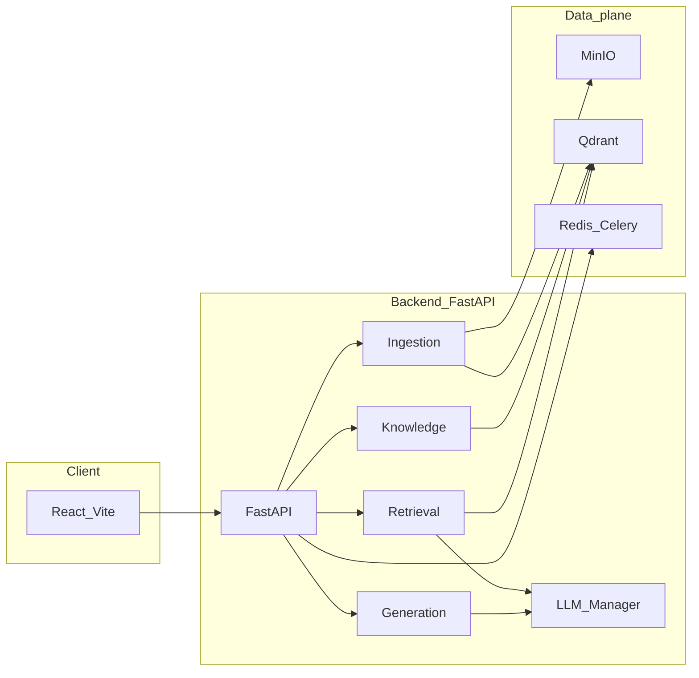

# MMAA · Multi-Modal 智能路由可扩展知识库 RAG Agent

面向多知识库、多模态场景的 RAG（Retrieval-Augmented Generation）Agent：支持文档与图像的统一检索与生成，基于知识库画像的智能路由，三路混合检索（Dense + BGE-M3 稀疏 + Visual）与两阶段重排，具备可解释的思考链与引用展示。

## 项目特色

### 核心能力
- **多模态数据处理**：PDF、Word、TXT、Markdown、图片等解析；文档内嵌图 VLM 描述后插回原文再分块；支持本地上传、URL、文件夹、热点订阅等多来源接入。
- **智能知识库路由**：基于 K-Means + LLM 主题摘要的画像生成，TopN 检索 + 每 KB 加权聚合，自动决策单库/多库/全库。
- **三路混合检索**：Dense（Qwen3-Embedding）+ Sparse（BGE-M3）+ Visual（CLIP + VLM 描述），加权 RRF 粗排 + Cross-Encoder 精排。
- **One-Pass 意图识别**：意图分类、查询改写、关键词/多视角生成与 visual/audio/video 意图一次 LLM 调用，输出结构化 IntentObject。
- **可解释与调试**：SSE 推送思考链（意图、路由、检索策略），引用悬浮与 context_window 前后文透视。

### 技术架构
- **后端**：FastAPI + Python 3.9+，DDD 模块化（Ingestion / Knowledge / Retrieval / Generation），Core 层 LLM Manager + BGE-M3 稀疏编码。
- **前端**：React + TypeScript + Vite，Tailwind CSS，对话/知识库/架构页/调试组件。
- **存储**：MinIO（对象）、Qdrant（向量与稀疏索引）、Redis（缓存与 Celery 队列）。
- **模型**：LLMManager 按任务路由，支持 SiliconFlow、OpenRouter、阿里云百炼、DeepSeek 等；Qwen3-Embedding、BGE-M3、CLIP、Reranker、VLM。
- **部署**：Docker Compose 一键启动后端与依赖服务。

面向希望**本地或 Docker 自建**多模态 RAG 的开发者：配置集中在 [`backend/.env`](backend/.env)（由 [`backend/.env.example`](backend/.env.example) 复制），详细设计见 **[docs/MMAA_ARCHITECTURE.md](docs/MMAA_ARCHITECTURE.md)**。密钥与提交规范见 **[SECURITY.md](SECURITY.md)**。

### 系统架构（概览）



## 项目结构

```
MMAA-RAG/
├── backend/                    # 后端 (Python / FastAPI)
│   ├── app/
│   │   ├── api/                # 接口层：chat、upload、knowledge、import、debug
│   │   ├── core/               # 配置、LLM Manager、sparse_encoder、portrait_trigger
│   │   ├── modules/            # 业务模块
│   │   │   ├── ingestion/      # 解析、分块、向量化、sources、MinIO/Qdrant
│   │   │   ├── knowledge/      # 知识库 CRUD、画像生成、路由
│   │   │   ├── retrieval/      # 意图、改写、混合检索、重排
│   │   │   └── generation/     # 上下文构建、流式输出
│   │   └── tasks/              # 定时/异步任务（如热点导入）
│   ├── celery_app.py
│   ├── requirements.txt
│   ├── Dockerfile
│   └── .env.example            # 复制为 .env 并填写密钥（勿提交 .env）
├── frontend/                   # 前端 (React / TypeScript / Vite)
│   ├── src/
│   │   ├── components/         # chat、knowledge、architecture、settings、debug
│   │   ├── data/               # 架构页数据等
│   │   ├── services/           # API、SSE
│   │   ├── store/ & hooks/
│   │   └── pages/
│   ├── package.json
│   └── vite.config.ts
├── docs/                       # 架构与设计文档
│   ├── MMAA_ARCHITECTURE.md    # 架构设计（推荐阅读）
│   └── ...
├── docker-compose.yml
├── start-dev.sh                # 开发环境启动（Docker 依赖 + 本地前后端）
└── README.md
```

## 核心模块概览

### 1. Ingestion（数据输入处理与存储）

- **职责**：将各类文件与多来源内容解析、分块、向量化后写入对象存储与向量库，为检索与画像提供数据基础。
- **解析**：`ParserFactory` 按类型调度——**PDF：MinerU API → 本地 MinerU 2.5 → PaddleOCR-VL-1.5 → PyMuPDF 兜底**；**DOCX/PPTX：MinerU API → 本地 MinerU → python-docx / python-pptx**；TXT/Markdown、图片（PIL）。文档内嵌图先单独做 VLM 描述并上传 MinIO，再将 caption 插回原文占位符后统一分块。
- **分块**：递归语义分块（段落/句子优先，max/min 长度与重叠窗口）；每个 chunk 写入时带 `context_window`（前后 chunk ID）便于调试拉取前后文。
- **向量化**：文档——Qwen3-Embedding-8B（Dense 4096 维）+ BGE-M3 稀疏编码，双向量写入 `text_chunks`；图片——VLM caption 文本向量（text_vec）+ CLIP 视觉向量（clip_vec）写入 `image_vectors`。
- **存储**：MinIO 按知识库与类型组织路径；Qdrant 写入 text_chunks、image_vectors（画像由 Knowledge 模块写入 kb_portraits）。
- **多来源与异步**：sources 层支持 URL、文件夹、Tavily 热点、媒体下载等，统一走 Ingestion 管道；大任务经 Celery + Redis 异步执行，前端可轮询或流式查进度。
- **代码入口**：`modules/ingestion/service.py`、`parsers/factory.py`、`sources/`、`storage/minio_adapter.py`、`storage/vector_store.py`。

### 2. Knowledge（知识库管理与画像）

- **职责**：知识库的 CRUD、画像的生成与更新、以及基于画像的在线路由决策（未指定知识库时自动选库）。
- **知识库 CRUD**：创建/查询/更新/删除知识库，维护元数据与统计；支持用户指定知识库时直接使用、跳过路由。
- **画像生成**：从该 KB 的 **Text、Image、Audio、Video** 按比例采样（文档 dense、图/音 text 侧、视频关键帧 **frame_vec**）；K-Means 聚类（K = sqrt(N/2) 限制在配置上限）；每簇取近中心若干样本拼成主题文本，LLM 生成 topic_summary 后向量化写入 `kb_portraits`；采用 Replace 策略（先删该 KB 旧画像再插入）。
- **路由决策**：用 refined_query 的 Dense 向量在 kb_portraits 上做**全局** TopN 检索；按 kb_id 聚合时，每个 KB 只取 TopN 中属于该 KB 的前 K 个节点，做位置衰减加权平均，再 min-max 归一化；若最高分低于阈值则全库检索，否则按与第一名的差距决定单库或取前两库。
- **代码入口**：`modules/knowledge/service.py`、`portraits.py`、`router.py`。

### 3. Retrieval（语义路由与混合检索）

- **职责**：查询预处理（One-Pass 意图）、目标知识库确定后，执行三路混合检索与两阶段重排，输出供生成的 Top-K 结果。
- **One-Pass 意图识别**：一次 LLM 调用输出 IntentObject——意图类型、refined_query、sparse_keywords、multi_view_queries、visual_intent/audio_intent/video_intent、sub_queries 等；解析失败时回退默认意图保证下游可执行。
- **混合检索**：Dense：主查询 + 多视角查询向量化后检索并内部融合；Sparse：BGE-M3 对查询（或拼接关键词）生成稀疏向量，在 text_chunks 上稀疏检索；Visual（当 visual_intent 非 unnecessary）：查询的文本向量 + CLIP 文本向量，对 image_vectors 做 text_vec/clip_vec 双路 RRF；三路结果按 doc 去重后做加权 RRF 粗排。
- **两阶段重排**：粗排结果取前若干候选，构建 (query, content) 对送 Cross-Encoder 精排；精排分与 RRF 分加权合并后排序，取 final_top_k；当 visual_intent 为 implicit_enrichment 时可做图片保护（至少保留若干图片）。
- **代码入口**：`modules/retrieval/service.py`、`processors/intent.py`、`processors/rewriter.py`、`search_engine.py`、`reranker.py`。

### 4. Generation（上下文构建与生成）

- **职责**：将重排后的 Top-K 转为会话级引用映射与多模态 Prompt，调用 LLM 生成回答，并通过 SSE 推送思考链、引用与正文流。
- **上下文构建**：按重排分数排序后为每条结果分配序号 1,2,3…，生成 ReferenceMap（id、content_type、file_path、content 摘要、presigned_url、metadata 含 chunk_id 等）；按 max_context_length、max_chunks、max_images 控制长度；文档/图片/音视频按 Type A/B 插槽填入 Prompt。
- **提示词**：系统提示词与各类模板集中在 `core/llm/prompt.py`，按意图类型选用；规定 [id] 引用、多模态描述方式及诚实回答原则。
- **流式输出**：StreamManager 发送 `thought`（意图、路由、检索策略）、`citation`（引用元数据与 debug_info，含 chunk_id、context_window）、`message`（LLM 增量）；前端 ThinkingCapsule、CitationPopover、打字机渲染与灯箱/播放器。
- **代码入口**：`modules/generation/service.py`、`context_builder.py`、`templates/multimodal_fmt.py`、`stream_manager.py`。

### 5. LLM Manager（模型管理与路由）

- **职责**：按任务类型将 chat/embed/rerank 等请求路由到对应模型与 Provider，统一多厂商 API，集中管理提示词与可观测性。
- **任务路由**：intent_recognition、image_captioning、final_generation、reranking、kb_portrait_generation 等映射到具体模型与 Provider；业务层只传 task_type 与参数，不关心具体厂商或实例。
- **统一接口**：chat（多轮消息、temperature）、embed（文本列表）、rerank（query + documents）；底层各 Provider 实现 OpenAI 兼容协议。
- **多厂商**：SiliconFlow、OpenRouter、阿里云百炼、DeepSeek 等；Manager 负责拼装请求、解析响应与可选故障转移。
- **提示词**：`prompt.py` 定义所有模板字符串，`prompt_engine` 提供 `render_template(template_name, **kwargs)`，业务层只传变量。
- **其它 Core 组件**：`sparse_encoder.py`（BGE-M3 编码，供 Ingestion 与 Retrieval）、`portrait_trigger.py`（画像更新触发）、`keyword_extract.py`。
- **代码入口**：`core/llm/manager.py`、`core/llm/__init__.py`（LLMRegistry）、`prompt.py`、`prompt_engine.py`、`providers/`。

---

更细的设计与实现说明见 **[docs/MMAA_ARCHITECTURE.md](docs/MMAA_ARCHITECTURE.md)**。

## 快速开始

### 环境要求
- Docker & Docker Compose
- Node.js 18+、npm 或 pnpm
- Python 3.9+（本地跑后端时）
- LibreOffice（可选；若需要在页面内预览 PPTX/DOCX，后端会依赖其将 Office 文档转 PDF）
- FFmpeg（可选；若启用视频解析/切段，后端会依赖 ffmpeg 可执行程序）

### 1. 克隆与配置

```bash
git clone <repository-url>
cd MMAA-RAG
cp backend/.env.example backend/.env
# 编辑 backend/.env：至少填写 SILICONFLOW_API_KEY（必填）
```

**必填与常用环境变量（详见 `backend/.env.example`）**

| 变量 | 说明 |
|------|------|
| `SILICONFLOW_API_KEY` | 必填。默认 LLM/Embedding 等走 SiliconFlow；也可在配置中改用其他 Provider 并填对应 Key。 |
| `REDIS_URL` | 本地开发通常为 `redis://localhost:6379/0`（与 Docker 内 Redis 一致）。 |
| `QDRANT_HOST` / `QDRANT_PORT` | 本地一般为 `localhost` / `6333`。 |
| `MINIO_*` | 本地 Docker MinIO 默认 `minioadmin` / `minioadmin`；生产环境请修改。 |

可选：`DEEPSEEK_API_KEY`、`OPENROUTER_API_KEY`、`ALIYUN_BAILIAN_API_KEY`、`TAVILY_API_KEY`、飞书相关变量等。

前端默认请求 `http://localhost:8000/api`；若需修改，可在前端构建时使用环境变量 `VITE_API_BASE_URL`。

### 2. 启动开发环境

```bash
chmod +x start-dev.sh
./start-dev.sh
```

脚本会检查已存在 `backend/.env`，启动 MinIO、Qdrant、Redis（`docker compose --env-file backend/.env`），再在本地启动后端与前端。

### 3. 访问
- **前端**：http://localhost:3000  
- **后端 API**：http://localhost:8000  
- **API 文档**：http://localhost:8000/docs  
- **MinIO 控制台**：http://localhost:9001（默认账号/密码与 `backend/.env` 或 `docker-compose.yml` 一致，本地多为 `minioadmin`）

## Docker 部署

Compose 需从 `backend/.env` 读取 `SILICONFLOW_API_KEY` 等变量，请使用：

```bash
docker compose --env-file backend/.env up -d
docker compose --env-file backend/.env ps
docker compose --env-file backend/.env logs -f
```

主要服务：`backend`、`minio`、`qdrant`、`redis`、`celery_worker`，可选 `celery_flower`（Celery 监控）。前端需单独构建或运行开发服务器。

## 配置要点

- **后端**：[`backend/app/core/config.py`](backend/app/core/config.py)，仅从 **`backend/.env`** 加载（文件不存在时依赖进程环境变量）；模型与任务路由见 Core LLM 层。
- **前端**：API 基地址见 [`frontend/src/services/api_client.ts`](frontend/src/services/api_client.ts)（`VITE_API_BASE_URL`）。
- **模板**：[`backend/.env.example`](backend/.env.example)；**勿**将真实 `backend/.env` 提交到 Git。

## 故障排除

- **启动报错缺少 `SILICONFLOW_API_KEY`**：确认已创建 `backend/.env` 并已填写该变量，修改后需重启后端进程。
- **未找到 `backend/.env`**：执行 `cp backend/.env.example backend/.env` 后再启动。
- **`docker compose` 启动后容器内无 API Key**：必须使用 `docker compose --env-file backend/.env`，勿依赖项目根目录的 `.env`。

## 测试与调试

- **后端单元测试**：`cd backend && pytest tests/ -v`（若有 tests 目录）。
- **检索与 RAG 行为**：前端对话页 + 架构页「RAG 请求链路」；调试信息通过引用与 Inspector 等组件查看。

## 预览相关说明（PPTX/DOCX）

- 页面内预览 `pptx/docx` 时，后端会先将文件转为 PDF 再返回给前端 iframe。
- 若服务器未安装 LibreOffice，转换会失败，前端将自动回退到“文本预览/分块预览”，并提示安装依赖。
- 在 Linux/WSL 新环境建议提前安装：

```bash
sudo apt-get update && sudo apt-get install -y libreoffice
```

## 视频解析相关说明（FFmpeg）

- 视频模态的切段与音频提取依赖系统 `ffmpeg`（用于长视频分段与部分视频音频处理流程）。
- 若未安装 `ffmpeg`，相关流程会降级或失败（日志会提示 `ffmpeg 未找到`）。
- 在 Linux/WSL 新环境建议提前安装：

```bash
sudo apt-get update && sudo apt-get install -y ffmpeg
```

- 若 `ffmpeg` 不在 PATH，可在 `backend/.env` 中设置：`FFMPEG_PATH=/your/path/to/ffmpeg`。

## 文档索引

| 文档 | 说明 |
|------|------|
| [MMAA_ARCHITECTURE.md](docs/MMAA_ARCHITECTURE.md) | 架构设计与实现要点 |
| [ARCHITECTURE_COMPLIANCE_ANALYSIS.md](docs/ARCHITECTURE_COMPLIANCE_ANALYSIS.md) | 实现与设计符合度分析 |
| [SPARSE_RETRIEVAL_IMPLEMENTATION.md](docs/SPARSE_RETRIEVAL_IMPLEMENTATION.md) | BGE-M3 稀疏检索 |
| [MULTIMODAL_IMAGE_AUDIO_VIDEO_TECHNICAL_SPEC.md](docs/MULTIMODAL_IMAGE_AUDIO_VIDEO_TECHNICAL_SPEC.md) | 多模态（图/音/视）技术方案 |
| [SECURITY.md](SECURITY.md) | 密钥与敏感信息管理说明 |
| [CONTRIBUTING.md](CONTRIBUTING.md) | 贡献说明（勿提交密钥文件） |

## 许可证与联系

- **许可证**：MIT，详见 [LICENSE](LICENSE)。
- **问题与讨论**：欢迎通过 GitHub Issues / Discussions 反馈。

---

**快速体验**：`./start-dev.sh` → 打开 http://localhost:3000 → 创建知识库并上传文档/图片，开始对话与引用溯源。

**核心价值**：多模态统一检索、知识库智能路由、思考过程可解释、引用可追溯。
