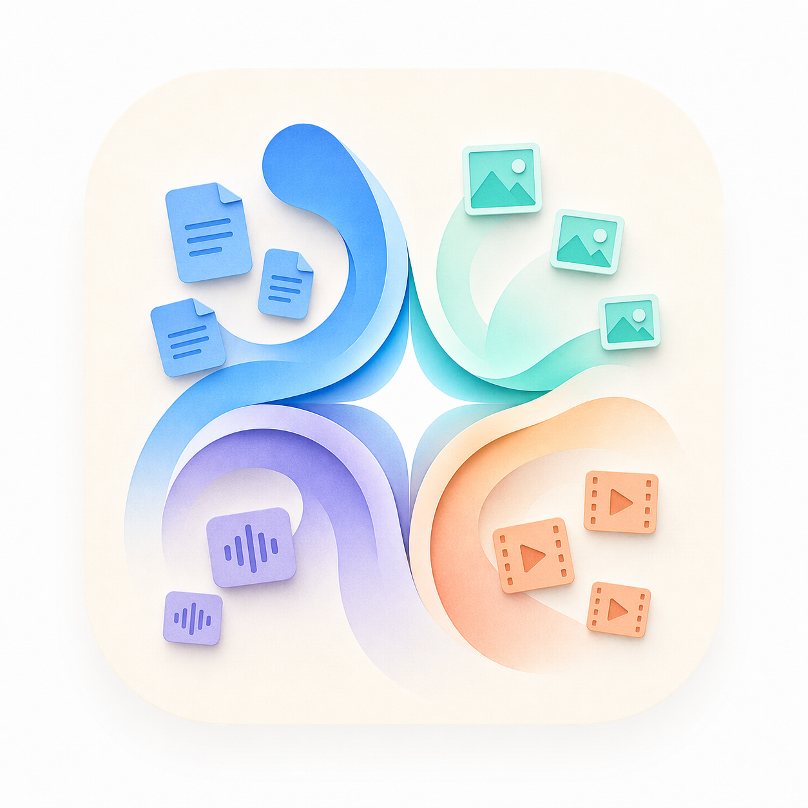
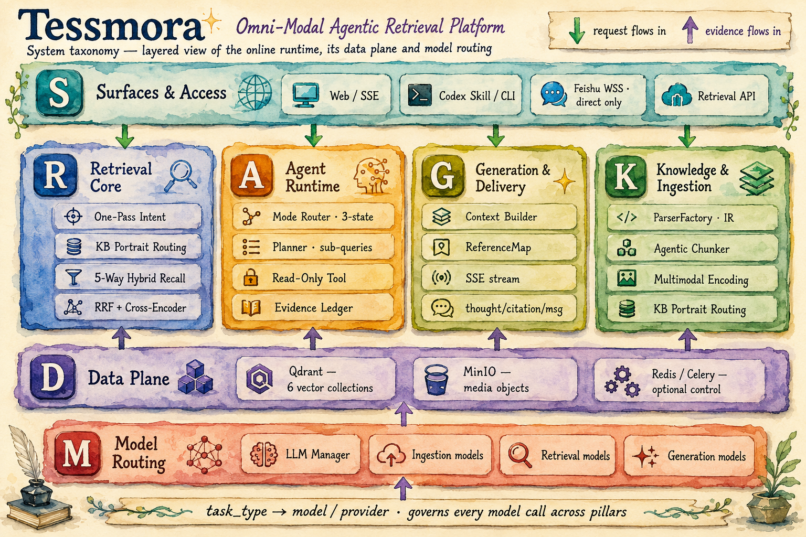
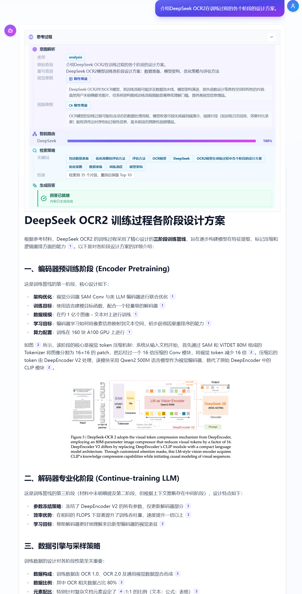
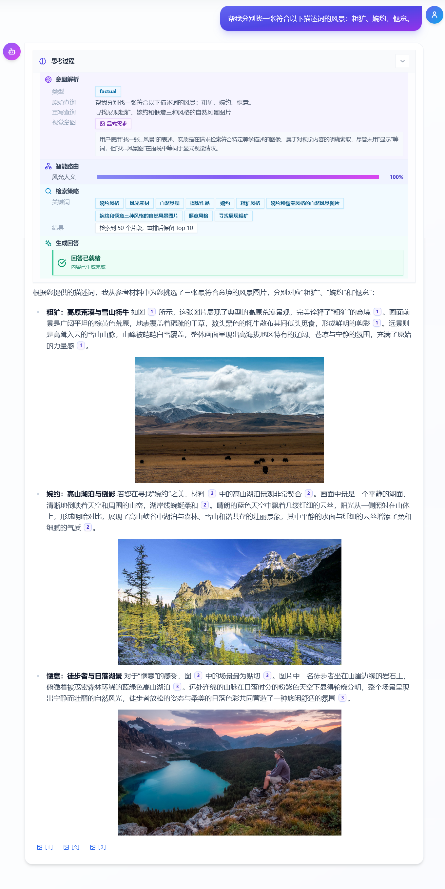
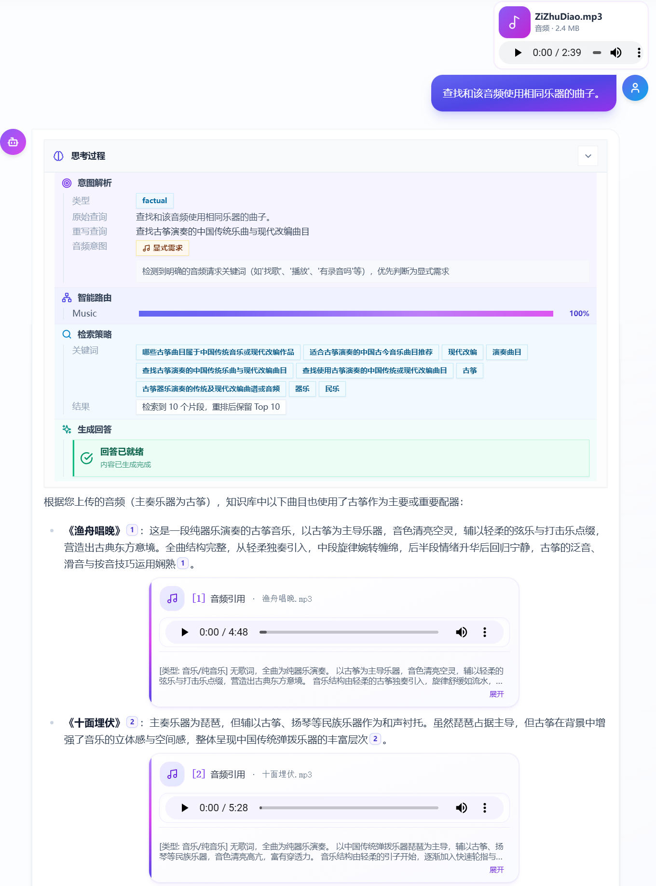
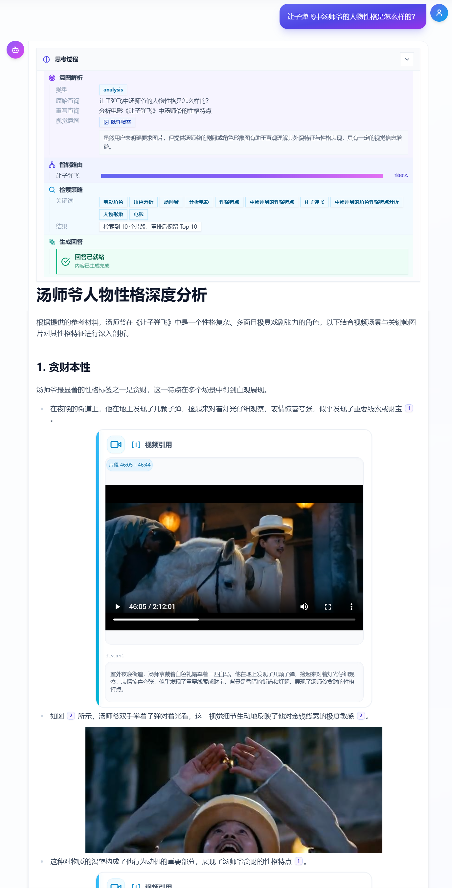
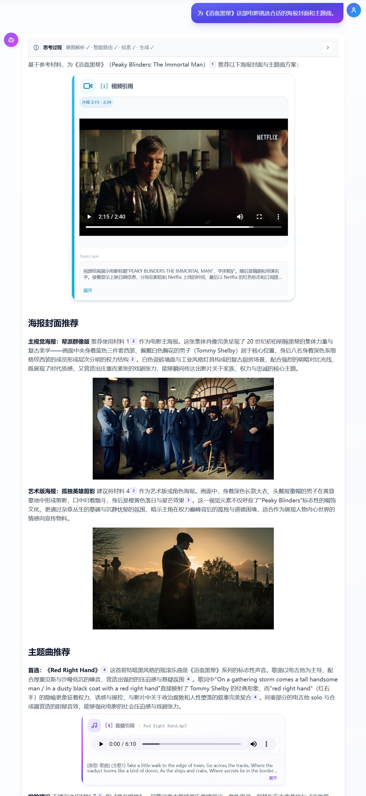
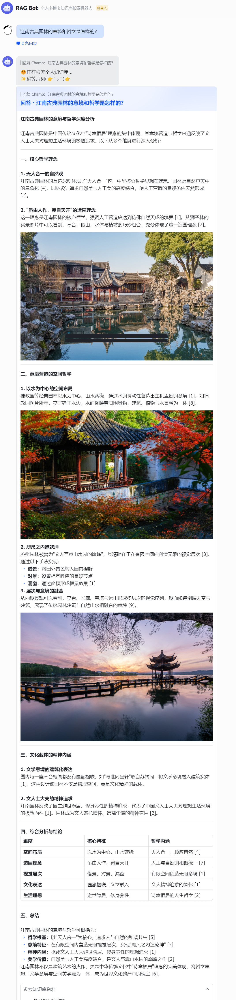

<p align="center">
  
</p>

<p align="center"><strong>简体中文 | <a href="README-en.md">English</a></strong></p>

# Tessmora — An Omni-Modal Agentic Retrieval Platform

<h3 align="center"><em>Every fragment finds its place.</em></h3>

<p align="center">
  
</p>

Tessmora 是可私有化部署的全模态 Agentic Retrieval 平台。文档、图片、音频与视频保留各自合适的解析单元和专用向量，再通过知识库画像路由、混合检索、两阶段排序和有界 Agent 汇入同一套可追溯回答链路。

它解决三个核心问题：

- **内容怎么进入系统**：普通文档用无损 Agentic Chunker；图片用 VLM + CLIP；音频用 ASR + CLAP；视频用 Scene → Shot → Key Frame。
- **问题怎么找到证据**：One-Pass 意图、KB 画像路由、Dense / Sparse / Visual / Audio / Video 召回、加权 RRF 与 Cross-Encoder 精排。
- **复杂问题怎么继续补查**：自动、直接检索、Agent 深研三态可选；Agent 只调用现有只读检索工具，并受轮数、查询数和证据池预算约束。

## 为什么是 Tessmora

| 能力 | 当前实现 |
|---|---|
| **全模态数据面** | 文档、图片、音频、视频分别建模，不把所有内容降维为纯文本 |
| **智能检索范围** | 未指定 KB 时，以主题画像和多视角查询决定单库、多库或全库 |
| **跨通道融合** | Dense + BGE-M3 Sparse + Visual 为主干，音频与视频使用专用向量与意图权重 |
| **Agentic Evidence Loop** | Planner 规划互补子查询，并发检索，跨轮证据去重与有限置信增强 |
| **预算化多轮上下文** | 按完整对话轮次、消息数和字符预算选取历史，贯通检索与生成 |
| **可验证输出** | SSE 推送阶段摘要、引用与正文；引用保留来源、媒体 URL、时间范围与 `context_window` |
| **多入口** | Web 为完整交互入口；可选飞书 IM 与 Docx/Wiki 导入；内置 Codex Skill/CLI |

## 架构速览



图中 Direct 与 Agent 复用同一个 Retrieval Core；Qdrant 提供在线检索向量，MinIO 为引用上下文补充原始媒体。项目启动后可通过 [http://localhost:3000/architecture](http://localhost:3000/architecture) 查看可交互架构页；代码级设计见 [MMA_ARCHITECTURE](docs/MMA_ARCHITECTURE.md)。

## 核心模块

| 模块 | 职责 | 主要入口 |
|---|---|---|
| **Ingestion** | 多来源解析、Agentic 分块、全模态向量化、MinIO/Qdrant 写入 | `backend/app/modules/ingestion/` |
| **Knowledge** | KB 生命周期、全模态画像与跨库路由 | `backend/app/modules/knowledge/` |
| **Retrieval** | One-Pass 意图、五路召回、RRF、Cross-Encoder | `backend/app/modules/retrieval/` |
| **Agent Runtime** | 三态分流、规划、只读工具调用与证据收敛 | `backend/app/modules/agent/` |
| **Generation** | 多模态上下文、ReferenceMap、流式生成 | `backend/app/modules/generation/` |
| **LLM Manager** | `task_type` 到模型/Provider 的统一路由 | `backend/app/core/llm/` |

### 文档与表格分块

- PDF、DOCX、PPTX、TXT、Markdown 等普通文档进入生产版 Agentic Chunker。
- Chunker 先把原文固化为标题、段落、列表、表格、代码等不可变单元；LLM 只规划连续单元范围，不生成或改写原文。
- 服务端校验无损覆盖、无重叠与 600 estimated-token 硬上限；规划失败时使用确定性结构分块兜底。
- Excel/CSV 不走通用 Agentic Chunker，继续使用 Sheet 摘要、带表头行块和列画像策略。

### 多模态索引

| 模态 | 主语义单元 | Qdrant |
|---|---|---|
| 文档 | Agentic Chunk | `text_chunks_agentic`：Dense + BGE-M3 Sparse |
| 图片 | 单图 | `image_vectors`：`text_vec` + `clip_vec` |
| 音频 | 单文件/整段 | `audio_vectors`：`text_vec` + `clap_vec` + 可选 Sparse |
| 视频 | Semantic Shot | `video_shot_vectors`：caption/ASR Dense+Sparse；`video_keyframe_vectors`：`frame_vec` + `clip_vec` |
| KB 画像 | 聚类主题摘要 | `kb_portraits` |

视频 Scene–Shot–ASR 的字段、长视频分窗和关键帧策略见 [多模态技术说明](docs/MULTIMODAL_IMAGE_AUDIO_VIDEO_TECHNICAL_SPEC.md)。

## 对话与检索示例

<details>
<summary>展开 Web 与飞书示例</summary>

### 文档检索

Query：`介绍 DeepSeek OCR2 在训练过程各阶段的设计方案。`



### 图片检索

Query：`分别找一张符合粗犷、婉约、惬意的风景图。`



### 音频检索

Query：`查找和该音频使用相同乐器的曲子。`



### 视频检索

Query：`《让子弹飞》中汤师爷的人物性格是怎样的？`



### 跨模态混合

Query：`为《浴血黑帮》挑选合适的海报封面和主题曲。`



### 飞书 IM（可选）



</details>

## 快速开始

### 环境要求

| 依赖 | 说明 |
|---|---|
| Docker 与 Docker Compose | 启动 MinIO、Qdrant、Redis |
| Node.js ≥ 18 | 前端；推荐 Node 20 LTS |
| Python ≥ 3.11 | Docker 镜像使用 3.11；本地开发推荐 3.12 |
| FFmpeg / ffprobe | 音视频探测、分段与关键帧 |
| LibreOffice | DOCX/PPTX 转 PDF 与页内预览 |

### 1. 克隆与配置

```bash
git clone https://github.com/Champ-X/MMA-RAG.git
cd MMA-RAG
cp backend/.env.example backend/.env
```

默认模型注册至少要求：

| 变量 | 要求 |
|---|---|
| `SILICONFLOW_API_KEY` | **必填**：默认 LLM、Embedding、Rerank 等任务 |
| `OPENROUTER_API_KEY` | 选填：使用 OpenRouter 模型时配置 |
| `ALIYUN_BAILIAN_API_KEY` | 选填：使用阿里云百炼模型、Omni 视频解析或飞书相关模型配置时配置 |
| `DEEPSEEK_API_KEY` | 选填：任务路由到 DeepSeek 时配置 |
| `MINERU_TOKEN` | 选填：优先使用 MinerU 云解析；缺失时按本地/其它解析链降级 |
| `PADDLEOCR_API_URL` / `PADDLEOCR_TOKEN` | 选填：启用 PaddleOCR 解析分支 |
| `FEISHU_*` | 选填：飞书 IM 或飞书文档导入，详见 [FEISHU_BOT_SETUP](docs/FEISHU_BOT_SETUP.md) |

完整变量与默认值以 [`backend/.env.example`](backend/.env.example) 为准。不要提交真实密钥，部署边界见 [SECURITY](SECURITY.md)。

### 2. 安装后端依赖

```bash
python3 -m venv .venv
source .venv/bin/activate
pip install -U pip
pip install -r backend/requirements.txt
```

### 3. 启动开发环境

```bash
source .venv/bin/activate
./start-dev.sh
```

`start-dev.sh` 会：

1. 检查 `backend/.env`；
2. 检查或尝试安装 FFmpeg 与 LibreOffice；
3. 通过 Docker Compose 启动 MinIO、Qdrant、Redis；
4. 在本机启动 FastAPI 与 Vite。

Compose 还定义了可选的 `celery_worker` / `celery_flower`，开发脚本默认不启动它们。

### 4. 访问

| 服务 | 地址 |
|---|---|
| Web UI | [http://localhost:3000](http://localhost:3000) |
| 架构页 | [http://localhost:3000/architecture](http://localhost:3000/architecture) |
| 后端 API | [http://localhost:8000](http://localhost:8000) |
| OpenAPI | [http://localhost:8000/docs](http://localhost:8000/docs) |
| MinIO Console | [http://localhost:9001](http://localhost:9001) |
| Qdrant Dashboard | [http://localhost:6333/dashboard](http://localhost:6333/dashboard) |

## API 与 Codex Skill

后端提供稳定的只读证据接口：

```text
POST /api/v1/retrieval/search
```

它返回紧凑的 `doc | image | audio | video` 证据合同，不直接暴露内部 Qdrant payload。对话与 Agent 模式继续使用 `/api/chat/message` 或 `/api/chat/stream`。

仓库自带 Tessmora Codex Skill，CLI 名称保留为 `mma-rag`：

```bash
./scripts/install-codex-skill.sh
skills/mma-rag/scripts/mma-rag health
skills/mma-rag/scripts/mma-rag kb list
skills/mma-rag/scripts/mma-rag search --query "部署失败后如何回滚？" --kb-id KB_ID
skills/mma-rag/scripts/mma-rag ask --query "总结部署流程" --kb-id KB_ID --agent-mode auto
```

安装脚本会在 `${CODEX_HOME:-$HOME/.codex}/skills/mma-rag` 创建指向仓库 Skill 的符号链接，不覆盖已有同名目录。完整命令、安全上传根目录与退出码见 [CLI reference](skills/mma-rag/references/cli-reference.md)。

仓库还提供隔离的合成 RAG 评测集与 `rag-eval` runner，覆盖 Recall@K、nDCG、MRR、Faithfulness、Answer Relevance 和 Context Precision；使用方式和指标口径见 [RAG 评测基线](docs/RAG_EVALUATION.md)。

## 当前边界

- 应用 API **没有内置用户鉴权**，开发配置中的 CORS 允许任意来源；请只在可信网络使用，公网部署前必须在反向代理或 API Gateway 增加认证、TLS、来源限制、限流与上传大小控制。
- Chat session 和部分统计仍是进程内状态，不适合直接做无状态多副本部署。
- Agent 当前只有只读 `multimodal_knowledge_search` 工具；没有写工具、审批流、MCP、长期记忆或沙箱。
- 飞书聊天当前走直接检索路径；Web Chat API 与 `mma-rag ask` 支持三态 Agent 模式。
- 检索权重和部分阈值仍在代码中，尚未全部迁入配置中心。

更完整的现状与演进状态见 [架构文档](docs/MMA_ARCHITECTURE.md) 和 [路线图](docs/mira-plan.md)。

## 文档索引

| 文档 | 定位 |
|---|---|
| [MMA_ARCHITECTURE](docs/MMA_ARCHITECTURE.md) | 当前实现：模块边界、入库与问答链路、数据面、Agent 与 API |
| [MULTIMODAL_IMAGE_AUDIO_VIDEO_TECHNICAL_SPEC](docs/MULTIMODAL_IMAGE_AUDIO_VIDEO_TECHNICAL_SPEC.md) | 图片、音频、视频的字段、向量与检索细节 |
| [AGENTIC_UPGRADE_WEKNORA_RESEARCH](docs/AGENTIC_UPGRADE_WEKNORA_RESEARCH.md) | Agent 调研基线、已落地能力与风险原则 |
| [mira-plan](docs/mira-plan.md) | 按“已完成 / 部分完成 / 待规划”维护的演进路线 |
| [FEISHU_BOT_SETUP](docs/FEISHU_BOT_SETUP.md) | 飞书 IM 与 Docx/Wiki 权限、变量、验证 |
| [CLI reference](skills/mma-rag/references/cli-reference.md) | 本地 Skill/CLI 命令与安全边界 |
| [RAG_EVALUATION](docs/RAG_EVALUATION.md) | 合成评测集、隔离运行方式、六类指标与回归门禁 |
| [SECURITY](SECURITY.md) | 当前安全姿态与生产部署清单 |
| [CHANGELOG](CHANGELOG.md) | 近期功能与文档变更 |

---

**快速体验**：`./start-dev.sh` → 打开 [http://localhost:3000](http://localhost:3000) → 创建知识库并上传内容 → 选择自动、直接或 Agent 深研 → 检查回答引用。
