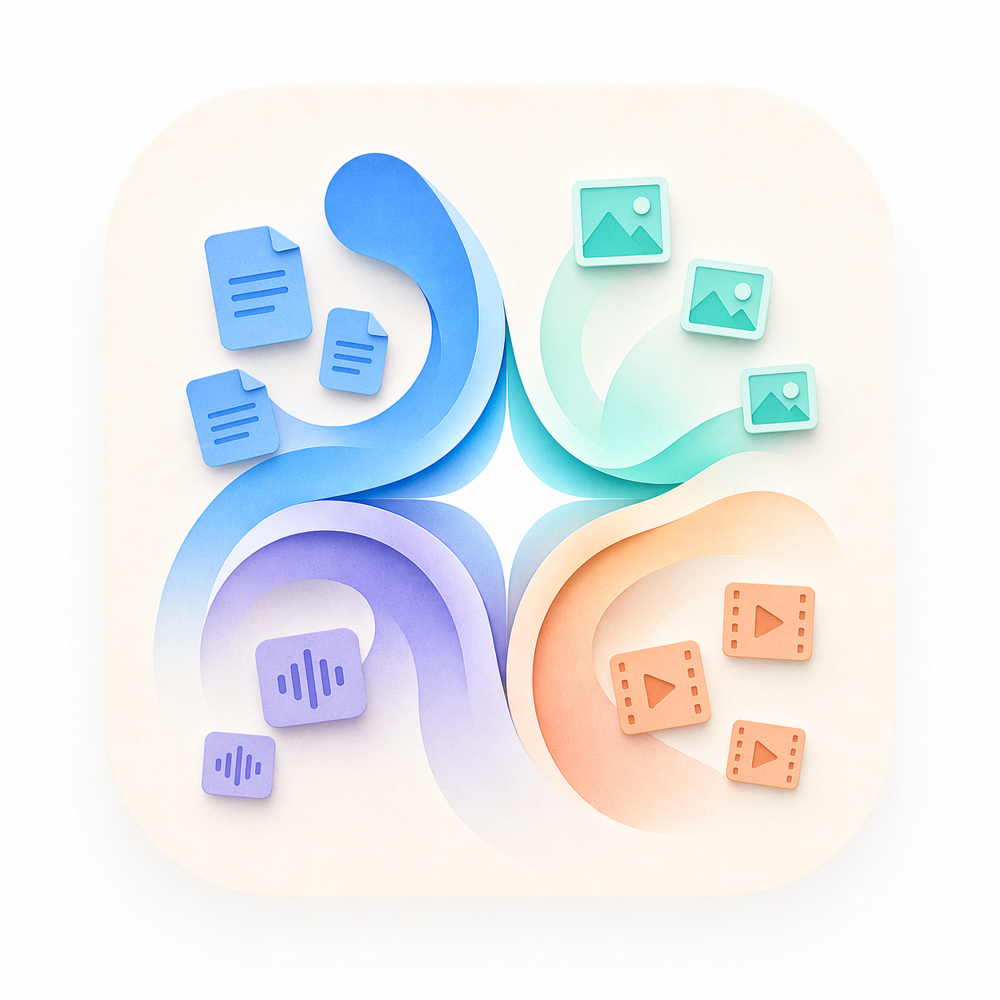
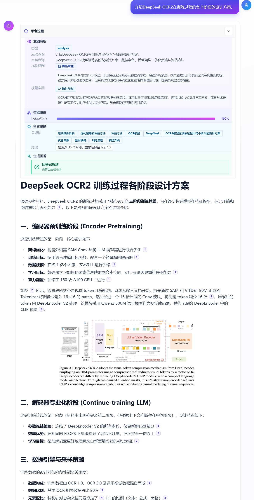
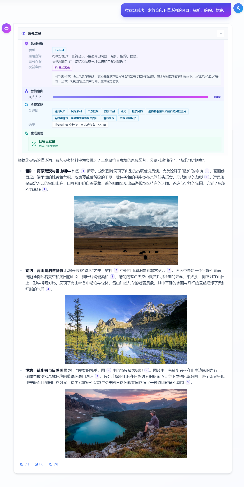
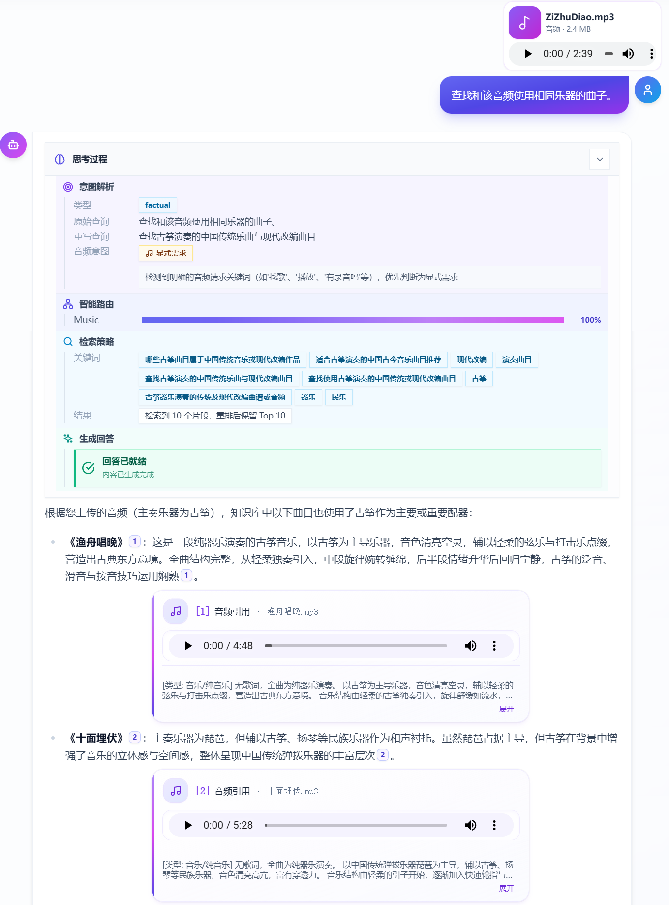
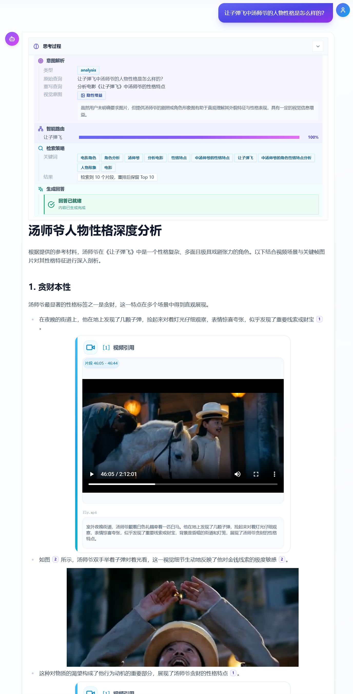
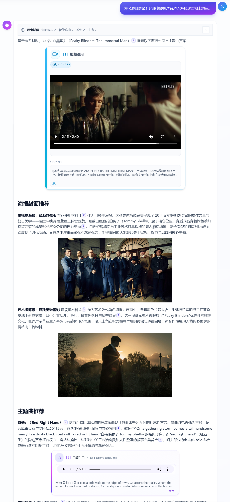
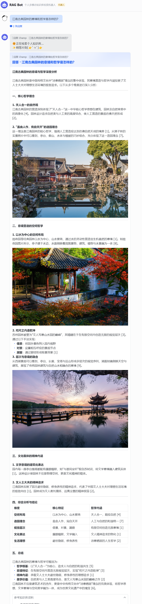
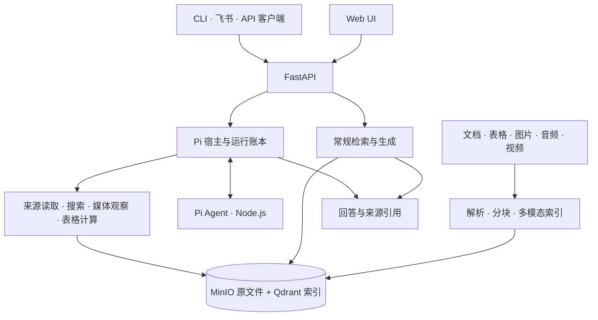

<p align="center">
  
</p>

<h1 align="center">Tessmora</h1>

<p align="center"><strong>多模态检索，自主研究，答案有据可查。</strong></p>
<p align="center">Every fragment finds its place.</p>

<p align="center">
  <strong>简体中文</strong> · <a href="README-en.md">English</a>
</p>

<p align="center">
  <a href="#快速开始">快速开始</a> ·
  <a href="#agent-mode">Agent Mode</a> ·
  <a href="#检索效果">检索效果</a> ·
  <a href="#文档">文档</a> ·
  <a href="#参与贡献">参与贡献</a> ·
  <a href="https://github.com/Champ-X/MMA-RAG/issues">反馈问题</a>
</p>

<p align="center">
  
  
  <a href="https://github.com/Champ-X/MMA-RAG/issues"></a>
</p>

**Tessmora 是可自托管的多模态 RAG 与 Agent 研究工作台。** 将文档、表格、图片、音频和视频放入知识库，用自然语言搜索、比较和提问，再通过原文、图片预览或媒体时间片段核对回答。代码仓库与 CLI 沿用 `MMA-RAG` / `mma-rag` 名称。

你可以用它阅读一组研究资料、在素材库中寻找图片与音乐，或让 Agent 围绕复杂问题逐步检索、深读和整理证据。


## 核心能力

| 你想做什么 | Tessmora 如何支持 |
| --- | --- |
| **统一检索多种资料** | 文档采用保留原文的 Agentic Chunking；表格保留表头与行块；图片、音频和视频建立各自的语义与向量索引 |
| **找到关键词之外的内容** | 常规检索结合 Dense、BGE-M3 Sparse、CLIP、CLAP 等通道，按问题意图融合召回并重排；未指定知识库时可按主题画像路由 |
| **围绕复杂问题持续研究** | 独立的 Pi Agent Mode 自主选择搜索、深读原文、扩展上下文、查看媒体或计算表格，再提交带引用的回答 |
| **回到来源检查结论** | 引用关联原文件、文本上下文、图片及音视频时间范围；Agent 过程展示实际工具调用、证据、耗时和异常 |
| **明确材料与检索范围** | `@` 引用知识库文件或本机附件作为分析材料；通过知识库与文件选择器限定搜索范围 |
| **接入已有工作流** | Web UI、检索与对话 API、仓库自带 CLI / Codex Skill，以及可选的飞书 IM 与 Docx/Wiki 导入 |

<details>
<summary><strong>查看产品截图：文档、图片、音频、视频与跨模态问答</strong></summary>

以下为已有 Web / 飞书交互示例，展示检索结果与媒体引用；Pi Agent Mode 的行为见下方独立说明。

### 文档问答

“介绍 DeepSeek OCR2 在训练过程各阶段的设计方案。”



### 图片检索

“分别找一张符合粗犷、婉约、惬意的风景图。”



### 音频检索

“查找和该音频使用相同乐器的曲子。”



### 视频问答

“《让子弹飞》中汤师爷的人物性格是怎样的？”



### 跨模态选材

“为《浴血黑帮》挑选合适的海报封面和主题曲。”



### 飞书 IM



</details>

## 检索效果

2026-10-08 完成 **300 道公开题 + 80 道本地多模态题**的实际对照，保存 **1,740 条任务记录**。评测分别衡量目标文档召回与必需证据覆盖，失败保留在分母；数据、配置和回执均有版本哈希。

### 公开语料：语义检索提升目标文档召回

使用 SciFact 全部 **5,183 篇摘要**、17,031 个三句片段。文档 Recall@5 在 300 道题上评分；证据组 Recall@5 在有人工句子证据的 188 道题上评分。两项指标均检查前 5 个交付片段。

| 方案 | 成功任务 | 文档 Recall@5 | 证据组 Recall@5 |
| --- | ---: | ---: | ---: |
| BM25 | 300/300 | 63.44% | 77.13% |
| Dense | 300/300 | 76.83% | 89.89% |
| Hybrid，固定 RRF | 300/300 | 75.89% | 87.77% |
| Hybrid + 重排，首轮 | 225/300 | 59.11% | 64.89% |
| Hybrid + 重排，可用性控制轮 | 300/300 | **80.40%** | **90.43%** |

**Dense 相对 BM25 的文档 Recall@5 提高 13.38 个百分点**，配对 95% 区间为 +7.13～+19.12 个百分点。重排控制轮取得本轮最高分；其证据组 Recall 相对 Dense 的增益区间跨零，仍需更多样本验证。

该组件实验使用 Qwen3-Embedding-8B、Qwen3-Reranker-8B 和 BM25，是自定义 SciFact 协议，与生产 BGE-M3 稀疏通道及官方 BEIR 排行榜口径不同。首轮重排的 75 次失败全部保留；控制轮另跑完整 300 题，在后续题开始前等待健康冷却结束，不重试本题失败。两轮也受服务状态变化影响。

### 本地多模态：多轮补查覆盖更多必需证据

在现有知识库上只读评测文本、图片、音频、视频、跨模态与限定范围无答案题。采用最新的来源核验标注，**证据齐全率**表示找齐全部必需证据的题目比例，分母为 76 道有证据标注的题，失败按零计分。

| 模式 | 证据阶段 | 前 5 条证据齐全率 | 集合证据齐全率（@50） |
| --- | --- | ---: | ---: |
| Direct 单轮检索 | 检索结果 | 81.58% | 81.58% |
| 常规多轮 Agent（legacy-agent） | 检索结果 | 92.11% | **100.00%** |
| Pi Agent | 研究观察，含已核验媒体锚点 | 88.16% | 97.37% |
| Pi Agent | 最终答案引用 | **96.05%** | **97.37%** |

常规多轮 Agent 的检索集合找齐 **76/76 题**的证据，Direct 为 **62/76 题**；Pi 在最终前 5 个引用中找齐 **73/76 题**，全部引用找齐 **74/76 题**。Pi 引用按答案正文首次出现的顺序计分，未核验媒体保留位置且不授予证据分。各模式执行预算不同，最终引用包含生成后的证据选择，应与检索结果分阶段解读。

本地 80 题来自 35 个来源关联组，文本仅涉及 3 份文档；标注由 Agent 根据来源核验，尚非独立人工盲标，原始媒体也未全面核验。这些是开发集上的证据覆盖指标，最终回答正确性、引用支持度与正确拒答率仍待单独评测。

[完整结果与评分说明](docs/RETRIEVAL_REVIEW_20261008.md) · [公开语料结果](docs/RETRIEVAL_EVALUATION_20261008.md) · [评测协议与复现命令](docs/RETRIEVAL_EVALUATION_V2.md) · [最新机器可读汇总](evals/retrieval_v2/review-20261008/summary.json)

## 快速开始

推荐使用 **本机运行前后端 + Docker 运行存储服务** 的开发方式。以下命令面向 macOS / Linux；Windows 可使用 WSL2。当前 Compose 未包含前端和 Pi Node 运行时，不能单独启动完整产品。

### 1. 准备环境

| 依赖 | 要求与用途 |
| --- | --- |
| Python | **3.11 或 3.12**；下方以 3.12 为例 |
| Node.js / npm | **Node.js ≥ 22.19**，同时满足 Vite 与 Pi SDK 的依赖要求 |
| Docker + Compose | Docker 已启动，用于 MinIO、Qdrant、Redis |
| FFmpeg / ffprobe | 音视频探测、转码与帧提取 |
| LibreOffice | DOCX/PPTX 转 PDF 与预览；Linux 中文文档建议安装 `fonts-noto-cjk` |

### 2. 克隆并配置模型服务

```bash
git clone https://github.com/Champ-X/MMA-RAG.git
cd MMA-RAG
cp backend/.env.example backend/.env
```

编辑 `backend/.env`，按需填写真实凭证，**清空未使用服务的 `your_...` 占位值**。当前默认路由需要：

| 配置项 | 默认用途 |
| --- | --- |
| `SILICONFLOW_API_KEY` | 文本向量化与重排：Qwen3 Embedding / Reranker |
| `DEEPSEEK_API_KEY` | 文本问答、意图识别、文档分块与 Pi 主模型：`deepseek-flash` |
| `ALIYUN_BAILIAN_API_KEY` | 默认图片理解、音频转写、视频解析，以及 Pi 的媒体观察工具 |
| `MINERU_TOKEN` | 可选，启用 MinerU 云端文档解析；本地与其他解析路径取决于文件类型和已安装依赖 |
| `OPENROUTER_API_KEY` | 可选，使用 OpenRouter 模型时填写 |

先体验 Markdown / TXT 文档问答时，可从 SiliconFlow 与 DeepSeek 开始；使用默认媒体能力时再配置百炼。其他解析、导入和飞书配置见 [环境变量示例](backend/.env.example)。常规模型路由可在页面设置中调整；Pi 使用 [独立配置](docs/PI_AGENT_MODE.md)。

**自托管不等于离线推理。** 原文件与索引由本地 MinIO / Qdrant 保存，默认解析和模型调用仍可能将内容发送给你配置的服务商，并产生 API 费用。

### 3. 安装依赖并启动

在仓库根目录执行；如果使用 Python 3.11，将第一行替换为 `python3.11 -m venv .venv`。

```bash
python3.12 -m venv .venv
source .venv/bin/activate
python -m pip install --upgrade pip
python -m pip install -r backend/requirements.txt
npm --prefix frontend ci
npm --prefix agent-runtime ci
./start-dev.sh
```

启动脚本优先使用仓库 `.venv`（可通过 `MMA_PYTHON` 指定），检查 Python、Node.js 和 Pi 依赖，缺少前端或 Pi 依赖时执行 `npm ci`。脚本检查 FFmpeg / LibreOffice，缺失时提示手动安装；随后复用已有存储容器，等待 MinIO / Qdrant / Redis、API 和前端代理就绪。选中的 `colima-mma-rag` 未运行时会自动启动该 profile。Celery worker / Flower 不在默认启动路径中。首次使用会下载 BGE-M3、CLIP、CLAP 等本地模型；示例配置开启了启动预加载，请预留下载时间、磁盘与内存。

```bash
./start-dev.sh                       # 前台启动，Ctrl+C 停止前后端
./start-dev.sh restart --background  # 一键重启并后台运行
./start-dev.sh status                # 进程、API 和前端代理状态
./start-dev.sh logs                  # 最近日志
./start-dev.sh stop                  # 停止前后端，保留存储容器
./start-dev.sh doctor                # 检查环境，不安装或启动服务
```

默认 Web 端口固定为 **3001**，API 固定为 **8000**。开发后端时可加 `--reload`；端口与等待时间等选项见 [本地启动说明](docs/LOCAL_STARTUP.md)。

| 入口 | 默认地址 |
| --- | --- |
| Web UI | [localhost:3001](http://localhost:3001) |
| API 文档 | [localhost:8000/docs](http://localhost:8000/docs) |
| 服务健康检查 | [localhost:8000/health](http://localhost:8000/health) |
| MinIO Console | [localhost:9001](http://localhost:9001) |
| Qdrant Dashboard | [localhost:6333/dashboard](http://localhost:6333/dashboard) |

### 4. 完成第一次有引用的问答

1. 打开 Web UI，创建一个知识库。
2. 上传自有文档，或使用仓库内的合成示例 [`ops-rollback.md`](evals/baseline_v1/corpus/ops-rollback.md)，等待处理完成。
3. 选择该知识库，以“直接检索”提问：**“什么情况下必须回滚？回滚后如何验证？”**
4. 打开回答引用，核对原文中的触发条件、三次 `/ready` 检查与 15 分钟观察期。
5. 开启输入框左侧的 `π`，体验 Agent Mode，并展开过程查看它实际使用的来源与工具。

`/health` 成功只说明 API 已启动；上传、检索与引用均完成，才说明所用链路可用。

<details>
<summary>启动排查与已有数据恢复</summary>

- **页面打不开**：执行 `./start-dev.sh status` 和 `./start-dev.sh logs`。默认使用 3001，端口被占用时会报错，不会悄悄顺延；可用 `--port` 或 `FRONTEND_PORT` 指定其他前端端口。
- **模型或工具调用失败**：检查对应服务商凭证、余额及模型权限。Pi 还需要 `agent-runtime` 依赖和满足版本要求的 Node.js。
- **首次启动很慢**：检查模型下载日志与 `HF_ENDPOINT`。将 `PRELOAD_LOCAL_MODELS_ON_STARTUP=false` 可推迟下载到首次实际使用，不会消除模型依赖。
- **媒体预览失败**：确认 `MINIO_PUBLIC_ENDPOINT` 是浏览器可访问的主机与端口，不能使用仅容器内部可解析的 `minio:9000`。
- **恢复已迁移的本机数据**：使用 `./scripts/start-restored.sh`，与普通入口共享启动、重启、停止和状态管理。它要求已有 MinIO/Qdrant 数据目录或完整存储容器，并保留容器原有挂载，适用于数据仍在其他工作区的情况；不初始化空数据或触发重新入库。详见 [本机数据迁移记录](docs/local-data-migration.md)。

</details>

## Agent Mode

Tessmora 提供两条独立的问答路径，可在同一会话切换：

| 路径 | 行为 | 入口 |
| --- | --- | --- |
| **常规检索** | `direct` 单轮检索；`agent` 在轮数、查询数和证据预算内多轮补查；`auto` 自动选择两者 | Web、`/api/chat/*`、`mma-rag ask` |
| **Pi Agent Mode** | 使用 [Pi Agent SDK](https://github.com/earendil-works/pi) 自主规划、选择工具与生成回答，独立于常规检索编排 | Web 输入框 `π`、`/api/pi/*` |

Pi 可以列出来源、精确或混合搜索、分页深读、扩展邻近上下文、恢复已读证据、观察图片/PDF 页/音视频片段，以及对 CSV/TSV/XLSX 做确定性的筛选、分组和计算。来源访问工具为只读，不提供任意 Shell 或代码执行。

`@` 材料用于阅读与比较，**不会自动扩大搜索范围**。运行事件、证据和附件保存在本地账本中，支持取消、断线后的事件续接与历史恢复；服务重启会将未完成任务标为中断，不会自动重新执行。

当前 Pi **没有应用层单任务时长、Token 或工具调用总量上限**；长任务受模型上下文、服务商和机器资源限制，可由用户停止。引用检查校验证据身份与编号，答案是否完整、结论是否由来源支持，仍需核对。配置、工具合同与已知限制见 [Pi 模式文档](docs/PI_AGENT_MODE.md)。

## 架构


```mermaid
flowchart TB
    Files[文档 · 表格 · 图片 · 音频 · 视频] --> Ingest[解析 · 分块 · 多模态索引]
    Ingest --> Storage[(MinIO 原文件 + Qdrant 索引)]
    Web[Web UI] --> API[FastAPI]
    Integrations[CLI · 飞书 · API 客户端] --> API
    API --> Classic[常规检索与生成]
    API --> Host[Pi 宿主与运行账本]
    Host <--> Pi[Pi Agent · Node.js]
    Classic --> Storage
    Host --> Tools[来源读取 · 搜索 · 媒体观察 · 表格计算]
    Tools --> Storage
    Classic --> Answer[回答与来源引用]
    Host --> Answer
```

前端使用 React / TypeScript，后端使用 FastAPI / Python；Pi SDK 运行在独立 Node 进程中。两条问答路径复用已有知识数据，保留各自的编排与检索逻辑。

| 源码目录 | 职责 |
| --- | --- |
| [`frontend/`](frontend/) | 知识库、对话、媒体引用与 Agent 过程界面 |
| [`backend/app/modules/ingestion/`](backend/app/modules/ingestion/) | 解析、保留原文的分块与多模态向量化 |
| [`backend/app/modules/retrieval/`](backend/app/modules/retrieval/) · [`agent/`](backend/app/modules/agent/) | 常规混合检索、重排与有界多轮 Agent |
| [`backend/app/modules/pi_agent/`](backend/app/modules/pi_agent/) · [`agent-runtime/`](agent-runtime/) | Pi 宿主、来源工具、持久化账本与 Agent 循环 |
| [`backend/app/modules/generation/`](backend/app/modules/generation/) · [`core/llm/`](backend/app/core/llm/) | 常规回答生成、模型服务商与任务路由 |

## API 与集成

通过只读检索 API 获取 `doc | image | audio | video` 证据。将 `KB_ID` 替换为实际知识库 ID：

```bash
curl -X POST http://localhost:8000/api/v1/retrieval/search \
  -H 'Content-Type: application/json' \
  -d '{"query":"什么情况下必须回滚？","knowledge_base_ids":["KB_ID"],"top_k":5}'
```

常规对话使用 `/api/chat/message` 或 `/api/chat/stream`；Pi 使用 `/api/pi/runs` 创建任务，并通过事件接口订阅过程。请求结构可在启动后的 [OpenAPI](http://localhost:8000/docs) 中查看。

仓库自带的 CLI 可以直接使用；也可运行 `./scripts/install-codex-skill.sh` 安装 Codex Skill：

```bash
skills/mma-rag/scripts/mma-rag health
skills/mma-rag/scripts/mma-rag kb list
skills/mma-rag/scripts/mma-rag search --query "什么情况下必须回滚？" --kb-id KB_ID
skills/mma-rag/scripts/mma-rag ask --query "总结回滚流程" --kb-id KB_ID --agent-mode auto
```

CLI 的 `--agent-mode` 对应常规 `direct / auto / agent`，不启用 Pi。飞书 IM 当前使用直接检索；配置见 [CLI 参考](skills/mma-rag/references/cli-reference.md) 与 [飞书接入指南](docs/FEISHU_BOT_SETUP.md)。

## 验证与评测

仓库提供自动测试、隔离的 RAG 评测入口及带候选记录的 Pi 实测报告。[检索评测 v2](docs/RETRIEVAL_EVALUATION_V2.md) 支持公开基准与现有知识库对照、证据级评分、逐题失败回执和配对区间；本轮 8 份报告、1,740 条任务记录已通过[离线复算审计](evals/retrieval_v2/completion-audit-20261008.json)。原有 **7 份合成文档、8 个问题**的 v1 基线继续用于快速回归。

激活后端虚拟环境后，在仓库根目录运行以下基础检查：

```bash
npm --prefix frontend test
npm --prefix frontend run build
npm --prefix agent-runtime test
./scripts/rag-eval validate
```

后端测试按改动模块选择；[近期回归记录](docs/qa/pi-agent-publication-2026-10-07.md) 提供实际命令与覆盖范围，部分测试需要存储服务。检索指标、独立 judge、数据隔离和报告对比见 [RAG 评测指南](docs/RAG_EVALUATION.md)；Pi 的功能验证与未通过项见 [Pi 验证记录](docs/PI_AGENT_VERIFICATION.md)。

## 部署边界

- **面向本机单用户与可信网络。** 应用尚无完整的用户鉴权、租户隔离和知识库 ACL，常规 API 的 CORS 允许任意来源。公网接入前需要认证网关、TLS、来源限制及限流，详见 [SECURITY.md](SECURITY.md)。
- **Pi 的访问控制有独立范围。** 默认仅本机访问，可配置服务端访问令牌与知识库允许列表；它们不替代整个应用的用户权限体系。
- **持久化能力因路径而异。** Pi 使用本地 SQLite 账本，单数据目录仅一个宿主持锁；常规后端会话与部分统计仍在进程内，不宜直接横向扩容为无状态多副本。
- **检索和媒体理解可能出错。** 引用可追溯不等于语义已验证；视频采样不等于逐帧观察。请结合原文件判断关键结论。

## 文档

| 文档 | 内容 |
| --- | --- |
| [Pi Agent Mode](docs/PI_AGENT_MODE.md) | 自主研究、来源工具、配置与运行语义 |
| [架构说明](docs/MMA_ARCHITECTURE.md) | 入库、常规检索与生成链路；Pi 以独立文档为准 |
| [多模态技术说明](docs/MULTIMODAL_IMAGE_AUDIO_VIDEO_TECHNICAL_SPEC.md) | 图片、音频、视频的解析单元、字段与索引 |
| [行内引用与附件](docs/chat-inline-references.md) | `@` 材料、编辑与引用预览 |
| [模型连接测试与调用排查](docs/MODEL_CALL_RELIABILITY.md) | 路由逐项 / 批量测试、健康状态与回退策略 |
| [CLI 参考](skills/mma-rag/references/cli-reference.md) · [飞书接入](docs/FEISHU_BOT_SETUP.md) | 外部工作流与配置 |
| [RAG 评测](docs/RAG_EVALUATION.md) · [Pi 验证](docs/PI_AGENT_VERIFICATION.md) | 复现方式、覆盖范围与结果边界 |
| [检索实测结果](docs/RETRIEVAL_EVALUATION_20261008.md) · [检索评测 v2](docs/RETRIEVAL_EVALUATION_V2.md) | 公开与本地多模态对照、证据覆盖、配对区间与复现命令 |
| [Decision 模型配置](docs/DECISION_MODELS.md) | TypeSafe / OpenRouter 判断模型、连接测试与高级诊断 |
| [Jev 实验结论](docs/research/JEV-DECISIONS.md) | 历史 Jev 语义判断与引用诊断实验；默认关闭 |
| [安全说明](SECURITY.md) · [历史变更](CHANGELOG.md) | 部署要求与已有变更记录 |

## 参与贡献

欢迎通过 [Issues](https://github.com/Champ-X/MMA-RAG/issues) 报告问题或提出改进，通过 [Pull Requests](https://github.com/Champ-X/MMA-RAG/pulls) 提交修改。中文和英文均可。

- **报告问题**：提供提交 SHA、操作系统、运行时版本、所用模式、最小复现步骤与脱敏日志；注明预期与实际结果。
- **提交修改**：聚焦一个问题，说明改动目的、验证命令与结果；界面变更附截图，模型或检索变更附可复现的输入与来源。
- **改进文档**：保持中英文 README 的功能与安装说明一致；不要将实验候选写成已交付能力。
- **保护数据**：不提交 API Key、`.env`、用户知识库或未脱敏运行产物。安全问题按 [安全报告说明](SECURITY.md#reporting) 私下报告。

## 许可证

当前仓库尚未提供 `LICENSE` 文件，未声明开源许可证。使用、修改或分发的授权范围请先与维护者确认。

## 致谢

Tessmora 基于 [Pi](https://github.com/earendil-works/pi)、[Qdrant](https://github.com/qdrant/qdrant)、[MinIO](https://github.com/minio/minio)、[FlagEmbedding](https://github.com/FlagOpen/FlagEmbedding)、[CLIP](https://github.com/openai/CLIP)、[CLAP](https://github.com/LAION-AI/CLAP)、[FastAPI](https://github.com/fastapi/fastapi) 与 [React](https://github.com/facebook/react) 等项目构建，感谢其维护者与贡献者。
