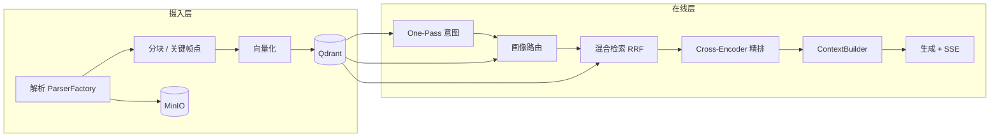
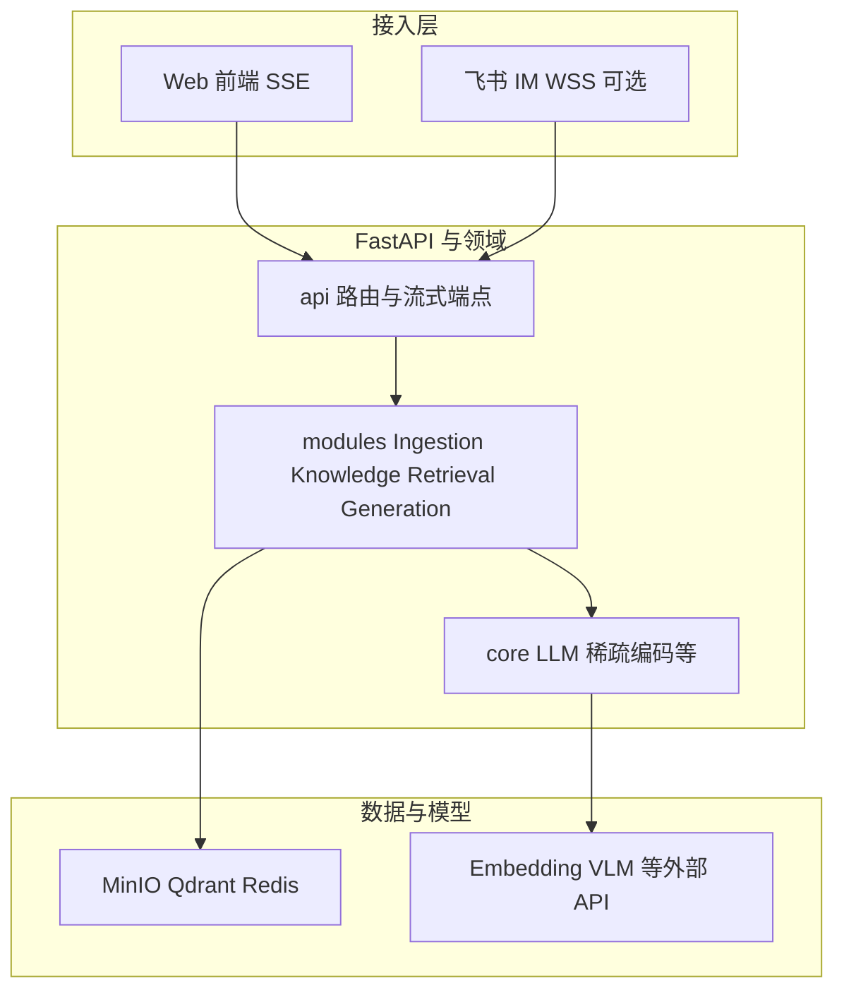
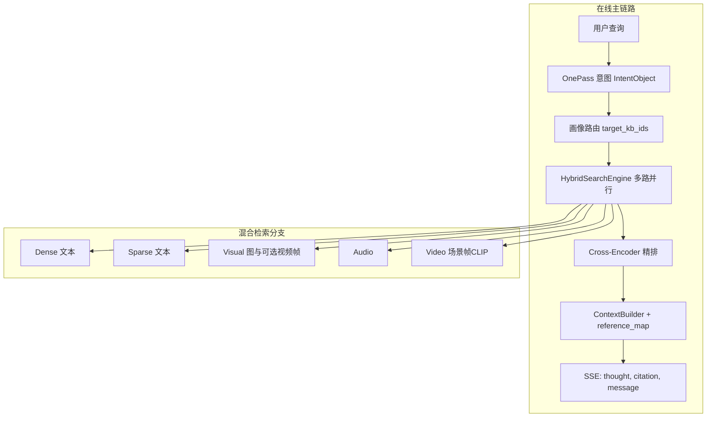
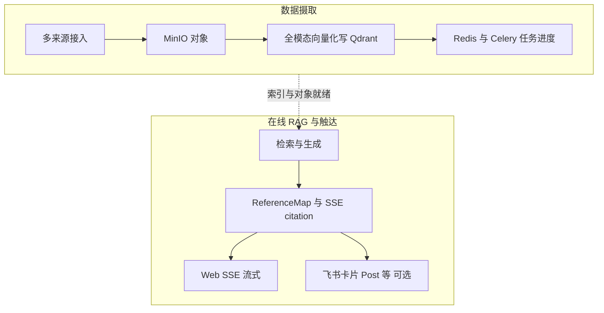

# MMA 多模态 RAG 知识库 — 架构设计文档

## 文档说明

本文档描述 **MMA-RAG**（本仓库）的模块划分与数据流，以**当前代码实现**为准；与 **[MULTIMODAL_IMAGE_AUDIO_VIDEO_TECHNICAL_SPEC.md](./MULTIMODAL_IMAGE_AUDIO_VIDEO_TECHNICAL_SPEC.md)** 互为补充（后者专述图/音/视的解析、向量形态与检索细节）。

**路径约定**：除非另行标注，本文中的 **后端路径** 均相对于仓库根目录下的 [`backend/app/`](../backend/app/)；**前端路径** 均相对于 [`frontend/src/`](../frontend/src/)。

**与架构页文案的关系**：产品化架构页（[`frontend/src/data/architectureData.ts`](../frontend/src/data/architectureData.ts)）与页面 [`ArchitecturePage.tsx`](../frontend/src/pages/ArchitecturePage.tsx) 上的 **整体架构卡片、RAG 请求链路 Stepper、数据流分区图** 同源；本地启动前端后可在 **`/architecture`**（如 `http://localhost:3000/architecture`）交互查看。**SSE 事件类型、引用字段等协议级细节以本文及 `modules/generation/stream_manager.py` 为准**；下文 mermaid 与表格为与前端图示一致的静态对照，便于在仓库内离线阅读。

**项目特点（阅读主线）**：

1. **统一 Embedding 空间 + 模态专用向量**：文档/图片描述/音频与视频的文本侧共用 Dense 嵌入；图片叠加 CLIP、音频叠加 CLAP、视频按关键帧叠加 **scene_vec / frame_vec / clip_vec**（详见多模态专文）。
2. **One-Pass 意图 + 多路混合检索**：单次 LLM 调用产出意图与查询策略；检索层并行 Dense、Sparse、Visual、Audio、Video，再 **RRF 融合**与 Cross-Encoder 精排。
3. **知识库画像路由**：未指定 KB 时，用 `kb_portraits` 做跨库语义匹配与单库/多库/全库决策。
4. **可观测对话体验**：SSE 推送思考链与引用，前端 ThinkingCapsule / CitationPopover 等呈现检索路径与溯源。

**文档如何组织「思路」与「实现」**：

- 各章开头的 **设计思路**：回答「要解决什么问题、为何选这条路径」，偏架构 rationale。
- **方案特点**：用短句概括该章方案的 **辨识度**（与常见做法相比好在哪里、约束是什么）。
- 各节末的 **实现方案要点**：与代码行为对齐的细节，便于对照仓库排查。

**全链路设计问题 → 文档落点（速查）**：

| 设计问题 | 主要落点 |
|----------|----------|
| 异构文件如何进同一套检索？ | 第二章：ParserFactory、中间表示、按模态选「块 / 点」 |
| 文本与看图/听声如何同时召回？ | 第二章向量化 + 第三章混合检索与意图三档 |
| 多库时如何避免扫全库？ | 第三章：`kb_portraits` 与 `modules/knowledge/router.py` 阈值策略 |
| 多路分数不可比怎么办？ | 第三章：RRF 粗排 + Cross-Encoder 精排分工 |
| 生成与前端如何共用引用协议？ | 第四章：`ContextBuilder`、`reference_map`、SSE 事件顺序 |
| 模型与厂商如何可替换？ | 第五章：`LLMManager`、registry、providers |
| 想看与本文配套的交互图示？ | 前端路由 **`/architecture`** + `architectureData.ts`（与第一章 §1.2.1～§1.3.1、第二章 §2.5 对照） |

### 目录

- [一、设计背景与目标](#一设计背景与目标)
- [二、数据的输入处理与存储](#二数据的输入处理与存储)
- [三、语义路由与检索策略](#三语义路由与检索策略)
- [四、LLM 上下文构建与返回内容构造](#四llm-上下文构建与返回内容构造)
- [五、模块化 LLM 管理器](#五模块化-llm-管理器)
- [六、前端交互设计要点](#六前端交互设计要点)
- [七、代码分层与模块边界](#七代码分层与模块边界)
- [八、相关文档索引](#八相关文档索引)

---

## 一、设计背景与目标

**本章设计思路**：在本地可部署前提下，把「多知识库、多模态、自动选库、可解释检索」作为一等需求，而不是在纯文本 RAG 上事后打补丁。

**本章方案特点**：目标陈述直接对应下文模块——可扩展 KB 与多来源导入、文档+图音视贯通、语义路由与混合检索、统一 LLM 调度、DDD 式分层与前端可观测性。

以下各节给出 **贯穿全栈的原则、数据流图与关键取舍**，便于先建立全局再读第二～七章。

### 1.1 贯穿全栈的设计原则

| 原则 | 含义与落点 |
|------|------------|
| **实现即真理** | 架构描述以本仓库当前代码为准，与多模态专文、README 交叉引用，避免「文档架构」与「运行架构」漂移。 |
| **边界清晰** | Ingestion（解析与写入）、Knowledge（画像与路由）、Retrieval（意图→混合检索→重排）、Generation（上下文与流式）、Core/LLM（模型与编码器）职责分离，便于替换实现与排障。 |
| **可降级、不断流** | 解析链多级回退、意图 JSON 失败默认值、VLM 失败仍写占位描述等，保证导入与问答主路径可用。 |
| **白盒化体验** | SSE 推送思考链与结构化引用，前端区分 doc/image/audio/video，支撑调试与用户信任。 |

### 1.2 端到端逻辑数据流

**关于上图箭头**：One-Pass 意图**不访问** Qdrant；`kb_portraits` 与各 Collection 的读取发生在 **路由**（画像检索）与 **混合检索** 阶段。图中 `Q --> OP` 表示「在线问答与同一套向量数据闭环」，而非意图模型直连向量库。

### 1.2.1 系统分层示意（与前端「整体架构」对照）

与 [`ArchitectureDiagram`](../frontend/src/components/architecture/ArchitectureDiagram.tsx) 一致：**Web SSE** 与 **可选飞书 WSS** 汇入同一 FastAPI；领域模块共享 **MinIO / Qdrant / Redis** 与 **多厂商 LLM**。

### 1.3 在线问答链路展开（与第三章对照）

下图将 **§3.1～§3.4** 的主路径压成一条可读链路；各路 Dense / Sparse / Visual / Audio / Video 的细节仍以第三章为准。

### 1.3.1 RAG 请求链路（七阶段，与前端 Stepper 同源）

阶段划分与 [`architectureData.ts`](../frontend/src/data/architectureData.ts) 中的 `requestFlowSteps` 一致；前端 [`RequestFlowStepper`](../frontend/src/components/architecture/RequestFlowStepper.tsx) 提供逐步展开与耗时、技术标签；此处用一图一表作概要。

| 阶段 | 职责摘要 | 主要代码入口（相对 `backend/app/`） |
|------|----------|--------------------------------------|
| 1 | 流式对话入口：问题、`kb_ids`、会话上下文 | `api/chat.py` → `stream_chat` |
| 2 | 输出 `IntentObject`（改写、稀疏关键词、多视角、分模态意图） | `modules/retrieval/processors/intent.py` → `IntentProcessor.process` |
| 3 | 未指定 KB 时：`kb_portraits` TopN、加权聚合、单库/多库/全库 | `modules/knowledge/router.py` → `KnowledgeRouter.route_query` |
| 4 | Dense / Sparse / Visual / Audio / Video 多路检索与 RRF 粗排 | `modules/retrieval/search_engine.py` → `HybridSearchEngine` |
| 5 | Cross-Encoder 精排，与 RRF 分合并取 Top-K | `modules/retrieval/reranker.py` → `Reranker` |
| 6 | `ContextBuilder` 生成 `ReferenceMap`；系统提示与多模态材料模板 | `modules/generation/context_builder.py`、`core/llm/prompt.py` 等 |
| 7 | `GenerationService` 调 LLM；`StreamManager` 推送 `thought` / `citation` / `message` | `modules/generation/service.py` → `stream_generate_response`、`modules/generation/stream_manager.py` |

### 1.4 关键设计取舍（为何不是另一种做法）

| 取舍点 | 本方案 | 常见替代 | 选择理由 |
|--------|--------|----------|----------|
| 意图与检索计划 | **One-Pass** 单次结构化 JSON | 多轮链式调用（先分类再改写再检索） | 降低 RTT 与状态不一致；下游拿到一份自洽的「检索计划」 |
| 多路结果合并 | **RRF（排名融合）** | 分数归一化后加权求和 | 各路分数量纲与分布差异大，排名域融合更稳健、实现简单 |
| 精排位置 | RRF 后 **少量候选** 上 Cross-Encoder | 全程精排或仅用向量分数 | 成本可控；深层 query–passage 交互只对 Top-N 候选发挥 |
| 视频检索单位 | **每关键帧一点** + `segment_id` 聚合 | 整条视频单向量 | 匹配粒度细；聚合后仍可对用户呈现「一条视频」 |
| 未指定 KB | **画像点 + 向量近邻 + 阈值** | 固定全库或规则路由 | 随内容增长可扩展；语义与库级摘要对齐，避免纯规则僵化 |
| Blob 与向量 | **MinIO + Qdrant 分离** | 向量库内嵌大文件 | 职责清晰：检索负载与对象服务解耦；Presigned URL 直连前端 |
| 多模态白盒 | **SSE：`thought` → `citation` → `message`** | 仅返回最终文本 | 调试与用户信任：推理阶段与引用先于正文结构化下发 |

**与「纯文本 RAG + 事后挂插件」的差异**（体现本章目标优先级）：

| 维度 | 纯文本 RAG 常见形态 | MMA-RAG 目标形态 |
|------|---------------------|------------------|
| 模态 | 附件或外链，检索仍以文本为主 | 图/音/视与文档 **同等进入向量检索与融合** |
| 选库 | 用户手选或简单关键词 | **未指定时** 用语义画像做 **库级** 匹配 |
| 查询理解 | 单次改写或无语义策略 | **意图类型 + 多视角 + 分模态三档**，驱动各路开关与权重 |
| 用户体验 | 黑盒回答 | **思考链 + 类型化引用 + 媒体直连** |

系统目标：构建**本地可运行、可扩展的语义路由多模态 RAG Agent**，具备：

- **可扩展知识库**：支持用户自建多主题知识库、增量更新；支持多种内容来源（本地上传、URL 下载、RSS/热点、媒体下载等）。
- **多模态数据**：支持**文档**（PDF、Word、TXT、Markdown 等）、**图片**、**音频**、**视频**。文档与内嵌图、独立图、音、视在 Ingestion 与 Retrieval 中均已**贯通实现**（视频为 **MLLM 场景解析 + 每关键帧一点** 写入 Qdrant，见多模态专文）。
- **语义路由与混合检索**：根据查询自动路由至合适知识库；混合检索结合 **Dense、Sparse、Visual（图 + 可选并入视频关键帧）、Audio（CLAP + ASR/描述）、Video（scene/frame/clip 多路 RRF）**，并两阶段重排（RRF 粗排 + Cross-Encoder 精排）。
- **统一 LLM 管理层**：意图识别、**VLM 图注、ASR 音频转写、多模态描述**、Embedding、Reranker、最终生成等由模块化 LLM Manager 统一调度，支持多厂商 API（如 SiliconFlow、OpenRouter、阿里云百炼、DeepSeek 等）。
- **模块化与 DDD**：业务按领域划分（Ingestion / Knowledge / Retrieval / Generation），与核心设施（Core）及 API 层解耦；前端支持对话、知识库管理、思考链可视化、引用展示等。

---

## 二、数据的输入处理与存储

**本章设计思路**：把 **「异构源 → 统一中间表示 → 按模态选择切块单位 → 多向量写入」** 固化成管道；文档强调可复用的文本块，媒体强调 **「向量点 = 语义单元」**（图一点、音一点、视频每关键帧一点），与检索侧一一对应。

**本章方案特点**：解析可插拔（Factory）、版式文档优先强解析链路、图文在分块前对齐（内嵌图 caption 回注）、对象与向量双存储（MinIO + Qdrant）、长任务异步化。

### 2.1 数据解析与处理

**设计思路**：不同 MIME/扩展名背后是不同的信息结构；用 **ParserFactory** 做唯一入口，避免业务层散落 `if pdf / elif docx`。文档类优先 **版面与表格友好的解析器**，弱化为兜底 OCR/文本抽取，提高知识库「可检索信息密度」。

**方案特点**：PDF/DOCX 等走 **MinerU（云/本地）→ Paddle → 轻量库** 的阶梯回退；图片走轻量解码 + 元数据；音/视频在进入 ASR/MLLM 前统一产出时长、格式等 **流水线契约**。

按数据类型采用差异化解析策略，由 `ParserFactory` 统一调度；扩展新格式时增加对应 Parser 即可。

#### 文档类

**小节设计思路**：PDF/Office 的信息密度来自 **版式、表格与阅读顺序**；若优先走轻量文本抽取，复杂版式会退化为乱序纯文本，后续检索与引用质量上限被锁死。故采用 **强解析优先、轻量兜底** 的阶梯，在成本与可用性之间可配置（云 MinerU / 本地 MinerU / 云端 OCR）。

**小节方案特点**：同一入口（`ParserFactory`）屏蔽 MIME 差异；失败自动降级，避免单点配置阻断整条导入流水线。

- **PDF**（`PDFParser`，`modules/ingestion/parsers/factory.py`）：**首选 MinerU 链路**——① **MinerU 云端 API**（需 `MINERU_TOKEN` 且开启 `mineru_pdf_enabled`）；失败则 ② **本地 MinerU 2.5**（`mineru_client.parse_pdf`）；若仍不可用或失败，再 ③ **PaddleOCR-VL-1.5**（`modules/ingestion/parsers/paddleocr_client.py`，需 API 配置）；最后 ④ **PyMuPDF（fitz）** 兜底。与旧「以 PyMuPDF 为主」的表述相反：**MinerU / Paddle 为版式与表格优先，PyMuPDF 仅作末级回退**。
- **DOCX / PPTX**：同样 **MinerU API → 本地 MinerU 2.5**（本地路径依赖 **LibreOffice** 将 Office 转为 PDF 再逐页解析）；仍失败则回退 **python-docx** / **python-pptx**（以文本为主）。
- **TXT / Markdown**：纯文本直接读取；Markdown 使用 markdown 库并支持结构化切分。
- **表格**：MinerU / Paddle 解析结果中的表格多为 Markdown Table；可按需再经 LLM 摘要或下游处理。

#### 图片类

**小节设计思路**：图片在流水线中同时服务 **VLM 语义描述** 与 **CLIP 视觉向量**；解析阶段只需稳定解码与元数据，避免在 Parser 层重复实现推理逻辑。

**小节方案特点**：轻量依赖、格式覆盖广；输出 **base64 + 几何信息** 作为下游 VLM/CLIP 的统一输入契约。

- 使用 PIL/Pillow 解析，支持 JPG、JPEG、PNG、GIF、BMP、TIFF 等。
- 元数据：width、height、format、mode、aspect_ratio；输出含 base64 供 VLM 使用。

#### 多模态扩展（音频/视频）

**小节设计思路**：音/视的 **解析与写入** 在 Ingestion 完成；**是否值得为当前问句走音/视检索** 属于在线意图问题，放在第三章用三档意图统一调度，避免 Ingestion 与 Retrieval 职责交叉。

**小节方案特点**：导入侧保证「每条媒体有可检索向量」；在线侧用 `audio_intent` / `video_intent` 等控制 **路权与成本**，而非在解析阶段猜测用户查询。

- 意图层在 One-Pass 中输出 `audio_intent`、`video_intent`（explicit_demand / implicit_enrichment / unnecessary），与 `visual_intent` 一起参与检索权重与策略。
- 图/音/视的解析、向量字段与 Qdrant 形态见 **[MULTIMODAL_IMAGE_AUDIO_VIDEO_TECHNICAL_SPEC.md](./MULTIMODAL_IMAGE_AUDIO_VIDEO_TECHNICAL_SPEC.md)**。

**实现方案要点：**

- **解析入口**：根据文件扩展名或内容检测由 ParserFactory 选择对应 Parser。**文档**（PDF/DOCX/TXT/Markdown 等）返回统一结构的 parse_result（如 markdown 文本、提取的图片列表、元数据）；**图片**解析输出 base64 与尺寸等供 VLM/CLIP 使用；**音频**（mp3/wav/m4a/flac 等）由 AudioParser 输出时长、采样率、格式等，供 ASR/CLAP 流水线使用；**视频**（mp4/avi/mov/mkv 等）由 VideoParser 输出时长、分辨率、帧率等，供关键帧提取与 VLM/CLIP 使用。
- **文档内图片**：PDF 或 Markdown 解析时若发现内嵌图，先提取图片字节与在原文中的占位符（markdown_ref）；每张图单独走 VLM 描述 + 上传 MinIO + CLIP 向量化 + 写入 image_vectors，同时将生成的 caption 记下，在后续分块前插回原文占位符，再对整份文档做分块与向量化，保证图文一致。
- **音频/视频**：音频走 ASR 转写 + 描述生成 + `text_vec` + `clap_vec`（+ 可选 sparse），写入 `audio_vectors`。视频走 MLLM 场景/关键帧规划 → 按时间戳截帧 → 每帧写入 **`scene_vec` + `frame_vec` + `clip_vec`** 至 `video_vectors`（**一关键帧一点**）；若含音轨可 ffmpeg 抽轨并记录 `audio_file_id`。详见多模态专文。
- **多来源接入**：sources 层（URL、文件夹、Tavily 热点、媒体下载等）产出统一格式的「待处理文件」或 URL，由 Ingestion 统一执行下载（若需要）、解析、分块/多模态处理、向量化、写入；大任务通过 Celery 异步执行，进度写入 Redis 供前端轮询或 SSE 推送。

### 2.2 分块策略

**设计思路**：文档检索依赖 **粒度适中的文本块**——过大则噪声多，过小则上下文碎裂；故采用 **结构感知（标题/段落）+ 递归切分 + 重叠窗口**，在长度约束下尽量保持语义完整。多模态则 **不以「块」为检索单位**，而以 **已标注好的向量点** 为单位，避免不自然的硬切。

**方案特点**：内嵌图先 **VLM 描述并回注原文** 再分块，使「图意」进入文本检索路径；视频侧 **按关键帧落点**、检索后再按 `segment_id` 聚合，平衡 **细粒度匹配** 与 **用户感知的视频条目标识**。

- **文档**：递归语义分块（按段落/句子与长度限制）、重叠窗口（如 max_chunk_size=1000，chunk_overlap=200）；配置参数集中管理。
- **图片/音频/视频**：不做传统「分块」，而以**向量点**为单位：图片一点；音频一点（整段）；视频**每关键帧一点**（含场景摘要、帧描述、CLIP 与帧图路径）。检索时按点返回，视频检索侧再按 `segment_id` 聚合去重，精排与上下文构建时按条引用。

**实现方案要点：**

- **文档分块**：入口根据解析结果类型（Markdown、纯文本等）选择策略：已有结构的按标题/段落先切大块，单块若仍超过 `max_chunk_size`（如 1000 字符）则进入递归切分；递归时优先按句号、换行等边界再切，并遵守 `min_chunk_size`（如 100 字符）避免过碎。重叠在递归完成后统一施加：对相邻 chunk 在边界处取 `chunk_overlap`（如 200 字符）的公共内容，保证上下文连贯、检索时边界信息不丢失。
- **文档内嵌图片**：先对文档解析得到的图片逐张做 VLM 描述并上传 MinIO，再将每张图的 caption 按占位符插回 Markdown 原文（如 `[图注：xxx]`），最后对这份「补全后的 Markdown」做上述分块与向量化，这样同一段文字中若含图片说明，会与周围文本一起被切进同一或相邻 chunk，便于检索与引用。
- **多模态条目不切块**：**图片、音频**各对应 **一个** Point（caption / transcript+description 等）。**视频**按 **每个关键帧一个 Point**（同一条视频文件可对应多个 Point，共享 `segment_id` 等），不再对单帧做子块切分。
- 每个**文档** chunk 写入向量库时携带 `context_window`：保存前一个与后一个 chunk 的 ID（或临时 ID），便于调试时拉取「前文/后文」做上下文透视（Small-to-Big 扩展可按需使用）。

### 2.3 向量化策略

**设计思路**：**文本向量**负责与查询语言对齐，承担路由、画像与主检索；**专用向量**负责与「看图/听声」类需求对齐。同一逻辑实体（如一张图）在 Qdrant 中单点多命名向量，检索时 **多路命中再融合**，而不是强行压成单向量。

**方案特点**：文档 **Dense + Sparse（BGE-M3）** 兼顾语义与关键词；图片 **text_vec（caption）+ clip_vec**；音频 **text_vec + clap_vec（+ 可选 sparse）**；视频每帧 **scene_vec / frame_vec / clip_vec** 三路语义分工（场景摘要 / 帧描述 / CLIP 视觉对齐），且 Visual 检索可 **并入视频关键帧**，缓解「纯图库为空」时的视觉召回缺口。

- **文档 Chunk**：
  - **Dense**：统一文本嵌入模型（如 Qwen3-Embedding-8B）生成 4096 维向量。
  - **Sparse**：BGE-M3 稀疏编码（`core/sparse_encoder.py`），写入 Qdrant 的 `sparse` 命名向量，用于稀疏检索。
- **图片**：
  - **VLM 描述**：调用 VLM（如 Qwen3-VL-30B-A3B-Instruct）生成 caption，再对 caption 做文本向量化（与文档同模型）。
  - **CLIP**：`openai/clip-vit-large-patch14`，768 维视觉向量。
  - 同一 Point 使用 Qdrant Named Vector：`text_vec` + `clip_vec`，检索时双路 RRF 融合。
- **音频**：
  - **ASR + 描述**：音频经 ASR（如 Qwen3-Omni / 多模态 API）转写得到 transcript，再经 LLM 生成「主要内容、语气、场景」等描述；拼接后做文本向量化。
  - **CLAP**：`laion/clap-htsat-fused` 提取 512 维声学向量；可选 BGE-M3 稀疏与文档一致。
  - 同一 Point：`text_vec`（4096）+ `clap_vec`（512），可选 `sparse`；检索时 text + clap 双路 RRF，可与 sparse 融合。
- **视频**：
  - **MLLM 场景与关键帧**：由 `_parse_video_scenes_mllm` 等产出 `scene_summary` 与关键帧 `description`/`timestamp`；按时间戳截帧上传 MinIO。
  - **三向量（每关键帧一点）**：`scene_vec`、`frame_vec` 为 4096 维 Dense（分别对应场景摘要与帧描述嵌入）；`clip_vec` 为 768 维 **CLIP 图像编码**（patch 级视觉语义，非逐像素）。检索时在 `scene_vec` / `frame_vec` / `clip_vec` 上 Prefetch + Fusion RRF。
  - **与 Visual 检索的衔接**：显式/隐性视觉意图下，Visual 检索会用同一查询向量集检索 `video_vectors` 中的关键帧，并入图片结果，避免图库为空时漏掉视频画面。

**实现方案要点：**

- **文档**：每个 chunk 的文本先经 Dense 模型得到 4096 维向量，再经 BGE-M3 的 `encode_corpus` 得到稀疏表示（indices + values）；写入 Qdrant 时该 Point 同时带 `dense` 与 `sparse` 两个命名向量，检索阶段 Dense 路与 Sparse 路可独立查询再融合。BGE-M3 采用懒加载、Float16 以控制显存。
- **图片**：先调用 VLM（Prompt 中可注入文档内图时的标题、周围上下文）得到 caption；再用与文档相同的 Dense 模型对 caption 向量化得到 `text_vec`；同时用 CLIP 对原图编码得到 768 维 `clip_vec`。若 VLM 失败则用占位描述仍写入 `text_vec`，保证 Point 完整。
- **音频**：ASR 得到 transcript，LLM 生成 description，拼接后做 Dense（4096）+ 可选 BGE-M3 sparse；CLAP 对音频解码并重采样后提取 512 维 clap_vec；写入 audio_vectors 时 Point 含 text_vec、clap_vec 及可选 sparse。
- **视频**：每个关键帧一条 Point：`scene_vec`、`frame_vec`、`clip_vec` 与帧图路径、时间戳、`segment_id` 等 payload；长短视频分流与分段解析由 `settings` 中视频阈值与窗口参数控制。
- **多模态统一**：Text、Image、Audio、Video 的文本侧共用同一 Embedding 模型；画像对视频集合使用 **`frame_vec`**（关键帧描述嵌入）与其它模态一并聚类，使路由能反映全模态主题分布。

### 2.4 存储架构

**设计思路**：**Blob（MinIO）存原件与可播放媒体**，**Qdrant 存向量与检索 payload**——二者用 `file_id`、路径前缀约定对齐。向量侧按 **集合（Collection）分模态**，便于独立调参、独立扩容与按意图短路；**kb_id 全程 Pre-filter**，保证多租户隔离与延迟可控。

**方案特点**：每库一桶或等价隔离、Presigned URL 解耦鉴权与直传；`text_chunks` / `image_vectors` / `audio_vectors` / `video_vectors` / `kb_portraits` 职责单一；画像 **Replace 更新** 避免旧簇残留污染路由。

**为何按 Collection 分模态（而非单集合多类型）**：各路检索的 **命名向量维度与检索器不同**（如 sparse 仅文档、clip 仅图/视频帧）；分集合便于 **独立限流、扩容与按意图短路**，也降低单集合 payload 模式爆炸带来的索引与调试成本。

#### 对象存储（MinIO）

- **每知识库一个 Bucket**（`kb-{sanitize(kb_id)}`）；桶内以 `documents/`、`images/`、`audios/`、`videos/` 等前缀区分对象类型（视频关键帧图在 `videos/{file_id}/keyframes/`）。
- 上传、解析后写入 MinIO；对外提供 Presigned URL 供前端预览与播放（文档/图片预览，音频/视频播放）。

#### 向量与 Chunk（Qdrant）

- **text_chunks**：文档 Chunk；向量含 `dense`（4096 维）与 `sparse`（BGE-M3）；Payload 含 text_content、kb_id、file_id、file_path、file_type、context_window、metadata 等。
- **image_vectors**：图片；Named Vector：clip_vec（768 维）、text_vec（4096 维）；Payload 含 kb_id、file_id、file_path、caption、image_source_type、img_format 等。
- **audio_vectors**：音频；Named Vector：text_vec（4096 维）、clap_vec（512 维），可选 sparse；Payload 含 kb_id、file_id、file_path、transcript、description、duration、audio_format、sample_rate 等。
- **video_vectors**：视频；**每关键帧一点**；Named Vector：`scene_vec`（4096）、`frame_vec`（4096）、`clip_vec`（768）；Payload 含 `scene_summary`、`frame_description`、`frame_image_path`、`segment_id`、时间戳、`audio_file_id`（若抽音轨）等。
- **kb_portraits**：知识库画像；向量为 4096 维；Payload 含 kb_id、topic_summary、cluster_size，用于路由阶段相似度检索与加权打分；采样时文档/图/音用各自 **dense/text_vec**，视频关键帧用 **`frame_vec`**（与其它模态同维、同嵌入空间）。

#### 异步与缓存

- 长耗时导入通过 Celery + Redis 异步执行；前端可轮询或流式查看进度。热点/定时导入见 `tasks/scheduled_hot_topics.py`。

**实现方案要点：**

- **MinIO**：按知识库划分存储空间（如按 kb_id 的 bucket 或前缀），文档、图片、音频、视频分子目录（documents/images/audios/videos）；对象路径与 `file_id`、`file_path` 在向量库 Payload 中一致保存，便于生成 Presigned URL 与删除时联动；音频/视频可提供播放用 URL。
- **Qdrant**：所有检索均先按 `kb_id` 做 Pre-filter，再执行向量/稀疏检索，保证只命中目标知识库。`text_chunks` 的 Payload 中 `context_window` 存前后 chunk 的 ID，便于调试接口按 chunk_id 拉取前后文。image_vectors、audio_vectors、video_vectors 各自独立集合，检索时按意图分别查询再融合。
- **画像更新触发**：在内容增量或定时策略下触发画像重建；从 Text / Image / Audio / Video 四路按比例采样（视频以**关键帧点**计量，向量为 **frame_vec**），保证全模态在路由中有表征；生成完成后采用 Replace 策略：先删除该 kb_id 下全部旧画像点，再插入新生成的 portrait 点，避免历史画像残留。

### 2.5 数据流与多端输出（与前端「数据流」对照）

与 [`architectureData.ts`](../frontend/src/data/architectureData.ts) 中 `dataFlowStages` 及 [`DataFlowDiagram`](../frontend/src/components/architecture/DataFlowDiagram.tsx) 的分区一致：**摄取**（接入 → MinIO → 向量化与 Qdrant → Redis/Celery）与 **在线 RAG**（检索与生成 → 引用与 citation）串联，末端经 **Web SSE** 或 **可选飞书** 送达。

---

## 三、语义路由与检索策略

**本章设计思路**：把「理解查询」与「执行检索」拆开：**理解阶段一次 LLM 结构化输出**，驱动后续 **多路并行检索**；路由不依赖规则引擎堆叠，而依赖 **库级语义画像** 与用户查询在同一嵌入空间中的相似度，再辅以 **阈值化的单库/多库/全库** 决策。

**本章方案特点**：One-Pass 降延迟、意图三档控制 **是否走音/图检索及视频 CLIP 与权重**（视频检索本身常开、权重可调）、混合检索 **RRF + Cross-Encoder** 两阶段、多模态与文本在同一套融合框架内。

### 3.1 查询预处理（One-Pass 意图识别）

**设计思路**：若意图、改写、关键词、多视角、分模态意图拆成多次调用，易产生 **前后矛盾** 与 **额外 RTT**；合并为单次结构化生成，使下游 `HybridSearchEngine` 拿到 **一份自洽的「检索计划」**。

**方案特点**：输出 IntentObject（JSON）；**audio_intent 为 unnecessary 时音频路直接空结果**；**video_intent 主要调 RRF 权重**；**visual_intent 还控制是否生成 CLIP 查询向量**；解析失败时安全默认值保证检索可执行。

**分模态三档（explicit / implicit / unnecessary）的设计意图**：并非简单「要不要检索」，而是把 **召回成本、CLIP/CLAP 编码成本与答案相关性** 绑在一起调度——**explicit** 强化该模态在 RRF 中的话语权；**implicit** 允许「顺带 enrichment」但不主导；**unnecessary** 在音频侧 **直接短路整路**，在视觉侧 **跳过 CLIP 查询构造** 等，避免纯文本问句仍触发昂贵的多模态向量分支。

在 `modules/retrieval/processors/intent.py` 中，将**意图分类、查询改写、关键词/多视角生成、视觉/音频/视频意图**统一为一次 LLM 调用，输出结构化 JSON（IntentObject），降低延迟并保持一致性。

- **主要字段**：reasoning、intent_type（factual/comparison/analysis/coding/creative）、is_complex、**visual_intent / audio_intent / video_intent**、search_strategies（dense_query、sparse_keywords、multi_view_queries）、sub_queries。
- **visual_intent**：explicit_demand / implicit_enrichment / unnecessary，用于决定是否执行**图片**检索及权重。
- **audio_intent** / **video_intent**：与 visual 同三档。**音频**：`unnecessary` 时 **`_audio_search` 直接返回空**，不参与音频向量检索。**视频**：检索任务**每次执行**；`video_intent` 主要调节 **RRF 中 video 路权重**（显式/隐性提高）；`visual_intent` 还用于控制是否为视频检索生成 **CLIP 查询向量**（`unnecessary` 时仅用 Dense 匹配 `scene_vec`/`frame_vec`）。详见 `modules/retrieval/search_engine.py` 中 `HybridSearchEngine.search` / `_video_search`。
- 查询改写与多视角在 `modules/retrieval/processors/rewriter.py` 中配合使用；稀疏侧关键词可用于 BGE-M3 查询构建。

**实现方案要点：**

- **输入**：除用户当前 query 外，将最近若干轮对话历史（如最近 5 轮、每条截断长度）格式化为文本一并放入 Prompt，便于指代消解与多轮语境下的意图判断。
- **输出与校验**：LLM 返回的 JSON 需包含上述字段；若解析失败或缺少关键字段，则使用默认意图（如 factual、refined_query 为原 query、visual_intent 为 unnecessary），保证下游检索仍可执行。
- **字段用途**：`refined_query`（或 dense_query）作为语义检索的主查询与路由查询向量来源；`sparse_keywords` 与 dense_query 可拼接后送 BGE-M3 生成稀疏查询向量；`multi_view_queries` 用于 Dense 多视角检索；`visual_intent` 控制是否执行 **Visual** 及 **视频检索中的 CLIP 分支**；`audio_intent` 控制是否执行 **Audio** 检索（`unnecessary` 时为空）；`video_intent` 主要调节 **Video 路** 在 RRF 中的权重（检索仍执行）。

### 3.2 知识库画像与路由

**设计思路**：用户未指定库时，系统需要 **「库级语义摘要」** 而非逐文档扫描；通过对各模态向量 **聚类 + LLM 主题句**，把每个 KB 压缩成可检索的 **portrait 点**，在线阶段用 **查询向量最近邻** 完成候选库排序。

**方案特点**：采样 **覆盖 Text/Image/Audio/Video**（视频用 `frame_vec` 与文本同空间），使路由感知全库内容形态；**Replace 策略** 更新画像；在线 **位置衰减 + min-max + 双阈值**（置信不足则全库）平衡 **精准单库** 与 **召回兜底**。

**为何画像用「聚类 + LLM 主题句」而非直接摘要文件名**：库级路由需要的是 **可与用户问句比对的语义摘要**；对海量 chunk 逐条摘要成本高且噪声大。聚类将 **相近语义折叠为簇心邻域**，再对少量代表样本做 LLM 主题句，在 **覆盖度、成本与可检索性** 之间折中。

- **画像生成**（`modules/knowledge/portraits.py`）：
  - 从 **Text、Image、Audio、Video** 各 Collection 采样向量（文档 dense、图/音的 text 侧、视频的 **frame_vec**），K-Means 聚类；聚类数 **K 取 `sqrt(N/2)`（经验公式）并上限 `max_kb_portrait_size`**。**轮廓系数**在聚类完成后计算，用于日志与质量观测，**不用肘部法则在多个 K 间搜索**。
  - 对每个簇取近中心若干 Chunk/条目，经 LLM 生成 topic_summary，再向量化写入 `kb_portraits`；采用 Replace 策略更新该 KB 的画像。
- **在线路由**（`modules/knowledge/router.py`）：
  - 使用 processed_query（refined_query）的向量在 `kb_portraits` 中检索 TopN 相似节点。
  - 按 KB 聚合：位置衰减加权平均、min-max 归一化后按阈值决定单库/多库/全库（实现细节见同文件）。

**实现方案要点：**

**配置与数值时效**：下文中的路由阈值（如 `ROUTING_ALL_LOW_THRESHOLD`、`ROUTING_GAP_DOMINANT`）、精排 `top_k` / `final_top_k` 及 RRF 权重等，**均以仓库内当前实现为准**——见 `modules/knowledge/router.py`、`modules/retrieval/reranker.py`、`modules/retrieval/search_engine.py` 及应用内 `settings`（或等价配置模块）；本文所举数字仅供阅读对照。

- **画像生成**：从该 KB 的 **Text、Image、Audio、Video** 各 Collection 按比例采样（视频为关键帧点，使用 **frame_vec**）；若总条目数小于阈值（如 5000）则全量取，否则蓄水池采样并设上下限（如 50～1000）。采样时只带 id、vector、source_type（doc/image/audio/video），不加载正文以节省内存；确定聚类中心后，再按 id 回查各 Collection 取正文。K-Means 的 K 取 `sqrt(N/2)` 并限制在配置的 `max_kb_portrait_size` 内。每个簇取距离中心最近的若干样本，将其文本以「[文档片段]」「[图片描述]」「[音频转写/描述]」「[视频帧描述]」等前缀拼成 content_pieces，调用 LLM 生成 topic_summary，再 Dense 向量化写入 `kb_portraits`。存储前先删除该 kb_id 下全部旧画像（Replace 策略）。
- **路由决策**：若用户已指定知识库则直接使用，不查画像。否则用 refined_query 的 Dense 向量在 `kb_portraits` 上做**全局**向量检索（不按 kb_id 过滤），取 TopN（如 30）个最相似节点。按 kb_id 聚合时，每个 KB 只取这 TopN 中属于该 KB 的、得分最高的前 K 个节点（如 5 个），对这些相似度做**位置衰减加权平均**（实现中为 `α^i` 权重、`i` 从 0 起，与文档常用写法 `w_i=α^(i-1)`（`i` 从 1 计）等价），得到该 KB 的 **raw 分**。若 **raw 分的全局最大值** 仍低于阈值（`modules/knowledge/router.py` 中 `ROUTING_ALL_LOW_THRESHOLD`，当前为 **0.08**），则判定「全部偏小」，改为拉取**全部知识库 id** 做全库检索（`low_confidence`）；否则再对 raw 分做 **min-max 归一化** 到 [0,1]，若第一名与第二名的归一化分差 ≥ **0.3**（`ROUTING_GAP_DOMINANT`）则只选第一名（单库），否则取前两名（多库）。最终输出 target_kb_ids 及置信度，供检索阶段 Pre-filter 使用。

### 3.3 混合检索（HybridSearchEngine）

**设计思路**：不同命名向量、不同检索器返回的 **分数不可直接比较**；采用 **各路人马先出排名，再用 RRF 在排名域融合**，避免强行校准分分布。意图三档进入 **路权与 limit**，使 **显式多媒体需求** 不被纯文本洪流淹没。

**方案特点**：Text 上 **Dense 多查询 + Sparse**；Visual 上 **text_vec + clip_vec**，并 **可并入 video 关键帧**；Audio 上 **text + CLAP（+ sparse）**；Video 上 **scene/frame/(可选 clip)** 三路；全局 **加权 RRF** 合流后 **Cross-Encoder 精排**。

**与「单向量混合检索」的差异**：单向量方案需把所有模态压进同一嵌入空间，往往损失图像/音频的专用几何；本方案 **保留多命名向量与各模态检索器**，在 **结果层** 用 RRF 统一排序语言，扩展新模态时主要 **新增一路 Prefetch**，不必推翻全局嵌入定义。

- **输入**：RetrievalContext（含 refined_query、target_kb_ids、search_strategies、**visual_intent、audio_intent、video_intent** 等）。
- **文本流**：
  - **Dense**：主查询 dense_query + 多视角 multi_view_queries 向量化后检索 text_chunks，内部加权融合。
  - **Sparse**：BGE-M3 对查询（或拼接关键词）生成稀疏向量，调用 `vector_store.search_text_chunks_sparse()`，与 Dense 结果一起参与融合。
- **图片流**（当 visual_intent 非 unnecessary）：
  - 查询的文本向量匹配 `text_vec`；CLIP 文本向量匹配 `clip_vec`；`image_vectors` 上 Prefetch + Fusion RRF。若 CLIP 可用，还会**额外检索 `video_vectors`**，将命中关键帧并入 Visual 结果（与多模态专文一致）。
- **音频流**（当 audio_intent 非 unnecessary）：
  - 查询的 text 向量 + 可选 CLAP 文本向量、BGE-M3 sparse，对 `audio_vectors` 双路/多路 RRF；`unnecessary` 时整路为空。
- **视频流**（每次执行）：
  - 查询文本做 Dense 向量，在 `scene_vec` + `frame_vec` 上检索；若 `visual_intent` 非 `unnecessary`，再生成 CLIP 文本向量参与 **clip_vec** 路；三路 Prefetch + RRF 后，`_video_search` 内按 **segment** 聚合去重。
- **融合**：**Dense、Sparse、Visual、Audio、Video** 多路结果经加权 RRF 粗排（`visual_intent` / `audio_intent` / `video_intent` 动态权重），再经 Cross-Encoder 精排取 Top-K，供上下文构建使用。

**实现方案要点：**

- **Dense**：对 dense_query 向量化得到主查询向量，对 multi_view_queries 分别向量化后与主查询一起对 Text Collection 检索，多路结果在引擎内部按权重融合（同一文档被多路命中时分数叠加），再参与全局 RRF。
- **Sparse**：用 BGE-M3 对「dense_query 与 sparse_keywords 拼接」或仅 dense_query 生成查询稀疏向量，调用 Qdrant 的 sparse 向量检索接口，在 text_chunks 上按 kb_id Pre-filter 后检索，返回列表参与 RRF。
- **Visual**：仅当 visual_intent 为 explicit_demand 或 implicit_enrichment 时执行。查询侧生成文本向量 + CLIP 文本向量（失败则回退单路），对 `image_vectors` 双路 RRF；成功时**额外**检索 `video_vectors` 关键帧并合并。explicit/implicit 控制 limit 与 score_threshold。
- **Audio**：仅当 audio_intent 非 unnecessary 时执行；查询做 text + 可选 CLAP + sparse，对 `audio_vectors` 检索；`unnecessary` 时返回空列表。
- **Video**：**每次**调用 `_video_search`；CLIP 侧是否启用取决于 `visual_intent`（见 `search` 中传入的 `visual_query`）。`video_intent` 调节 **video 路 RRF 权重**，而非跳过检索。
- **RRF**：**Dense、Sparse、Visual、Audio、Video** 多路结果按 doc/point id 去重合并后，对每条结果的「多路排名」应用加权 RRF 公式（如 score = Σ weight_t / (k + rank_t)），权重可配（如 dense=1.0、sparse=0.8、visual=1.2、audio=1.1、video=1.1），k 通常取 60。RRF 后得到粗排列表，进入精排阶段。

### 3.4 两阶段重排

**设计思路**：RRF 解决 **多路融合**；Cross-Encoder 解决 **query-passage 深层交互**——二者分工：前者便宜、可并行多路；后者贵、只对少量候选调用。

**方案特点**：粗排 **意图加权 + 可选多模态配额**；精排统一 (query, content) 形式但 **按类型填 content**；最终分数 **精排与 RRF 加权合并**，在「语义相关」与「多路共识」之间折中。

- **粗排**：RRF 将多路检索结果归一化到排名空间，避免分数量纲不一致；**visual/audio/video** 路在 RRF 中的权重随 **explicit/implicit/unnecessary** 动态调整（见 `modules/retrieval/search_engine.py`）。**对 implicit 下图结果的「配额保护」在精排后的最终截取中实现**（见 3.4 实现要点），粗排阶段不单独为音/视预留槽位。
- **精排**：Reranker（如 Qwen3-Reranker-8B / BGE-Reranker-v2-m3）对 (Query, Content) 对打分，按分数取最终 Top-K。Content 对**文档**为 text_content，对**图片**为 caption，对**音频**为 transcript+description，对**视频**为 description（可选含关键帧摘要）。

**实现方案要点：**

- **粗排**：在 HybridSearchEngine 内完成 RRF 融合；`visual_intent` / `audio_intent` / `video_intent` 为 **explicit** 等时会 **提高对应路在 RRF 中的权重**（见 `modules/retrieval/search_engine.py` 动态权重）。**implicit 下对图片的「最低配额」在精排后截取阶段由 `Reranker` 实现**（见上条），而非在 RRF 粗排中统一预留音/视槽位。
- **精排**：从粗排结果中取前若干名作为候选（`modules/retrieval/reranker.py` 中 `top_k`，当前为 **20**）构建 (query, content) 对：**文档**用 text_content，**图片**用 caption（可加「[图片描述]:」前缀），**音频**用 transcript+description，**视频**用 description。调用 Cross-Encoder 批量打分后，将精排分数与 RRF 分数按权重（默认 **0.7** 精排 + **0.3** RRF）合并，再排序截取 **`final_top_k`（当前为 10，以代码为准）**。
- **多模态保护（与代码一致）**：当前 `modules/retrieval/reranker.py` 在 **`visual_intent == implicit_enrichment`** 时对**图片**结果做保留配额，避免被纯文本挤掉；**未**对 audio/video 的 implicit 单独实现同类配额。若后续扩展音/视配额，应在此节与代码同步更新。

---

## 四、LLM 上下文构建与返回内容构造

**本章设计思路**：检索结果是 **异构列表**；进入生成前必须 **序列化为模型可读的统一「材料」格式**，并建立 **稳定引用编号**，使模型输出 `[n]` 与前端溯源、用户点击一致。**长度预算** 在材料级裁剪，避免撑爆上下文。

**本章方案特点**：`ContextBuilder` + 多模态模板统一四类材料文案；**reference_map** 同时服务 LLM 与前端（含 URL）；系统提示词约束 **诚实引用与禁止伪造编号**；SSE 将 **citation 提前于 message** 下发，便于前端预渲染。

### 4.1 上下文构建（ContextBuilder）

**设计思路**：模型只能读文本；图片/音频/视频在 prompt 中以 **结构化文字描述 + 可选 URL 元数据** 呈现，由前端负责真正的媒体展示。引用序号是 **会话内协议**，必须与 `reference_map` 严格对齐。

**方案特点**：分类型模板前缀（文档/图片/音频/视频）；**max_context_length + 分模态条数上限**；视频可将关键帧提升为独立引用以增强可解释性；debug 携带 `context_window` 等供 Inspector。

- 接收重排后的 Top-K（**文档 Chunk + 图片 + 音频 + 视频**），建立**会话级引用映射**：序号 1,2,3... 对应 chunk_id/point_id、file_path、MinIO URL、content_type 等。
- **多模态模板**（`modules/generation/templates/multimodal_fmt.py`）：
  - **文档**：`【材料 <index>】 (类型: 文档 | 来源: <file_name>) 内容片段： <text_content>`
  - **图片**：`【材料 <index>】 (类型: 图片 | 来源: <file_name>) [视觉描述]： <caption>`
  - **音频**：`【材料 <index>】 (类型: 音频 | 来源: <file_name>) [转写/描述]： <transcript/description>`
  - **视频**：`【材料 <index>】 (类型: 视频 | 来源: <file_name>) [描述/关键帧摘要]： <description>`
- 系统提示词（`core/llm/prompt.py`、`modules/generation/templates/system_prompts.py`）规定引用格式（如 `[id]`）、**文档/图片/音频/视频**多模态描述方式及诚实回答原则。

**实现方案要点：**

- **引用映射**：对重排后的结果按最终分数排序，依次分配序号 1、2、3…；每条结果对应一个 ReferenceMap 条目，包含 id（序号）、**content_type（doc/image/audio/video）**、file_path、content（摘要/caption/transcript+description/视频描述）、metadata（含 score、chunk_id、kb_id 等）、以及可选的 **presigned_url / audio_url / video_url**。文档类引用保留 chunk_id，便于调试时按 point id 拉取 context_window 前后文；音频/视频引用可带播放 URL 与时长、关键帧等。
- **上下文长度控制**：设 max_context_length（如 4000 字符）、max_chunks、**max_images / max_audios / max_videos**（及 implicit 时略多的配额），按相关性顺序填入对应模板直至达限；超长时可在不破坏引用序号的前提下截断或省略部分材料，并保证 reference_map 与 prompt 中的序号一致。
- **全模态展示**：**音频**引用除文本描述外，生成 Presigned URL 供前端播放；**视频**引用可带关键帧信息或关键帧图片 URL，并将关键帧作为独立「图片」引用加入 reference_map，使模型能以 [n] 引用关键帧图；citation 的 debug_info 可区分 doc/image/audio/video 便于前端渲染。
- **系统提示词**：按意图类型（如 factual / analysis / creative）可选用不同 system prompt 模板；模板中明确要求回答中事实必须带 [id]、禁止捏造编号、**文档/图片/音频/视频**等材料需在文中点明类型，以及「未找到则诚实说明」等原则。

### 4.2 流式返回与前端展示

**设计思路**：流式生成时用户仍需 **即时反馈「系统在做什么」**；将 **可结构化** 的阶段（意图、路由、检索计划）与 **最终 token 流** 分离为不同 SSE 事件，前端可分别设计 UI（胶囊 vs 气泡）。

**方案特点**：`thought` / `citation` / `message` 三类事件；引用带 **类型化 URL 与 debug_info**；ThinkingCapsule 与 CitationPopover 形成 **「推理可见、出处可点」** 的体验闭环。

**事件顺序（citation 早于 message）的设计意图**：模型一旦开始流式输出，`[n]` 会随 token 到达；若引用元数据滞后，前端无法即时做 **悬浮预览与链接解析**。先下发 `citation` 再推 `message`，使 **序号协议在正文开始前已就绪**，避免「先见脚注号、后见脚注内容」的割裂体验。

- **StreamManager** 通过 SSE 推送：思考链（thought）、引用元数据（citation）、消息流（message）。
- 前端：引文悬浮（CitationPopover）、图片灯箱、打字机流式展示；思考胶囊（ThinkingCapsule）展示意图、路由、检索策略等，实现“白盒化”思考。

**实现方案要点：**

- **SSE 事件类型**：`thought` 用于推送意图识别、路由、检索策略等中间状态，前端据此更新 ThinkingCapsule（如 intent_type、refined_query、target_kbs、**visual_intent、audio_intent、video_intent**、sparse_keywords 等）。`citation` 在上下文构建完成后、生成开始前发送，payload 为 reference_map 的 frontend 友好格式（id、**type：doc/image/audio/video**、file_name、content 摘要、**img_url/audio_url/video_url**、scores、debug_info 含 chunk_id 与 context_window）；前端可预加载引用卡片，并在用户悬停 [n] 时按类型展示预览/播放器。`message` 为 LLM 流式输出的 delta，前端做打字机渲染与 Markdown 解析。
- **引用与调试**：doc 类型引用在 debug_info 中带 chunk_id；若后端支持，可异步拉取该 chunk 的 context_window（prev/next 文本）并注入 citation。**音频/视频**引用通过 audio_url/video_url 与关键帧信息支持播放与时间戳跳转，供「上下文透视」与多模态调试使用。

---

## 五、模块化 LLM 管理器

**本章设计思路**：业务代码不应写死 **「某厂商某模型」**；将差异收敛到 **Provider + Registry**，上层只声明 **task_type**（意图、图注、ASR、生成、精排等），便于切换密钥、切换模型与 A/B。

**本章方案特点**：OpenAI 兼容适配多后端；**prompt 集中**（`prompt.py`）与 **渲染**（`prompt_engine`）分离；与 **sparse_encoder、portrait_trigger** 等并列在 Core，构成「模型与编码设施」层。对外由 **同一套 `LLMManager` 接口** 覆盖 chat / embed / rerank / 多模态输入，避免各模块各自实例化客户端；**`registry` 映射任务→模型**，**`providers/*` 隔离厂商协议**；可扩展记录耗时与 Token，为限流、熔断与主备打基础。

**用 `task_type` 而非直接暴露模型名的设计意图**：同一业务语义（如「意图识别」）在不同环境可映射到不同模型与厂商；**替换模型不改变调用点**，只改 registry 与配置，降低多团队协作时的合并冲突与回归范围。

- **职责**：统一封装 **chat、embed、vision、rerank** 以及 **音频转写（ASR）、多模态描述**等能力，业务层按任务类型调用，不关心具体厂商或模型实例。
- **核心位置**：`core/llm/`。
  - **manager**：对外接口与任务路由。
  - **registry**：模型注册表与任务到模型的映射（如 **intent_recognition、image_captioning、audio_transcription、final_generation、reranking** 等）。
  - **prompt.py**：所有提示词模板字符串（含 **image_captioning、audio_transcription** 等）；**prompt_engine.py**：加载 prompt 模块并对外提供 `render_template` 等。
  - **providers**：silicon_flow、openrouter、aliyun_bailian、deepseek 等，实现统一协议（如 OpenAI 兼容），**多模态任务**（图注、ASR、视频描述）由支持多模态的模型承接。
- **其他核心组件**：
  - **sparse_encoder.py**：BGE-M3 稀疏编码，供 Ingestion 写入与 Retrieval 查询使用（文档与可选音频 sparse）。
  - **portrait_trigger.py**：知识库画像更新触发逻辑（全模态向量采样）。
  - **keyword_extract.py**：关键词提取等，供检索与改写使用。

模型与 API 由各 Provider 与 `llm_manager` 配置；任务与模型对应关系在 `registry` 中配置或扩展。

**实现方案要点：**

- **任务路由**：业务层调用时指定 `task_type`（如 **intent_recognition、image_captioning、audio_transcription、final_generation、reranking、kb_portrait_generation**）；LLM Manager 根据 registry 将任务映射到具体模型与 provider，同一任务可配置主备模型，便于后续做故障转移；**多模态任务**（图注、ASR、视频/音频描述）由支持对应模态的 API 承接。
- **统一接口**：chat（含多轮消息、temperature、**多模态输入如图片/音频**）、embed（文本列表）、rerank（query + documents）等对上层统一；底层各 provider 实现 OpenAI 兼容的请求/响应格式，Manager 负责拼装与解析。
- **提示词**：所有模板字符串集中在 `prompt.py`，由 `prompt_engine` 加载并对外提供 `render_template(template_name, **kwargs)`；各业务模块只传变量名与值，不写死 Prompt 内容；**image_captioning、audio_transcription** 等模板支持文档内图上下文、语音/音乐策略等，便于全模态迭代。
- **可观测与弹性**：每次调用可记录 task_type、model、耗时、Token 用量、成功/失败；超时或失败时可选择重试或回退到默认结果，精排/生成等关键路径可考虑备用模型切换（当前实现中部分能力可选配）。

---

## 六、前端交互设计要点

**本章设计思路**：多模态 RAG 的痛点之一是 **「为什么引用这条？」**；前端与后端 SSE 合同对齐，用 **同一套结构化数据** 驱动 **推理可视化 + 引用交互**，降低黑盒感。

**本章方案特点**：ThinkingCapsule 对齐 `thought` 事件字段；CitationPopover 对齐 `citation` 与正文 `[n]`；架构页数据见 [`frontend/src/data/architectureData.ts`](../frontend/src/data/architectureData.ts)，与本文互为「展示入口 / 契约说明」——**协议细节见文档说明与第四章**。组件按 **聊天 / 知识库 / 调试** 拆分：聊天路径优先 **低延迟渲染**（流式 Markdown、懒加载媒体）；调试路径暴露 **得分与 context_window**；全模态播放器、灯箱、上传管道阶段可视化与 Inspector 类组件共同服务普通用户与排障场景。

**本章与第四章的边界**：第四章定义 **后端构造什么材料、如何编号、SSE 载荷形状**；本章定义 **这些载荷如何映射到组件与交互**——二者共用 **reference_map / citation 协议**，保证产品迭代时「改 UI 不改契约」或「改契约可单测对齐」。

- **动态思维胶囊**：展示 intent_type、refined_query、路由结果（目标 KB、全库 fallback）、检索策略（**Dense/Sparse/Visual/Audio/Video**）。
- **多模态流式渲染**：SSE 解析 thought / citation / message；引用处按类型展示：**文档**片段、**图片**悬浮预览与灯箱、**音频/视频**内嵌播放器与关键帧。
- **知识库与画像**：知识库列表与详情；可选画像视图（主题气泡、数据比例），画像可反映**文档/图片/音频/视频**的主题分布。
- **上传与管道**：上传进度、解析/向量化/画像更新等阶段状态展示；支持**文档、图片、音频、视频**多类型上传与管道状态。
- **调试**：RAG 检查器、引用得分构成、上下文窗口前后文等（InspectorDrawer 等）；多模态引用可区分 doc/image/audio/video 的得分与来源。

前后端数据结构约定见 `modules/generation/stream_manager.py`（`StreamEventType`：`thought` / `citation` / `message`）及前端 `services` 中的 SSE 解析与 `components/chat` 消费逻辑；架构页展示数据见 [`frontend/src/data/architectureData.ts`](../frontend/src/data/architectureData.ts)。**`/architecture`** 上的图示与第一章 §1.2.1～§1.3.1、第二章 §2.5 的静态图一一对应，便于对照阅读。

**实现方案要点：**

- **ThinkingCapsule**：消费 SSE 的 `thought` 事件，将 intent_type、refined_query、sub_queries、target_kbs（含 id、name、score）、routing_method、以及 **Dense/Sparse/Visual/Audio/Video** 是否激活、sparse_keywords 等展示为可读状态或迷你图表，便于用户理解「为何选这些库、用了哪些检索路」。
- **CitationPopover**：根据消息中的 [n] 与 citation 列表匹配，悬停时展示对应条目的 file_name、content 摘要、**类型（doc/image/audio/video）**；若 backend 在 debug_info 中提供 context_window，可展示前文/后文或「展开上下文」。
- **全模态引用展示**：**文档**引用展示片段与 context_window；**图片**引用展示缩略图或 Presigned URL，点击进入灯箱；**音频**引用提供 audio_url 内嵌播放器；**视频**引用提供 video_url 播放器，并可展示关键帧与时间戳，便于与回答对照。

---

## 七、代码分层与模块边界

**本章设计思路**：用 **分层** 约束依赖方向——接口层薄、领域模块厚、核心设施复用；长任务与 HTTP 请求解耦，避免把 Celery 任务塞进单次请求的同步路径。

**本章方案特点**：后端 **FastAPI + Celery + Qdrant + MinIO**；前端 **React / Vite**；业务子域 **`ingestion` / `knowledge` / `retrieval` / `generation`** 与本文第二～四章叙述顺序一致。具体文件路径以各章 **实现方案要点** 及 [README.md](../README.md) 为准，**本文不罗列仓库目录树**。

**分层与依赖方向**：

- **`api`**：HTTP/SSE 契约与鉴权、参数校验；编排调用 `modules`，不承载领域规则。
- **`modules`**：可测试的业务编排（导入、画像、检索、生成）；依赖 `core` 与存储适配器，避免接口细节反向渗透。
- **`core`**：配置、日志、LLM、稀疏编码、画像触发等横切能力；被多模块复用，业务分支尽量少。
- **`integrations`**（`integrations/`）：飞书等**可选渠道**适配，复用同一套 `modules` 检索与生成管道；**不改变**核心数据面（MinIO / Qdrant / Redis）。配置与说明见 [FEISHU_BOT_SETUP.md](./FEISHU_BOT_SETUP.md)。
- **`tasks`**（与 `modules` 并列于应用内）：定时/异步任务（如热点拉取），生命周期独立于单次请求。

**本章在全书中的角色**：概括 **谁依赖谁、子域如何对应前文**；落地文件名与类名见第二～六章与 README，需要时在仓库内按符号或路径搜索即可。

---

## 八、相关文档索引

**本章作用**：与本文档形成 **「架构主线 + 模态专深」** 分工——架构篇回答模块边界与数据流；多模态专文回答图/音/视字段与 Qdrant 形态，避免单文件过长且便于独立迭代。

| 文档 | 说明 |
|------|------|
| [README.md](../README.md) | 项目概览、快速开始与模块入口 |
| [MULTIMODAL_IMAGE_AUDIO_VIDEO_TECHNICAL_SPEC.md](./MULTIMODAL_IMAGE_AUDIO_VIDEO_TECHNICAL_SPEC.md) | 图片 / 音频 / 视频：解析、存储、向量形态与检索细节 |
| [SECURITY.md](../SECURITY.md) | 密钥、敏感配置与环境变量管理 |
| [docker-compose.yml](../docker-compose.yml) | 本地/容器运行时拓扑（后端与 MinIO、Qdrant、Redis 等依赖） |
| [FEISHU_BOT_SETUP.md](./FEISHU_BOT_SETUP.md) | 可选：飞书 IM 渠道接入；与核心 RAG 数据面解耦，见第七章 `integrations/` |

以上为当前 MMA-RAG 架构设计及实现概要，后续迭代以代码为准。
