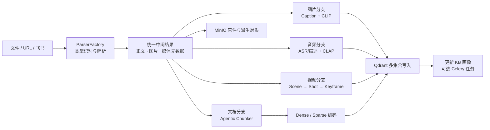
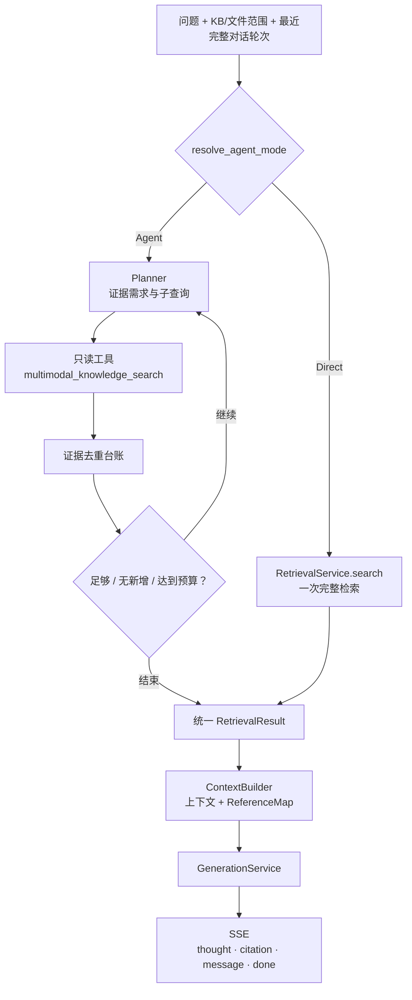

# Tessmora 架构设计

> 同步基线：2026-07-26，覆盖 `c1ea6c0` 及此前实现。本文只描述当前仓库已经存在的能力；规划中的能力统一放在 [mira-plan.md](./mira-plan.md)。

## 1. 阅读约定

Tessmora 是一个面向文档、图片、音频和视频的多模态检索与问答系统。在线问答有两种执行路径：

- **Direct**：一次完整检索后进入生成，适合目标明确的问题。
- **Agent**：先规划子问题，再有界地多轮调用同一个只读检索工具，汇总证据后进入生成。

无论走哪条路径，下游都收到统一的 `RetrievalResult`，因此上下文构建、引用协议和回答生成不会分叉。

本文使用以下约定：

- 后端路径相对于 [`backend/app/`](../backend/app/)。
- 前端路径相对于 [`frontend/src/`](../frontend/src/)。
- 图音视频的解析、向量字段和召回细节以 [多模态技术规范](./MULTIMODAL_IMAGE_AUDIO_VIDEO_TECHNICAL_SPEC.md) 为准。
- 可交互的产品化架构图位于前端 `/architecture` 页面；其文案源在 [`architectureData.ts`](../frontend/src/data/architectureData.ts)。

### 1.1 必须保持的系统不变量

| 不变量 | 当前实现 |
|---|---|
| 意图处理不直接访问向量库 | One-Pass 只生成查询计划；Qdrant 从知识库路由和实际检索阶段开始读取 |
| Agent 不绕过主检索链 | 每个子查询都复用 `RetrievalService`，仍经过意图、路由、混合召回和重排 |
| 自动工具只读 | `AgentToolRegistry` 只允许执行标记为 `read_only` 的工具 |
| 写入与查询分开描述 | MinIO/Qdrant 是数据面；Redis/Celery 是可选任务控制面，不是检索结果来源 |
| 引用与正文分开传输 | SSE 用结构化 `citation` 事件下发引用，用 `message` 事件增量下发正文 |

## 2. 系统全景

总览图中的箭头以数据或控制流方向绘制：Qdrant 向 Retrieval Core 提供向量检索数据，MinIO 向 ContextBuilder 提供原始媒体；Redis/Celery 只向 Ingestion 提供可选任务控制。Direct 与 Agent 在 Retrieval Core 和 ContextBuilder 复用同一套实现。

### 2.1 当前模块边界

| 模块 | 职责 | 主要入口 |
|---|---|---|
| API | 参数校验、会话装配、SSE 协议、公开证据契约 | `api/chat.py`、`api/retrieval.py`、`api/upload.py` |
| Agent | 模式选择、规划、只读工具调用、证据台账与停止条件 | `modules/agent/` |
| Retrieval | One-Pass 意图、知识库路由、五路召回、RRF、Cross-Encoder 精排 | `modules/retrieval/` |
| Generation | 上下文裁剪、引用映射、模型调用和流式事件 | `modules/generation/` |
| Knowledge | 知识库元数据、画像生成、跨库路由和预览 | `modules/knowledge/` |
| Ingestion | 异构来源解析、Agentic Chunker、多模态处理和存储 | `modules/ingestion/` |
| Core | 配置、统一模型管理、日志和本地推理组件 | `core/` |

## 3. 写入路径：从文件到可检索证据

```mermaid
flowchart LR
  Source["文件 / URL / 飞书"] --> Detect["ParserFactory\n类型识别与解析"]
  Detect --> IR["统一中间结果\n正文 · 图片 · 媒体元数据"]
  IR --> Doc["文档分支\nAgentic Chunker"]
  IR --> Image["图片分支\nCaption + CLIP"]
  IR --> Audio["音频分支\nASR/描述 + CLAP"]
  IR --> Video["视频分支\nScene → Shot → Keyframe"]
  Doc --> Embed["Dense / Sparse 编码"]
  Image --> Store
  Audio --> Store
  Video --> Store
  Embed --> Store["Qdrant 多集合写入"]
  IR --> Blob["MinIO 原件与派生对象"]
  Store --> Portrait["更新 KB 画像\n可选 Celery 任务"]
```

### 3.1 文档解析与分块

`ParserFactory` 是解析入口。版式文档采用强解析优先、轻量解析兜底的阶梯：

- PDF：MinerU 云端 → 本地 MinerU → PaddleOCR-VL → PyMuPDF。
- DOCX/PPTX：MinerU；本地链路可经 LibreOffice 转 PDF；失败后回退到轻量库。
- TXT/Markdown：直接读取并保留可用于分块的结构。
- Excel/CSV：使用专用表格策略，不交给通用文档分块器。

生产文档分块器位于 [`splitters/agentic.py`](../backend/app/modules/ingestion/splitters/agentic.py)。它让 LLM 只返回 unit ID 规划，再由服务端从原始单元无损物化内容，从而降低模型改写、遗漏或伪造正文的风险。失败时保留确定性回退路径。

### 3.2 多模态检索单元

| 模态 | 主检索单元 | 主要表示 |
|---|---|---|
| 文档 | 语义 chunk | Dense + Sparse |
| 图片 | 单张图片或文档内嵌图 | `text_vec` + `clip_vec` |
| 音频 | 单个音频对象 | `text_vec` + `clap_vec` + Sparse |
| 视频 | Semantic Shot | caption Dense/Sparse + ASR Dense/Sparse |
| 视频视觉增强 | Shot 下属关键帧 | `frame_vec` + `clip_vec` |

视频 Shot 是主检索单元，关键帧只是从属视觉增强索引，不能把两者描述成两个互相独立的视频语义单元。

### 3.3 存储契约

| 存储 | 集合或对象 | 用途 |
|---|---|---|
| Qdrant | `text_chunks_agentic` | 文档 Dense/Sparse chunk |
| Qdrant | `image_vectors` | 图片文本语义和 CLIP |
| Qdrant | `audio_vectors` | 音频文本、声学与稀疏表示 |
| Qdrant | `video_shot_vectors` | 视频 caption/ASR 四路主召回 |
| Qdrant | `video_keyframe_vectors` | 视频关键帧视觉增强 |
| Qdrant | `kb_portraits` | 知识库主题画像和跨库路由 |
| MinIO | 原文件、解析结果、媒体派生物、知识库元数据 | 对象存储与引用回跳 |
| Redis | Celery broker/result backend（可选） | 异步任务控制，不承载在线检索证据 |

## 4. 读取路径：Direct 与 Agent

```mermaid
flowchart TB
  Request["问题 + KB/文件范围 + 最近完整对话轮次"] --> Mode{"resolve_agent_mode"}
  Mode -->|Direct| Once["RetrievalService.search\n一次完整检索"]
  Mode -->|Agent| Plan["Planner\n证据需求与子查询"]
  Plan --> Tool["只读工具\nmultimodal_knowledge_search"]
  Tool --> Ledger["证据去重台账"]
  Ledger --> Stop{"足够 / 无新增 / 达到预算？"}
  Stop -->|继续| Plan
  Stop -->|结束| Unified["统一 RetrievalResult"]
  Once --> Unified
  Unified --> Context["ContextBuilder\n上下文 + ReferenceMap"]
  Context --> Generate["GenerationService"]
  Generate --> SSE["SSE\nthought · citation · message · done"]
```

### 4.1 请求上下文

Chat API 会把知识库范围、选中文件、附件摘要和最近的**完整对话轮次**装配为检索上下文。默认预算由配置控制：

- 最多 12 条上下文消息；
- 总计最多 6000 字符；
- 单条最多 1600 字符；
- 会话最多在进程内保存 100 条消息。

“完整轮次”意味着不会仅截取一条孤立的 assistant 或 user 消息。当前会话存储仍是 `api/chat.py` 中的进程内字典，重启或多副本运行时不会自动共享。

### 4.2 模式选择

请求支持 `auto`、`direct`、`agent` 三种模式：

- `direct`：显式执行单轮检索。
- `agent`：显式执行有界深研。
- `auto`：用确定性、可解释的复杂度规则判定；对比、多子任务、跨模态、长问题等信号达到阈值时选 Agent，否则选 Direct。

兼容层仍接受旧布尔值，但新调用方应传三态字符串。模式判定代码在 [`mode_router.py`](../backend/app/modules/agent/mode_router.py)。

### 4.3 Direct 路径

Direct 只调用一次 `RetrievalService.search`。这“一次”不是单向量查询，而是一条完整的多阶段检索链：

1. One-Pass 意图生成查询改写、关键词、多视角查询和各模态意图。
2. 若请求没有指定知识库，使用 `kb_portraits` 做跨库路由。
3. 并行执行允许的 Dense、Sparse、Visual、Audio、Video 召回。
4. 用 RRF 在排名域融合不同通道。
5. 对候选执行 Cross-Encoder 精排并返回统一结果。

### 4.4 Agent 路径

Agent Runtime 不替换主检索器，而是在其上增加一个有界循环：

1. Planner 根据原问题、已执行查询和证据摘要选择 `search` 或 `final`。
2. 每轮最多并发执行若干个子查询；每个子查询调用同一个 `RetrievalService`。
3. 结果按稳定标识去重，写入证据台账。
4. 证据足够、没有新证据、规划器回退、工具错误或预算耗尽时停止。
5. 合并后的证据重新包装成标准 `RetrievalResult`，交给公共生成链。

默认安全预算：

| 预算 | 默认值 |
|---|---:|
| 最大轮数 | 3 |
| 每轮最大子查询数 | 3 |
| 总子查询数 | 6 |
| 最终证据数 | 30 |

当前自动工具注册表只有 `multimodal_knowledge_search`，并且是只读工具。尚不存在网页搜索、写入知识库、执行代码或任意 MCP 工具的自动授权。

## 5. 一次检索内部发生什么

### 5.1 One-Pass 查询规划

`IntentProcessor` 用一次结构化 LLM 调用产出：

- `intent_type`
- `refined_query`
- 稀疏关键词
- 多视角查询
- Visual / Audio / Video 三档意图

解析失败时使用保守默认值，避免整个问答链中断。One-Pass 本身不访问 Qdrant。

### 5.2 知识库画像路由

当调用方已经指定 KB 或文件时，检索严格使用该范围；未指定时，`KnowledgeRouter` 查询 `kb_portraits`，根据近邻分数和阈值选择单库、多库或全库回退。

画像来自各知识库内容的聚类和主题摘要，它只解决“去哪些库找”，不替代库内 chunk/媒体检索。

### 5.3 五路召回与融合

`HybridSearchEngine` 根据意图并行执行：

- Dense：文本语义匹配；
- Sparse：关键词和专有名词匹配；
- Visual：图片文本/CLIP，并可使用视频关键帧视觉增强；
- Audio：转写/描述、Sparse 和 CLAP；
- Video：Shot caption/ASR 的四路召回，关键帧作为视觉补充。

不同通道的原始分数不在同一量纲，因此先使用 RRF 按排名融合，再让 Cross-Encoder 对较小候选集做 query-passage 深交互精排。部分权重、路由阈值与模态配额仍在代码中，尚未全部变成 KB 级配置，这是当前明确的技术债。

## 6. 上下文、引用与流式协议

`ContextBuilder` 把精排结果转为两类产物：

- 给生成模型的受预算约束上下文；
- 给客户端的 `ReferenceMap`，包含文件、chunk/page、音视频时间范围等定位信息。

Chat SSE 的主要事件：

| 事件 | 作用 |
|---|---|
| `thought` | 模式选择、意图、路由、检索轮次、生成准备等结构化阶段状态 |
| `citation` | 类型化引用列表，独立于正文发送 |
| `message` | 回答文本增量 |
| `error` | 可展示的失败信息 |
| `done` | 流结束与收尾元数据 |

前端不能从回答正文反解析引用；应始终消费 `citation` 事件。Agent 的轮次、子查询、新增证据量和停止原因通过 thought/debug 元数据暴露，不代表输出模型的私有思维链。

## 7. 对外接口与接入差异

| 接入 | 当前行为 |
|---|---|
| Web Chat | 支持 `auto/direct/agent`、会话上下文、附件与 SSE |
| `POST /api/v1/retrieval/search` | 只检索、不生成；返回稳定的紧凑多模态证据契约 |
| `mma-rag search` | 调用公开检索 API |
| `mma-rag ask` | 调用 Chat API，可选择 Agent 模式 |
| 飞书机器人 | 目前直接调用 `RetrievalService`，尚未接入 Chat 的三态 Agent 路由 |

公开检索响应刻意不暴露 Qdrant 原始 payload 或内部 dataclass，外部 Agent 应依赖 `query/refined_query/intent_type/target_knowledge_bases/results` 契约。CLI 细节见 [CLI reference](../skills/mma-rag/references/cli-reference.md)。

## 8. 运行与部署

### 8.1 本地开发拓扑

`./start-dev.sh` 的默认行为：

1. 用 Docker Compose 启动 MinIO、Qdrant、Redis；
2. 在本机启动 FastAPI；
3. 在本机启动 Vite 前端。

Celery worker 和 Flower 在 Compose 中有定义，但不会由该脚本默认启动。它们是可选的异步任务设施，不是 Direct/Agent 在线检索的前置条件。

### 8.2 当前生产边界

仓库默认配置适合本地或可信内网，不应未经加固直接暴露到公网：

- 应用层目前没有内建用户认证或租户授权；
- CORS 当前允许所有来源；
- Chat 会话和部分统计存于单进程内存；
- Qdrant、MinIO、Redis 需要由网络层隔离并配置正式凭证；
- 视频解析仍较依赖特定供应商链路；
- 公开检索 API 是只读语义接口，但当前没有内建鉴权与限流。

部署前的具体检查项见 [SECURITY.md](../SECURITY.md)。

## 9. 前端架构映射

前端 `/architecture` 页面只保留六个读图入口，避免把同一条链路在“创新点”“性能”“集成”等卡片中重复表达：

1. 系统概览：系统契约与 Direct/Agent 差异；
2. 整体架构：接入、API/领域、数据、模型四层；
3. 请求链路：Direct 与 Agent 分叉、统一结果汇合；
4. 核心模块：六个当前领域模块；
5. 数据流：写入路径与读取路径分开；
6. 技术栈：已使用组件和已知部署边界。

这套页面是架构导航，不是协议规范；集合字段、SSE 事件和配置默认值仍以代码及本文为准。

## 10. 代码与文档索引

| 主题 | 入口 |
|---|---|
| Agent 模式与循环 | [`backend/app/modules/agent/`](../backend/app/modules/agent/) |
| 检索编排 | [`backend/app/modules/retrieval/service.py`](../backend/app/modules/retrieval/service.py) |
| 五路召回 | [`backend/app/modules/retrieval/search_engine.py`](../backend/app/modules/retrieval/search_engine.py) |
| 向量集合契约 | [`backend/app/modules/ingestion/storage/vector_store.py`](../backend/app/modules/ingestion/storage/vector_store.py) |
| 生成上下文 | [`backend/app/modules/generation/context_builder.py`](../backend/app/modules/generation/context_builder.py) |
| SSE 事件 | [`backend/app/api/chat.py`](../backend/app/api/chat.py)、[`stream_manager.py`](../backend/app/modules/generation/stream_manager.py) |
| 公开检索 API | [`backend/app/api/retrieval.py`](../backend/app/api/retrieval.py) |
| 多模态技术细节 | [MULTIMODAL_IMAGE_AUDIO_VIDEO_TECHNICAL_SPEC.md](./MULTIMODAL_IMAGE_AUDIO_VIDEO_TECHNICAL_SPEC.md) |
| Agentic 升级研究 | [AGENTIC_UPGRADE_WEKNORA_RESEARCH.md](./AGENTIC_UPGRADE_WEKNORA_RESEARCH.md) |
| 演进路线图 | [mira-plan.md](./mira-plan.md) |
| 飞书接入 | [FEISHU_BOT_SETUP.md](./FEISHU_BOT_SETUP.md) |
