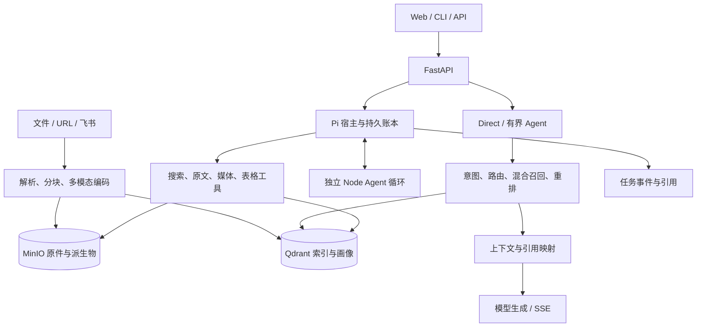

# Tessmora 系统架构

Tessmora 由 React 前端、FastAPI 后端、Pi Node 运行时和本地存储服务组成。文档描述当前代码中的模块和数据契约；模型默认值以 `backend/app/core/llm/` 和 `backend/.env.example` 为准。

## 系统与执行路径

```mermaid
flowchart TB
  Sources[文件 / URL / 飞书] --> Ingestion[解析、分块、多模态编码]
  Ingestion --> MinIO[(MinIO 原件与派生物)]
  Ingestion --> Qdrant[(Qdrant 索引与画像)]
  Web[Web / CLI / API] --> API[FastAPI]
  API --> Standard[Direct / 有界 Agent]
  Standard --> Retrieval[意图、路由、混合召回、重排]
  Retrieval --> Qdrant
  Retrieval --> Context[上下文与引用映射]
  Context --> Generation[模型生成 / SSE]
  API --> Host[Pi 宿主与持久账本]
  Host <--> Pi[独立 Node Agent 循环]
  Host --> Tools[搜索、原文、媒体、表格工具]
  Tools --> Qdrant
  Tools --> MinIO
  Host --> Events[任务事件与引用]
```

| 路径 | 入口 | 控制与生成 |
| --- | --- | --- |
| Direct | `/api/chat/*`、CLI、飞书 | 单次完整检索，公共生成链 |
| 常规 Agent | Chat 的 `agent`；`auto` 按复杂度选择 | 在轮数、查询数和证据预算内复用 `RetrievalService`，最后汇合到公共生成链 |
| Pi | `/api/pi/*`、Web 的 `π` 开关 | Pi SDK 自主选择工具并生成，Python 宿主校验来源与交付，独立于常规编排 |
| 只检索 | `POST /api/v1/retrieval/search` | 返回结构化证据，不生成回答 |

Decision 是常规链路的可选核验组件，不是第四种 Agent。默认关闭，启用后可核对来源需求或诊断回答引用；失败、跳过和未覆盖项有独立记录。详见 [Decision](DECISION_MODELS.md)。

## 模块边界

以下后端路径相对于 [`backend/app/`](../backend/app/)。

| 模块 | 职责 |
| --- | --- |
| `api/` | 请求校验、HTTP/SSE、会话上下文和公开证据契约 |
| `modules/ingestion/` | 来源导入、解析、保留原文的 Agentic Chunking、媒体派生物和索引写入 |
| `modules/knowledge/` | 文件元数据、知识库画像、推荐问题和跨库路由 |
| `modules/retrieval/` | 意图处理、多通道检索、融合、重排、范围和覆盖记录 |
| `modules/agent/` | 常规 Agent 的模式选择、规划、只读工具与有界循环 |
| `modules/generation/` | 上下文、引用选择、回答生成和流式收尾 |
| `modules/pi_agent/` | 来源目录、工具执行、任务账本、并发准入和 Node 进程监督 |
| `core/` | 配置、模型目录、连接探测、调用健康状态、本地模型共享加载 |
| `integrations/` | 飞书事件、卡片、文档和媒体适配 |

[`agent-runtime/src/`](../agent-runtime/src/) 承载 Pi SDK 循环；[`frontend/src/`](../frontend/src/) 分别处理常规 SSE 与 Pi 持久事件。评测代码在 `backend/evaluation/`，不由在线服务加载。

## 入库与存储

ParserFactory 根据文件格式选择解析器。TXT/Markdown 直接读取；版式文档按配置使用 MinerU、PaddleOCR 或本地解析，Office 预览依赖 LibreOffice。文档分块由模型规划原始单元 ID，再由服务端无损物化正文；表格使用表头和行块策略。图片、音频、视频建立文本语义与专用表示。

| 存储对象 | 内容 |
| --- | --- |
| MinIO 每知识库 bucket | 原文件、解析文本、抽取图片、关键帧、知识库与文件元数据 |
| `text_chunks_agentic` | 文档正文、Dense/Sparse 与来源定位 |
| `image_vectors` | 图片描述与 CLIP |
| `audio_vectors` | 转写/描述、Sparse 与 CLAP |
| `video_shot_vectors` | Shot caption/ASR 的 Dense/Sparse |
| `video_keyframe_vectors` | Shot 下属关键帧的文本/CLIP 视觉增强 |
| `kb_portraits` | 知识库主题画像与路由 |
| Pi `data/pi-agent/` | SQLite 任务账本、证据产物、附件和预览 |
| Redis / Celery | 可选任务控制，不作为在线证据来源 |

视频以 Shot 为主要语义检索单元，关键帧不能算作独立的完整视频理解。更详细的字段与处理入口见 [多模态技术说明](MULTIMODAL_IMAGE_AUDIO_VIDEO_TECHNICAL_SPEC.md)。更换 embedding 模型必须处理向量空间兼容性，不能直接复用不兼容的索引。

## 常规问答

1. Chat 校验消息、附件、行内引用与明确选择的知识库/文件范围。
2. 意图模型生成改写、关键词、多视角查询和模态需求；Decision 开启时按用途准入核验提案。
3. 显式范围严格生效；未指定时通过知识库画像路由，可为明确模态需求补充范围内的来源。
4. Dense、BGE-M3 Sparse、图片 CLIP、音频 CLAP 与视频路径按意图和排除约束执行，RRF 融合并进行 Cross-Encoder 重排。
5. 常规 Agent 可重复调用同一检索服务，去重后交给公共上下文构建器。具体轮数与预算见 `modules/agent/models.py` 和配置。
6. 生成器收到上下文与稳定引用编号；只向最终回答保留实际采用的引用。无依据回答不能附带候选引用。

`@` 材料与检索范围分开：材料可供阅读、比较，不自动成为搜索过滤条件，也不自动授权搜索更多来源。附件字段及 UTF-16 偏移契约见 [引用与附件](chat-inline-references.md)。

常规 SSE 使用 `thought` 表示结构化阶段、`citation` 传引用、`message` 传正文，并由 `error` / `done` 结束。阶段记录不是模型私有思维链。前端使用独立解析与文本缓冲处理分包和流式收尾。

## Pi 任务生命周期

宿主先保存排队任务，再准备可读来源目录并启动独立 Node 进程。工具只可访问宿主确定的知识库、文件和附件。Pi 选择搜索、深读、查看原始媒体、表格计算等工具；普通文件访问不暴露任意 Shell 或代码执行。

事件和工具产物持续写入账本。浏览器断线不取消任务，可按事件序号续接；用户停止会取消任务与工作进程；服务重启把未完成任务标为中断，不重放付费请求。证据编号、版本、位置和访问范围由宿主校验，但编号正确不等于语义蕴含。

Pi 默认没有应用层累计 Token、时长或工具次数上限。并发槽位与常规对话优先级仍生效；上下文窗口满时归档旧工具内容，保留复读定位。详见 [Pi 协议与配置](PI_AGENT_MODE.md)。

## 会话与配置持久化

- 常规 Chat 服务端会话主要在进程内，浏览器保存对话快照。显式恢复机制可恢复本地会话，不能把它当成共享数据库或多副本同步。
- Pi 任务、事件和附件独立持久化，一个数据目录只允许一个宿主持锁。
- `backend/data/llm_task_overrides.json` 与 `jev_settings.json` 是用户保存的本地配置，不提交 Git；缺失时使用代码与环境默认值。
- 本地模型共享加载，查询向量缓存按模型/输入区分；更换配置不应误用其他模型的向量。模型健康冷却在进程内维护。

## 运行边界

推荐拓扑为本机 Python/Node + Docker MinIO/Qdrant/Redis。`start-dev.sh` 验证 API 和前端代理就绪，默认不启动 Celery；根 Compose 不包含完整前端及 Pi Node 环境。前端生产产物由 `npm --prefix frontend run build` 生成到 `frontend/dist/`，应由静态服务器部署并代理 `/api`。

默认面向本机单用户或可信内网。应用尚无完整认证、租户隔离和知识库 ACL，CORS 默认开放；对外部署需要独立加固。存储健康、模型连通、实际问答与引用正确性是不同的检查层级，参见 [安全说明](../SECURITY.md) 与 [贡献指南](../CONTRIBUTING.md)。
