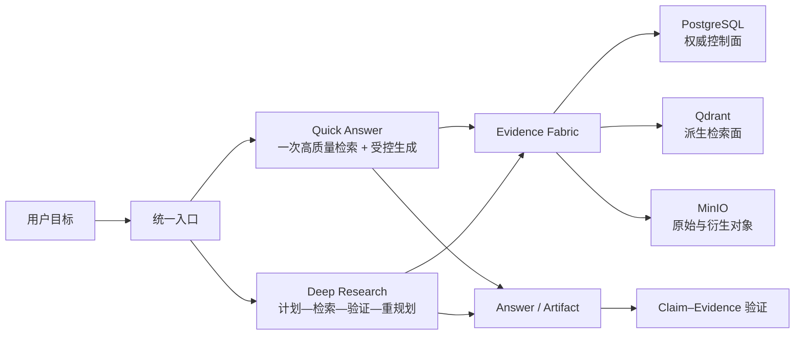
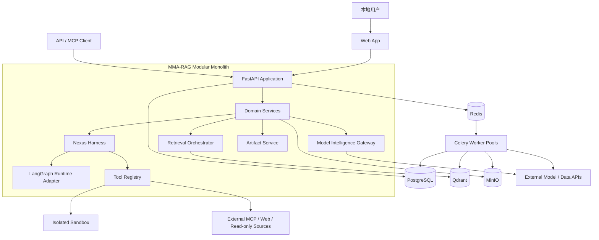
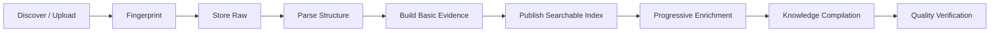
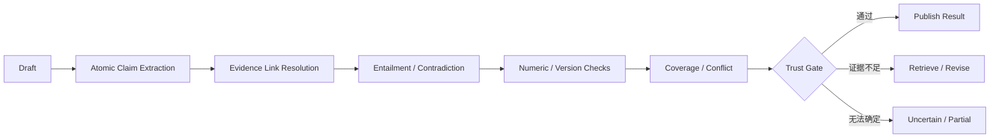
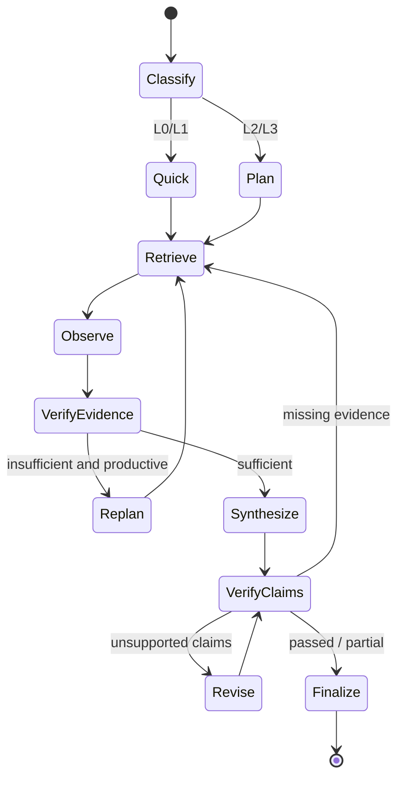
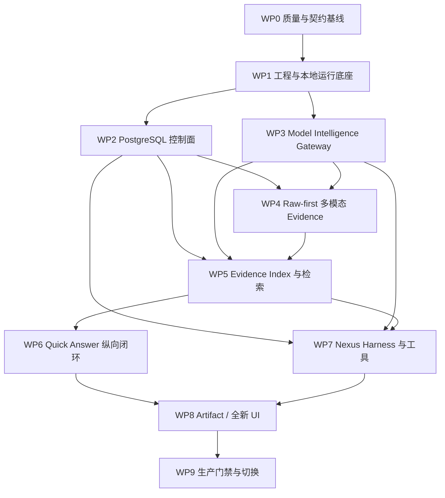

# MMA-RAG Multi-Modal Agentic Knowledge Base 全面架构升级实施方案

> 文档性质：目标架构、关键契约、重构边界与实施门禁<br>
> 文档状态：已决策，可进入分阶段实现<br>
> 适用部署：单用户、单租户、个人本地电脑，面向生产可靠性<br>
> 实施方式：允许整体重写，不承担旧数据迁移和旧接口兼容成本<br>
> 上位产品蓝图：[MULTIMODAL_AGENTIC_KNOWLEDGE_BASE_UPGRADE_BLUEPRINT.md](./MULTIMODAL_AGENTIC_KNOWLEDGE_BASE_UPGRADE_BLUEPRINT.md)

---

## 0. 执行摘要

本次升级不是在原有 Workflow RAG 外面包一层 Agent，也不是把所有请求都改成 ReAct。目标是重建一套以 **Space、Source、Evidence、Claim、Run、Artifact** 为核心对象的本地多模态知识操作系统：

- 保住并可验证地超过当前文档、图片、音频、视频混合检索质量；
- 简单问题仍走低延迟 Quick Answer，复杂问题进入可规划、可恢复、可验证的 Deep Research；
- 原始媒体、解析结果、检索索引、生成结论各自有明确身份与可信边界；
- PostgreSQL 保存权威业务事实，Qdrant 专注可重建的高质量向量检索，MinIO 保存原始与衍生文件，Redis 只承担瞬时协调；
- Agent 的计划、证据、工具调用、审批、检查点和最终产物全部可追踪、可暂停、可恢复；
- LLM/VLM/Embedding/Reranker 等 API 模型通过独立的 Model Intelligence Gateway 统一发现、验证、路由和降级；
- 第一版就具备可评测、可观测、可备份恢复、可从中断继续的本地生产能力。

最终系统不是一条更长的流水线，而是两条共享同一知识底座的执行路径：



### 0.1 最终架构结论

| 议题 | 最终选择 | 明确不做 |
|---|---|---|
| 应用形态 | Python/FastAPI 模块化单体 + 独立重任务 Worker | 初期微服务拆分 |
| Agent 运行时 | 自有 `Nexus Harness` 领域契约 + LangGraph 适配器 | 业务模型直接依赖 LangGraph 类型 |
| 任务执行 | Quick RAG 与 Agentic Research 双路径 | 所有请求一律 Agent 化 |
| 元数据权威 | PostgreSQL | 用 Qdrant Payload 或 MinIO Tag 充当数据库 |
| 检索 | Qdrant Dense/Sparse/多模态 + PostgreSQL 精确检索 | Elasticsearch/OpenSearch |
| 原始文件 | MinIO | 将大文件塞入 PostgreSQL |
| 瞬时协调 | Redis | 把 Redis/Celery Result 当作任务真相 |
| 长任务 | Celery 负责摄取、解析、向量化、知识编译 | 用 Agent Runtime 执行批处理 DAG |
| 模型 | 大模型能力主要调用 API；本地仅轻量特征模型 | Ollama/vLLM 等本地 LLM 生命周期平台 |
| 文档解析 | PDF/Word/PPT/扫描文档统一 MinerU，失败即显式失败 | 静默降级到低质量解析器 |
| 部署 | Docker Compose 一键启动，lite/standard/full Profiles | Kubernetes、多机分片 |
| 用户模型 | 单用户、单租户、Space 仅用于知识组织 | 多租户、企业 RBAC |
| 搜索范围 | 当前 Space 默认，显式 Global 与 `@Scope` | Agent 自行扩大用户给定范围 |
| 知识写回 | 候选—验证—用户接受—发布生命周期 | 任务输出自动成为正式知识 |
| 首版扩展 | 稳定接口 + 内置插件 | 任意第三方插件在线安装执行 |

### 0.2 第一版必须交付的完整闭环

第一版不是 Demo，必须同时完成以下闭环后才能替换旧系统：

1. 全模态摄取与渐进式可搜索；
2. Space/Source/Source Version/Evidence Revision 权威模型；
3. 不低于旧系统的高质量混合检索；
4. Quick Answer 与可恢复的 Deep Research；
5. Evidence、Claim、引用与分层验证；
6. Model Intelligence Gateway；
7. 只读知识、Web、MCP、SQL/计算类工具与隔离沙箱；
8. Canonical Artifact 与常用导出；
9. 全新前端信息架构和可恢复 SSE；
10. 评测、可观测性、备份与恢复演练。

Auto Wiki、完整 GraphRAG、外部写动作、第三方插件安装、页面视觉 MultiVector 属于目标架构的一部分，但不是首版上线门槛；它们必须预留稳定接口，不能反过来拖慢核心闭环。

---

## 1. 范围、目标与非目标

### 1.1 核心目标

#### G1：检索质量不回退

旧实现中的 Dense、BGE-M3 Sparse、CLIP、CLAP、视频场景/关键帧、RRF、Cross-Encoder、知识库画像路由等能力，不要求复用旧代码，但必须转化为评测基线。新架构只有在各模态和综合任务上达到“无显著回退，并在定位、去重、跨模态或多跳任务上有净增益”后，才允许切换默认流量。

#### G2：从一次回答升级为可靠任务

复杂任务要具备目标约束、步骤计划、证据账本、工具观察、充分性判断、重规划、暂停恢复、部分交付与明确停止原因。Agentic 的价值以任务完成质量衡量，不以工具调用次数衡量。

#### G3：建立可验证的知识对象

回答中的重要主张必须能回到不可变 Evidence Revision，并定位到页、区域、时间段、表格单元格或代码位置。生成总结与正式知识必须区分，过期和冲突必须可表达。

#### G4：让模型可替换、可感知、可治理

模型接入不再散落在业务模块。系统应自动感知 Provider 当前可用模型及其能力，通过最小探测验证协议兼容性，但任何“启用新模型或改变活动路由”的动作都需要用户确认。

#### G5：在个人本地环境达到生产可靠性

不建设企业级租户和权限体系，但要具备幂等、恢复、审计、健康检查、资源调度、密钥保护、隔离执行、备份恢复和故障可解释能力。

### 1.2 明确非目标

- 不兼容旧知识库 ID、旧 Qdrant Collection、旧 MinIO 标签或旧会话结构；
- 不迁移当前测试数据，切换时直接重新导入；
- 不为 Kubernetes、多区域、多节点一致性和水平分片做首版实现；
- 不引入 Elasticsearch/OpenSearch；
- 不建设多租户、组织、成员、RBAC/ABAC；
- 不部署本地通用 LLM/VLM；
- 不允许 Agent 直接在宿主机或 API 进程内执行任意代码；
- 不以完整 Auto Wiki、完整知识图谱或外部写操作作为第一版阻塞项；
- 不按日历或虚构团队规模排期，所有实施顺序按依赖关系和质量门禁推进。

### 1.3 成功标准

升级是否成功由四类结果共同决定：

| 结果面 | 成功表现 |
|---|---|
| 用户价值 | 简单问题更稳，复杂任务能自主研究并交付可复用成果 |
| 知识可信 | 重要结论有证据，冲突和不足被明确展示，生成内容不冒充事实 |
| 工程可靠 | 重启、限流、Provider 失败、Worker 崩溃后能恢复或给出明确部分结果 |
| 可演进性 | 模型、解析器、检索器、工具、Renderer 和 Runtime 可替换而不改领域模型 |

---

## 2. 当前系统判断与重写依据

### 2.1 应保留的能力资产

当前 MMA-RAG 已经证明了以下方向有效：

- 文档、图片、音频、视频分别经过专用处理链路，而不是只有文本 Chunk；
- 文本 Dense + Sparse、图片 CLIP + Caption、音频 CLAP + Transcript、视频场景 + 帧等多通道召回；
- RRF 融合、Cross-Encoder 精排、图片保护和选定文件增强；
- 多知识库画像路由；
- 文档解析出的图片继续进入图片理解链路，并将语义锚回原文；
- 结果包含来源、页面或时间等初步引用信息。

这些是新系统必须守住的“产品能力资产”。它们会被整理成离线评测集、检索策略和领域接口，而不是整体搬运现有类和全局单例。

### 2.2 不能继续扩建的结构性问题

代码审阅显示，旧架构的上限来自结构而不是模型：

1. **权威状态缺失**：知识库元数据分散在 MinIO 标签、隐藏 JSON、Qdrant Payload 和内存字典中，出现 ID 推断与兼容扫描；
2. **任务不可恢复**：会话、流事件和部分处理状态保存在进程内，重启或多进程后丢失；
3. **固定执行链**：在线路径基本是意图识别—路由—检索—重排—一次生成，无法根据证据继续研究；
4. **多模态证据扁平化**：图片多为整图，音频接近整文件，视频以帧/场景点为主，最终重排和生成仍过度依赖文字代理；
5. **引用仅做编号合法性检查**：尚未验证“某条证据是否真的支持某个主张”；
6. **Provider 层耦合**：模型目录、路由、任务模型和 Provider 参数硬编码，缺少持久化能力画像、探测和运行快照；
7. **大模块与全局状态**：摄取、向量存储、知识服务、聊天和前端核心组件体积过大，边界不清；
8. **运维闭环不足**：当前 Compose 缺少 PostgreSQL、备份恢复、完整健康门禁和本地可观测性；
9. **测试无法承担重构保护**：现有测试集中于少量解析/连接器场景，缺少多模态检索、引用、Agent 与恢复评测。

### 2.3 为什么选择重写而不是渐进打补丁

旧系统的主键、状态、存储权威和调用边界都需要改变。若继续兼容旧 MinIO/Qdrant 元数据，会让每一层长期承担双模型复杂度，且无法可靠解决删除、版本、重建、恢复和引用稳定性问题。

因此采用以下策略：

> **能力基线保留，代码结构重写；用评测保证不退化，用新权威模型切断旧兼容负担。**

旧系统只在重写期间充当：

- 评测结果对照组；
- 现有多模态算法和 Prompt 的参考实现；
- 构建新测试样本的行为样本库。

新路径达到切换门禁后，旧 API、旧 Collection、旧内存会话和旧元数据逻辑一次性移除，不建设长期双写。

---

## 3. 架构原则与不可破坏的约束

### 3.1 权威与派生分离

每一种状态只能有一个权威来源：

- PostgreSQL 记录业务事实、版本、状态、引用关系和运行轨迹；
- MinIO 保存字节级原始内容与衍生资产；
- Qdrant 只保存可从 PostgreSQL + MinIO 重建的检索投影；
- Redis 只保存缓存、消息、租约和短期事件分发。

任何代码都不得通过“扫描 Qdrant/MinIO 猜业务状态”恢复权威信息。

### 3.2 原始证据不可被生成内容替代

Caption、OCR、Transcript、摘要、实体、Claim 和 Wiki 页面都是派生对象。它们可以辅助检索与理解，但不能覆盖原始页、图片、音频或视频。最终引用必须同时持有 Evidence Revision 和原始定位。

### 3.3 领域契约不绑定框架

Space、Evidence、Claim、Run、Tool、Artifact 和 Model Route 使用项目自有 Schema。LangGraph、Celery、Qdrant、MinIO 等只能出现在适配层。这样可以替换运行时和存储，而不重写业务语义。

### 3.4 质量模式必须显式

系统提供 Fast、Quality、Deep 三种检索/研究深度。任何因资源不足或 Provider 失败造成的质量下降都必须显示并记录，不能静默把 Deep 降成 Fast。

### 3.5 后台工作幂等、可恢复、可重建

所有长任务均以稳定 Job Key 和阶段性 Checkpoint 执行。Celery 官方文档强调启用 late acknowledgement 时任务可能重复执行，因此任务必须幂等；本系统把“至少一次投递 + 幂等副作用”作为默认语义，而不假设 exactly-once。[Celery Tasks](https://docs.celeryq.dev/en/stable/userguide/tasks.html)

### 3.6 Agent 自主性由外部保障约束

停止条件、允许工具、搜索范围、审批、资源保护、证据充分性与最终验收由 Harness 强制执行，不能只写在 Prompt 中。

### 3.7 单用户不等于无安全边界

本地知识无需数据不出域，用户明确允许发送给已配置 API Provider；但密钥、宿主机命令、外部写操作、恶意网页/文档和资源耗尽仍是安全问题，必须分别治理。

### 3.8 任何新能力先证明净收益

GraphRAG、Auto Wiki、MultiVector、Query Expansion、长期记忆和多 Agent 都通过场景评测、资源成本与用户价值门禁后再默认开启。目标架构预留位置，不代表首版全量运行。

---

## 4. 总体目标架构

### 4.1 系统上下文



### 4.2 运行单元

| 运行单元 | 责任 | 不承担 |
|---|---|---|
| `web` | React 单页应用、任务/证据/模型/系统界面 | 权威状态、业务规则 |
| `api` | REST/SSE/MCP、领域用例、事务边界、命令接收 | 重型媒体处理、宿主机任意执行 |
| `agent-worker` | 恢复或推进 LangGraph Run、模型/工具调用 | 摄取批处理、模型特征常驻复用以外的大型队列 |
| `ingest-worker` | Source 同步、MinerU 解析、结构分段 | Agent 推理 |
| `media-worker` | 图片/音频/视频分析与轻量本地模型 | 业务状态权威 |
| `index-worker` | Embedding、Qdrant 投影、别名切换、重建 | 修改 Source 原始事实 |
| `compile-worker` | Claim 候选、实体关系、摘要/Wiki 候选 | 自动发布正式知识 |
| `scheduler` | 增量同步、清理、备份、健康探测、资源编排 | 保存调度结果真相 |
| `sandbox-runner` | 隔离代码/SQL/文档渲染任务 | 访问宿主机隐私目录或默认联网 |
| `postgres` | 权威控制面与运行状态 | 大媒体对象、向量近邻检索 |
| `qdrant` | Dense/Sparse/多模态检索投影 | 业务关系、事务、唯一真相 |
| `minio` | 原始 Source 与衍生媒体/Artifact 二进制 | 任务状态与可查询元数据 |
| `redis` | Broker、Cache、Lease、限流、事件扇出 | 持久任务与业务状态权威 |

这些运行单元可以来自同一代码库和同一镜像，通过命令与队列区分责任；“独立 Worker”不等于首版拆成多个网络微服务。

### 4.3 模块化单体边界

API 与核心领域采用模块化单体，原因是本地单用户部署下，网络拆分不会带来扩展收益，却会增加事务、调试和启动成本。模块之间只通过公开 Application Service、领域事件与端口接口调用，禁止跨模块直接访问 Repository 表。

推荐领域模块：

1. `spaces`：Space、Collection/View、Search Scope；
2. `sources`：Connector、Source、Source Version、同步与删除；
3. `ingestion`：Job、Stage、Parser Profile、衍生资产；
4. `evidence`：Content Unit、Evidence Revision、Locator、血缘；
5. `retrieval`：Query Plan、Channel、Fusion、Rerank、Context Pack；
6. `claims`：Claim、Support、Conflict、Trust Level、验证；
7. `runs`：Conversation、Task、Run、Step、Checkpoint、Event；
8. `agents`：Harness、Plan、Policy、Tool Execution、Approval；
9. `models`：Provider、Catalog、Capability Probe、Route Policy、Invocation；
10. `artifacts`：结构化成果、版本、导出与刷新；
11. `connectors`：内置数据源与增量游标；
12. `operations`：备份、恢复、健康、资源调度与诊断。

依赖方向固定为：

```text
API / Worker Entrypoints
        ↓
Application Use Cases
        ↓
Domain Models + Domain Policies
        ↓
Ports (Repository / Search / Runtime / Model / Tool / Blob)
        ↓
Adapters (PostgreSQL / Qdrant / LangGraph / Celery / MinIO / Provider)
```

Domain 层不得 import FastAPI、SQLAlchemy ORM、Qdrant Client、Celery Task 或 LangGraph State。

### 4.4 部署 Profiles

| Profile | 默认进程 | 适用场景 | 行为 |
|---|---|---|---|
| `lite` | Web、API、PostgreSQL、Qdrant、MinIO、Redis、合并 Worker | 资源有限、少量资料 | 并发最低，后台富化按需 |
| `standard` | 分离 Agent/Ingest/Media/Index Worker | 默认推荐 | 前台 Quality 优先，后台渐进富化 |
| `full` | 更细 Worker 池、OTel Collector、完整本地观测 UI、定时备份 | 大知识库与长期运行 | 更强诊断、队列隔离和并行度 |

Apple Silicon/CUDA 环境可选启动 Host Feature Worker，让 CLIP、CLAP、BGE-M3 Sparse 等轻量模型使用宿主机 Metal/CUDA；它仍通过受控任务协议工作，不让 API 进程直接耦合设备。

### 4.5 本地网络边界

- 默认所有用户入口只监听 `127.0.0.1`；
- 本地模式不显示登录页、不建立用户/租户表，所有请求使用单一 Local Principal；
- Docker 内部数据库、MinIO、Redis、Qdrant 不映射到所有网卡；
- 可选 LAN 模式需显式开启，并使用固定本地 API Token；
- 不宣称这是公网部署方案，不提供直接公网暴露选项；
- Provider 出站请求记录目标 Provider、模型、用途、耗时和失败，但常规日志不写 Prompt 原文和密钥。

---

## 5. 数据权威、领域对象与一致性

### 5.1 为什么 PostgreSQL 不能被 Qdrant 取代

Qdrant 是本方案不可缺少的检索引擎，但不是控制面数据库。两者解决的问题不同：

| 能力 | PostgreSQL | Qdrant |
|---|---|---|
| Source/版本/任务状态权威 | 适合，事务与约束明确 | 不应承担 |
| 多对象关系与唯一性 | 外键、唯一约束、事务 | Payload 只能辅助过滤 |
| Run/Step/Approval 并发更新 | 行锁、乐观锁、事务 | 不是运行状态数据库 |
| Claim–Evidence 多对多关系 | 原生适合 | 查询与维护成本高 |
| 精确 ID、数字、短语、元数据查询 | B-tree/GIN/FTS/`pg_trgm` | Sparse 更适合召回而非权威精确查询 |
| Dense/Sparse/MultiVector 近邻 | 不作为主方案 | 核心优势 |
| 索引模型切换和候选召回 | 辅助 | 核心优势 |
| 从头重建 | 保存重建输入与状态 | 接受被删除后重建 |

PostgreSQL 自带 `tsvector/tsquery` 全文检索，并可通过 `pg_trgm` 支持相似字符串和 `LIKE/ILIKE` 索引，因此足够承担标识符、专名、数字、短语和元数据的精确补充检索，无需再引入 Elasticsearch/OpenSearch。[PostgreSQL Full Text Search](https://www.postgresql.org/docs/current/textsearch.html) · [`pg_trgm`](https://www.postgresql.org/docs/current/pgtrgm.html)

核心判断是：

> PostgreSQL 决定“对象是什么、当前哪个版本有效、谁引用了它、任务走到哪里”；Qdrant 决定“对这个查询而言哪些证据可能相关”。

### 5.2 存储权威矩阵

| 信息 | 权威存储 | 派生/缓存 |
|---|---|---|
| Space、Collection/View、Scope | PostgreSQL | Redis 查询缓存 |
| Source、Version、Fingerprint、状态 | PostgreSQL | Qdrant Filter Payload |
| 原始文件和网页快照 | MinIO，PostgreSQL 记录对象清单与 Hash | 本地下载缓存 |
| Evidence Revision 文本/定位/血缘 | PostgreSQL | Qdrant Payload/向量 |
| 页图、Crop、音频片段、关键帧 | MinIO | CDN/浏览器缓存（未来） |
| Embedding/Sparse/CLIP/CLAP/MultiVector | Qdrant | 可重建 |
| Claim、Support、Conflict、有效期 | PostgreSQL | 图投影（未来） |
| Run、Step、Plan、Approval、Checkpoint 索引 | PostgreSQL | Redis 唤醒/软租约加速/Event Fan-out |
| LangGraph Checkpoint 内容 | PostgreSQL Checkpointer | 无 |
| Artifact 结构和版本 | PostgreSQL | MinIO 导出文件 |
| Provider/Model/Capability/Route | PostgreSQL | Redis 健康与短 TTL Catalog 缓存 |
| Job、Stage、重试、错误 | PostgreSQL | Celery Broker/Result |
| 审计与持久事件 | PostgreSQL | SSE 在线订阅 |

### 5.3 核心标识体系

所有 ID 使用稳定、无语义、可排序的全局 ID（例如 UUIDv7），禁止从 Bucket 名、文件名、Qdrant Point ID 或路径推导业务 ID。

Source 是全局知识对象，Space 和 Run 通过 Link 组织它，不复制 Evidence：

```text
source_id                              # 逻辑来源，例如一个文件或 URL
  └─ source_version_id                 # 不可变内容版本
       └─ content_unit_id              # 结构单元身份：页、段、图、场景……
            └─ evidence_revision_id    # 某解析/语义内容版本下的不可变证据
                 └─ projection_id      # 可重建的特定索引投影

space_id ── source_space_link ── source_id
run_id   ── run_source_link   ── source_id  # 临时附件，带 TTL/保留策略
```

辅助对象：

- `connector_id`：一个持续同步配置；
- `job_id` / `stage_run_id`：一次后台处理与阶段尝试；
- `claim_id` / `claim_revision_id`：语义主张与不可变表达版本；
- `run_id` / `step_id` / `tool_execution_id`：任务执行轨迹；
- `artifact_id` / `artifact_revision_id`：成果身份与版本；
- `model_snapshot_id` / `config_snapshot_id`：运行时不可变配置快照。

Qdrant Point ID 由 `projection_id` 映射，Payload 必须携带 `evidence_revision_id`、`source_version_id`、`source_id`、派生的 `space_ids`、`visible_from_sequence/visible_until_sequence`、模态、状态、Locator 摘要和索引版本，但 Payload 不反向成为 Space 归属或业务事实来源。Link 改变由投影事件更新 `space_ids`，最终结果仍批量回 PostgreSQL 校验 Scope。

### 5.4 核心对象定义

#### Space

用户面向的最高知识组织单位，替代旧 `KnowledgeBase`。Space 不代表权限租户，也不拥有 Source 字节；它通过 `source_space_link` 组织 Source，并承载：

- 目标和描述；
- Source 集合；
- 默认检索画像与质量档位；
- 可选固定模型/Agent/工具策略；
- Collection/View 与推荐查询；
- 编译能力开关和当前就绪度。

#### Source 与 Source Version

`Source` 表示全局逻辑来源；`Source Version` 是一次不可变快照。文件内容 Hash、连接器外部版本、抓取时间、MIME、字节数和原始对象 Key 均绑定版本。相同 Source 可链接到多个 Space，Link 可以拥有该 Space 下的别名、标签、纳入时间和富化/可见性策略；相同内容 Hash 的不同 Source Version 还可共享内容寻址 Raw Object，但 Provenance 仍分别保留。Space/Link 选择的是面向能力的 `Knowledge Profile`；Encoder、预处理和 Index Generation 则由系统 `Index Profile` 管理，不能由每个 Link 任意改变。

临时附件创建正常的 Source Version，但只通过 `run_source_link` 进入当前 Task/Run Scope；默认随 Run 保留策略到期，用户可显式延长或 Promote/Link 到 Space。清理只移除 Run Link，Blob 仍遵循全局可达性 Mark-and-Sweep。

#### Content Unit

Content Unit 表示跨重新解析仍尽量稳定的结构身份，例如一张图、一个说话人 Turn 或一个视频 Scene。稳定性不能只依赖“第 12 页/Scene 8”等易漂移序号，而由 Source-native Anchor、规范化内容 Fingerprint、结构邻域共同匹配。拆分/合并通过 `split_from/merge_of/supersedes` Lineage 表达；匹配不确定时创建新 Unit，宁可保留显式关系，也不误复用身份。

#### Evidence Revision

Evidence Revision 是可引用的最小证据版本，包含：

- 模态和结构类型；
- 原文/Transcript/OCR/Caption 等可检索代理；
- 原始 Locator；
- 前后/父子/时间关系；
- 解析器、模型、Prompt、策略版本；
- 内容 Hash 和产生时间；
- 当前状态、质量标记、替代关系。

以下变化创建新 Evidence Revision：Parser/分段改变结构，OCR/ASR/Caption/VLM 改变可引用语义内容，或 Locator 改变。Embedding、Sparse、CLIP/CLAP 编码、量化、距离函数只改变检索表示时，创建新的 Projection/Index Generation，不改 Evidence Revision；Reranker、融合和阈值变化只创建 Retrieval Config Revision。

#### Claim

Claim 是可验证的原子主张。它与 Evidence Revision 通过 `supports`、`contradicts`、`qualifies` 等关系连接，并携带有效时间、验证级别和状态。Claim 不因 LLM 生成就成为知识。

#### Run

Run 是一次 Quick Answer 或 Deep Research 的可恢复执行，冻结输入范围、配置、模型路由、工具策略和质量模式。Conversation 是交互容器，Task 是用户目标，Run 是某次实际执行；三者不能混为一个会话字典。

#### Artifact

Artifact 是可持续编辑和导出的成果，不是聊天消息附件。其 Canonical 形态是结构化 Block Document，包含 Claim–Evidence 绑定、用户编辑、来源快照和刷新边界。

### 5.5 生命周期

#### Source Version 主状态与能力就绪矩阵

多模态 Stage 可以独立成功、失败或被关闭，不能用一条状态枚举掩盖。权威主状态为：

```text
DISCOVERED → STORED → PROCESSING → READY / PARTIAL / FAILED
任意非清除状态 → TOMBSTONED → PURGED
```

同时为每项能力记录 `NOT_CONFIGURED / DISABLED / PENDING / RUNNING / READY / PARTIAL / FAILED / STALE`，例如：

- 文档：`parse_structure/text_index/extracted_images/table_structure`；
- 图片：`global_visual/caption/ocr/visual_index`（整图证据，不生成通用子图证据）；
- 音频：`vad/asr/diarization/topic/acoustic_index`；
- 视频：`scene/keyframe/transcript/ocr/action`；
- 知识编译：`claim/entity/wiki`。

产品仍显示用户易懂的渐进里程碑，但它们是从矩阵计算出的谓词，不是单一线性真相：

```text
STORED → PARSED → SEARCHABLE → ENRICHED → COMPILED → INGEST_QUALITY_VERIFIED
```

- `PARSED`：该模态最低基础结构就绪；
- `SEARCHABLE`：Knowledge Profile 规定的最低检索能力已发布；
- `ENRICHED`：Knowledge Profile 要求的富化均 Ready，Disabled/Not Configured 不伪装成功；
- `COMPILED`：仅在启用知识编译时有意义，否则为 `NOT_APPLICABLE`；
- `INGEST_QUALITY_VERIFIED`：已就绪能力通过摄取质量检查，不代表 Claim 事实为真。

例如音频 ASR Ready、CLAP Failed 时，主状态可以是 `PARTIAL` 且文本搜索可用；UI 必须明确声学搜索不可用。

#### Evidence 与 Projection 生命周期

```text
Evidence Revision:
DRAFT → VALIDATING → PUBLISHED → SUPERSEDED / TOMBSTONED → PURGED

Projection Item:
PENDING → ACTIVE → RETIRING → DELETED
       ↘ FAILED → PENDING (retry)
```

只有 `PUBLISHED` Evidence 可支持 Claim；只有 `ACTIVE` Projection 可进入召回。Evidence 的不可变性在 `PUBLISHED` 后生效，显式 Purge 除外。Projection 失败不篡改 Evidence，只改变对应 Capability Readiness。

#### Run 生命周期

```text
CREATED → PLANNING → RUNNING ↔ WAITING_TOOL
                         ↘ WAITING_APPROVAL
                         ↘ WAITING_INPUT
                         ↘ PAUSED
                         ↘ RECOVERING
                         ↘ PARTIAL
                         ↘ FAILED
                         ↘ CANCELLED
                         ↘ COMPLETED
```

终态必须记录 `stop_reason`，如目标达成、证据不足、用户取消、Provider 持续失败、资源保护触发或安全熔断，不能只有一个模糊的 `success=false`。

#### 知识写回生命周期

```text
CANDIDATE → EVIDENCE_VERIFIED → USER_ACCEPTED → PUBLISHED
                                             → SUPERSEDED → ARCHIVED
```

任务输出默认停在 `CANDIDATE`。即使验证通过，也不得跳过用户接受而成为 Space 的正式知识。

### 5.6 事务、事件与跨存储一致性

每次改变业务事实时，在同一 PostgreSQL 事务中写入领域表和 Transactional Outbox。Outbox Dispatcher 将事件投递给 Worker，Worker 以 `event_id + handler_version` 作为幂等键记录消费结果。内部 Outbox、用户可见 Run/Job Event、OpenTelemetry 三者用途不同：Outbox 保证副作用投递，Run/Job Event 表达持久产品状态，Telemetry 用于诊断；不能互相代替。

日常新增/更新 Evidence 不会为每个 Source 重建整个 Collection。可见区间统一采用半开区间 `[visible_from_sequence, visible_until_sequence)`，其中 `visible_until_sequence=NULL` 表示尚未被替代；Sequence 只由 PostgreSQL 单调分配。发布过程是：

1. PostgreSQL 在同一事务中预留 `publish_sequence`，创建不可变 Evidence Revision、Projection Intent 与待处理 Outbox，并把新 Revision 的 `visible_from_sequence` 固定为该值；此时尚不对查询可见；
2. Worker 读取已冻结输入，向当前 Index Generation 幂等 Upsert `visibility=pending`、携带同一 `visible_from_sequence` 的 Point；
3. 校验数量、Hash、向量维度、Payload 和抽样查询；
4. 将该批 Point 标记 `visibility=active`；
5. PostgreSQL 在一个最终发布事务中把 Projection Manifest/Evidence 标记为 `PUBLISHED`；若这是替代发布，则同时把旧 Revision 标记为 `SUPERSEDED`、将其 `visible_until_sequence` 写为同一 `publish_sequence`，并写入更新旧 Projection 可见区间的 Outbox；
6. 查询结果在批量 Hydrate 时再次按 PostgreSQL Published/Tombstone 和可见区间过滤，因此 Qdrant 更新旧 Point 的短暂延迟不会把未发布、已替代或已删除证据交给上层；
7. Reconciler 清理“Qdrant 已 active、PostgreSQL 未 published”、可见区间漂移或其他半完成状态。

只有在 Embedding/Feature Encoder、维度、距离函数、预处理、Payload Schema 或索引策略变化时，才构建完整新 Generation。多个索引族必须以一个兼容的 `IndexRelease` 一起发布：

1. 在新物理 Collection 中回放权威 Evidence 至固定 Watermark；
2. 追平 Watermark 后增量；
3. 做完整性、质量和抽样查询验证；
4. 在短暂发布租约内完成最终 Catch-up；
5. `IndexRelease` 经过 `BUILDING → VALIDATED → ACTIVATING`；
6. PostgreSQL 先记录目标 Release 与物理 Collection 映射，查询按 PostgreSQL Release 解析物理 Collection；
7. 切换各 Alias 并校验全部指向，最后把 Release CAS 为 `ACTIVE`；Alias 是可验证投影，不反向决定权威状态；
8. 崩溃时 Reconciler 按 PG 的 `ACTIVATING` 记录完成或回退 Alias，绝不拼接半套 Release；
9. 旧 Release 进入 `RETIRED` Retention，确认无回滚/历史复现需求后清理。

Qdrant 官方 Collection Alias 支持原子切换，适合后台构建新索引后无停机替换。[Qdrant Collection Aliases](https://qdrant.tech/documentation/manage-data/collections/#collection-aliases)

系统必须有 `Reconciler` 定期检查：

- PostgreSQL Active IndexRelease/Generation 与 Alias 指向是否一致；
- Qdrant Point 数、版本与 Evidence 是否一致；
- MinIO Object Hash 与 Source Version Manifest 是否一致；
- Tombstone 是否已从所有活动索引移除；
- 失联 Job、过期 Lease 和孤立衍生资产。

修复策略优先“从权威源重建派生面”，而不是修改 PostgreSQL 迎合派生错误。

### 5.7 删除与恢复

默认删除为 Tombstone：

删除有两种语义：从 Space 移除只删除/归档 `source_space_link`，不影响其他 Space 和已有 Run；全局删除 Source 才执行 Tombstone。全局删除流程：

1. PostgreSQL 立即将 Source/Version/Evidence 标记不可检索；
2. 在查询层首先按状态过滤，避免等待向量删除；
3. 发出删除投影事件，移除 Qdrant 活动点；
4. 取消或忽略尚未完成的相关 Job；
5. 标记受影响 Claim、Artifact 和 Run 引用；
6. 在可配置保留期内允许恢复；
7. 永久清除时删除 PostgreSQL 关系、Qdrant 投影，并只清除不再被任何 Source Version/Artifact/Backup Manifest 引用的 MinIO 内容寻址对象，生成 Purge Report；
8. 对共享 Blob 使用引用关系 + 周期 Mark-and-Sweep，而不是靠易漂移的单计数直接删除。

### 5.8 PostgreSQL Schema 分组

实现时采用按领域分组的表，而不是一张万能 JSON 表：

| 分组 | 主要表 | 核心约束 |
|---|---|---|
| Space | `spaces`、`collections`、`collection_rules`、`space_profiles` | 单用户无 `tenant_id`；名称/Slug 局部唯一 |
| Source | `connectors`、`sources`、`source_space_links`、`run_source_links`、`source_versions`、`object_manifests` | `(source_id, version_no)` 唯一；Content Hash 不可变；每 Source 最多一个 Current Version；Link/Version 用 `valid_from/to_sequence` 保留历史，不原地抹除 |
| Evidence | `content_units`、`evidence_revisions`、`evidence_locators`、`evidence_links`、`evidence_assets` | Revision 发布后不可改；保存 `visible_from/to_sequence`；Locator 类型与模态一致；显式 Purge 除外 |
| Projection | `index_releases`、`index_generations`、`projection_manifests`、`projection_items` | `(evidence_revision_id, index_generation_id, vector_role)` 唯一；一个 Active Release 映射一组兼容 Generation；Alias 必须与 PG 映射一致 |
| Job | `ingestion_jobs`、`stage_runs`、`job_events`、`leases`、`idempotency_records` | Stage Input Hash + Policy Version 唯一幂等；Lease 有心跳/过期语义 |
| Run | `conversations`、`tasks`、`runs`、`run_steps`、`run_events`、`run_snapshots`、`runtime_checkpoints` | `(run_id, sequence)` 唯一；终态不可逆；Snapshot 不可变 |
| Tool | `tool_definitions`、`tool_executions`、`approvals` | Tool Version 固定；副作用执行有 Idempotency Key；审批决定不可覆盖 |
| Trust | `claims`、`claim_revisions`、`claim_evidence_links`、`verification_runs`、`conflicts` | Claim Revision 不可变；Support/Contradict 绑定精确 Evidence Revision |
| Artifact | `artifacts`、`artifact_revisions`、`artifact_blocks`、`artifact_evidence_links`、`render_jobs` | 用户编辑与生成 Block 可区分；Render 是派生 |
| Model | `provider_connections`、`model_deployments`、`capability_observations`、`probe_runs`、`route_policies`、`model_invocations` | 模型身份含 Connection/Protocol/Endpoint；Observation 有来源和时间 |
| Config/Ops | `config_revisions`、`outbox_events`、`consumer_offsets`、`tombstones`、`backup_manifests`、`reconciliation_issues` | Draft/Active 版本约束；Outbox 可重放；问题可关闭但不无痕删除 |

模态共有字段留在 `evidence_revisions/locators`，文档 Figure、音频 Segment、视频 Scene、表格 Cell 等专用结构使用类型化 Detail 表或受 Schema 校验的 JSONB；高频过滤字段必须升为正式列和索引。禁止将所有领域对象塞进无约束 JSONB。

---

## 6. 数据源与知识编译架构

### 6.1 核心原则：Raw First，逐级发布

当前流程存在“先解析、后保存原文件”的失败窗口。新流程必须先把原始内容保存为不可变 Source Version，再进行任何解析：



解析失败时原始文件仍存在，Source Version 主状态进入 `FAILED` 或 `PARTIAL`，对应 `parse_structure=FAILED` 并记录 `error_code=PARSE_FAILED`；用户可以查看错误、修改 Parser 配置或重试。禁止用空 Transcript、零向量、伪默认元数据或占位 Caption 把失败伪装成成功。

### 6.2 Connector 与 Source 统一模型

首批内置 Source Adapter：

| Adapter | 首版能力 | 增量语义 |
|---|---|---|
| Upload/Local File | 单文件和批量上传 | Content Hash 去重 |
| Folder Watch | 受控目录扫描与监听 | 新增、修改、重命名、删除 |
| URL/Site | 单页、站点边界抓取 | ETag/Last-Modified/内容 Hash |
| Git Repository | 文件树、分支或 Commit 快照 | Commit/Blob Hash |
| RSS/Atom | Feed 与条目 | Entry ID/更新时间 |
| Markdown/Notes | 本地 Markdown 目录 | 文件 Hash/路径映射 |
| Feishu（可选） | 复用现有接入经验 | 外部资源 ID/版本游标 |

Notion、Google Drive、邮件等延后。Connector 只负责发现和取得原始内容，不得直接创建 Qdrant Point 或调用业务内部的 IngestionService。

每个 Connector 必须实现：

- `discover`：列出候选资源及外部版本；
- `fetch`：取得字节/快照和元数据；
- `checkpoint`：保存增量游标；
- `detect_delete`：识别外部删除；
- `health`：验证连接与凭据；
- `normalize_error`：把限流、认证、内容失败分类；
- `preview`：导入前展示预计影响，不产生正式 Source。

### 6.3 摄取 Job 与阶段所有权

摄取、富化、索引和知识编译属于 Celery Job，不属于 Agent Run。PostgreSQL 是两者共同的真相，但双方不能独立修改同一个状态字段：

- Agent Step 可以创建/等待一个 `job_ref`；
- Celery Worker 只更新 Job/Stage 和产出对象；
- Harness 通过事件或 Reconciler 观察 Job 结果，再推进 Run；
- Agent 取消不直接回滚已发布 Source，只取消未提交阶段；
- Job 重试不重跑已校验成功且输入版本相同的阶段。

`StageRun` 至少冻结：输入对象 ID、输入 Hash、Parser/模型/Prompt/策略版本、幂等键、尝试次数、Worker 资产版本、开始/结束时间、错误分类和输出 Manifest。

Job/Stage 的 Lease 与 Fencing Epoch 保存在 PostgreSQL，是唯一提交权；Redis/Celery 只负责投递、唤醒和 Advisory Revoke。Redis 被清空或 Broker 消息丢失后，Scheduler 扫描 `QUEUED` 和 Lease 过期的 `RUNNING` Stage 重新投递；旧 Worker 的迟到结果因 Fencing Epoch 不匹配而不能覆盖新 Attempt。Celery Result Backend 只供短期诊断，不参与状态判断。

### 6.4 Parser 路由与“不降级”策略

| 内容类型 | 权威解析路径 | 失败行为 |
|---|---|---|
| PDF、扫描 PDF | MinerU | `PARSE_FAILED`，保留 Raw，可重试；绝不切 PyMuPDF/Paddle |
| DOCX、PPTX | MinerU | 同上；绝不切 python-docx/python-pptx 生成低保真结果 |
| 旧 `.doc` | 不伪装支持；要求显式转换或由可验证 MinerU 能力处理 | `UNSUPPORTED_FORMAT` 或 MinerU 明确失败 |
| Markdown、TXT | 原生结构解析 | 保留原文并显式失败 |
| CSV | 原生表结构解析 | 行列错误可定位 |
| XLSX | 原生 Sheet/Cell/Formula 是结构真相；可选 MinerU 视觉/叙事富化 | 任一路径状态分别展示，不互相伪装 |
| 独立图片 | 图片 Pipeline | 原图保留，富化可分阶段失败 |
| 音频 | 音频 Pipeline | 原音频保留，ASR/分段/CLAP 独立状态 |
| 视频 | 视频 Pipeline | 原视频保留，音轨/场景/帧独立状态 |

这里的“不降级”含义是：对页面布局文档，MinerU 是唯一正式 Parser；服务不可用或结果不合格时宁可明确失败，也不产出看似成功的低质量知识。Markdown/TXT/CSV/XLSX 的原生解析不是 MinerU 的降级路径，而是对应格式的结构化真相。

MinerU 官方说明 Docker 部署只支持 Linux 和 WSL2，不支持 macOS Docker；macOS 可以本地 Python/MPS 运行。因此本项目支持两种等价适配：[MinerU 官方说明](https://github.com/opendatalab/MinerU)

1. `MinerURemoteAdapter`：调用已配置的 MinerU API；
2. `MinerUHostWorkerAdapter`：macOS 宿主 Worker 运行 MinerU，通过本地受控协议接任务。

Host Worker 只通过 Loopback Enrollment Token 注册，轮询/领取带 PostgreSQL Stage Fencing 的任务；Raw/Output 使用短期 Scoped Presigned GET/PUT，不持有 PostgreSQL、Redis 或 MinIO Root Credential。它上报版本、Capability、Heartbeat 和当前任务，可被 Launcher 撤销。Compose 健康页必须显示当前适配方式、版本、资产状态和可用性，不能承诺一个在 macOS 不成立的容器内 MinerU 服务。

若所选 MinerU Endpoint 只接收 PDF，DOCX/PPTX 先经固定版本的无头 Office Renderer 规范化为 PDF，并保存转换 Manifest、页/Slide 映射和输出 Hash，再交给 MinerU。这是输入规范化而非语义 Parser Fallback；转换或 MinerU 任一步失败都进入显式失败，绝不切到 `python-docx/python-pptx` 产出另一套低保真语义。

### 6.5 文档 Pipeline

文档处理不是“Markdown 切块”，而是生成可定位的结构树：

```text
Document Source Version
├─ Page
│  ├─ Heading / Paragraph / List
│  ├─ Table / Formula / Footnote
│  ├─ Figure Anchor
│  │  └─ Extracted Image → Image Pipeline
│  └─ Layout Figure / Reading Order
└─ Cross-page Section
```

必须保留当前优秀行为：MinerU 抽取出的图片继续走完整图片 Pipeline，而不是只保留 MinerU 的文字描述。图片与文档之间建立双向锚点：

- 图片知道所在 `source_version_id/page/figure/bbox`；
- 文档段落知道对应图片 `content_unit_id`；
- Caption/OCR 作为可检索代理插入邻近上下文，但原图仍是证据；
- 引用可定位至“第 12 页、图 3、右下区域”，而不仅是整个 PDF。

基础 `SEARCHABLE` 阶段只要求结构文本、表格基础结构、图像锚点和必要向量就绪；复杂图表区域、页面视觉 MultiVector 和深层实体抽取可在后续富化。

### 6.6 图片 Evidence Pipeline

```text
Image / Extracted Figure
├─ Original + Source Anchor
├─ Whole-image Visual Vector
├─ Global Caption
├─ OCR Blocks + Bounding Boxes
├─ Embedded Figures
│  ├─ Chart / Table / UI / Object / Diagram
│  └─ Crop + Local Caption + Local Embedding
└─ Dense/Sparse Text Proxies
```

分级策略：

- 基础阶段：保存原图、全局 Caption、Whole-image CLIP、基础 OCR、Caption Dense/Sparse；
- 富化阶段：复杂度检测后产生区域与 Crop；
- 按需阶段：某图被频繁命中、参与 Deep Research 或用户圈选时进行更细区域分析；
- 任何局部 Evidence 都保留到原图的 Bounding Box 和生成 Crop 的参数。

UI 设计稿、图表、示意图和普通照片使用同一 Evidence 体系；独立图片以整图为最小证据单元，嵌入文档的 Figure 由布局解析器识别，并用专用 VLM Prompt 处理，不建立互不兼容的孤立索引。

### 6.7 音频 Evidence Pipeline

目标层级：

```text
Audio Source
└─ Chapter / Topic
   └─ Speaker Turn
      └─ Evidence Segment
```

每个 Segment 至少包含：

- `start_ms/end_ms`，并将词级时间戳作为独立 Capability Readiness；Provider 支持时优先生成，不支持时显示 `word_timestamps_unavailable`；
- 说话人或未知说话人 ID；
- Transcript 和 ASR 置信度；
- Topic/Description；
- Text Dense/Sparse；
- CLAP 声学向量；
- 与前后 Segment、同一 Speaker、议题和关联文档的链接；
- 可选情绪/语气，但明确标为模型推断，不能当作事实。

VAD、Diarization、ASR、Topic Segmentation 和 CLAP 是独立 Stage。某一项失败不应删除其他已成功结果，但 UI 必须显示能力缺失；例如 CLAP 失败不能写入零向量并声称可声学搜索。

### 6.8 视频 Evidence Pipeline

目标层级：

```text
Video Source
└─ Chapter
   └─ Scene
      ├─ Shot
      ├─ Keyframe / Visual Vector
      ├─ Transcript / Speaker
      ├─ OCR / Screen State
      ├─ Action / Interaction / Event
      └─ Evidence Segment
```

基础阶段复用并增强当前场景、重叠窗口和关键帧思路；深层 Shot/Action 分析按需进行。视频抽取的音轨必须进入共享 Audio Pipeline，并通过时间轴与 Scene 对齐，不能只作为临时转写文件。

视频 Query 要支持：

- 语义场景搜索；
- 关键帧/视觉相似搜索；
- Transcript/OCR 精确与语义搜索；
- 行为/交互事件搜索；
- “之前/之后/第一次/持续多久”等时间关系扩展。

### 6.9 表格 Evidence Pipeline

CSV/XLSX 生成：

- Workbook/Sheet 元数据；
- Cell/Range、合并单元格、公式和格式语义；
- Sheet Summary；
- Row Block；
- Column Portrait；
- Header/数据类型/单位；
- 可验证的 Cell Locator。

当前 Excel 的 Sheet Summary、Row Block、Column Portrait 语义可保留为行为资产。数字结论必须引用原单元格或 Range，并保留公式/单位；不能只引用 LLM 生成的表格摘要。

### 6.10 渐进式富化策略

每个 Space 选择面向用户目标的 `Knowledge Profile`，它定义需要获得的知识能力，而不暴露底层 Top-K：

| Knowledge Profile | 基础行为 | 后台行为 |
|---|---|---|
| Searchable | 尽快完成基础文本/模态索引 | 仅必要富化 |
| Multimodal | 图片区域、音频分段、视频场景优先 | 复杂区域按需 |
| Research | 增加 Claim/实体/时间候选 | Idle 时编译 |
| Archive | 保留原始与基础检索 | 降低后台优先级 |

`Knowledge Profile` 与系统 `Index Profile` 必须严格区分：前者决定“这个 Space 需要解析、富化和编译到什么程度”，后者冻结“某个索引族使用哪个 Encoder、预处理、维度、距离函数、Payload Schema 和物理 Generation”。首版允许 Space 选择 Knowledge Profile，但不允许借此形成互不兼容的向量空间。

调度优先级由以下信号共同决定：

1. 前台任务显式需要；
2. Source 最近被命中或固定；
3. Space Knowledge Profile 要求；
4. 用户手动触发；
5. 本地空闲资源。

后台富化暂停不会影响已发布的基础检索；UI 同时展示 Source 和各能力的 Readiness，而不是用一个百分比掩盖差异。

### 6.11 发布、重解析与删除传播

- 一批 Evidence 只有在 Manifest 校验完成后才能标记 `PUBLISHED`；
- 查询默认只读已发布 Revision；
- 重解析若改变结构、语义代理或 Locator，则创建新 Evidence Revision；它投影到当前 Index Generation，不因普通重解析创建全新 Generation；
- 新版本发布后，旧 Evidence 标记 `SUPERSEDED`，默认检索排除但历史引用可读；
- Parser/OCR/ASR/Caption 改变语义内容时新建 Evidence Revision；Embedding/Feature Encoder/量化改变时新建 Projection/Index Generation；Reranker/融合变化只新建 Retrieval Config；
- Source 删除或版本替换会让依赖 Claim/Artifact 进入 `STALE`，不无痕更新结论。

---

## 7. 高质量多模态检索架构

### 7.1 逻辑检索 API 与物理索引分离

业务和 Agent 只能调用统一 `EvidenceSearchPort`，不感知 Qdrant Collection 名。逻辑 API 支持：

- `search`：多通道相关性搜索；
- `find`：关键词、标识符、数字、短语、Locator 查找；
- `open`：读取某 Evidence 及原始定位；
- `expand`：展开父子、邻近、前后时间或同源上下文；
- `compare`：比较 Source Version/Evidence Revision；
- `list`：按结构和元数据浏览；
- `resolve_scope`：把 `@Space/@Collection/@Source` 固定为 Scope Capsule。

这组导航工具借鉴 WeKnora 的分层搜索思路，但在本项目中必须返回统一 Evidence ID，而不是各工具自创内容结构。[WeKnora](https://github.com/Tencent/WeKnora)

### 7.2 Qdrant 物理索引族

目标架构固定五个索引族；前四个是首版强制能力，`page_multivector` 只要求契约和 Alias 位置预留，启用不构成首版发布门槛：

| Index Family | 典型 Named Vectors | 内容 |
|---|---|---|
| `text_evidence` | `dense`、`sparse` | 文档段落、Markdown/代码文本、表格结构代理；只包含可引用 Evidence |
| `image_evidence` | `visual`、`caption_dense`、`caption_sparse` | 整图和区域 Crop |
| `audio_evidence` | `text_dense`、`text_sparse`、`acoustic` | Speaker/Topic Segment |
| `video_evidence` | `scene_dense`、`frame_visual`、`text_sparse` | Scene、Shot、Frame、事件代理 |
| `page_multivector`（可选） | `page_late_interaction` | 页面视觉 MultiVector，评测通过后启用 |

不按 Space 建 Collection，也不把所有模态强塞进一个万能 Collection。每个索引族使用物理代际：

```text
text_evidence__{model_family}__{dimension}__g{epoch}
alias: text_evidence_active
```

每次 Search 从 PostgreSQL 取得一个完整 Active IndexRelease，并在本次请求内固定其物理 Collection 映射；Alias 只用于运维便利和一致性校验。模型维度、距离函数、量化和 Payload Schema 变化都创建新 Generation；禁止发现 Schema 不同就自动删除 Collection。Space Portrait 是少量控制面派生数据，首版保存在 PostgreSQL 并由 `ScopeRouter` 在内存计算候选；Claim 候选走 Trust/Knowledge 逻辑面。两者都不得混入 Evidence Index 或渲染成 Citation。

Run Snapshot 会记录实际 Index Generation。历史结果始终可通过已保存 Evidence Ledger 核验；若用户要求精确重放，只有仍在 Retention 的 Generation 才能复现原排名。Generation 已清理后只能在当前索引上“重新运行”，UI 必须标记为新执行，不能声称是确定性 Replay。

Qdrant 原生支持 Dense、Sparse、Named Vector、MultiVector、RRF 与多阶段查询，适合继续承担本项目检索面；MultiVector 可以作为候选集上的高精度 Late Interaction，而非全量默认成本。[Qdrant Hybrid Queries](https://qdrant.tech/documentation/search/hybrid-queries/) · [Qdrant MultiVector](https://qdrant.tech/documentation/tutorials-search-engineering/using-multivector-representations/)

### 7.3 Query Plan

查询先被编译成可解释 `Query Plan`，但 Quick Path 不需要 Agent Planner：

- 原始问题与规范化表达；
- 精确词、标识符、数字、短语；
- 可选多视角 Query；
- 模态意图和时间/版本约束；
- Scope Capsule；
- 可选 Run Knowledge Snapshot 的 `published_sequence` Watermark 与固定 IndexRelease；
- 需要启用的 Recall Channel；
- 质量档位与证据目标；
- 模型和配置快照。

Plan 只决定“需要哪些通道”，不让视频、图片或 Graph 通道无条件运行。所有 Query Embedding 在一次请求中去重并缓存，多个通道共享结果。

统一 Search Contract 至少包含：

- Request：Query、Scope Capsule、Quality Mode、模态/时间/版本约束、固定 Source、所需 Locator 粒度、Config Snapshot；
- Channel Result：Channel/模型/Generation、候选 Rank、校准前分数、阈值、健康和耗时；
- Search Hit：Evidence Revision、Source Version、Locator、融合 Rank、选择理由、Readiness、上下文链接和 Materialization Handle；
- Response：最终 Evidence Set、未运行/失败通道、实际质量、覆盖/冗余统计和 Trace ID。

Qdrant 返回后使用一次批量 PostgreSQL Hydration 校验 Published/Tombstone/Version 状态，禁止逐 Hit N+1 查询。若过滤掉跨存储短暂残留 Point，Retrieval Orchestrator 按受控 Over-fetch/Cursor 补足候选并记录 Stale Projection Rate，避免残留点占据 Top-K 造成质量暗降。

### 7.4 检索主链

```mermaid
flowchart LR
    Q["Query + Scope"] --> F["Range / Status / Version Filter"]
    F --> C["Parallel Channel Recall"]
    C --> T["Per-channel Threshold"]
    T --> R["Rank Fusion / RRF"]
    R --> D["Overlap Dedup + Source Diversity"]
    D --> M["Modality-specific Rerank"]
    M --> S["Evidence-set Rerank"]
    S --> X["Context Expansion"]
    X --> P["Evidence Pack"]
```



关键规则：

1. **先过滤后召回**：Space、Source、Version、状态、时间、类型和用户固定范围先成为 Qdrant/PostgreSQL 条件；Run 查询还使用 `visible_from ≤ watermark < visible_until` 的 As-of 区间；
2. **通道真正并行**：当前代码“构造协程后逐个 await”的假并行必须移除；
3. **通道失败可见**：每个 Channel 返回状态、耗时、候选数和错误，不允许 `catch → []` 静默降质；
4. **各通道独立阈值**：阈值由模型/模态评测校准，不比较不同向量空间的 Raw Score；
5. **RRF 为基础融合**：按 Rank 融合，权重和常数版本化；
6. **重叠去重**：利用父子、页、时间轴和内容 Hash 合并邻近重复结果；
7. **来源多样性**：分析任务防止一个长文件占满上下文，但明确单文件查询不强制打散；
8. **模态配额只在相关时启用**：不为“看起来多模态”而硬塞图片或视频；
9. **先单证据精排，再证据集合精排**：最终组合同时考虑覆盖、冲突、来源和冗余；
10. **上下文按关系扩展**：打开父段、相邻页、音视频前后片段，而不是盲目增加 Top-K。

### 7.5 精确检索与 Sparse 的边界

不引入 Elasticsearch/OpenSearch 是明确选择，但不能假设 Learned Sparse 等于所有精确搜索。以下查询走 PostgreSQL 结构/FTS/Trigram 通道并参与融合：

- 文件名、路径、Source ID、版本号；
- 数字、日期、错误码、函数名、专有缩写；
- 引号短语和原话；
- 表格 Sheet/列名/单元格；
- 页码、时间点、说话人；
- 模糊拼写和短文本相似。

中文短词、代码标识符、数字和精确原话必须有专项 Golden Set。若 PostgreSQL FTS 对特定语言不足，可增加确定性 tokenizer/规范化列，但仍不引入第二套独立搜索集群。

### 7.6 模态专用重排

当前将图片 Caption、音频 Transcript、视频 Description 全部送入文本 Cross-Encoder 的做法保留为基础兜底，但目标重排层分为：

- Text ↔ Text Cross-Encoder；
- Text ↔ Image/Page VLM Rerank；
- Text ↔ Audio Segment 语义/声学组合；
- Text ↔ Video Scene/Frame Rerank；
- Evidence Set Coverage/Redundancy/Conflict Rerank。

专用重排是能力可选项：Provider/模型未验证时不能假装可用，系统会显示采用了文本代理重排。新重排器只有在模态 nDCG/定位质量提升且资源可接受后才可成为默认。

### 7.7 原始媒体 Materialization

最终生成或验证模型需要原始视觉/音视频时，由 `EvidenceMaterializer` 根据 Evidence Locator 受控构建输入：

- PDF 页面或局部 Crop；
- 原始图片/区域 Crop；
- 音频 Segment；
- 视频短片/关键帧序列；
- 表格 Range 与结构化值。

Materializer 负责 Provider 格式、大小、帧数、音频时长限制和临时对象生命周期，但必须把任何压缩/截取参数写入 Trace。若模型无法接收原媒体，系统显式标记“基于文本代理”，不能把它称为原生多模态核验。

### 7.8 Fast、Quality、Deep 三档检索质量

执行深度和检索质量是两个独立轴：

| 检索档 | 召回与验证 | 使用规则 |
|---|---|---|
| Fast | 少量通道、较小候选集、单次重排、轻验证 | 只在用户显式选择或低价值预览使用 |
| Quality | 多通道并行、RRF、专用/文本重排、上下文扩展 | Quick Answer 默认 |
| Deep | 多视角、跨 Source、迭代查找、原媒体、证据集重排、Claim 验证 | L2/L3 Research 默认 |

资源不足不能静默把 Quality/Deep 降成 Fast。系统可以排队、暂停后台富化、请求用户选择，或在结果中明确报告缺失通道。

### 7.9 Scope 与跨 Space 路由

范围规则：

- 默认仅当前 Space；
- 用户显式选择 Global 后，才执行 Space Portrait 粗路由；
- `@Space`、`@Collection`、`@Source` 固定范围，优先级最高；
- Run 创建后冻结 Scope Capsule，Agent 不能扩大；
- 路由返回候选 Space、置信度和理由，用户可查看；
- 相同 Source Hash 在多个 Space 出现时共享物理内容，但 Provenance 列出所有实际范围关系；
- Collection/View 是 PostgreSQL 保存的查询视图，不是 Qdrant Collection。

`source_space_link` 具有独立 `projection_state`。新增 Link 在派生 `space_ids` 尚未更新时，ScopeResolver 以该 Link 的 `source_id` 做补充检索；移除 Link 先由 PostgreSQL Scope/Hydration 立即阻断，再异步清理 Payload。Knowledge Snapshot 保存不可变 Scope Membership Snapshot，恢复旧 Run 时按固定 Source ID 集合分批查询，不依赖当前 `space_ids`，因此 Link 后续变化不会造成假阴性或无痕扩域。

当前知识库画像路由思路可提炼为 `ScopeRouter`，但必须移除 ID 兼容扫描和隐式全局搜索。

### 7.10 Evidence Pack 与上下文经济

检索输出不是拼接字符串，而是结构化 Evidence Pack：

- Evidence Revision ID 和短别名；
- 原始 Locator；
- 可读摘要与必要原文；
- 模态/来源/版本/有效时间；
- Recall Channel、Rank、Rerank、选择理由；
- 前后/父子扩展关系；
- 冲突与新鲜度提示；
- 原媒体 Materialization Handle；
- 本次 Pack 的覆盖和冗余统计。

Prompt 中可使用短别名减少 Token，但所有别名仅在本次请求内有效，最终输出必须解析回稳定 Evidence Revision ID。这与 WeKnora v0.7.0 的 request-local resource alias 思路相似，但本项目的 Stable ID 仍由 PostgreSQL 控制。[WeKnora v0.7.0](https://github.com/Tencent/WeKnora/releases/tag/v0.7.0)

### 7.11 检索非回退门禁

新检索默认替换旧实现前必须满足：

- 文本、图片、音频、视频各自 Recall@K/nDCG 不显著回退；
- 精确词、数字、中文短词和 Locator 查找提升；
- 跨模态、跨 Source、多跳和版本问题提升；
- 错误通道不再静默，质量状态可解释；
- 同等质量模式下延迟与资源处于可接受范围；
- 原始媒体引用能正确打开并定位；
- 50k Source/5m Evidence 目标规模的索引与查询压测通过已声明硬件档位。

量化、On-disk Vector 或近似参数只有在 Golden Set 证明没有不可接受损失后才能开启。

---

## 8. Evidence、Claim 与可信验证

### 8.1 Evidence 不等于 Claim

Evidence 是来源中可定位的内容；Claim 是系统或用户提出的可验证陈述。例如表格 B17 是 Evidence，“第二季度转化率下降 8.4%”是 Claim。两者必须独立建模，才能表达：

- 同一 Evidence 支持多个 Claim；
- 一个 Claim 需要多个来源；
- 某 Evidence 只限定范围而不完全支持；
- 来源之间相互矛盾；
- 新 Source Version 使旧 Claim 过期。

### 8.2 Claim–Evidence 关系

每个 Claim Revision 包含：

- 原子化文本和可选结构化 Subject/Predicate/Object；
- Claim 类型：事实、数字、比较、因果、建议、推断；
- 有效时间和 `as_of`；
- 重要性与所需 Trust Level；
- 支持、反驳、限定和背景 Evidence Links；
- 提取模型与验证模型/策略；
- 当前状态和可解释失败原因。

关系本身保存：Evidence Revision、Locator、摘录、关系类型、支持分数、验证方法和验证时间。最终回答中的 Citation 由这些稳定关系渲染，不使用临时 `[n]` 作为唯一标识。

### 8.3 T0–T3 验证级别

| 级别 | 适用结果 | 必须检查 |
|---|---|---|
| T0 | 改写、格式转换、无新事实的 Artifact 操作 | 结构完整、安全、输出格式 |
| T1 | 简单事实回答 | 引用存在、Locator 有效、范围与新鲜度、轻量支持 |
| T2 | 多来源分析、比较、总结 | 原子 Claim、支持/反驳、覆盖度、跨来源一致性 |
| T3 | 数字、版本冲突、高风险结论、外部行动依据 | 独立验证上下文、确定性计算/版本检查、交叉来源、必要人工确认 |

Quick Answer 通常至少 T1；Deep Research 重要主张至少 T2；数字、版本或行动前提自动提升为 T3。用户可以要求更高，不允许模型自行降低。

### 8.4 验证管线



Claim 提取与 Claim 验证必须是两个独立步骤。验证模型使用独立的 Evidence Context，不读取 Draft 的隐藏推理；高重要性任务优先选择不同模型或 Provider，避免同一模型自证。模型独立不是绝对正确保证，因此数字计算、日期/版本排序、单位换算和引用定位尽量使用确定性工具。

### 8.5 冲突、新鲜度与拒答

系统不得把多个来源平均成一个不存在的事实。结果应区分：

- `SUPPORTED`：证据充分；
- `PARTIALLY_SUPPORTED`：只支持部分范围；
- `CONFLICTED`：存在明确反证；
- `STALE`：依赖旧 Source Version；
- `INSUFFICIENT`：证据不足；
- `UNVERIFIABLE`：当前工具/格式无法核验。

当最终核心 Claim 为 `INSUFFICIENT` 或 `CONFLICTED` 时，结果可以部分交付，但必须把不确定性放在结论附近，不能只埋在引用抽屉。

### 8.6 Citation 呈现

Citation 支持两层：

1. **简洁层**：答案中的短标记、来源名和可信状态；
2. **证据层**：展开后看到原文、页/区域/时间/单元格、上下文、Source Version、支持关系和冲突。

媒体 URL 不持久写入 Claim。客户端打开 Evidence 时，Asset Access Service 根据 Locator 临时解析流地址，避免旧回答中的预签名 URL 过期。

---

## 9. Quick Answer 与 Nexus Agent Harness

### 9.1 双执行路径

#### Quick Answer

适合 L0/L1：单一事实、定位、简短总结和明确 Source 内问题。执行：

```text
Scope → Query Plan → Quality Retrieval → Evidence Pack → Draft → T1 Verify → Answer
```

它不启动通用 Agent 循环，但同样创建持久 Run、保存配置快照、写事件和 Evidence Ledger，因此刷新/断线后可重看结果。

#### Deep Research

适合 L2/L3：比较、多跳、跨来源、因果、冲突、研究报告和需工具的任务。执行：

```text
Goal → Plan → Search/Find/Open/Compare → Observe → Evidence Sufficiency
  ↖                     Re-plan ← insufficient
  └→ Synthesize → Claim Verify → Revise/More Evidence → Artifact/Answer
```

模式可以由复杂度路由建议，但用户随时可明确选择。自动路由给出可理解原因，不将简单问题偷偷升级成长任务。

### 9.2 Nexus Harness 的职责

`Nexus Harness` 是本项目稳定领域层，不是新的 Agent 框架。它定义：

- Run/Step/Plan 状态；
- Scope Capsule；
- Model/Config Snapshot；
- Tool Catalog 与 Risk Policy；
- Evidence Ledger；
- Approval 与 Interrupt；
- Stop Policy 与 Safety Fuse；
- Checkpoint/Resume/Cancel；
- Verification Gate；
- Run Event 与 Partial Result。

LangGraph 只作为首个 `AgentRuntimePort` 实现，负责节点执行、Checkpoint 和 Interrupt。LangGraph 官方 Persistence 支持检查点、故障恢复和 Human-in-the-loop；Interrupt 会在恢复时从节点开头重跑，因此节点前的副作用必须幂等或被封装成可恢复 Task。[LangGraph Persistence](https://docs.langchain.com/oss/python/langgraph/persistence) · [LangGraph Interrupts](https://docs.langchain.com/oss/python/langgraph/interrupts)

### 9.3 领域级 Runtime 契约

Harness 对 Runtime 的最小契约：

```text
start(run_snapshot) -> runtime_ref
advance(runtime_ref, input?) -> events + state_digest
interrupt(runtime_ref, reason, payload) -> checkpoint_ref
resume(runtime_ref, checkpoint_ref, decision) -> events
cancel(runtime_ref) -> terminal_state
inspect(runtime_ref) -> public_state
recover(runtime_ref) -> recovery_result
```

`AgentState` 只保存 ID、短摘要和状态，不保存 Blob、完整媒体、向量或巨型工具输出。大结果进入 MinIO Artifact/Tool Result，对象关系进入 PostgreSQL，向量留在 Qdrant。

#### 单写者与 Fencing

产品执行真相是 PostgreSQL 中的 Domain Run/Step/Event；LangGraph Checkpoint 只是与某次已提交 Domain Transition 关联的恢复载荷，不是第二套产品状态。

每个 Run 保存 `state_version/run_execution_epoch/owner_worker_id/lease_expires_at/current_checkpoint_ref`。Agent Worker 推进协议：

1. 通过 PostgreSQL CAS 取得或续租 Run Driver，获得单调递增 Fencing Token；Redis 只负责唤醒和低延迟通知；
2. 为本次推进创建唯一 `step_attempt_id/transition_id`；
3. 模型调用和 Tool Execution 先以该 ID 写入持久 Ledger，重复执行读取已有结果或按幂等策略恢复；
4. Runtime 产生新 Checkpoint Payload，先写为 `PREPARED`；
5. 在同一 PostgreSQL 事务中校验 Fencing Token/旧 `state_version`，提交 Run/Step 状态、Checkpoint Reference、公开 Event 和下一条 Outbox Command；
6. 提交成功后 Checkpoint 成为 `COMMITTED`；未被 Domain Run 引用的 Prepared Checkpoint 是 Orphan，由 Reconciler 丢弃；
7. Lease 过期后的旧 Worker 即使迟到，也会因 Fencing/State Version 不匹配而无法提交。

Pause/Resume/Cancel/User Input 都进入幂等 Command Inbox；Job 完成只发 `resume_requested` Outbox，由 Scheduler 重新竞争 Run Driver，Job Event Listener 和 Reconciler 不能直接同时推进 Runtime。故障测试必须覆盖双 Worker 抢占、旧 Worker 迟到提交、重复 Resume 和 Checkpoint 已写但 Domain Transition 未提交。

### 9.4 Run Snapshot

Run 创建时冻结：

- 用户目标和输入附件版本；
- Scope Capsule；
- 执行深度与检索质量；
- Agent Profile/Prompt/Tool Schema/Policy 版本；
- Model Route Policy 与 Catalog Snapshot；
- Parser/Retrieval/Verification 版本；
- 当前应用和 Runtime 版本。

此外冻结 `Knowledge Snapshot`：

- `source_space_link`/Collection 规则版本；
- Evidence Publish Watermark；
- 当前 Index Release 及各物理 Generation；
- 冻结 Scope 中的 Source Version ID 集合；
- Run 临时 Source Version；
- Snapshot 创建时间和当前 Source Version 视图。

Evidence/Projection 使用 `visible_from_sequence/visible_until_sequence` 表达版本化可见区间。Qdrant 和 PostgreSQL Exact/FTS 都按 Run Watermark 做 As-of 过滤，并用冻结 Source Version ID 集合复核，使长任务不会中途混入新知识，也不会因旧版本后来被 Supersede 而丢失原候选。当前 Tombstone/永久删除始终优先，已删除内容不会因旧 Snapshot 重新进入检索。被活跃 Run Snapshot Pin 的旧 Projection/IndexRelease 在 Run 终止或 Snapshot 保留期结束前不得物理清理。用户希望纳入新资料时创建 Rebase/Child Run，保留原 Run 的比较关系，而不是改写原 Snapshot。

软件升级后恢复旧 Run 时先做兼容检查：可迁移则产生新 Checkpoint Revision；不可迁移则将 Run 标记 `NON_RESUMABLE_AFTER_UPGRADE`，保留 Evidence Ledger、事件和部分 Artifact，绝不能假装从不兼容状态继续。

### 9.5 研究状态图



等待外部 Job、Provider、用户 Approval 或资源时，状态图通过 Interrupt 持久暂停，不占用 API 请求或 Worker Slot。

### 9.6 执行深度与计划确认

| 深度 | 典型任务 | 计划体验 |
|---|---|---|
| L0 | 打开、定位、格式转换 | 不展示计划 |
| L1 | 单次高质量问答 | 不要求计划确认 |
| L2 | 只读多步研究 | 展示计划后自动运行，用户可随时中断 |
| L3 | 长耗时、高成本、外部写或高风险 | 可配置运行前确认；每个写动作仍单独审批 |

用户已明确不设置业务 Token、费用、步骤或总时长上限，因此 Harness 不用任意预算提前截断正常研究。但“无限业务预算”不等于没有工程边界：每次 Provider 调用仍有超时、重试上限、Payload 上限和 Provider 限制。

### 9.7 Evidence Ledger

Ledger 是 Run 的核心工作记忆，记录：

- 已发现 Evidence Revision；
- 由哪个步骤/查询/工具获得；
- 当前用途和相关 Claim；
- 支持、反驳、重复或低质量状态；
- 是否已读原始上下文；
- 是否需要补证；
- 被排除的原因；
- Evidence Gain 指标。

Planner 和 Verifier只通过 Ledger 交换证据，不把全部对话/工具输出重复塞回 Prompt。上下文压缩只能摘要工作过程，不能改写 Evidence ID、Locator、Claim 状态和用户约束。

### 9.8 Safety Fuse 与停止条件

不设业务预算，但必须防止失控：

- 同一工具和等价参数反复调用；
- 多轮无新增 Evidence 或无 Claim 覆盖提升；
- Plan 在等价状态间循环；
- Provider 持续错误、限流或返回不兼容结构；
- 用户取消或暂停；
- 磁盘/RAM/温度/系统负载进入危险区；
- 工具心跳丢失；
- 异常费用增长触发告警，可由用户选择自动暂停。

另设极高、可配置但不可关闭的 Emergency Fuse：连续 Runtime 时长或状态转换数达到防失控阈值时，持久 Pause、交付部分结果并要求用户显式继续。它只防止“每轮仍获得极少新证据”之类永不收敛的异常，不作为正常任务的 Token/费用/步骤业务预算；继续操作会开启新的 Execution Epoch 并保留完整轨迹。

触发 Fuse 后优先交付当前部分成果、证据缺口和停止原因，而不是只返回错误。

### 9.9 Supervisor 与 Specialist

默认一个 Supervisor + 强类型工具。只有子问题满足以下条件之一才创建 Specialist：

- 可独立并行且有清晰输入/输出；
- 需要独立上下文或专门模型；
- 需要不同工具风险边界；
- 合并收益高于上下文复制成本。

Specialist 只返回结构化结果、Claim 候选和 Evidence IDs，不把自由格式长对话全部交给 Supervisor。默认不采用“每种模态一个 Agent”或固定五个研究 Agent。

### 9.10 记忆边界

首版只实现：

- Conversation/Task/Run 的可靠短期记忆；
- 用户显式保存的偏好、规则和常用 Scope；
- 可复用 Agent/Profile 配置。

情景/流程长期记忆后置，写入时必须是候选、带来源/适用范围/有效期，并由用户确认。绝不把每轮对话自动向量化成永久事实。

### 9.11 对用户公开的轨迹

UI 展示工作事件：

- 正在查找哪些范围；
- 使用了什么工具；
- 发现了多少证据和冲突；
- 哪一步等待、重试或失败；
- 为什么继续搜索或停止；
- 哪些 Claim 通过或未通过。

不展示模型隐藏思维链。Trace 面向诊断保存结构化输入摘要、模型/工具元数据和证据关系，普通用户看到的是可审计的工作过程。

---

## 10. Tool、MCP 与隔离执行

### 10.1 Tool Registry

每个 Tool Definition 必须声明：

- 稳定名称和版本；
- 结构化输入/输出 Schema；
- 能力标签与适用模态；
- `read`、`internal_draft_write`、`external_write`、`destructive` 风险级别；
- Scope 要求；
- 超时、重试和幂等语义；
- 是否需要 Sandbox/网络；
- 是否需要 Approval；
- 输出大小与 Artifact 化规则；
- 健康状态和最近验证时间。

模型只看与当前步骤相关的精简 Tool View；完整 Registry 由 Harness 控制，避免把几十个工具说明全部塞进 Prompt。

Tool Execution 使用持久状态机：

```text
PREPARED → WAITING_APPROVAL → EXECUTING → SUCCEEDED
                              ↘ FAILED / CANCELLED / OUTCOME_UNKNOWN
```

每次 Attempt 绑定 Run Fencing Token、Tool Version、输入 Hash 和 Idempotency Key。网络中断后无法确认副作用时进入 `OUTCOME_UNKNOWN`，先查询/对账，禁止盲目重试。

### 10.2 首版只读工具面

首版工具：

- `knowledge_search`；
- `find_in_source`；
- `open_evidence`；
- `expand_context`；
- `compare_versions`；
- `list_sources`；
- `resolve_entity`（基础版）；
- `web_search/web_open`；
- 只读 MCP Tool；
- 受控 SQL/表格计算：只在 Sandbox 中对已选 CSV/Parquet/表格快照使用 DuckDB；首版禁止 Agent 查询应用 PostgreSQL；
- Artifact Draft 创建和更新。

Artifact Draft 属于本系统内部受控写，不等同于对外部系统写。发送消息、修改外部文档、创建任务和删除内容在后续版本默认关闭。

#### 外部结果证据化

Web Search Snippet、MCP 返回值或 SQL 输出本身不能直接支持 Claim。只有被物化为 Run-scoped Source/Evidence 后才进入 Ledger：

- Web/MCP：保存 URI、Fetch Time、Tool/Server/Schema Version、原始响应 Hash/对象和 Locator；
- SQL：保存 Query Hash、输入 Dataset/Source Version Snapshot、DuckDB/函数版本、结果对象和计算 Manifest；
- 原始大结果进入 MinIO，PostgreSQL 创建临时 Source Version/Evidence Revision，并通过 `run_source_link` 关联；
- 标记 `external/untrusted`、抓取时间和 Trust Provenance；
- Run 结束后按保留策略清理，用户可显式 Promote/Link 到 Space；
- 未物化的搜索提示只用于下一步导航，不能出现在 Citation 或 Claim Support 中。

### 10.3 MCP

MCP 同时有两个方向：

1. MMA-RAG 作为 MCP Client 调用外部只读工具；
2. MMA-RAG 作为 MCP Server 暴露 `search/open/list/compare` 等只读知识能力。

所有外部 Tool 输出视为不可信数据，不能把网页或工具返回中的指令提升为系统指令。外部 MCP Server 自报的 `read-only`/风险标签只作参考；本地 Registry 按用户确认的 Server、Tool 名和 Schema Version 白名单决定风险，版本变化重新审核。MCP Server 必须复用同一 Domain Service 和 Scope，不另写绕过审计的查询路径。MCP 官方也要求工具调用保持明确授权和控制边界。[MCP Tools](https://modelcontextprotocol.io/specification/draft/server/tools) · [MCP Security](https://modelcontextprotocol.io/docs/tutorials/security/security_best_practices)

### 10.4 外部写动作审批

未来启用写工具时，统一流程为：

```text
Prepare → Preview Diff/Recipients/Side Effects → Durable Approval
       → Execute with Idempotency Key → Verify Result → Audit / Compensate
```

每个外部写动作单独审批，不能因为用户批准了研究计划就批量授权所有后续写入。删除、公开发布和不可逆动作还要二次确认。

### 10.5 Sandbox

生产路径禁止 API/Agent Worker 直接执行 Shell/Python。实现分为受信 `Sandbox Controller` 与不可信 `Payload Container`：Host Launcher/Controller 只允许启动固定镜像、配置固定资源策略；Payload 永远拿不到 Docker Socket、Host Home、控制面数据库或 Secret。若运行环境不允许安全按任务创建容器，则使用预创建隔离 Worker + 每任务 Workspace，不能以普通子进程冒充沙箱。

`SandboxRunner` 的最低边界：

- 每任务独立临时 Workspace/Container；
- CPU、RAM、磁盘、进程、文件数和执行时间限制；
- 默认无网络，按 Tool Policy 开 Allowlist；
- 知识库和输入文件只读挂载；
- 输出只能写到指定 Artifact 目录；
- 环境和依赖版本进入 Manifest；
- 结束后快照必要输出并销毁；
- 不挂载 Docker Socket、宿主 Home 或 Secret Vault。

“本地个人使用”不降低这项要求，因为 Prompt Injection、错误代码和资源耗尽仍可能破坏本机完整性。

---

## 11. Model Intelligence Gateway

### 11.1 定位

Model Intelligence Gateway 是独立领域模块，不是 `LLMManager` 的扩展工具类。它统一管理：

- Provider Connection 与协议；
- 可用模型目录；
- 模型能力及证据；
- 最小能力探测；
- Provider/模型健康与并发；
- 任务路由和用户固定；
- 参数协商与响应归一；
- 调用审计、用量、费用和错误；
- 运行时不可变快照。

业务模块只声明所需能力，例如“支持图片输入 + JSON Schema + Streaming”，不硬编码 Provider 或型号。

### 11.2 模型身份

`model_id` 不能全局唯一，因为同名模型在不同端点、区域、协议和代理商上的能力可能不同。模型身份为：

```text
provider_connection_id
  + protocol_family
  + endpoint/region
  + upstream_model_id
```

同一上游模型在 OpenAI Responses 与 Chat Completions、在不同代理端点或不同 Region 上，均可形成不同 `Model Deployment` 和 Capability Observation。

### 11.3 Provider 协议适配

首批协议族建议覆盖：

- OpenAI Responses；
- OpenAI Chat Completions；
- Anthropic Messages；
- Google Gemini `generateContent/models.list`；
- OpenAI-compatible Chat/Embedding；
- 常见 Embedding/Rerank REST 形态；
- 当前 SiliconFlow、DeepSeek、OpenRouter、阿里云百炼的专用 Profile。

“OpenAI-compatible”只说明基础形状相近，不代表 Streaming、Tool Call、JSON Schema、图片/音频输入、Reasoning 参数和 Usage 一致。每个协议能力必须独立声明和探测。

### 11.4 统一核心与 Provider 扩展参数

统一核心请求覆盖：

- System/Message/多模态 Content Parts；
- Streaming；
- Tools 与 Tool Choice；
- Structured Output/JSON Schema；
- Output Modality；
- Sampling 与最大输出；
- Timeout、Cancel、Retry Class；
- Metadata/Trace Context；
- Usage/Cost 采集需求。

Provider 特有参数通过强类型、命名空间化 Extension 提供，例如：

- `openai.reasoning_effort`、Responses 特性；
- `anthropic.thinking_budget`、Prompt Cache；
- `google.thinking_config`、Safety/Media 参数；
- 自定义 Header、Base URL、Region；
- Provider 特定缓存和路由提示。

每次调用先执行参数协商，产生：

| 结果 | 语义 |
|---|---|
| `APPLIED` | Provider 明确支持并发送 |
| `TRANSFORMED` | 按已验证映射转换，例如 token 字段改名 |
| `DEGRADED_WITH_CONSENT` | 可降级，且策略/用户允许，结果显式记录 |
| `REJECTED` | 关键能力或参数不支持，调用前失败 |

禁止 `**kwargs` 被 Adapter 静默丢弃。

### 11.5 规范化响应

统一返回：

- Text/Image/Audio/File 等 Content Parts；
- Tool Calls 与参数解析状态；
- Structured Output 解析/Schema 校验；
- Finish/Stop Reason；
- Input/Output/Cache/Reasoning Token Usage；
- Provider Request ID、模型实际版本和延迟；
- 费用估计及定价快照；
- Safety/Refusal/Error 分类；
- Streaming Sequence 与是否完整。

不保存或暴露隐藏推理内容；Reasoning Token 只作为用量元数据。

### 11.6 模型目录发现证据链

“自动去官网感知可用模型”不能等同于爬网页后自动上线。不同 Provider 的模型 API 信息密度差异很大：OpenAI Models API 主要提供 ID/Owner，Gemini Models API 会给出支持方法和部分限制。因此采用分层证据：

1. **Provider 官方模型 API**：当前端点实际可见性；
2. **官方 SDK/机器可读 Schema/结构化文档**：参数、模态、限制；
3. **项目内 Curated Catalog**：已审阅的丰富种子信息；
4. **最小 Capability Probe**：验证当前端点实际行为；
5. **官方网页变化观察**：只形成待验证候选；
6. **社区目录**：仅 advisory，不能单独启用能力。

每条 Capability Observation 保存 `source_type/source_url or probe_id/observed_at/confidence/raw_hash`。最终有效能力为：

```text
协议适配器上限
∩ Provider 当前端点可见模型
∩ 官方能力声明
∩ 成功 Probe
∩ 用户策略
```

这一设计吸收 Codex/Pi 的“内置丰富目录 + Provider 刷新 + TTL/缓存 + 显式兼容元数据”思路，而不依赖模型名称猜测。[Codex Model Catalog](https://github.com/openai/codex/blob/main/codex-rs/models-manager/models.json) · [Pi Providers](https://pi.dev/docs/latest/providers) · [OpenAI Models API](https://developers.openai.com/api/reference/resources/models) · [Gemini Models API](https://ai.google.dev/api/models)

自动刷新工作流为：

```text
Provider /models 或官方 Catalog
→ 使用 ETag/Last-Modified/Hash 拉取官方结构化文档
→ 受约束地抽取 Model Candidate 与参数边界
→ 与当前 Catalog 做 Diff
→ 对新增/变化能力安排最小 Probe
→ 生成 Review Bundle
→ 用户确认 Enable/Route 变更
```

官方页面解析器只允许输出 Model Candidate Schema，网页文本不能注入工具、策略或执行指令。页面结构变化、抓取失败或抽取冲突只会降低 Observation 置信度并提示人工检查，不会删除已验证模型或自动改 Route。刷新支持手动触发和低频后台计划，尊重 Provider 限流。

用户提到的 “LLM-space” 未能从公开信息中唯一定位到可核验项目，因此本方案不虚构其实现细节；其“多 Provider 模型空间”方向已由上述可验证设计覆盖。

### 11.7 Model Lifecycle

```text
DISCOVERED → PENDING_VERIFICATION → VERIFIED → ENABLED
                     ↘ QUARANTINED
ENABLED → DEGRADED → DEPRECATED → DISABLED
```

- 自动发现只到 `DISCOVERED/PENDING_VERIFICATION`；
- Probe 成功可到 `VERIFIED`；
- 首次 `ENABLED` 或改变活动路由必须用户确认；
- 连续健康失败进入 `DEGRADED/QUARANTINED`，不能继续作为默认；
- Provider 目录消失先标 `last_seen` 和 `DEPRECATED`，不立即破坏历史 Run；
- Embedding 维度或语义模型变化触发新 Index Generation，绝不覆盖旧向量。

### 11.8 最小 Capability Probe

Probe 按需、低成本、可重复，至少覆盖：

- 基础 Chat 与 Streaming 完整性；
- Tool Calling 参数和结果结构；
- JSON Object/JSON Schema 遵循；
- Image/Audio/Video 输入（若声明）；
- Embedding 输入类型、维度、批量与限额；
- Rerank 请求/返回格式；
- Reasoning/Thinking 参数映射；
- 最大上下文和输出边界的抽样验证；
- Usage、取消、错误和限流形态。

Probe 不是模型质量 Benchmark，只证明协议/能力可用；质量仍由本项目评测集决定。Probe 不向官网页面中的任意指令授权，也不会执行网页提供的代码。

### 11.9 路由策略

Model Route 由策略而不是模型自己决定：

```text
Required Capabilities
→ Enabled + Verified Deployments
→ Health / Rate Limit / Context Fit
→ Quality Benchmark Tier
→ User Pin / Space Pin / Agent Pin
→ Latency / Cost Preference
→ Ordered Candidates
```

支持三层固定：

- Space 默认生成/验证模型；
- Agent/Profile 固定调用型模型或能力策略；
- Task/Run 创建时临时固定调用型模型。

模型角色分三类，路由语义不同：

| 类型 | 例子 | 切换规则 |
|---|---|---|
| Projection-bound | Dense/Sparse/CLIP/CLAP/Page Encoder | 由 Index Manifest 固定精确 Deployment、Tokenizer/Preprocess 和 Asset Hash；逐请求禁止 Fallback/Task Pin，失败时该 Channel 显式不可用；换模型必须建新 Generation/Release |
| Evidence-transform-bound | MinerU、OCR、ASR、Caption、分段 | Stage Snapshot 固定候选策略；若使用已批准 Fallback，产出记录实际模型并形成相应 Evidence Revision，绝不无痕替换 |
| Invocation-bound | 生成 LLM/VLM、Planner、Verifier、Reranker | 可在用户已批准的有序候选链内按健康 Fallback |

首版每个 Index Family 只有一个系统 Active Index Profile；Space 可选择 Knowledge Profile 和请求级检索质量模式，但不能任意更换 Query Encoder。未来若确需多个 Index Profile 并存，必须各自有完整 Release/物理 Generation，Scope 显式选择 Index Profile，不能把不同空间向量混在一个 Alias 下。

固定调用型模型不满足关键能力时，应在运行前报错或请求用户改选，不能偷偷换模型。未固定时只可在已批准候选链内 Fallback，且必须事件化；新发现模型绝不自动加入链。Streaming 已向用户输出、Tool 已产生副作用或 Structured Output 状态不可安全拼接时，不做透明跨 Provider 续写。Quarantine 影响新的 Invocation，不拼接接管已进行的 Stream。

### 11.10 任务能力路由

至少定义以下能力角色，而不是维护一张巨型 hardcoded task map：

| Role | 关键能力 |
|---|---|
| `quick_synthesis` | 低延迟、引用遵循、稳定流式 |
| `research_planner` | 工具调用、长上下文、结构输出 |
| `multimodal_understanding` | 相应原媒体输入、定位理解 |
| `claim_extractor` | 严格 JSON Schema、原子化 |
| `claim_verifier` | Evidence 遵循、矛盾判断；高等级优先异构模型 |
| `projection_encoder` | 语言/模态、维度、批量和稳定版本；仅供 Index Profile 绑定，不进入逐请求 Fallback |
| `reranker` | 文本或专用模态 Pair/List 排序 |
| `asr` | 时间戳、说话人/语言能力 |
| `artifact_renderer` | 结构输出与格式遵循 |

默认执行位置矩阵：

| 能力 | 默认位置 |
|---|---|
| LLM、VLM、ASR、Dense Embedding、Reranker | 已配置 API Provider |
| CLIP、CLAP、BGE-M3 Sparse、VAD、FFmpeg/确定性媒体处理 | 本地 Feature/Media Worker |
| MinerU | macOS Host Worker 或 Remote API |
| 通用本地 LLM/VLM/Whisper 生命周期 | 不提供 |

### 11.11 Provider 健康与并发治理

Gateway 记录：

- 最近成功/失败、错误类型和 Rate Limit；
- P50/P95 延迟、TTFT、Streaming 中断率；
- 每模型前台/后台并发；
- Token/费用；
- Capability Probe 新鲜度；
- Circuit Breaker 与恢复探测。

前台 Quick/Research 优先于后台 Caption/Claim/Wiki 编译。并发控制由本地 Scheduler 和 Provider Semaphore 联合执行，不由各业务模块自行重试。

### 11.12 Feature Model Asset Management

虽然不部署本地通用 LLM，CLIP、CLAP、BGE-M3 Sparse 和可选 MinerU Host 仍需资产治理：

- Model Asset Manifest、版本、来源、Checksum 和 License；
- 下载/缓存状态；
- CPU/Metal/CUDA 兼容性；
- 单实例池、Warmup 和内存占用；
- Encoder 输出维度与 Index Generation 绑定；
- 失败状态和手动重试；
- API/Worker 之间避免重复加载。

### 11.13 Secret 与 Credential Store

Provider Key 不写数据库明文。`CredentialStorePort` 支持：

- 只有 macOS Host Launcher 直接访问 Keychain，并用其中的 Master Reference 解锁本地加密 Vault；
- Host Secret Broker 通过 Loopback Unix Socket/一次性文件描述符或短期 Scoped Token 向具体进程提供单个 Secret，不把 Vault Master Key 放进 Compose Environment；
- API、Agent、Ingest 等进程只获得自身作用域，不给所有容器挂载完整 Secret Volume；
- 数据库只保存 Secret Reference；
- `.env` 仅用于开发和最初 Bootstrap；
- 普通日志、Run Event、错误和 OpenAPI 响应自动脱敏；
- 备份中默认不含 Secret，用户选择后以独立密码加密导出；
- Secret 轮换后新 Invocation 使用新版本，进行中的调用不注入变化；撤销会阻止新调用并使相关 Capability 进入不可用状态。

### 11.14 Models UI

Models 页面必须让用户看到：

- Provider Connection、协议和 Endpoint；
- 当前可见模型、发现来源和 Last Seen；
- 声明能力与已验证能力的差异；
- Probe 结果与失败原因；
- `Verified/Enabled/Deprecated/Quarantined` 状态；
- 当前各任务 Route 与 Fallback；
- 参数支持/转换/拒绝说明；
- 变更路由前的影响预览；
- 调用健康、延迟和用量。

自动刷新可以后台进行，但启用或改变活动路由必须由用户在这里确认。

---

## 12. 配置、策略与版本治理

### 12.1 配置分层

1. **代码默认值**：安全且可启动的稳定默认；
2. **Bootstrap 环境配置**：端口、数据根、Profile、基础连接；
3. **PostgreSQL 版本化配置**：Prompt、Tool Schema、检索策略、路由、Parser Profile、Agent Policy；
4. **Secret Store**：API Key 和敏感凭据；
5. **Run Snapshot**：执行时冻结以上有效版本。

浏览器 LocalStorage 不再保存 Provider/模型/知识库等服务器事实。

### 12.2 Draft—Active—Retired

Prompt、工具 Schema、Agent Policy、Retrieval Policy、Routing Policy 和 Parser Profile 都使用：

```text
DRAFT → VALIDATED → ACTIVE → RETIRED
```

激活前显示 Diff 和影响范围，可回滚到上一 Active Revision。影响索引语义的修改必须提示新建 Index Generation；影响 Run 兼容的修改必须保留旧 Revision，不能原地改写。

### 12.3 配置可重现性

任一答案、Claim 或 Artifact 应能回答：

- 使用了哪个 Prompt/Tool/Route/Model Catalog 版本；
- 搜索使用了哪个索引代际与融合策略；
- Evidence 来自哪个 Parser/Feature Model；
- Verifier 使用了什么策略和模型；
- 当时有哪些能力缺失或降级。

---

## 13. Artifact、知识编译、Wiki 与 Graph

### 13.1 Canonical Artifact

Artifact 的权威形态是结构化 Block Document：

```text
Artifact Revision
├─ Metadata / Goal / Audience
├─ Blocks
│  ├─ Heading / Paragraph / List
│  ├─ Table / Chart Spec
│  ├─ Image / Audio / Video Clip
│  ├─ Timeline / Comparison / Diagram
│  └─ Embedded Claim
├─ Claim–Evidence Links
├─ User Edits
├─ Source + Config Snapshot
├─ Refresh Boundaries
└─ Render Manifest
```

所有格式都是 Renderer 输出，不是各自独立真相。首版最小 Renderer 集合为 Canonical JSON、Markdown、HTML、PDF，以及含表格 Block 时的 CSV/XLSX 导出；DOCX、PPTX、音频概览和视频摘要作为后续 Renderer 插件。导出失败不破坏 Canonical Revision，结构化 Round-trip 以 Canonical JSON 为准。

### 13.2 Artifact 刷新

Source 更新后执行影响分析：

- 哪些 Claim 依赖被替代 Evidence；
- 哪些 Block 是用户手工编辑，禁止自动覆盖；
- 哪些 Block 可重新生成；
- 哪些数字需要重算；
- 哪些导出需要重新渲染。

系统生成 Refresh Proposal 和 Diff，用户接受后产生新 Artifact Revision。不存在“原文变化后自动改掉正式报告”的无痕行为。

### 13.3 四层知识表面

吸收 LLM Wiki 的正收益设计，明确分离：

1. `raw`：不可变 Source/Evidence；
2. `knowledge`：Claim、实体、关系、Wiki 候选与已发布知识；
3. `output`：Artifact；
4. `operational`：Run、会话和临时工作记忆。

自动 Wiki 只能从前两层编译，永远不是原始事实权威。Archive 默认不进入普通搜索，需显式包含；大 Dataset 可只保存 Manifest 与外部位置，不必复制全部数据。[LLM Wiki](https://github.com/nvk/llm-wiki)

### 13.4 Auto Wiki（后置）

首版预留 `KnowledgeCompilerPort`、Wiki Page/Revision/Link/Candidate Schema，但不要求默认生成。后续启用时：

- 主题、人物、项目、概念、综合分析页面分类型；
- 页面保留来源、反向链接、版本和发布状态；
- AI 修改先进入 Candidate/Diff；
- 确定性 Lint 与引用完整性先行；
- Librarian 发现过期、冲突、孤立和缺口；
- 不为所有 Space 强制编译。

### 13.5 GraphStore（后置增强）

首版在 PostgreSQL 预留实体、关系、事件和时态边表，并通过 `GraphStorePort` 访问：

- `entities` / `entity_aliases`；
- `relations` / `relation_evidence`；
- `events` / `event_participants`；
- `temporal_edges`；
- `claim_evidence_links`。

基础多跳可先用 PostgreSQL 和检索工具完成。只有真实评测证明 PostgreSQL 图查询成为瓶颈或 GraphRAG 带来明确净收益时，才考虑 Neo4j 等图存储适配；不在首版引入第二个图数据库。

### 13.6 OKF 交换层

Open Knowledge Format 当前是早期开放规范，官方明确其不定义存储和查询基础设施，因此只作为导入、导出和归档交换层，不作为内部 Evidence/Claim Schema。[OKF Specification](https://github.com/GoogleCloudPlatform/knowledge-catalog/blob/main/okf/SPEC.md)

导出包含：

- Markdown/YAML 页面；
- Citation/Link/Index/Change Log；
- Asset Manifest 与稳定相对引用；
- 未识别字段原样保留；
- `x-nexus-*` 扩展描述多模态 Locator、Claim 和版本；
- 原媒体可选择内嵌、复制或外部 Manifest。

导入先进入 Candidate/Raw 层，经验证后再发布。

---

## 14. API、持久事件与开放协议

### 14.1 API 原则

- REST 命令与查询使用 `/api/v1`；
- 所有 Schema 有明确 Pydantic Model 和稳定 `operation_id`；
- 前端 Client 从 OpenAPI 自动生成；
- 统一错误信封：`code/message/details/trace_id/retryable`；
- 大列表使用 Cursor Pagination；
- 创建 Run/Job/Artifact 支持 `Idempotency-Key`；
- 媒体经 Asset API/HTTP Range 提供，不暴露 MinIO 内部地址；
- 当前旧 API 不承担兼容层，切换时一次替换。

### 14.2 核心资源 API

建议稳定资源面：

```text
/spaces /collections /sources /source-versions
/ingestion-jobs /evidence /claims
/conversations /tasks /runs /runs/{id}/events
/artifacts /agents /tools /approvals
/model-providers /models /model-routes /model-probes
/system/health /system/queues /system/indexes
/backups /restores /reconciliation
```

首版操作面还必须显式提供：

```text
POST /search
POST /find
GET  /evidence/{revision_id}
POST /evidence/{revision_id}/expand
POST /evidence/compare

POST /upload-sessions
PUT  /upload-sessions/{id}/parts/{part_no}
POST /upload-sessions/{id}/complete

GET  /assets/{asset_id}                 # Range / thumbnail / crop
GET  /ingestion-jobs/{id}/events
GET  /runs/{id}/snapshot                # cursor rebase
POST /artifacts/{id}/render-jobs
GET  /render-jobs/{id}
```

领域动作使用明确命令端点，例如：

```text
POST /runs
POST /runs/{id}/pause
POST /runs/{id}/resume
POST /runs/{id}/cancel
POST /approvals/{id}/decide
POST /sources/{id}/reprocess
POST /indexes/{family}/rebuild
```

长命令返回 `202 Accepted + Location` 指向 Job/Run；资源更新使用 ETag/`If-Match` 或显式 `expected_revision` 做乐观并发；幂等键复用但 Payload 不同时返回冲突。大文件上传支持断点、Part Hash、整文件 Hash、过期回收和 Complete 后 Raw-first Source 创建。

### 14.3 事件信封

Run 与 Ingestion Job 共享统一持久事件信封：

```json
{
  "stream_id": "run-or-job-id",
  "sequence": 184,
  "event_id": "uuidv7",
  "event_type": "retrieval.channel.completed",
  "occurred_at": "...",
  "producer": "retrieval-worker",
  "trace_id": "...",
  "schema_version": 1,
  "public_payload": {},
  "artifact_refs": [],
  "supersedes": null
}
```

`(stream_id, sequence)` 单调且唯一。并发 Producer 通过 PostgreSQL per-stream Counter/CAS 分配 Sequence；引起用户可见状态变化的 Domain Mutation、Run/Job Event 与相应 Outbox 在同一事务提交。Event Log 写 PostgreSQL；Redis 只做在线 Fan-out。

### 14.4 SSE 恢复语义

```text
GET /api/v1/runs/{run_id}/events?after={cursor}
Last-Event-ID: {cursor}
```

- SSE `id` 等于可恢复 Cursor；
- Query 参数 `after` 优先于 `Last-Event-ID`，两者冲突时返回明确错误而不是猜测；
- 客户端按 Event ID/Sequence 去重；
- 检测到 Gap 时暂停应用增量，REST 补齐后继续；
- 重连只续读，不重新创建或执行 Run；
- 慢客户端采用窗口/心跳/断开重连，不阻塞 Producer；
- 细粒度 Token Delta 仅短期 Chunk 化保留，最终文本/结构快照持久化；状态变化、工具、Evidence、Approval、错误和终态事件长期保留；
- Compaction 生成持久 State Snapshot 和 `base_cursor/min_available_cursor`，但不删除审计所需终态；
- Cursor 早于 `min_available_cursor` 时返回 `410 CURSOR_EXPIRED` 和 Snapshot URL；客户端先应用 Snapshot，再从 `base_cursor` 续读；
- 未识别的关键 `schema_version/event_type` 必须显示兼容错误，不能静默忽略。

事件只包含可公开工作轨迹，不包含隐藏思维链、完整 Prompt 或大型 Tool Output。

### 14.5 MCP Server

首版对外暴露只读 MCP Resources/Tools：

- 列出 Space/Source；
- Search/Find/Open/Compare Evidence；
- 读取 Artifact；
- 查看 Run/Job 状态。

MCP 调用与 Web/API 共用同一 Application Service、Scope、Trace 和错误语义。后续写能力仍经过相同审批和幂等机制。

---

## 15. 前端全面重构方案

### 15.1 保留与重写边界

保留技术栈和可复用展示经验：React 18、TypeScript、Vite、Tailwind、Radix UI、主题、Markdown/公式/代码渲染、媒体预览和引用交互。

重写：路由、服务端状态、API Client、SSE、页面信息架构和巨型组件。当前把 Chat/Knowledge/Settings/Architecture 四页全部常驻后用 `hidden` 切换，是为了防止组件卸载关闭 SSE；新持久 Run 与可恢复事件建成后，不再需要这种补丁。

### 15.2 状态分层

| 状态 | 工具 | 示例 |
|---|---|---|
| 服务端事实 | TanStack Query | Space、Source、Run、Evidence、Model、Job、Artifact |
| URL/导航 | React Router | 当前 Run、Evidence、Space、Filter |
| 纯 UI 临时状态 | Zustand | 面板宽度、选中项、未提交草稿、播放器状态 |
| 大型未提交本地草稿 | IndexedDB | 临时附件、离线 Artifact 草稿 |

Conversation、模型配置和知识库不能再以 LocalStorage 为权威。Mutation 后通过 Query Key/事件精确失效，不由页面手工四处刷新。

### 15.3 正式路由

```text
/                                      Home
/spaces                                Spaces
/spaces/:spaceId                       Space Overview
/spaces/:spaceId/sources               Sources
/spaces/:spaceId/collections           Collections / Views
/spaces/:spaceId/evidence              Evidence Browser
/spaces/:spaceId/jobs                  Ingestion Jobs

/research/new                          Ask / Research
/runs/:runId                           Run Workspace
/runs/:runId/evidence/:revisionId      Evidence Detail

/studio                                Artifact Studio
/artifacts/:artifactId                 Artifact Editor / Review

/agents                                Agent Profiles
/tools                                 Tools / MCP

/models/providers                      Provider Connections
/models/catalog                        Models / Capabilities
/models/routing                        Routing Policies

/system/status                         Health / Resources
/system/jobs                           Queues
/system/storage                        Storage / Index / Reconciliation
/system/backups                        Backup / Restore
/system/traces                         Runs / Traces
/system/settings                       Runtime Config
```

旧 Architecture 宣传页移出产品导航。架构说明进入开发文档；运行时版本和依赖状态进入 System。

页面职责必须保持清晰：

| 页面 | 主要内容 |
|---|---|
| Home | 正在运行/待恢复任务、待确认事项、摄取失败、知识变化、Provider/Worker/存储健康 |
| Space | 目标、Source、Collection/View、Readiness、近期 Evidence/Claim/Artifact 变化 |
| Sources/Jobs | 导入向导、推荐 Parser/Profile、分阶段时间线、错误、重试、重解析、删除影响 |
| Evidence Browser | 文档页、图像区域、音频/视频时间轴、表格范围的统一浏览与筛选 |
| Run Workspace | 目标、Plan、进度、阶段成果、Evidence Ledger、暂停/恢复/取消 |
| Studio | Canonical Artifact 编辑、Claim 引用、Diff、导出、Refresh Proposal |
| Agents/Tools | Profile、Scope、能力、工具风险、MCP 健康和审批策略 |
| Models | Connection、Catalog、Probe、能力证据、Route 与变更确认 |
| System | 真实健康、资源、队列、索引、Trace、备份恢复和 Reconciliation |

### 15.4 核心研究工作台

采用稳定三栏：

```text
任务/步骤/历史 | 交流、阶段成果、Artifact | Evidence Ledger
```

- 左栏：目标、Plan、Steps、状态、暂停/恢复/取消；
- 中栏：用户交流、结论、阶段性结果、冲突和 Artifact；
- 右栏：按 Claim/模态/来源组织的 Evidence，可固定、排除、比较和打开原始定位。

Evidence Ledger 是 Quick、Research 和 Studio 之间一致的“证据脊柱”。模态颜色只编码真实类型，不使用无意义装饰。

### 15.5 Feature 边界

```text
features/
├─ spaces/
├─ sources/
├─ ingestion-jobs/
├─ runs/
├─ evidence/
├─ claims/
├─ artifacts/
├─ models/
├─ tools/
└─ system/
```

每个 Feature 内分 `api/queries/model/components/routes`。禁止重建 3000 行万能资源页或 1500 行 Message Bubble。运行时间线、Evidence Card、Media Locator、Claim Badge、Approval Card 和 Health Card 形成跨 Feature 设计系统组件。

所有主路由按需加载，并在 CI 设置 Bundle/Chunk 预算；大 PDF/Excel/媒体 Preview 作为独立 Lazy Chunk，避免重现当前主包和手动导入弹窗体积失控的问题。

### 15.6 流式客户端

统一 `DurableEventClient`：

- 可同时订阅多个 Run/Job，不再是一个全局活动流；
- Cursor 存在 URL/Query Cache，刷新后续读；
- Dedup、Gap Fill、Backoff、Heartbeat；
- 页面卸载只取消 UI 订阅，不取消服务端 Run；
- “停止”明确发送 Cancel 命令；
- 事件转成判别联合类型，Reducer 幂等；
- 虚拟化长 Evidence/事件列表，避免大任务拖垮浏览器。

### 15.7 OpenAPI 与媒体

- 后端契约生成 TypeScript Client 和 Schema；
- CI 检测 OpenAPI Diff；
- 不保留当前手写、混合 snake/camel 和大量 `any` 的大 API Client；
- Asset API 支持 Range、缩略图、页图、Crop、音频波形和时间定位；
- 预览 URL 按需取得，不在消息中永久保存；
- 大 Evidence、视频帧和表格采用分页/虚拟化/按需加载。

### 15.8 不采用 SSR/Next.js

这是本地知识工作台，不依赖 SEO 或公开首屏。React/Vite SPA 结合持久 API 足够，切换 Next.js/SSR 只会增加部署和状态复杂度，没有正收益。

---

## 16. 本地生产运维架构

### 16.1 Compose 拓扑

默认 `standard`：

```text
web / reverse-proxy
api
scheduler
worker-agent
worker-ingestion
worker-media
worker-index
worker-knowledge
postgres
qdrant
minio
redis
```

可选 `host-feature-worker`。`standard/full` 默认包含 OTel Collector，`full` 再增加 Prometheus/Tempo/Grafana 或其他本地观测界面；`lite` 使用 SDK 的短期本地 Export/聚合，不因省略 Collector 失去基本 Trace ID。所有镜像固定版本或 Digest，不能用 `latest`。

### 16.2 启动与 Readiness

统一管理入口可命名为 `nexus`：

```text
nexus up --profile standard
nexus doctor
nexus status
nexus logs
nexus backup
nexus restore
nexus reindex
nexus setup
nexus upgrade
nexus down
```

启动器不隐式安装 Homebrew/apt/npm 依赖。`doctor` 只诊断并给出修复动作。

首次启动进入 Setup Wizard/CLI，而不是把“容器已启动”误称为产品可用：

1. 选择数据根和资源 Profile；
2. 配置至少一个生成 Provider/Secret；
3. 验证 Quick/Planner/VLM/ASR/Dense Embedding/Reranker 所需角色；
4. 选择 MinerU Remote 或注册 Host Worker；
5. 校验/下载 CLIP、CLAP、BGE-M3 Sparse 资产；
6. 配置可选备份目标；
7. 用内置小样本执行解析、检索、生成 Smoke Test。

Readiness 分层：

- `LIVE`：进程事件循环可响应；
- `CONTROL_READY`：迁移成功，PostgreSQL/MinIO/Redis、数据根和 Scheduler 可用；
- `INDEX_READY`：Qdrant Active IndexRelease/Alias/Manifest 一致；
- `CAPABILITY_READY`：按矩阵分别显示 MinerU、VLM、ASR、Dense、Sparse、CLIP、CLAP、Reranker、Sandbox；
- `QUICK_READY`：Quality Retrieval + Quick Synthesis + T1 Verification 可用；
- `RESEARCH_READY`：Planner/Tool/Checkpoint/T2–T3 Verification 可用；
- `DEGRADED`：部分能力失败且清楚列出影响。

G6 要求首版声明的四模态能力全部达到对应 Ready，而不是只有 Quick+Embedding。未安装 Host MinerU 且未配置 Remote 时，控制面仍可启动，但文档解析明确显示 `NOT_CONFIGURED`。

### 16.3 Resource-aware Scheduler

本地 Scheduler 观察：

- CPU、RAM、GPU/Metal、温度；
- 磁盘空闲和 I/O；
- Feature Model 已加载状态；
- Provider 并发与限流；
- 前台 Run 和后台 Job 队列。

三种资源模式：

| 模式 | 行为 |
|---|---|
| Eco | 前台单任务，富化只在空闲运行 |
| Balanced | 默认；一项前台 + 2–4 个受控后台任务 |
| Performance | 硬件允许时提高媒体/索引并发 |

Quick/Research 前台永远优先，可暂停后台富化和 Wiki 编译。达到磁盘/RAM 高水位时停止接收相应重任务并给出解决建议，不能把操作系统拖到不可用。

50k Source、5m Evidence、1–2TB 媒体是目标上界，不是所有 Mac 的承诺；System 页面必须基于本机基准显示容量估计和风险。

### 16.4 OpenTelemetry

默认启用本地 OpenTelemetry Trace/Metric，结构为：

```text
Run / Ingestion Job
├─ Plan / Stage
├─ Model Invocation
├─ Tool Execution
├─ Retrieval
│  ├─ Channel Recall
│  ├─ Fusion
│  ├─ Rerank
│  └─ Evidence Set
├─ Verification
└─ Artifact Render / Index Publish
```

记录 Token、延迟、费用、资源、Evidence Gain、重试、循环、停止原因和索引版本。OpenTelemetry 是厂商中立的遥测标准，可在本地导出；Langfuse/LangSmith 仅在用户显式配置后作为可选外部 Exporter。[OpenTelemetry](https://opentelemetry.io/docs/)

普通日志不记录 Raw Prompt/完整 Tool Output，原因不仅是隐私，也包括 Secret 泄漏、日志体积和 Prompt Injection 扩散风险。诊断时通过显式、短期、脱敏的 Debug Capture 开启。

### 16.5 Backup 与 Restore

首版备份范围：

- PostgreSQL 一致性备份；
- MinIO Raw/Derived/Artifact 对象，使用内容寻址增量；
- Bootstrap、版本化配置、Prompt、Provider/Space/Agent 设置；
- Feature Model Asset Manifest 和 Checksum（下载缓存本身可选备份）；
- 可选密码加密的 Secret 包；
- Qdrant Snapshot 是用户显式启用的 RTO 加速项，所有 Profile 默认恢复路径均为从 PostgreSQL + MinIO 重建；达到大规模阈值时 UI 强烈建议启用，但不自动改变备份策略；
- Redis 不备份。

备份通过 `Backup Epoch` 建立跨存储一致切面：

1. 取得短暂 Publish Barrier，只阻止 Evidence/Index/Config 最终发布，不阻止长时间解析计算；
2. 在 PostgreSQL 一致性快照中冻结 Source/Object Manifest、Active IndexRelease、Config Revision 和 Outbox High-watermark；
3. 建立 PG Backup 与 Manifest，随后释放 Barrier；
4. 按 Manifest 复制不可变 MinIO 对象并逐项校验 Hash，Snapshot 之后的新对象进入下一 Epoch；
5. 备份保留期内不清理 High-watermark 之后恢复所需的 Outbox/Generation；
6. 若用户启用 Qdrant Snapshot，则记录相同 IndexRelease 和已消费 Watermark；否则写入 `rebuild_required` Marker。

Qdrant Snapshot 包含 Collection 数据与配置，但 Alias 需由控制面 Manifest 恢复，因此两者必须一起校验。恢复后从 Watermark 继续投影并 Reconcile，不能假设组件快照天然同一事务。[Qdrant Snapshots](https://qdrant.tech/documentation/snapshots/)

“可重建”有前提：相同 Encoder/Tokenizer/Preprocess 资产或相同 Provider Deployment 仍可用。若原模型已消失，只能用新模型建立新 Generation 并重新过质量门禁，不能声称精确恢复旧向量空间。

Backup Manifest 记录应用/Schema/索引版本、对象数量、Hash、Snapshot 版本和是否包含 Secret。Restore 只允许写入空数据根，流程为：

```text
Validate Manifest → Restore PostgreSQL → Restore Config/Objects
→ Restore or Rebuild Qdrant → Reconcile → Integrity Sample → Restore Report
```

恢复状态分层：

- `CONTROL_PLANE_RESTORED`：Space/Source/Run/Artifact 元数据可浏览；
- `MEDIA_AVAILABLE`：Raw/Artifact 对象校验可读；
- `SEARCH_SNAPSHOT_READY`：快照索引可查询；
- `SEARCH_REBUILT_READY`：从权威数据重建完成；
- `FULLY_RECONCILED`：跨存储检查通过。

默认每日计划备份，对控制面提供不超过 24 小时的配置 RPO；用户可调整。媒体 RPO 取决于最后一次增量备份并在 UI 明示。TB 级媒体恢复时间取决于设备和目标介质，不作虚假固定承诺，系统必须实时展示吞吐、ETA 和部分 Readiness。备份到同一物理磁盘时明确提示“不构成灾难恢复”。

发布门禁不是“备份命令成功”，而是至少完成一次自动 Restore Drill 和 Hash/抽样查询验证。

### 16.6 升级与应用回退

G6 前 Legacy 只作为只读对照；G6 后 Legacy 无法理解新数据，不能作为正式 Rollback。正式升级流程：

```text
nexus upgrade --preflight
→ 兼容矩阵/磁盘/Provider/Worker 检查
→ 自动 Backup Epoch
→ Expand Migration
→ 新应用 + Backfill/Reconcile
→ Gate 验证
→ Contract Migration（延迟到回滚窗口后）
```

- 应用版本声明可读的 Schema/Checkpoint/Event/IndexRelease 范围；
- 数据库采用 Expand→Backfill→Switch→Contract，回滚窗口内上一版新应用仍能读取 Schema；
- 失败回退目标是“上一版新应用 + 上一 Config/IndexRelease”，或从预升级 Backup 恢复到空数据根；
- 破坏性 Down Migration 不作为日常回退手段；
- Runtime 不兼容的旧 Run 按 9.4 保留部分结果并明确不可恢复。

### 16.7 本地完整性与安全控制

- 默认 `127.0.0.1`，最小宿主端口；
- 本地 Web 与 API 默认同源，不开放通配 CORS；
- Host Launcher 生成随机本地 Session/Bootstrap Token；它不是用户账号登录，但用于阻止任意网页调用 localhost；
- 严格校验 Host/Origin/JSON Content-Type，Mutation 使用 CSRF Token，防止 DNS Rebinding/localhost CSRF；
- Web 同源代理 API、SSE 和媒体，关闭 SSE Buffering；
- MinIO/Qdrant/PostgreSQL/Redis 不直接开放 LAN；
- LAN 模式使用可生成、轮换和撤销的固定 Token，并明确“无 TLS 只适用于受信局域网”；
- URL/Connector/Web Tool 做 SSRF 和下载大小控制；
- 外部内容视为不可信，隔离指令和数据；
- Secret 脱敏与加密；
- 沙箱与外部写审批；
- 依赖和镜像漏洞扫描；
- 不因“允许数据发送 Provider”而省略以上完整性控制。

---

## 17. 评测、测试与发布门禁

### 17.1 先建立质量契约，再实现 Agent

当前测试无法保护整体重写：后端只有少量文本/飞书解析测试，前端没有测试和 CI；实测前端 Type Check/Build 可通过但主包较大，Lint 因缺配置失败；后端在正确 `PYTHONPATH` 下仍有一项解析预期漂移。第一项实施工作必须是冻结行为基线，而不是先引入 LangGraph。

测试数据可以丢弃，但以下资产必须新建并版本化：

- 多模态 Golden Corpus；
- Query/Expected Evidence/Locator 标注；
- 旧检索的基线结果与错误分析；
- Claim–Evidence/冲突/拒答样本；
- Provider Mock 与协议录制样本；
- 故障注入场景；
- 规模与资源基准。

### 17.2 Golden Corpus 组成

#### 文档

- 原生 PDF、扫描 PDF、复杂双栏、表格、公式、脚注；
- DOCX/PPTX，含图表、批注、母版和抽取图片；
- MinerU 解析失败、超时和异常结果；
- Markdown/TXT、CSV/XLSX；
- 多版本、相同文件名、重命名和删除。

#### 图片

- 普通照片、UI、架构图、数据图表、表格截图、带 OCR 的设计稿；
- 整图查询与区域查询；
- 相似图、版本差异、文字与视觉矛盾。

#### 音频

- 多说话人、重叠说话、噪声、不同语言；
- 时间定位、原话、Speaker、主题切换；
- 非语音声学查询。

#### 视频

- 产品演示、屏幕录制、会议、动作场景；
- Scene/Keyframe/Transcript/OCR/时间关系；
- “之前/之后/第一次”与跨场景查询。

#### 综合任务

- 跨模态、跨 Source、多跳；
- 版本变化、冲突、过期；
- 数字/单位/日期；
- 无答案、恶意 Prompt Injection；
- 生成报告和 Artifact Refresh。

### 17.3 摄取评测

- Parser 成功/失败分类准确率；
- 阅读顺序、标题树、表格结构、公式与图片锚点；
- OCR、ASR、Speaker、Scene/Shot 切分；
- Locator 页/区域/时间/单元格误差；
- Raw 保留与可重试；
- 幂等重放后对象数量和 Hash 不变；
- 重解析新 Revision 与旧引用可读；
- Tombstone 立即不可检索和完整 Purge。

### 17.4 检索评测

每个模态分别计算 Recall@K、MRR、nDCG、定位准确率；综合计算：

- Dense/Sparse/Exact/Visual/Acoustic/Scene Channel 贡献；
- Fusion 相对最佳单通道增益；
- 跨模态、跨 Source、多跳命中；
- 版本/时间正确性；
- 去重和来源多样性；
- Query/Context Token、延迟和本地资源；
- Channel 失败可见率；
- Fast/Quality/Deep 的质量—延迟曲线。

“不回退”不是平均分掩盖某个模态崩溃。任何核心模态显著回退都阻止切换；允许的阈值必须在 Golden Set 配置中明确，而不是临发布口头判断。

### 17.5 回答与 Claim 评测

- Answer Correctness；
- Claim Coverage；
- Citation Precision/Recall；
- Evidence Entailment；
- Conflict Detection；
- Freshness/Version Accuracy；
- Numeric Calculation；
- Correct Refusal/Uncertainty；
- 原始媒体引用定位；
- T0–T3 Gate 遵循率。

### 17.6 Agent 评测

- 复杂度路由是否正确；
- Plan 与 Scope 是否一致；
- Tool 选择/参数/结果处理；
- Search→Find→Open→Expand 的迭代能力；
- Evidence Gain 与无效调用；
- 证据不足时是否继续，充分时是否停止；
- 循环/Safety Fuse；
- Cancel/Pause/Resume；
- Worker/Provider/API 重启恢复；
- Approval 不被绕过；
- Specialist 合并是否保留 Evidence ID；
- 部分结果与 Stop Reason 是否可用；
- Prompt Injection 是否能改变 Scope、Tool Policy 或系统指令。

### 17.7 Model Gateway 合约测试

每个 Adapter 使用 Mock/录制响应覆盖：

- 非流式与流式；
- Tool/Structured Output；
- 多模态 Content Part；
- Usage、Finish、Refusal；
- Provider Error/Rate Limit/Timeout/Cancel；
- 参数映射和明确拒绝；
- Catalog Refresh、模型消失、Capability Probe；
- Fallback 安全边界；
- Embedding 维度变化和新 Index Generation。

真实 Provider Smoke Test 必须显式开启，避免 CI 无意产生费用。

### 17.8 恢复与故障注入

必须主动测试：

- API 在 Run 中重启；
- Agent Worker 在 Tool 前后崩溃；
- Celery Stage 被重复投递；
- Redis 清空；
- Qdrant 暂停、Alias 错配或 Collection 缺失；
- MinIO 暂时不可用/对象 Hash 不符；
- PostgreSQL 连接抖动；
- MinerU、ASR、Embedding、Rerank 限流/失败；
- SSE 断线、重复、乱序和 Gap；
- 磁盘高水位；
- Backup 恢复到空数据根。

### 17.9 前端与端到端门禁

- Lint、Type Check、Unit/Component Test；
- OpenAPI Client 生成无 Diff；
- 创建 Space→导入四模态→看到分阶段 Readiness；
- Quick Answer→打开页/区域/时间证据；
- Deep Research→刷新页面→继续→暂停/恢复/取消；
- SSE 断线续读不重复 Run；
- Claim 冲突和 Evidence Ledger；
- Artifact 编辑、导出和刷新 Proposal；
- Provider 发现→Probe→用户启用→路由；
- Backup→清空数据根→Restore→查询验证；
- 大 Evidence/事件列表虚拟化性能和媒体 Range 播放。

### 17.10 版本化质量阈值

WP0 产出 `evals/gates/{baseline_version}.yaml`，在新实现跑分前冻结：

- 各核心模态的硬性 Recall/nDCG/Locator 下限，不能用综合平均抵消；
- Exact/数字/版本/无答案的零容忍或明确最低正确率；
- 跨模态与综合收益门槛；
- 延迟、内存、磁盘和 Provider 调用的基准硬件/Profile；
- Provider 非确定性任务的重复次数、置信区间或固定录制策略；
- 允许波动、显著回退和阻塞发布的判定方法。

阈值的具体数值必须由旧基线和 Golden Set 得出，本架构文档不虚构数字；一旦冻结，在该替换周期中只能通过有理由的 ADR 提高或修正标注错误，不能为了让新实现过关而临时放宽。

### 17.11 发布等级

| Gate | 必须满足 |
|---|---|
| G0 Contract Ready | Schema、Golden Set、基线、CI 可运行 |
| G1 Control Ready | PostgreSQL/ID/Outbox/Event/Backup 基础闭环 |
| G2 Knowledge Ready | Raw-first 摄取、Evidence、索引发布、删除/重建 |
| G3 Retrieval Ready | 四模态非回退，Quality 默认，原始定位可开 |
| G4 Quick Ready | Quick Answer、T1 验证、持久 Run/SSE、新 UI |
| G5 Research Ready | Harness、工具、恢复、T2/T3、部分结果 |
| G6 Production Ready | 负载、故障、Restore Drill、Doctor、观测全部通过 |

只有 G6 后才删除 Legacy 默认入口。

---

## 18. 全面重写实施路线

### 18.1 依赖图



每个 Work Package 都必须从可运行主干开始、以可运行主干结束；不允许长期存在一个无法启动的“大重写分支中的分支”。

每个 Work Package 使用统一完成模板：契约/Schema、迁移与兼容、实现、测试/评测、Trace/Metric、运维说明、Kill Switch、Legacy 替换清单和验收报告缺一不可。大型 WP 以下述内部 Increment 逐个合并，不以一次巨型改动完成。

### 18.2 WP0：质量与契约基线

**依赖**：无。

**交付物**：

- 冻结旧实现作为只读参考 Commit/Tag；
- 多模态 Golden Corpus 与版本化标注格式；
- 旧检索/回答基线报告；
- 新领域词汇表和 ID/状态/错误/Event Schema；
- Python/TypeScript Lint、Type、Unit、Integration、E2E 基础；
- Provider Mock、MinIO/Qdrant/PostgreSQL Test Fixture；
- CI 与可重复本地测试入口。

**验收门槛**：

- 同一 Golden Set 可分别跑旧/新引擎；
- 结果可按模态、问题类型和 Locator 切片；
- CI 能阻止 Schema 漂移和测试入口失效；
- 旧测试中的现实冲突被修正，而不是简单删除失败用例。

**替换/删除**：本阶段不改产品入口。

### 18.3 WP1：工程与本地运行底座

**依赖**：WP0。

**交付物**：

- 现代 Python Packaging/锁定依赖，拆分 API/Worker/Dev 依赖；
- 新 Compose Profiles、固定镜像、健康检查、同源 Web；
- 新前端 App Shell、真路由、TanStack Query/生成 Client 基础；
- PostgreSQL、Qdrant、MinIO、Redis 新数据根；
- Alembic、Bootstrap、Doctor、真实 Health；
- Setup Wizard/CLI 与 Capability Readiness；
- CredentialStore、配置分层；
- OpenTelemetry 基础与统一错误信封；
- Backup/Restore 骨架和 Manifest；
- 媒体 Worker 镜像包含并固定 FFmpeg/系统媒体依赖，API 镜像保持精简且非 Root。

**验收门槛**：

- 全新机器/空数据根一键启动；
- 默认只绑定 127.0.0.1；
- 依赖未就绪时 API 不 Ready；
- `doctor` 能发现端口、版本、磁盘、MinerU/Feature Worker 问题；
- 未配置模型/MinerU 时只标 Control Ready，完成 Setup Smoke 后才标对应能力 Ready；
- Secret 不出现在日志/数据库明文。

**替换/删除**：旧 `start-dev.sh` 的隐式安装行为、旧 Compose、假 Debug/Health 不再使用。

**回退**：新 Profile 可完全停止，旧栈仍可从冻结入口运行；不做数据双写。

### 18.4 WP2：PostgreSQL 权威控制面

**依赖**：WP1。

**交付物**：

- Space、Source、Source Version、Content Unit、Evidence Revision 基础 Schema；
- Job/Stage、Run/Event、Config Revision、Outbox、Tombstone；
- Repository Ports 与事务边界；
- Schema/Event/Checkpoint 版本兼容矩阵与 Expand/Contract Migration 约束；
- Cursor Pagination、Idempotency Key、乐观并发；
- Event Dispatcher/Reconciler 框架；
- `/api/v1` 基础资源和生成 OpenAPI Client。

**验收门槛**：

- 所有业务 ID 由控制面创建，不从外部存储推导；
- 并发重复命令不重复创建对象；
- Outbox 重放不重复产生副作用；
- Run/Job Event 可按 Cursor 续读；
- PostgreSQL 可独立列出全部待重建索引与对象 Manifest。
- 回滚窗口内上一版新应用可读取 Expand 后 Schema，破坏性 Contract 尚未执行。

**替换/删除**：MinIO `.kb_meta.json`/Bucket Tag 权威、`_kb_storage`、进程内 session/status/event dict 的新功能入口。

### 18.5 WP3：Model Intelligence Gateway

**依赖**：WP1；与 WP2 后半并行，但持久化最终接 WP2。

**交付物**：

- Provider/Protocol/Model/Capability/Probe/Route 领域模型；
- OpenAI Responses/Chat、Anthropic、Gemini、OpenAI-compatible 等核心 Adapter；
- 当前 Provider 的兼容 Adapter；
- 官方 API、SDK/Schema、官网结构化页面 CatalogSource，Curated Seed、Observation Provenance、Diff/Review Bundle 与 Capability Probe；
- 参数协商与规范响应；
- 健康、并发、Fallback、用量；
- Models UI 的基础页面。

**验收门槛**：

- 至少两种原生协议和一个 Compatible Endpoint 通过合同测试；
- 不支持参数会明确拒绝或经授权降级；
- 自动发现不会自动改变 Route；
- 新模型/能力变化只进入 Pending；Probe 成功后仍需用户 Enable，官网内容不能直接生效；
- 模型消失、限流和 Streaming 中断可解释；
- Run 能冻结 Catalog/Route Snapshot；
- Embedding 维度不会再由硬编码 Collection 决定；
- Projection-bound Encoder 不允许运行时 Fallback，Index Manifest 精确绑定 Model/Tokenizer/Preprocess。

**替换/删除**：硬编码 Provider 实例、巨型 Task Route 表、JSON Task Override 和基于模型名的乐观能力猜测。

**Kill Switch**：固定至用户已验证 Provider/Model，暂停自动刷新，不影响历史 Run。

### 18.6 WP4：Raw-first 多模态 Evidence

**依赖**：WP2、WP3。

**交付物**：

- Upload/Folder/URL/Git/RSS/Markdown 内置 Connector；
- Durable Job/Stage/Lease/Heartbeat/Retry/Cancel；
- MinerU Remote/Host Adapter，文档无 Fallback；
- 文档结构、抽图→图片 Pipeline；
- 图片整图/OCR/视觉索引基础；
- 音频 VAD/Speaker/Segment；
- 视频 Chapter/Scene/Keyframe/音轨对齐；
- 表格 Cell/Range/公式与三类结构代理；
- Capability Readiness、失败重试、重解析、Tombstone 控制面，以及 Sources/Jobs 最小状态 UI。

**内部增量**：

- WP4a：Upload/Raw/Object Manifest、文档/表格、MinerU、基础 Content Unit/Evidence Draft；
- WP4b：抽取 Figure 与独立图片的全局/OCR/整图 Evidence；
- WP4c：音频 VAD/ASR/Speaker/Topic/CLAP Evidence；
- WP4d：视频 Scene/Keyframe/音轨对齐，以及 Folder/URL/Git/RSS Connector 生命周期。

**验收门槛**：

- Raw 总是在解析前落盘；
- Worker 崩溃/重复投递不产生重复 Revision；
- MinerU 失败明确且可重试，绝无低质量静默回退；
- 抽取图片保留页/图锚点并形成可验证图片 Evidence/索引输入；
- 音视频 Citation 可回放到正确时间；
- Tombstone 已在控制面阻止新发布；Qdrant 传播在 WP5 验收；
- API/Event 与最小 Jobs UI 可看到每一能力的真实 Readiness；本 WP 的完成里程碑是 `PARSED`，不是 `SEARCHABLE`。

**替换/删除**：`asyncio.create_task` 上传、巨型 `IngestionService`、内存 `_processing_status`、零向量/占位成功、旧 Parser Fallback。

**Kill Switch**：暂停某富化 Stage；已完成 Evidence 保留，任何缺失显式展示。

### 18.7 WP5：Evidence Index 与检索重写

**依赖**：WP2、WP3、WP4。

**交付物**：

- 四个必需 Qdrant Index Family、可选 Page MultiVector Family 契约，以及统一 Generation/Alias/Manifest；
- PostgreSQL Exact/FTS/Trigram 通道；
- Query Plan、Scope Capsule、Embedding 去重缓存；
- 真并行 Channel、可观察阈值、RRF；
- 重叠去重、来源多样性、模态/证据集 Rerank；
- Context Expansion、Evidence Pack、Materializer；
- Fast/Quality/Deep Policy；
- Rebuild/Reconcile/Tombstone 投影。

**内部增量**：

- WP5a：Projection Publisher、IndexRelease/Generation、Alias、Tombstone/Rebuild/Reconcile；
- WP5b：文档/表格 Text Dense/Sparse + PostgreSQL Exact/FTS，首先形成 `SEARCHABLE` 纵向切片；
- WP5c：Image/Audio/Video Channel 与对应 Locator/Materializer；
- WP5d：RRF、去重、多样性、模态/证据集 Rerank、Fast/Quality/Deep 和全模态评测。

WP4b–4d 与 WP5c 可以在 WP5a 稳定后按模态交错推进，但每个模态都必须以“Evidence→Projection→Search→Open Locator”的纵向切片合并。

**验收门槛**：

- 四模态 Golden Set 非回退；
- Exact/数字/中文短词/版本提升；
- 通道失败不静默，Quality/Deep 不静默降档；
- Schema/维度变化通过完整新 IndexRelease 无损发布；
- Qdrant 全删后可从权威数据重建；
- Tombstone 即刻经 PG Hydration 排除并最终传播至 Qdrant；
- 当前 Space/Global/@Scope 行为可解释；
- 目标规模压测与资源报告完成。

**替换/删除**：巨型 `VectorStore`、自动删 Collection、`RetrievalService` 固定 One-pass、`HybridSearchEngine` 反向实例化 Ingestion、硬编码权重和假并行。

**回退**：通过 PostgreSQL CAS 把 Active IndexRelease 切回上一通过评测的 Release，再由 Reconciler 统一校正各 Family Alias；Policy 切回上一 Active Revision。回退单位不是单一 Generation，必须显示实际 Release/Policy 版本。

### 18.8 WP6：Quick Answer 纵向闭环

**依赖**：WP5。

**交付物**：

- Conversation/Task/Quick Run；
- Claim/Claim Revision/Evidence Link 最小领域模型；
- Quality Retrieval→Evidence Pack→Synthesis→T1 Verify；
- Stable Citation 与 Asset Access；
- POST Command + Cursor SSE；
- Home、Spaces、Sources、Ask、Run/Evidence 新前端纵向切片；
- 临时附件作为 Task/Run-scoped Source Version，带 TTL、Promote-to-Space 和 GC 语义；
- Pause/Cancel 基础语义和阶段性事件。

**验收门槛**：

- 页面切换/刷新/浏览器重启不会取消 Run；
- SSE 重连不重复执行；
- 引用可打开原页/区域/音视频时间；
- 证据不足正确拒答；
- Quick 默认 Quality，延迟相对旧基线可接受；
- UI 不再依赖四页常驻 hidden。

**替换/删除**：旧 Chat API、内存 Session/StreamManager、临时引用编号作为唯一标识、手写 API Client 的对应路径。

**Kill Switch**：关闭复杂度自动路由，仅保留显式 Quick；仍使用新 Evidence/Run。

### 18.9 WP7：Nexus Harness 与只读工具

**依赖**：WP2、WP3、WP5，可在 WP6 后半开始。

**交付物**：

- Nexus Domain Contract 与 LangGraph Adapter；
- Planner/Executor/Observer/Verifier/Replanner/Finalizer；
- T2/T3 Claim 验证、Conflict/Freshness 与确定性数字/版本工具；
- Evidence Ledger、Scope、Stop/Safety Fuse；
- Search/Find/Open/Expand/Compare/Web/MCP/SQL 工具；
- Durable Checkpoint/Interrupt/Resume/Recovery；
- L2/L3 计划体验；
- Supervisor + 受限 Specialist；
- Sandbox Runner。

**内部增量**：

- WP7a：Run Driver、Fencing、Checkpoint/Command Inbox、公开 Event、恢复；
- WP7b：Evidence Ledger 与 Search/Find/Open/Expand/Compare 知识工具；
- WP7c：T2/T3 Claim Gate、Web/MCP/SQL 外部证据物化和 Sandbox；
- WP7d：Planner/Replan/Stop/Safety Fuse、L2/L3 体验与受限 Specialist。

**验收门槛**：

- 多跳/冲突任务优于 One-pass；
- 证据新增时继续、无增益时停止；
- Agent/Provider/API 重启后恢复；
- Scope 不扩大，外部输出不改变系统策略；
- 相同 Tool 副作用幂等；
- Cancel/Partial/Stop Reason 正确；
- Specialist 返回结构化 Evidence IDs；
- LangGraph 类型未进入 Domain/API Schema。

**替换/删除**：不在旧 Pipeline 外包壳；Deep Research 直接成为新 Run 类型。

**Kill Switch**：禁用 Research Runtime，所有请求回到新 Quick Path，并明确告知 Deep Research 不可用。

### 18.10 WP8：Artifact 与全新产品界面

**依赖**：WP6、WP7。

**交付物**：

- Canonical Artifact、Editor、Renderer、Refresh Proposal；
- Claim/Conflict/Freshness/Evidence Ledger 的完整交互界面；
- 完整 Home/Research/Evidence/Studio/Agents/Tools/Models/System；
- TanStack Query、Router、Zustand UI-only、虚拟化；
- 真实 Worker/Model/Index/Backup 状态界面。

**验收门槛**：

- 重要 Claim 有支持或明确不足；
- 冲突不被合并隐藏；
- Artifact 引用与用户编辑可追踪；
- Source 更新只产生 Refresh Proposal；
- 前端 E2E 与大列表性能通过；
- 旧万能组件不再承载新功能；
- Canonical JSON Round-trip 通过，Markdown/HTML/PDF 和表格 CSV/XLSX 最小导出通过；
- Refresh Proposal 不覆盖用户编辑，Artifact 引用仍绑定原 Evidence Revision。

**Kill Switch**：关闭自动 Claim 抽取或特定 Renderer，不影响 Evidence/Quick；结果标明验证等级。

### 18.11 WP9：生产门禁、恢复演练与切换

**依赖**：WP8。

**交付物**：

- 全量故障注入、Scale Test、性能基线；
- Backup/Restore/Index Rebuild Drill；
- Doctor、Reconciler、Queue/Trace/Storage UI；
- 安全扫描、Prompt Injection/SSRF/Sandbox 测试；
- 新安装和清洁卸载说明；
- Legacy 删除清单与最终数据格式标记。

**验收门槛**：

- G0–G6 全部通过；
- 空数据根一键启动和恢复均成功；
- PostgreSQL/Qdrant/MinIO/Redis/Worker 故障路径有可解释结果；
- Golden Set 与当前旧基线对比报告归档；
- 所有用户确认决策在系统默认值和文档中一致；
- 无新代码依赖 Legacy 模块。

**最终切换**：默认入口指向新系统，删除旧 API、旧 Session/Stream、旧 VectorStore/IngestionService/KnowledgeService、旧前端页面和陈旧静态 OpenAPI。旧测试数据卷不加载、不迁移。

### 18.12 后续工作包（不阻塞首版）

- Auto Wiki 与 Knowledge Librarian；
- 完整 Entity/Event/Temporal GraphRAG；
- 外部写工具、审批与补偿；
- 第三方 Plugin 安装/签名/隔离；
- Page Visual MultiVector 默认化；
- 长期 Episodic/Procedural Memory；
- 更多企业 Connector 与发布渠道。

它们必须复用现有 Evidence/Claim/Run/Tool/Artifact 端口，不另建平行知识体系。

---

## 19. 目标代码与仓库结构

```text
MMA-RAG/
├─ backend/
│  ├─ pyproject.toml
│  ├─ src/nexus/
│  │  ├─ api/                         # REST / SSE / MCP / schemas
│  │  ├─ modules/                     # vertical bounded modules
│  │  │  ├─ spaces/{domain,application,ports}/
│  │  │  ├─ sources/{domain,application,ports}/
│  │  │  ├─ connectors/{domain,application,ports}/
│  │  │  ├─ ingestion/{domain,application,ports}/
│  │  │  ├─ evidence/{domain,application,ports}/
│  │  │  ├─ retrieval/{domain,application,ports}/
│  │  │  ├─ claims/{domain,application,ports}/
│  │  │  ├─ runs/{domain,application,ports}/
│  │  │  ├─ agents/{domain,application,ports}/
│  │  │  ├─ tools/{domain,application,ports}/
│  │  │  ├─ models/{domain,application,ports}/
│  │  │  ├─ artifacts/{domain,application,ports}/
│  │  │  ├─ config/{domain,application,ports}/
│  │  │  └─ operations/{domain,application,ports}/
│  │  ├─ shared/domain/               # IDs, clock, base errors/events only
│  │  ├─ infrastructure/
│  │  │  ├─ postgres/
│  │  │  ├─ qdrant/
│  │  │  ├─ minio/
│  │  │  ├─ redis/
│  │  │  ├─ celery/
│  │  │  ├─ langgraph/
│  │  │  ├─ mineru/
│  │  │  ├─ providers/
│  │  │  ├─ source_adapters/
│  │  │  └─ sandbox/
│  │  ├─ runtime/nexus/               # Harness composition; no duplicate domain model
│  │  ├─ workers/                     # queue entrypoints only
│  │  ├─ observability/
│  │  └─ bootstrap/                   # composition root
│  ├─ migrations/
│  └─ tests/
│     ├─ unit/
│     ├─ contract/
│     ├─ integration/
│     └─ failure/
├─ frontend/
│  ├─ src/
│  │  ├─ app/                         # router, providers, shell
│  │  ├─ features/
│  │  ├─ components/                  # cross-feature design system
│  │  ├─ generated/                   # OpenAPI client
│  │  ├─ events/                      # durable SSE client/reducers
│  │  └─ lib/
│  └─ tests/
├─ contracts/
│  ├─ openapi/
│  ├─ events/
│  ├─ tools/
│  ├─ plugins/
│  └─ okf-extensions/
├─ evals/
│  ├─ datasets/
│  ├─ annotations/
│  ├─ runners/
│  ├─ baselines/
│  └─ reports/
├─ infra/
│  ├─ compose/
│  ├─ docker/
│  ├─ otel/
│  ├─ backup/
│  └─ scripts/
├─ docs/
│  ├─ architecture/
│  ├─ adr/
│  └─ operations/
└─ tools/nexus-cli/
```

每个 `modules/<name>` 自己拥有业务规则、Use Case 和 Port；不存在会再次膨胀的全局 `application/`。`runtime/nexus` 只编排 Agents/Runs/Retrieval/Claims 等模块的公开 Application Port；`infrastructure/langgraph` 实现 Runtime Port；`workers` 和 `api` 都是薄入口。共享层不得成为“什么都能放”的工具箱。

### 19.1 边界守卫

CI 增加架构测试：

- Domain 不得 import Adapter/Framework；
- API/Worker 不得直接 import Qdrant/MinIO Repository 实现；
- Feature 不得跨模块访问 ORM Model；
- 所有 Provider 参数必须经过 Capability Negotiation；
- 所有 Qdrant Collection 名只能出现在 Index Adapter；
- 所有外部副作用 Tool 必须声明风险/幂等/审批；
- 所有 Run/Job 状态变化必须产生持久 Event；
- 所有 Citation 必须解析到 Evidence Revision。

### 19.2 插件接口

首版稳定扩展点：

- Provider Protocol/Profile；
- Model Catalog Source/Probe；
- Parser；
- Connector；
- Feature Encoder；
- Retriever/Reranker；
- Tool/Skill；
- Artifact Renderer；
- GraphStore；
- CredentialStore。

首版只随发行版安装内置插件。开发模式可以加载本地自定义插件，但产品 UI 不提供任意第三方包下载/执行，直到签名、依赖隔离和升级兼容机制完成。

---

## 20. 外部设计采纳矩阵

| 来源 | 采纳 | 本项目适配 | 明确不采纳 | 时机 |
|---|---|---|---|---|
| [WeKnora v0.7.0](https://github.com/Tencent/WeKnora/releases/tag/v0.7.0) | Quick/Agent 分流、资源注册、Worker Pool、临时附件、处理恢复、引用抽屉 | 稳定 Evidence ID、单机资源调度、持久 Event | 多租户/RBAC、IM/Embed 全矩阵、多后端存储、自动 Wiki 无确认写修 | 首版核心 + Wiki 后置 |
| [LLM Wiki](https://github.com/nvk/llm-wiki) | Raw/Knowledge/Output/Operational 分层、显式 Promote、Query-Lite、Archive、Dataset Manifest | PostgreSQL/MinIO 权威 + Candidate 生命周期 | Markdown 文件夹作数据库、默认多 Agent、任意文件系统写、Wiki 作事实源 | 接口首版，Wiki 后置 |
| [OKF](https://github.com/GoogleCloudPlatform/knowledge-catalog/blob/main/okf/SPEC.md) | 可移植知识包、引用/链接/索引 | 导入导出 + `x-nexus-*` 多模态扩展 | 内部数据库和查询模型 | 后置但首版留端口 |
| [LangGraph](https://docs.langchain.com/oss/python/langgraph/persistence) | Checkpoint、Interrupt、恢复、状态图 | `AgentRuntimePort` Adapter，状态仅 ID/摘要 | 领域对象绑定 LangGraph、把 Checkpoint 当 Exactly-once | 首版 Research |
| [Codex Models Manager](https://github.com/openai/codex/blob/main/codex-rs/models-manager/src/manager.rs) / [Pi](https://pi.dev/docs/latest/providers) | 丰富内置目录、Provider 刷新、缓存、兼容元数据 | Model Intelligence Gateway + Probe + 用户启用 | 模型名启发式即真相、网页变化自动路由 | 首版 |
| [Qdrant](https://qdrant.tech/documentation/search/hybrid-queries/) | Dense/Sparse/Named/MultiVector、RRF、多阶段、Alias/Snapshot | 五索引族、代际发布、派生面 | Payload 作业务真相、每 Space 一个 Collection、Schema 不符自动删除 | 首版；MultiVector 后置增强 |
| [MinerU](https://github.com/opendatalab/MinerU) | 高保真文档结构、图片/表格/公式/OCR | 唯一正式文档 Parser，Remote/Host Adapter | macOS Docker 假设、失败后低质量 Parser Fallback | 首版 |
| [GraphRAG](https://microsoft.github.io/graphrag/get_started/) | Local/Global 图检索思想 | GraphStore Port + PostgreSQL 初始实现 | 全查询强制图谱、首版 Neo4j | 后置，评测驱动 |
| [OpenTelemetry](https://opentelemetry.io/docs/) | 厂商中立 Trace/Metric | 本地默认、外部 Exporter 显式开启 | 把 Raw Prompt 当普通日志 | 首版 |

---

## 21. 已关闭决策、风险与降险开关

### 21.1 已关闭决策

以下不应在实现过程中反复摇摆：

- 允许完全重写，旧测试数据不迁移；
- PostgreSQL 是权威控制面，Qdrant 是检索面；
- 不引入 Elasticsearch/OpenSearch；
- 单用户单租户，不建设 RBAC；
- 默认本地 127.0.0.1；
- 不部署本地通用 LLM；
- PDF/DOCX/PPTX/扫描件只用 MinerU，失败不降级；
- 检索质量优先，Quick 默认 Quality，Research 默认 Deep；
- 不设置业务 Token/费用/步骤/总时长预算，但保留工程超时和 Safety Fuse；
- LangGraph 管 Agent Run，Celery 管知识后台 Job，PostgreSQL 管真相；
- Auto Wiki/完整 GraphRAG/外部写/任意插件/Page MultiVector 不阻塞首版；
- 前端保留 React/TS/Vite，全面重写状态和路由；
- 备份恢复、评测和可观测性是首版 Gate，不是上线后补项。

若上位产品蓝图仍保留多租户、企业 RBAC、DLP 或组织协作叙述，本实施 Profile 以本节为准：它们不进入当前本地单用户版本。

### 21.2 主要风险

| 风险 | 早期信号 | 缓解 |
|---|---|---|
| 大重写导致多模态退化 | 单模态指标下降、代理文本占比升高 | WP0 Golden Set、逐模态 Gate、旧基线 Shadow |
| MinerU 单点 | 队列积压、API 不健康 | Raw-first、Host/Remote 双适配、显式失败/重试，不降质 |
| 模型目录漂移 | 模型消失、参数错误、维度变化 | 证据链、Probe、Lifecycle、Manual Enable、Index Generation |
| Provider 协议碎片 | Tool/Stream/Schema 兼容失败 | Native Adapter、参数协商、合同测试、不静默忽略 |
| PG/Qdrant/MinIO 不一致 | Alias/Manifest/对象 Hash 差异 | Outbox、幂等、Reconciler、Tombstone、权威重建 |
| 本地资源耗尽 | Swap、温度、磁盘高水位 | Resource Scheduler、队列隔离、前台优先、On-disk 评测 |
| 多模态定位失真 | 引用页/时间打不开 | Locator 专项评测、结构锚点、Materializer Trace |
| Agent 循环 | 无 Evidence Gain、重复 Tool | Ledger、Stop Policy、Safety Fuse、Partial Result |
| Wiki/记忆污染 | 无来源页面、旧结论被复用 | Candidate/Promote、默认关闭、来源/有效期、Librarian |
| Event Log 膨胀 | Token Delta 数量异常 | 事件分级保留、Compaction/Snapshot、Blob 外置 |
| 备份存在但不可恢复 | Manifest 不一致、索引无法加载 | Restore Drill、Snapshot + Rebuild 双路径、空数据根恢复 |

### 21.3 显式 Kill Switch

| 开关 | 效果 | 保底路径 |
|---|---|---|
| `research_runtime.enabled` | 停止新 Deep Research | 新 Quick Answer |
| `model_catalog.auto_refresh` | 暂停目录刷新 | 已验证/固定 Catalog Snapshot |
| `retrieval.channel.{x}.enabled` | 禁用故障通道并显式标记 | 其余通道；不声称完整质量 |
| `page_multivector.enabled` | 关闭高成本页面索引 | Dense/Sparse/Image/Page Text |
| `knowledge_compilation.enabled` | 停止 Wiki/Graph/Claim 后台编译 | Raw Evidence 正常搜索 |
| `external_tools.enabled` | 关闭外部 MCP/Web | 本地知识工具 |
| `external_write.enabled` | 禁止所有外部写 | Artifact Draft/Preview |
| `background_enrichment.enabled` | 暂停后台富化 | 已发布 Searchable Evidence |
| `index_release` rollback | PG CAS 切回上一完整索引发布并校正 Alias | 上一通过评测的 Release |
| `config_revision` rollback | 恢复上一策略 | 上一 Active Revision |

Kill Switch 不能偷偷改变结果语义。Run、UI 和 Trace 必须显示触发的开关和缺失能力。

---

## 22. 第一版 Definition of Done

第一版只有在以下条件全部成立时才算完成：

### 知识与多模态

- 文档、图片、音频、视频、表格可 Raw-first 摄取；
- MinerU-only 文档解析，无静默 Fallback；
- 文档抽图进入图片 Pipeline；
- 图片区域、音频 Segment、视频 Scene/Keyframe 和表格 Range 可定位；
- Source Version/Evidence Revision 不可变且可追溯；
- 删除、替代、重建和 Stale 传播正确。

### 检索

- Qdrant 四个必需索引族与可选 Page MultiVector 契约就绪，完整 IndexRelease 可安全发布/回滚并校验 Alias；
- Dense/Sparse/Exact/Visual/Acoustic/Video 多通道可观察；
- RRF、去重、来源多样性、模态/证据集精排、上下文扩展完成；
- Fast/Quality/Deep 可选且不静默降质；
- Golden Set 四模态不回退，跨模态/精确/版本任务有净收益。

### Agent 与可信度

- Quick Answer 和 Deep Research 双路径；
- Run/Step/Event/Checkpoint 持久化；
- Search/Find/Open/Expand/Compare 和只读外部工具；
- Scope/Knowledge Snapshot 冻结、Evidence Ledger、Safety Fuse、Partial Result；
- T1/T2/T3 Claim 验证和冲突/不足展示；
- 刷新、重启、暂停、恢复、取消均经过故障测试。

### 模型

- 多协议 Provider 接入和扩展参数；
- 目录自动发现、证据来源、Capability Probe；
- Verified→Enabled 人工门；
- Policy Route、Pin、Health、Fallback 和 Snapshot；
- Projection-bound Encoder 禁止逐请求 Fallback，Feature Model Asset/预处理版本与 IndexRelease 精确绑定。

### 产品与成果

- Home、Spaces、Sources、Ask/Research、Evidence、Studio、Agents/Tools、Models、System 完整可用；
- TanStack Query、真路由、UI-only Zustand、生成 API Client；
- Cursor SSE 可续读/去重/补 Gap；
- Canonical Artifact、引用、用户编辑、Refresh Proposal，以及 Canonical JSON/Markdown/HTML/PDF/表格导出；
- 长列表和媒体预览满足目标规模交互。

### 生产可靠性

- Compose lite/standard/full 可一键启动；
- 默认 127.0.0.1，Secret/Sandbox/SSRF/审批边界生效；
- OTel、真实 Health、Queue/Index/Provider/资源诊断；
- PostgreSQL/MinIO/配置备份与“无 Qdrant Snapshot”完整重建必须通过；启用可选 Snapshot 时再验证 Snapshot + Watermark 追平；
- 至少一次 Restore Drill、Reconcile 和索引重建成功；
- CI、合同测试、E2E、评测、故障注入和发布报告完整；
- Legacy 入口和旧权威逻辑已删除，新代码不依赖旧模块。

达到以上条件，用户得到的才不是“加了 Agent 的 MMA-RAG”，而是：

> **一个保有原生多模态检索优势，能围绕复杂目标持续研究，以不可变证据验证结论，可恢复、可观测、可维护，并能将知识转化为长期成果的本地 Multi-Modal Agentic Knowledge Base。**

---

## 23. 参考资料

### 项目与产品设计

- [MMA-RAG 产品升级蓝图](./MULTIMODAL_AGENTIC_KNOWLEDGE_BASE_UPGRADE_BLUEPRINT.md)
- [Tencent/WeKnora](https://github.com/Tencent/WeKnora)
- [WeKnora v0.7.0](https://github.com/Tencent/WeKnora/releases/tag/v0.7.0)
- [LLM Wiki](https://github.com/nvk/llm-wiki)
- [Open Knowledge Format Specification](https://github.com/GoogleCloudPlatform/knowledge-catalog/blob/main/okf/SPEC.md)
- [Microsoft GraphRAG](https://microsoft.github.io/graphrag/get_started/)

### Agent、Tool 与模型

- [LangGraph Persistence](https://docs.langchain.com/oss/python/langgraph/persistence)
- [LangGraph Interrupts](https://docs.langchain.com/oss/python/langgraph/interrupts)
- [MCP Tools](https://modelcontextprotocol.io/specification/draft/server/tools)
- [MCP Security Best Practices](https://modelcontextprotocol.io/docs/tutorials/security/security_best_practices)
- [Codex Models Manager](https://github.com/openai/codex/blob/main/codex-rs/models-manager/src/manager.rs)
- [Codex Bundled Model Catalog](https://github.com/openai/codex/blob/main/codex-rs/models-manager/models.json)
- [Pi Provider Documentation](https://pi.dev/docs/latest/providers)
- [OpenAI Models API](https://developers.openai.com/api/reference/resources/models)
- [Gemini Models API](https://ai.google.dev/api/models)

### 摄取、检索与运行

- [MinerU](https://github.com/opendatalab/MinerU)
- [Qdrant Hybrid and Multi-stage Queries](https://qdrant.tech/documentation/search/hybrid-queries/)
- [Qdrant MultiVector](https://qdrant.tech/documentation/tutorials-search-engineering/using-multivector-representations/)
- [Qdrant Collections and Aliases](https://qdrant.tech/documentation/manage-data/collections/)
- [Qdrant Snapshots](https://qdrant.tech/documentation/snapshots/)
- [PostgreSQL Full Text Search](https://www.postgresql.org/docs/current/textsearch.html)
- [PostgreSQL `pg_trgm`](https://www.postgresql.org/docs/current/pgtrgm.html)
- [Celery Tasks](https://docs.celeryq.dev/en/stable/userguide/tasks.html)
- [OpenTelemetry](https://opentelemetry.io/docs/)
