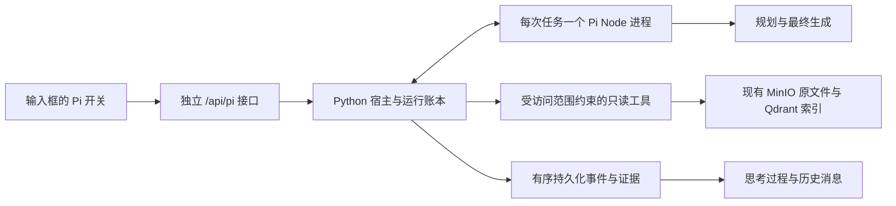

# Pi 自主检索模式

Pi 使用 [`earendil-works/pi`](https://github.com/earendil-works/pi) 的实际 Agent 循环，负责问题理解、研究决策、工具调用、证据取舍与最终回答。Tessmora 提供来源访问、工具执行、用量记录、事件持久化和引用身份检查。旧有 `auto / direct / agent` 流程不参与 Pi 的回答生成。

按用户 2026-10-06 的最新要求，交付重点是独立执行、范围约束、真实过程展示、取消与历史恢复，以及旧模式的关键回归。篇幅偏差、小样本答案满分和独立评分器校准不作为功能交付的前置条件，不为这些指标反复追加模型实验。已知的事实遗漏和过强断言仍如实记录，后续按实际使用影响改进；这不把历史严格评测的失败改成通过。

默认主模型与后续测试主模型均为 `deepseek:deepseek-flash`，推理与实验检查默认关闭。当前模式可完成真实检索与带来源的回答，仍可能遗漏比较要点，或将精确搜索未命中过度概括为全文不存在。独立执行链路和关键回归已有验证，不承诺随机生成答案完全相同或任意共享负载下性能不变。

核心功能已完成本地交付：输入框独立切换、受范围约束的工具、真实过程展示、取消与历史恢复均有验证记录。2026-10-07 初次增加回答要点、已选证据保留和提交完整性检查，原选材任务四次实际交付海报与主题曲，并验证预览、播放与刷新；该候选的冻结结果见 [素材交付稳定性记录](qa/pi-agent-media-stability-2026-10-07.md)。随后针对通用性审查，分离用户输入与外部来源任务、最终引用与原文工作记忆，支持追加遗漏项、保留尾部区间及完整输出预算计量。该轮 295 项 Pi 后端测试、61 项运行时测试、141 项前端测试与类型检查、构建通过；跨任务的实测、失败候选与边界见 [通用性审查记录](qa/pi-agent-generality-2026-10-07.md)。历史核心功能与更广的验证边界见 [核心功能交付审计](PI_AGENT_VERIFICATION.md#核心功能交付审计2026-10-06)。

同一原文件可产生多条独立证据，例如索引描述和直接观察。引用继续保留各自编号与内容，正文媒体按原始资源身份去重：Pi 引用携带宿主目录确定的 `pi_run_id + source_id`；历史引用从已有原文件路由恢复该身份，不依赖可选的调试字段或文件名。视频还按时间区间区分。2026-10-07 的重复图片修复已通过 299 项 Pi 后端测试、147 项前端测试及构建，并在用户原会话核对图片、引用预览与刷新，见 [媒体去重验证记录](qa/pi-agent-media-dedup-2026-10-07.md)。


回答相关性在生成阶段约束：默认交付匹配结果及必要理由，不介绍无关候选、不复述检索流水账；用户明确要求的比较、排除理由及关键反证仍须保留。前端不按计划主次、模态任务类型或相关性白名单隐藏引用，宿主也不为了凑齐计划引用而要求扩写正文。

Agent 将计划标为就绪后，宿主在下一次模型请求的工作数据之后重申通用写作要求，避免长检索记录被直接照搬为回答。仍由同一个 Pi Agent 起草，所有研究工具保持可用；不引入引用后的相关性过滤。2026-10-07 的预算移除、媒体恢复、重复选材与比较任务验证，以及未通过候选和语义边界，见 [回答聚焦与持续执行记录](qa/pi-agent-answer-focus-unlimited-2026-10-07.md)。

## 使用

1. 在 `agent-runtime` 执行 `npm ci`，使用 Node.js 22 或更高版本。
2. 按原方式启动后端与前端。Pi 路由按需初始化；关闭该功能或 Pi 依赖不可用不会阻止旧检索入口启动。
3. 点击输入框工具栏最左侧的 `π` 开关。环绕流光边框表示当前使用纯 Agent；开关右侧的模型选择只影响此模式。
4. 输入问题、添加附件或通过 `@` 指定分析材料。右侧的知识库图标可限定检索范围，文件范围继续限制搜索。关闭 Pi 恢复原回答方式。

切换模式不会重建编辑器，也不清空草稿、附件、引用、撤销历史或文件范围。发送后通过思考过程区域查看真实行动、工具参数、返回结果、证据编号、耗时与异常。回答草稿明确标为引用待确认，只有宿主接受的最终回答进入正式消息。

桌面 Pi 输入框悬浮于消息之上，圆角外保持透明，并按输入框实际高度为消息预留空间。边框光束沿圆角周长匀速移动，前后端渐隐；深色主题降低亮度，减少突兀的亮线。过程面板使用紧凑时间线，折叠时只展示状态与统计；文档、图片、音频和视频证据各有独立图标。

研究过程默认以时间线突出行动说明、检索目标和工具结果，收起没有附加信息的已完成模型调用；进行中、失败或取消的模型调用始终可见。“完整记录”按原有顺序展示所有步骤，证据标签可打开对应原文记录，调用详情保留完整参数和按需读取的结果。状态、计数与耗时均来自真实任务记录。

浏览器断线不等于取消任务。任务继续写入本地账本，刷新后从已收到的事件序号继续；“停止”会取消宿主工具与 Node 工作进程。服务重启将未完成任务明确标为中断，保留历史与证据，不会悄悄重新执行付费请求。继续提问创建关联的新运行。

工具失败保留原始反馈，Agent 可修正参数、改变方法并继续。取消固定的连续失败次数和协议提醒次数终止规则；提示词要求停止无进展的路径。正式提交、澄清、用户取消以及真实的服务或运行错误才结束任务。

通过请求和上传校验后，先保存排队任务并返回运行 ID，再准备来源目录。准备阶段也可取消、没有任务时限，并在思考过程内显示“准备检索资料”和实际的资源等待。已发出的底层读取需要先结束；取消会阻止后续目录分页和元数据读取，重复取消不会提前释放仍在读取的执行名额。

新任务初始配置为 `scope=null`、`scope_ready=false`。宿主确认知识库权限、文件身份、附件和行内引用后，将可读来源的私有映射、最终范围与 `sources.completed` 事件一起提交，再启动 Pi。来源或引用校验失败会留下可回放的失败任务；显式越过宿主允许列表的请求仍在创建前拒绝。准备事件属于宿主上下文，不计为 Pi 模型或工具调用。

后台会话的 Pi 运行继续接收事件，但不占用当前会话的输入框和停止按钮。停止操作及取消失败提示只作用于当前可见会话。

进入已有会话时会独立查询服务端 Pi 账本，补回浏览器缓存中缺失的任务，并重放真实事件；列表返回该会话的全部运行。Pi 附件的原始副本保存在服务端，即使浏览器附件副本被清理，回答引用仍可预览原文件。

同一会话可以混用模式。切回旧模式后，前端仅在会话含 Pi 记录时，通过 POST 携带最近的正式对话文本；服务端按原有上下文预算裁剪，仅接受用户/助手角色。该上下文只用于当前请求，不写入旧后端的全局会话，也不把 Pi 工具证据或未完成草稿当作新检索结果。未使用过 Pi 的请求保持原契约。

## 执行边界



- Pi 没有默认 shell、文件系统、网络抓取或自动发现的扩展工具。凭证只通过进程管道交付，不进入模型提示、命令行或运行账本。
- 旧 API、旧事件解析器、旧检索参数与旧任务模型路由保持独立。Pi 不写入全局模型健康状态，也不切换旧模式的模型。
- 原文件以知识库和文件身份绑定。兼容历史桶 ID 的确定性转换；歧义文件身份、错误 KB、跨库 parent 关系被拒绝。工具返回后再次核对范围。
- `@` 材料可供阅读，但不扩大独立的搜索范围。本机附件只属于本轮输入，不入库、不向量化。
- 默认是本机单用户工作区。`PI_AGENT_ALLOWED_KB_IDS` 是宿主允许列表，不是从浏览器接受的授权。该项目当前没有完整的多租户 RBAC；远程接入需要服务端认证和可信身份，不应把浏览器传来的用户 ID 当作权限。

## 工具

| 工具 | 能力与返回边界 |
| --- | --- |
| `update_answer_plan`（默认开启） | Agent 登记最终交付项、用户原句与依据类型，研究中更新进度、来源选择、原文区间及缺口，也可追加遗漏要求。计划用于研究组织，不是最终引用清单；已选原文持久保存，可指定关键区间。 |
| `list_sources` | 按名称及可选模态过滤后分页列出可读来源，区别输入材料和可搜索文件；目录本身不是证据。 |
| `search` | 精确短语匹配，或独立语义向量与词面匹配融合；覆盖文本、图片描述、音频描述/转写、视频镜头描述/ASR。可用 `source_ids` 将本次查询限定到已发现的来源，不会隐藏服务失败或截断。 |
| `read_source` | 分页读取解析后的文档 chunk 或媒体索引记录，返回真实编号和位置；长片段支持按字符位置续读并校验原记录版本。 |
| `expand_context` | 读取已返回文档证据的相邻 chunk。 |
| `recall_evidence` | 恢复已归档的工具证据，保留原编号。 |
| `inspect_media` | 直接查看原图片、PDF 页或指定音视频区间。长区间按 30 秒分包处理全部内容，每包至多采样 6 帧；保留绝对时间与继续位置，区分观察和原文。 |
| `query_table` | 对 CSV/TSV/XLSX 进行确定性的过滤、分组、计数和数值计算；保留行号与计算范围，不执行公式。PDF 表格通过原文和页图核对。 |
| `set_answer_requirements`（实验开关开启时） | 研究前登记 Pi 理解的正文上限、对应用户原句和必答要点。宿主核对原句身份，将要求与过程事件一起持久化；本轮不可通过后续工具调用改写。登记前可以请求澄清。 |
| `check_answer`（实验开关开启时） | 可选的草稿检查：返回正文/限制说明编号、实际字符数、缺失的声明和选中的原文。检查不结束任务，不调用模型或取得新证据。 |
| `submit_answer` | 接受 Pi 写出的最终回答，检查实际返回的引用编号与正文一致。实验开关开启时另查正文单元和原文片段绑定。用户要求确实未交付才使用 `partial` 并列出对应缺口；一般来源说明不降级状态。没有相关依据时使用 `outcome=not_found`、`partial` 和空引用。 |
| `ask_user` | 结束当前任务并提出澄清问题，保留已有过程。 |

检索摘要、解析文本、转写、媒体模型观察和表格计算具有不同的证据含义。引用校验能证明编号与返回内容的身份一致，不能证明每句话与来源语义蕴含。视频离散采样不能作为全片逐帧观察的证明。

实验检查开启时，文档索引记录在截取前扫描现有 `[图注：…]` 标记，产生版本化的 `provenance.text_origin`。交付的 `content_units` 在来源边界处分开，标为 `generated_caption` 或 `unmarked_parsed_text`，所选片段的 `origin` 随最终引用绑定保存。搜索、原文读取、上下文扩展与续读使用同一标记；复读保留原证据和类型。片段文字、字符位置与原始文件不改写，元数据与原文一起保存在工具产物中。

这是依据入库标记的来源提示，不是作者身份认证。没有标记的文字仍属未分类解析文本；旧索引块若从生成描述中段开始，无法仅据该块恢复丢失的开头。未闭合标记将本块可见尾部保守标为图注范围，并记录未闭合状态。需要确认作者表述时仍应查看上下文或原始页面。默认 Pi 不增加该元数据；历史证据沿用原编号和位置，不重新分类或改写旧回答。

`search.source_ids` 接受已发现的来源编号，只对当前一次查询生效。省略或空列表沿用本轮原检索范围；指定来源必须可搜索且位于本次 `knowledge_base_ids` 中，仅有读取权限的引用和本机附件不能借此进入搜索。未知、越界或互相冲突的选择在调用向量模型与索引前拒绝，空结果不会回退到其他文件。限定文档后仍可检索其有合法父子关系的抽取图片；需要文档文字时由 Pi 选择 `modalities=["doc"]`。工具返回这次查询的实际范围，原任务范围不变。

搜索、来源列表和读取保留分页与续读参数，页大小由 Agent 按任务选择；不再按工具输出额度丢弃已取得的候选。所有交付结果进入不可变产物，长期研究通过上下文归档及复读处理模型窗口。

`list_sources.modalities` 在计算总数和分页前筛选，例如 `["doc"]` 只列文档，避免大量抽取图片占据第一页。省略或空列表保持原排序与可读范围，附件和只读引用的权限含义不变。目录项不会生成证据编号。

图片搜索和索引读取在有合法 `source_file_id` 关系时，可返回 `provenance.parent_document`，提供所属文档的来源编号、名称、版本及可搜索状态。关系须通过知识库、存储桶和唯一文件身份检查，父文档还必须在本轮原范围内独立可读；不会从文件名猜测父文档，也不因图片可读就扩大文档权限。Pi 可自行决定继续读取或搜索该来源，链接本身不算已读正文，原图片的 `caption` 观察类型和引用身份不变。导航信息使用现有摘要额度，长文字保持明确截断位置和续读入口；过大的导航显示信息可以省略。关系变化会改变返回证据版本，并拒绝跨版本续读。

`read_source` 的 `next_start` 指向后续索引片段；`text_continuations` 则给出当前片段尚未读完的续读参数。续读限定 `limit=1`，以 Unicode 字符位置定位，并携带 `expected_record_version`，索引文字或位置改变时拒绝拼接。每份返回仍只为实际读到的文字分配证据编号，`text_start/text_end` 标记原记录中的范围；读到尾部不意味着这一份证据覆盖完整记录。续读可持续进行，不因调用次数或累计输出而禁止读取新文字。

`PI_AGENT_ANSWER_CHECKS_ENABLED` 默认关闭。两轮实际候选均在跨论文题失败，尚不能把该契约作为默认质量改进；关闭时不启用行级声明、字符限制登记或原文片段绑定，来源继续返回原文 `content`。新的回答要点与素材交付检查由独立的 `PI_AGENT_ANSWER_PLAN_ENABLED` 控制，默认开启；两个开关均与旧检索模式独立，每次运行记录其状态。

开启实验后，工具向 Pi 交付 `content_units`：原文按非空行分段，长行最多 1200 个 Unicode 码点，片段编号形如 `e2s1`，保留原始偏移和文字。原始 `Evidence.content`、引用编号、预览和历史证据不变。Pi 提交时用 `statements` 恰好覆盖每个正文非空行（`a1` 起）和每条限制说明（`l1` 起），将其声明为事实、推断、未找到依据、研究缺口或排版；事实/推断须选中实际取得的原文片段，并和该行的引用编号一致。账本保存来源版本、观察类型和偏移，供之后对照。行级覆盖并不等于一行内的每个事实都已获得支持，语义分类和支持关系仍由 Pi 判断；模型错误分类也可能通过身份检查。

实验提示另要求原文问题优先定位文档正文、按需继续深读，并区分目录导航、索引画面描述、可能由模型生成的插入图注和作者正文。比较问题按用户所问维度逐方核对已登记要点，有限篇幅优先保留事实、条件与差异。检索顺序、材料取舍和最终文字仍由 Pi 决定；这些提示不是宿主的语义判定，效果需要真实任务验证。默认关闭实验时不附加这段提示。

`check_answer` 和最终提交使用同一套确定性检查，失败由 Pi 自行修订，宿主不改写最终答案。拒绝反馈包含正文单元、实际字数、超出量及建议压缩目标，帮助 Pi 整体精简。实验开启时，Pi 先调用 `set_answer_requirements` 登记 `max_characters`、逐字的用户原句及必答要点；其余研究和提交工具在登记前被拒绝。原句只能来自当前问题或实际提供给 Pi 的最近用户历史，不能来自助手或资料。相同登记可重试，改变登记会被拒绝；输出超限、取消或事务失败不能发布登记成功。

检查与提交始终继承已登记上限，省略或 `null` 不会解除限长；显式填写不同值也会被拒绝。宿主去除空白、数字引用和 `#*`、反引号、`>` 排版符后按 Unicode 码点计数。登记要求在上下文归档后仍进入模型请求，服务重启保留其状态和事件。界面将其显示为 Pi 对要求的理解，不当作来源证据。

正文引用使用逐个的数字标记，例如 `[1][2]`；`[1,2]` 和 `[e1s1]` 不会被识别为有效正文引用，原文片段编号只填写在 `source_spans`。实验检查发生引用不匹配时，返回实际识别、声明、未返回的编号，以及各行所选原文来源的引用格式示例，供 Pi 自行修订。格式示例不证明原文支持该行事实，宿主不会自动改写或补齐引用。

回答要点或实验检查开启时，执行过且已保存完整参数及失败事件的提交，会得到宿主的失败记录引用。出现更新的被拒草稿后，工作进程可将较早的完整提交/反馈对从模型上下文归档，替换为明确标注的失败记录位置；保留最新一次已保存的草稿及反馈原文。混合研究/提交调用、缺少宿主确认或配对不完整的记录不作此处理；后续参数错误也不能挤掉最近的有效草稿结构。原始过程仍保留在账本中，前端根据真实 `context.compacted` 事件展示归档，不能把失败记录视为来源证据或正式答案。该机制不替 Pi 改写或截断正文。

已完成的 `check_answer` 也可参与上述归档：只有原始参数、检查产物及完成事件均已持久化，宿主才返回检查记录引用。出现更新的完整检查或被拒提交后，较早的检查草稿和结果可以整对归档，检查通过与否均不代表正式答案已被接受。最新一份有宿主记录的草稿及其反馈，在上下文归档时保留原文；参数错误、执行前拒绝或未保存的检查不会取代它。模型物理上下文仍有上限，无法容纳的输入须如实报告。`context.compacted` 用 `archived_check_spans` 标出检查记录，界面归入工具结果归档，原被拒提交计数和失败记录语义保持独立。该行为仍限于实验检查开启的运行。

被拒提交在过程面板显示简短的校验原因；“校验详情”保留原始诊断，“调用参数”保留原草稿。详情默认折叠，可用键盘展开查看。字数说明只使用完整、有效的宿主测量值；历史反馈截断或格式无效时不推断计数，也不将协议错误解释为语义判断。

登记仍依赖 Pi 的首次理解：填 `null` 可能是漏读限长，逐字原句也不证明数值解释正确。该机制保证已登记要求不会在后续丢失，不保证任意自然语言要求都被正确登记。实验检查、复读和研究工具在运行中持续可用，不再进入预算收尾。`answer_checks.semantic_support` 明确记录语义蕴含未经独立验证；通过检查不能在 UI 中标成“事实已核实”。

实验提示区分用户的明确字符上限与 Pi 自主选择的起草目标：有明确上限时登记原值和对应原句，没有时 `max_characters` 与 `length_quote` 同时为 `null`。年份、事实数值、结果数量、模型输出预算不构成用户限长；风格或非字符计量的篇幅要求记录在 `required_points`，不自行转换为字符上限。宿主仍只做原句身份与登记一致性检查，不以关键词或数字匹配替代 Pi 理解。

搜索直接读取已有索引，不重新解析或重建向量。语义检索的 embedding 模型必须与已有向量空间一致；默认 `Qwen/Qwen3-Embedding-8B`。词面检索遍历当前范围的全部索引分页，不再只扫描前 2000 条。Pi 的多轮检索质量仍需按实际业务语料评测。

## 配置与资源

配置前缀为 `PI_AGENT_`，与旧任务模型路由分开，读取 `backend/.env`。重要选项如下：

| 选项 | 默认值/用途 |
| --- | --- |
| `ENABLED` | `true` |
| `MODEL` | `deepseek:deepseek-flash` |
| `THINKING_ENABLED` | `false`；可独立开启 Pi 主模型推理。当前适配 DeepSeek/Qwen 的推理协议；其他未配置推理协议的模型会明确拒绝开启。 |
| `ANSWER_CHECKS_ENABLED` | `false`；实验性的正文单元/来源绑定与声明式篇幅检查。当前实测候选未通过，不建议作为默认开启。 |
| `ANSWER_PLAN_ENABLED` | `true`；Agent 登记交付项、保留已选证据，并在提交时检查完成状态、缺口及引用身份；设为 `false` 可回到此前的提交协议。 |
| `MODEL_API_KEY` / `MODEL_BASE_URL` | 可选的 Pi 主模型专用凭证和端点，避免共用服务商配额；不写入账本。 |
| `EMBEDDING_MODEL` | 必须匹配已有索引的向量空间。 |
| `VISION_MODEL` | `aliyun_bailian:qwen3-vl-plus-2025-12-19` |
| `AUDIO_MODEL` | `aliyun_bailian:qwen3-omni-flash` |
| `ALLOWED_MODELS` | 可选 JSON 模型列表，未设置时仅开放 `MODEL`。额外模型须先验证工具调用支持；如设置列表，应包含默认模型。不会自动开放旧模式的整个模型目录。 |
| `ALLOWED_KB_IDS` | 可选 JSON 知识库列表；空列表表示无知识库访问权。 |
| `API_TOKEN` / `TRUSTED_USER_ID` | 远程 API 的服务端凭证与可信工作区身份。默认仅本机访问。 |
| `MAX_CONCURRENT_RUNS` | `2`；调度并发，额外任务排队等待且可取消。 |
| `MAX_CONCURRENT_SEARCHES` | `1` |
| `YIELD_TO_LEGACY` | `true`：旧对话检索运行期间，Pi 等待来源目录读取、工作进程启动以及后续模型和工具调用的准入；扫描途中也会在下一次目录迭代或元数据读取前重新检查。已经发出的请求继续计为在途请求。等待和恢复是真实 trace 事件。 |
| `DATA_DIR` | `data/pi-agent`，包含 SQLite 账本、私有附件和预览。单目录仅一个宿主进程持锁。 |

当前没有应用层单任务预算：取消总时长、累计 Token、模型/工具/搜索/媒体调用次数、工具输出总量及强制收尾。`UsageLedger` 只记录实际用量，供应商未返回 Token 时标记未知；不会把 UTF-8 字节估算冒充真实 Token。旧 `BUDGET` 配置不再参与运行。取消 Pi 附件数量/大小、视频时长、来源扫描总数、表格行列/分组及工作记忆字符的任务配额，旧模式默认限制保持原契约。

历史默认值为 300 秒、24 次模型请求、240000 累计 Token、40 次工具、8 次搜索、6 次媒体观察；每次模型输出 6000 Token，单工具 90 秒/20000 字符，工具输出累计 240000 字符，媒体 20 MiB/180 秒，原文工作记忆 8000 字符/每段 1000 字符。这些是已移除的旧设计，保留于此用于解释历史失败记录。

推理开关仅作用于 Pi 主模型，不修改旧任务路由或工具模型。宿主将开启状态记录到任务配置，并将 `medium` 交给 Pi；当前兼容接口映射为供应商的启用/关闭参数，不承诺固定思考 Token 数。真实用量来自供应商回执；原始思维链不进入过程事件或历史。开启推理不代表结论已核验。

模型请求不再按剩余累计额度拒绝。已知单次输出容量取自部署模型配置或 Pi 的供应商模型目录，并结合当前上下文容量发送；未知容量交给供应商默认值，不设置应用层 6000 Token 上限。长任务仍受模型上下文窗口、供应商错误及机器实际资源影响；访问控制、证据身份检查和资源并发调度继续有效。

上下文归档依据实际模型窗口，投影完整的待发上下文，包括计划与保留原文，避免持久工作记忆绕过窗口检查。优先归档旧工具正文，必要时把过大的已选原文投影为明确的复读定位信息；原始文本和计划始终保存在账本，可通过 `recall_evidence` 或选择 `retained_spans` 继续读取。归档保持调用/返回配对、用户要求与最新校验草稿，不移除研究工具，也不将任务改为完成。

准入失败且未调用供应商的轮次记录为 `model.rejected`；调用前取消记录为 `model.cancelled`，均明确 `executed=false`，不生成模型完成或用量事件。实际发出的模型请求仍记录开始、完成或错误并结算用量。过程中的一次拒绝不能被解读为已经完成了一次模型推理。

上下文超过阈值时归档较早的工具结果，保留工具调用/返回配对、证据编号和原始问题；回答要点或实验检查开启时，较早的被拒提交可按上述规则整对归档。原始调用和结果仍在账本中，归档提示不作为新的来源证据。

回答要点或实验检查开启时，归档的来源结果另保留有界的复读定位信息：已交付的证据编号、来源和文件名、模态、版本、观察类型、位置，以及最前面的至多三段逐字摘录，每条证据合计不超过 160 个 Unicode 码点。来源标记和偏移沿用交付内容，不生成摘要、判断相关性或新增引用。每个工具结果的定位索引不超过 4096 个 UTF-8 字节，按原顺序保留可容纳的条目并说明省略数量；短结果不会为增加索引而膨胀。定位摘录仅帮助 Pi 选择复读编号，引用前仍须核对实际可见内容及上下文。

`context.compacted` 记录本次上下文投影归档的产物、证据编号及保留原文编号。导航不是新证据或语义核验；编号仍可回查并复读原文。源数据与历史产物不改变。

### 任务进度与依据交付

Agent 自行理解问题并登记最终交付项，宿主不靠任务关键词选择流程、查询或答案。每项绑定当前用户原句，编号、要求、原句、依据类型、模态和顺序不可删改；发现遗漏时可以在原项之后追加，不能删除难以完成的要求。不设固定要点数量；一般格式约束和研究步骤不要求单独登记。

`basis=sources` 用于需要外部资料的研究、事实、比较和素材任务。`evidence_ids` 是研究中选择的主要来源，`supporting_evidence_ids` 是补充依据；仅接受本轮已交付编号。只有明确要求某类原文或媒体资产才约束 `modality`，一般解释及跨模态分析使用 `any`。选择没有固定数量上限，最终引用由实际答案决定。

`basis=user_input` 用于用户文本或数值的翻译、改写、推导及按要求创作，`ready` 必须通过 `input_quotes` 逐字绑定当前或历史用户输入，不接受助手或工具文本。该项不选择外部来源，模态使用 `any`；所有项均为有效、就绪的输入处理时，可无引用提交 `completed`。外部核实需求不能据此转成输入任务，登记后的来源项也不能降级。正确识别依据类型仍由 Agent 判断，逐字身份检查不认证其任务理解。

要点与选择以 `answer.plan` 和状态在同一事务持久化。默认保留全部所选证据的已交付文本，不再按固定字符配额截短。`retained_range` 标记实际可见偏移、原长度与是否为部分摘录。

Agent 可用 `retained_spans` 指定已交付文本任意位置的关键 Unicode 区间，尤其是尾部条件、例外或计算结果。省略或 `null` 沿用仍被选择的旧区间，`[]` 恢复完整已交付文本；非法区间拒绝更新并保留上一状态。每次模型请求将计划与原文作为明确标注的用户级工作数据携带，窗口不足时明确归档为可复读身份，不提升为系统指令。保留不代表新增观察或完整阅读。

完成度按用户要求的结果与必要条件判定，不按资料穷尽程度判定。提示词在理解任务、登记计划和临近写作时区分真实交付缺口与普通来源说明；推荐或匹配任务不自行增加权威认证、全量阅读等验收条件。用户明确要求或结论成立必需的条件仍须满足，不能降格成普通说明。

`pending` 表示继续研究；`ready` 表示已足以交付该要求；`incomplete` 表示已有部分结果但仍有具体用户要求未交付，保留已选依据并填写 `gap`；`unavailable` 表示完全未取得该项依据，清空选择并填写 `gap`。后两者对应最终 `partial`，`limitations` 恰好列出它们的缺口。全部 `ready` 须提交 `completed` 和空 `limitations`。矛盾提交返回反馈供同一 Agent 修订，不自动改状态、删说明或改写正文。

一般来源范围或使用说明只在影响理解或使用时由 Agent 在正文末尾简述一次，不登记为缺口，也不因它降低任务完成度。结构化缺口及历史任务原有的 `limitations` 统一显示在回答末尾的“任务说明”，默认折叠；不再放在顶部过程面板中当作“尚未覆盖”。历史状态与说明原文保留，不根据文字关键词重新分类。

计划的主次分类不控制引用或展示：不要求正文引用所有已选证据，也不拒绝正文使用已交付但未放入计划的合法证据。全部实际引用的媒体正常展示，并按来源身份去重。完成度契约只保证 Agent 的计划、缺口和提交状态一致，不独立认证其对任务或证据的语义判断。

完成度判定、历史说明位置和真实复测的通过项/未通过项见 [完成度验证记录](qa/pi-agent-task-completion-2026-10-07.md)。

来源任务的 Markdown 图片地址必须对应最终选中且已交付的图片来源；内部身份、文件名、未取得的地址会被拒绝，Agent 可改用数字引用触发展示。校验使用现有 Markdown 解析器，覆盖引用式图片并跳过代码和转义示例；前端不渲染的原始 HTML 不当作图片。纯输入转换保留原 Markdown 地址；混合研究与输入处理也允许就绪的 `user_input.input_quotes` 中实际出现的图片地址，不强行替用户重写链接。该规则核对展示来源身份，不判断画面是否符合任务。

该检查保证已登记任务的状态、证据身份、输入身份、来源类型与引用交付一致；不证明首次拆解覆盖了任意自然语言要求，也不独立判断内容相关性、语义蕴含或事实准确性。正文是否实际解释了每个要点仍须由 Agent 核对；本次没有强制复制答复片段来模拟语义核验。取消、服务重启和旧模式隔离沿用既有边界。历史运行不重写、不重新执行。

共享硬件、Qdrant 和服务商配额仍然可能产生竞争。默认优先级保护旧对话，代价是 Pi 在并发时可能等待；独立凭证与资源部署可以进一步隔离。不能仅凭“独立路由”断言任何工作负载下零性能影响。

## 验证

```bash
cd agent-runtime && npm test
cd ../backend
../.venv/bin/python -m pytest tests/test_pi_agent_*.py -q
cd ../frontend && npm test && npm run build
```

`scripts/verify-pi-isolation.py` 运行真实模型、真实语料的配对检查：预热后，以交替顺序对比三个旧模式在无 Pi / 两路 Pi 负载下的答案、来源、错误与延迟。此命令产生模型费用，输出保存到 `data/pi-agent-verification`。该小规模检查的“来源命中”只检查预期论文，不等同于完整的答案语义评测。

脚本 v3 记录客户端观察到的每条 SSE 请求起止时间和分阶段事件，将历史读取与健康轮询收尾排除出重叠统计；已有结果文件会被拒绝覆盖。`backend/tests/test_pi_agent_isolation.py` 另用固定外部响应检验旧 HTTP/Agent 执行与 Pi 宿主调度的并发开销，不能用于代替供应商实际延迟评估。

`scripts/serve-pi-diagnostics.py` 使用独立进程和账本记录请求级模型、规划及检索耗时，不记录模型凭证或提示正文；禁用应用生命周期任务以避免重复启动监听器。`scripts/verify-pi-quality.py --cases <冻结用例清单> --output <新目录>` 保存三个旧模式的无负载/两路 Pi 负载回答，以及 Pi 自身的回答和实际证据。它先确认 Pi 模型已发起，再启动旧请求；语义结论必须另行对照来源审阅，脚本不会把引用编号合法当作正确性评分。

质量收集器在启动测量前检查 `/health` 和已启用的 Pi 协议，保存 `preflight.json`。完整性检查同时覆盖回答、流错误、两项 Pi 负载的模型准入和清理状态，失败时非零退出；`collection.json` 的执行成功不代表语义质量通过。原请求参数和完整 SSE 事件与回答一同保存。

`scripts/pi_semantic_review.py prepare --cases <用例> --receipts <回答目录> --output <新评阅目录>` 将回答匿名化，封存来源、实际引用、随机顺序和校验哈希；`--pi-dir` 可指定独立保存的 Pi 回答。随后用 `review --output <评阅目录> --model <独立评阅模型>` 发起逐项评阅。每份输入只请求一次，不自动重试或重新生成产品答案，原始输出和用量均保留。引用必须逐字对应回答和实际返回来源，遗漏、含糊或格式无效的评阅不能通过。该结果仍是模型评阅；逐字引文只能证明出处，不能证明语义蕴含，也不构成人工盲评或统计非劣效性结论。

实验性的 `scripts/pi_span_review.py` 使用输入原文片段编号，并强制覆盖回答的每个单元。事实覆盖与引用支持使用独立请求，分别只能看到参考资料或实际引用，原始输出均保存；空参考事实不调用模型。先执行 `calibrate --cases <校准清单> --output <新目录>` 封存正反例，再以 `review --output <校准目录> --model <模型>` 校准。只有实际结果全部符合预设金标，才能通过 `prepare --bundle <原v1封存目录> --calibration <通过的校准目录> --output <新目录>` 准备产品评阅。它保留原答案与评分规则，不替换旧评阅记录；当前校准未通过，不能用于宣布产品语义验收通过，详细结果见验收记录。

`scripts/pi_relation_review.py` 将子句分类、引用支持与明确反驳分别交给独立请求，保持原事实覆盖及评分规则。协议 7 可在 `calibrate` 时用 `--thinking` 冻结 Qwen3.5 Plus 推理配置；`review` 不接受临时覆盖。默认请求保持推理关闭。开启后设置 `thinking_budget=4000`、`max_completion_tokens=7990`，为供应商文档所述最多 10 Token 误差预留空间，推理与最终回复共用原 8000 Token 上限；回执须提供一致用量及实际推理记录，超限或缺失即停止。JSON 模式不保证在此模型的推理状态下生效，输出仍须直接通过原有严格校验，不修复格式或重试。

每次请求保存完整请求体（不含凭证）、原始响应、配置和哈希，保留集必须与开发集使用相同配置及模型端点，并重新核验通过的原始回执。供应商推理正文仅保存在本机私有评阅目录，不进入产品过程面板。旧失败记录不覆盖；新协议需要新目录。该脚本仍只开放开发与保留集校准，自动产品评分不可用。

每个独立请求只有一份答案，模型输入与输出使用请求内别名 `a1`，避免要求模型抄写随机长编号。真实答案编号仍在封存输入和宿主汇总中，完整输入哈希与实际请求体绑定每份原始回执；别名不跨请求连接结果。错误别名、调换任务回执或改写响应仍被拒绝。旧协议的编号错误不作修复或追认。

`scripts/verify-pi-replay.py` 在模型 HTTP、Qdrant HTTP 和 MinIO HTTP 边界录制实际响应，再交给独立的基线/候选进程。旧输入校验、附件分析、查询改写、本地编码、检索/重排、Agent 规划、生成、SSE 和历史逻辑仍实际执行。请求按端点、完整 JSON/请求体、读取参数和超时匹配；每次响应只能消费一次，未记录请求和剩余响应都会导致验证失败。回放禁止旧请求访问真实网络，录制与回放均拒绝知识库写入。

此工具使用 ASGI HTTP 边界，不运行后台生命周期任务；一般响应不重放网络延迟，外层 deadline 引发的取消仍由原调用方的超时逻辑触发。协议 v2 要求在启动 Python 前固定 `PYTHONHASHSEED=0`，并逐次录制/回放目录缓存的时钟读取，保留真实 60 秒缓存失效决策；不改变旧模式的 asyncio 超时行为。因此它验证相同外部输入下的行为一致性，不产生新的实时性能结论，也不把基线错误认定为正确答案。`--pi-load` 为候选回放另启真实 Pi 任务，并保存其账本；Pi 使用真实外部服务，旧流程仍只消费录制响应。

录制包含提示和来源正文，必须放在本机忽略目录，不能提交。请求不保存 Authorization 等凭证头；对预签名地址只比较对象身份及非签名参数。输出目录和响应记录均拒绝覆盖。基线和候选需使用相同环境配置、模型路由文件、固定问题及附件哈希。典型调用如下（路径应为实际独立检出与固定清单）：

```bash
PYTHONHASHSEED=0 .venv/bin/python scripts/verify-pi-replay.py --mode record \
  --checkout /tmp/tessmora-pi-baseline-bf9627b --cases <manifest.json> \
  --tape data/pi-agent-verification/replay-tape --output data/pi-agent-verification/replay-record
PYTHONHASHSEED=0 .venv/bin/python scripts/verify-pi-replay.py --mode replay \
  --checkout /tmp/tessmora-pi-baseline-bf9627b --cases <manifest.json> \
  --tape data/pi-agent-verification/replay-tape --expected data/pi-agent-verification/replay-record \
  --output data/pi-agent-verification/replay-baseline
# 再用 --checkout . 运行候选对照，并用另一个输出目录加 --pi-load 运行候选负载。
```

验收记录应保留失败候选，并同时报告未通过的门槛。浏览器验收包含原编辑器身份、草稿/引用/附件保留、浅色/深色、窄屏、减弱动态效果、真实任务过程、取消与刷新回放。不要把协议测试中的模拟供应商结果当作真实模型验证。

功能交付证据、历史严格评测及已知质量问题见 [PI_AGENT_VERIFICATION.md](PI_AGENT_VERIFICATION.md)。
