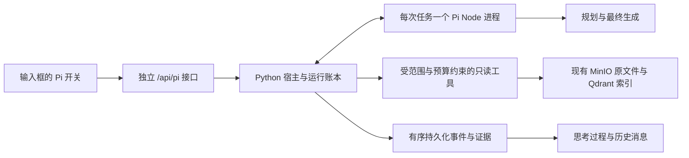

# Pi 自主检索模式

Pi 使用 [`earendil-works/pi`](https://github.com/earendil-works/pi) 的实际 Agent 循环，负责问题理解、研究决策、工具调用、证据取舍与最终回答。Tessmora 提供来源访问、工具执行、预算、事件持久化和引用身份检查。旧有 `auto / direct / agent` 流程不参与 Pi 的回答生成。

## 使用

1. 在 `agent-runtime` 执行 `npm ci`，使用 Node.js 22 或更高版本。
2. 按原方式启动后端与前端。Pi 路由按需初始化；关闭该功能或 Pi 依赖不可用不会阻止旧检索入口启动。
3. 点击输入框的 `π Agent` 开关。彩色边框和顶部状态表示当前使用纯 Agent；顶部模型选择只影响此模式。
4. 输入问题、添加附件或通过 `@` 指定分析材料。独立的知识库/文件范围继续限制搜索。关闭 Pi 恢复原回答方式。

切换模式不会重建编辑器，也不清空草稿、附件、引用、撤销历史或文件范围。发送后通过思考过程区域查看真实行动、工具参数、返回结果、证据编号、耗时与异常。回答草稿明确标为引用待确认，只有宿主接受的最终回答进入正式消息。

浏览器断线不等于取消任务。任务继续写入本地账本，刷新后从已收到的事件序号继续；“停止”会取消宿主工具与 Node 工作进程。服务重启将未完成任务明确标为中断，保留历史与证据，不会悄悄重新执行付费请求。继续提问创建关联的新运行。

进入已有会话时会独立查询服务端 Pi 账本，补回浏览器缓存中缺失的任务，并重放真实事件；当前列表最多返回最近 100 次运行。Pi 附件的原始副本保存在服务端，即使浏览器附件副本被清理，回答引用仍可预览原文件。

同一会话可以混用模式。切回旧模式后，前端仅在会话含 Pi 记录时，通过 POST 携带最近的正式对话文本；服务端按原有上下文预算裁剪，仅接受用户/助手角色。该上下文只用于当前请求，不写入旧后端的全局会话，也不把 Pi 工具证据或未完成草稿当作新检索结果。未使用过 Pi 的请求保持原契约。

## 执行边界



- Pi 没有默认 shell、文件系统、网络抓取或自动发现的扩展工具。凭证只通过进程管道交付，不进入模型提示、命令行或运行账本。
- 旧 API、旧事件解析器、旧检索参数与旧任务模型路由保持独立。Pi 不写入全局模型健康状态，也不切换旧模式的模型。
- 原文件以知识库和文件身份绑定。兼容历史桶 ID 的确定性转换；歧义文件身份、错误 KB、跨库 parent 关系被拒绝。工具返回后再次核对范围。
- `@` 材料可供阅读，但不扩大独立的搜索范围。本机附件只属于本轮输入，不入库、不向量化。
- 默认是本机单用户工作区。`PI_AGENT_ALLOWED_KB_IDS` 是宿主允许列表，不是从浏览器接受的授权。该项目当前没有完整的多租户 RBAC；远程接入需要服务端认证和可信身份，不应把浏览器传来的用户 ID 当作权限。

## 工具

| 工具 | 能力与返回边界 |
| --- | --- |
| `list_sources` | 分页列出可读来源，区别输入材料和可搜索文件；目录本身不是证据。 |
| `search` | 精确短语匹配，或独立语义向量与词面匹配融合；覆盖文本、图片描述、音频描述/转写、视频镜头描述/ASR。不会隐藏服务失败或截断。 |
| `read_source` | 分页读取解析后的文档 chunk 或媒体索引记录，返回真实编号和位置。 |
| `expand_context` | 读取已返回文档证据的相邻 chunk。 |
| `recall_evidence` | 恢复已归档的工具证据，保留原编号。 |
| `inspect_media` | 直接查看原图片、PDF 页，或至多 60 秒的音视频区间。视频最多 6 帧，保留原文件绝对时间；区分模型观察和原文。 |
| `query_table` | 对 CSV/TSV/XLSX 进行确定性的过滤、分组、计数和数值计算；保留行号与计算范围，不执行公式。PDF 表格通过原文和页图核对。 |
| `submit_answer` | 接受 Pi 写出的最终回答，检查实际返回的引用编号与正文一致。证据不足使用 `partial` 并列出缺口。 |
| `ask_user` | 结束当前任务并提出澄清问题，保留已有过程。 |

检索摘要、解析文本、转写、媒体模型观察和表格计算具有不同的证据含义。引用校验能证明编号与返回内容的身份一致，不能证明每句话与来源语义蕴含。视频离散采样不能作为全片逐帧观察的证明。

搜索直接读取已有索引，不重新解析或重建向量。语义检索的 embedding 模型必须与已有向量空间一致；这里默认 `Qwen/Qwen3-Embedding-8B`。词面检索单模态最多扫描 2000 条索引记录，截断会显式返回。Pi 的多轮检索质量仍需要按实际业务语料评测。

## 配置与资源

配置前缀为 `PI_AGENT_`，与旧任务模型路由分开，读取 `backend/.env`。重要选项如下：

| 选项 | 默认值/用途 |
| --- | --- |
| `ENABLED` | `true` |
| `MODEL` | `deepseek:deepseek-flash` |
| `MODEL_API_KEY` / `MODEL_BASE_URL` | 可选的 Pi 主模型专用凭证和端点，避免共用服务商配额；不写入账本。 |
| `EMBEDDING_MODEL` | 必须匹配已有索引的向量空间。 |
| `VISION_MODEL` | `aliyun_bailian:qwen3-vl-plus-2025-12-19` |
| `AUDIO_MODEL` | `aliyun_bailian:qwen3-omni-flash` |
| `ALLOWED_MODELS` | 可选 JSON 模型列表，未设置时仅开放 `MODEL`。额外模型须先验证工具调用支持；如设置列表，应包含默认模型。不会自动开放旧模式的整个模型目录。 |
| `ALLOWED_KB_IDS` | 可选 JSON 知识库列表；空列表表示无知识库访问权。 |
| `API_TOKEN` / `TRUSTED_USER_ID` | 远程 API 的服务端凭证与可信工作区身份。默认仅本机访问。 |
| `MAX_CONCURRENT_RUNS` / `MAX_QUEUED_RUNS` | `2 / 8` |
| `MAX_CONCURRENT_SEARCHES` | `1` |
| `YIELD_TO_LEGACY` | `true`：旧对话检索运行期间，Pi 等待工作进程启动以及后续模型和工具调用的准入。已经发出的请求不会被伪装为尚未发生。等待和恢复是真实 trace 事件。 |
| `DATA_DIR` | `data/pi-agent`，包含 SQLite 账本、私有附件和预览。单目录仅一个宿主进程持锁。 |
| `BUDGET` | JSON，可覆盖下面的预算字段。 |

默认单任务 300 秒、24 次模型调用、240000 Token、40 次工具调用、8 次搜索、6 次媒体分析。工具内的 embedding、视觉、音频模型调用也计入同一本账。没有返回 token usage 的调用按预留量保守收费。媒体输入另有字节和时间上限；资源等待计入运行时限。接近预算时保留提交回答所需的调用名额。

上下文超过阈值时归档较早的工具结果，保留完整的工具调用/返回序列、证据编号和原始问题；原始结果仍在账本中。不会把归档提示冒充新的来源证据。

共享硬件、Qdrant 和服务商配额仍然可能产生竞争。默认优先级保护旧对话，代价是 Pi 在并发时可能等待；独立凭证与资源部署可以进一步隔离。不能仅凭“独立路由”断言任何工作负载下零性能影响。

## 验证

```bash
cd agent-runtime && npm test
cd ../backend
../.venv/bin/python -m pytest tests/test_pi_agent_*.py -q
cd ../frontend && npm test && npm run build
```

`scripts/verify-pi-isolation.py` 运行真实模型、真实语料的配对检查：预热后，以交替顺序对比三个旧模式在无 Pi / 两路 Pi 负载下的答案、来源、错误与延迟。此命令产生模型费用，输出保存到 `data/pi-agent-verification`。该小规模检查的“来源命中”只检查预期论文，不等同于完整的答案语义评测。

脚本 v3 记录客户端观察到的每条 SSE 请求起止时间和分阶段事件，将历史读取与健康轮询收尾排除出重叠统计；已有结果文件会被拒绝覆盖。`backend/tests/test_pi_agent_isolation.py` 另用固定外部响应检验旧 HTTP/Agent 执行与 Pi 宿主调度的并发开销，不能用于代替供应商实际延迟评估。

验收记录应保留失败候选，并同时报告未通过的门槛。浏览器验收包含原编辑器身份、草稿/引用/附件保留、浅色/深色、窄屏、减弱动态效果、真实任务过程、取消与刷新回放。不要把协议测试中的模拟供应商结果当作真实模型验证。

本次结果及尚未通过的门槛见 [PI_AGENT_VERIFICATION.md](PI_AGENT_VERIFICATION.md)。
