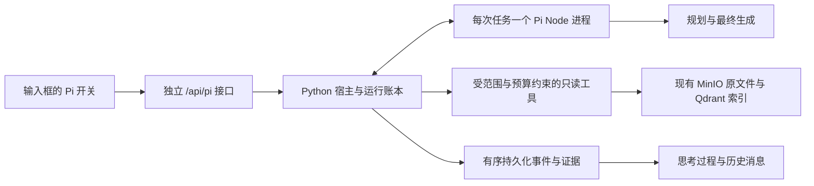

# Pi 自主检索模式

Pi 使用 [`earendil-works/pi`](https://github.com/earendil-works/pi) 的实际 Agent 循环，负责问题理解、研究决策、工具调用、证据取舍与最终回答。Tessmora 提供来源访问、工具执行、预算、事件持久化和引用身份检查。旧有 `auto / direct / agent` 流程不参与 Pi 的回答生成。

## 使用

1. 在 `agent-runtime` 执行 `npm ci`，使用 Node.js 22 或更高版本。
2. 按原方式启动后端与前端。Pi 路由按需初始化；关闭该功能或 Pi 依赖不可用不会阻止旧检索入口启动。
3. 点击输入框的 `π Agent` 开关。彩色边框和顶部状态表示当前使用纯 Agent；顶部模型选择只影响此模式。
4. 输入问题、添加附件或通过 `@` 指定分析材料。独立的知识库/文件范围继续限制搜索。关闭 Pi 恢复原回答方式。

切换模式不会重建编辑器，也不清空草稿、附件、引用、撤销历史或文件范围。发送后通过思考过程区域查看真实行动、工具参数、返回结果、证据编号、耗时与异常。回答草稿明确标为引用待确认，只有宿主接受的最终回答进入正式消息。

浏览器断线不等于取消任务。任务继续写入本地账本，刷新后从已收到的事件序号继续；“停止”会取消宿主工具与 Node 工作进程。服务重启将未完成任务明确标为中断，保留历史与证据，不会悄悄重新执行付费请求。继续提问创建关联的新运行。

通过请求和上传校验后，先保存排队任务并返回运行 ID，再准备来源目录。准备阶段也可取消、受运行预算约束，并在思考过程内显示“准备检索资料”和实际的资源等待。已发出的底层读取需要先结束；取消会阻止后续目录分页和元数据读取，重复取消不会提前释放仍在读取的执行名额。

新任务初始配置为 `scope=null`、`scope_ready=false`。宿主确认知识库权限、文件身份、附件和行内引用后，将可读来源的私有映射、最终范围与 `sources.completed` 事件一起提交，再启动 Pi。来源或引用校验失败会留下可回放的失败任务；显式越过宿主允许列表的请求仍在创建前拒绝。准备事件属于宿主上下文，不计为 Pi 模型或工具调用。

后台会话的 Pi 运行继续接收事件，但不占用当前会话的输入框和停止按钮。停止操作及取消失败提示只作用于当前可见会话。

进入已有会话时会独立查询服务端 Pi 账本，补回浏览器缓存中缺失的任务，并重放真实事件；当前列表最多返回最近 100 次运行。Pi 附件的原始副本保存在服务端，即使浏览器附件副本被清理，回答引用仍可预览原文件。

同一会话可以混用模式。切回旧模式后，前端仅在会话含 Pi 记录时，通过 POST 携带最近的正式对话文本；服务端按原有上下文预算裁剪，仅接受用户/助手角色。该上下文只用于当前请求，不写入旧后端的全局会话，也不把 Pi 工具证据或未完成草稿当作新检索结果。未使用过 Pi 的请求保持原契约。

## 执行边界



- Pi 没有默认 shell、文件系统、网络抓取或自动发现的扩展工具。凭证只通过进程管道交付，不进入模型提示、命令行或运行账本。
- 旧 API、旧事件解析器、旧检索参数与旧任务模型路由保持独立。Pi 不写入全局模型健康状态，也不切换旧模式的模型。
- 原文件以知识库和文件身份绑定。兼容历史桶 ID 的确定性转换；歧义文件身份、错误 KB、跨库 parent 关系被拒绝。工具返回后再次核对范围。
- `@` 材料可供阅读，但不扩大独立的搜索范围。本机附件只属于本轮输入，不入库、不向量化。
- 默认是本机单用户工作区。`PI_AGENT_ALLOWED_KB_IDS` 是宿主允许列表，不是从浏览器接受的授权。该项目当前没有完整的多租户 RBAC；远程接入需要服务端认证和可信身份，不应把浏览器传来的用户 ID 当作权限。

## 工具

| 工具 | 能力与返回边界 |
| --- | --- |
| `list_sources` | 分页列出可读来源，区别输入材料和可搜索文件；目录本身不是证据。 |
| `search` | 精确短语匹配，或独立语义向量与词面匹配融合；覆盖文本、图片描述、音频描述/转写、视频镜头描述/ASR。不会隐藏服务失败或截断。 |
| `read_source` | 分页读取解析后的文档 chunk 或媒体索引记录，返回真实编号和位置。 |
| `expand_context` | 读取已返回文档证据的相邻 chunk。 |
| `recall_evidence` | 恢复已归档的工具证据，保留原编号。 |
| `inspect_media` | 直接查看原图片、PDF 页，或至多 60 秒的音视频区间。视频最多 6 帧，保留原文件绝对时间；区分模型观察和原文。 |
| `query_table` | 对 CSV/TSV/XLSX 进行确定性的过滤、分组、计数和数值计算；保留行号与计算范围，不执行公式。PDF 表格通过原文和页图核对。 |
| `submit_answer` | 接受 Pi 写出的最终回答，检查实际返回的引用编号与正文一致。证据不足使用 `partial` 并列出缺口；没有相关依据时使用 `outcome=not_found`、`partial` 和空引用。 |
| `ask_user` | 结束当前任务并提出澄清问题，保留已有过程。 |

检索摘要、解析文本、转写、媒体模型观察和表格计算具有不同的证据含义。引用校验能证明编号与返回内容的身份一致，不能证明每句话与来源语义蕴含。视频离散采样不能作为全片逐帧观察的证明。

搜索直接读取已有索引，不重新解析或重建向量。语义检索的 embedding 模型必须与已有向量空间一致；这里默认 `Qwen/Qwen3-Embedding-8B`。词面检索单模态最多扫描 2000 条索引记录，截断会显式返回。Pi 的多轮检索质量仍需要按实际业务语料评测。

## 配置与资源

配置前缀为 `PI_AGENT_`，与旧任务模型路由分开，读取 `backend/.env`。重要选项如下：

| 选项 | 默认值/用途 |
| --- | --- |
| `ENABLED` | `true` |
| `MODEL` | `deepseek:deepseek-flash` |
| `THINKING_ENABLED` | `false`；可独立开启 Pi 主模型推理。当前适配 DeepSeek/Qwen 的推理协议；其他未配置推理协议的模型会明确拒绝开启。 |
| `MODEL_API_KEY` / `MODEL_BASE_URL` | 可选的 Pi 主模型专用凭证和端点，避免共用服务商配额；不写入账本。 |
| `EMBEDDING_MODEL` | 必须匹配已有索引的向量空间。 |
| `VISION_MODEL` | `aliyun_bailian:qwen3-vl-plus-2025-12-19` |
| `AUDIO_MODEL` | `aliyun_bailian:qwen3-omni-flash` |
| `ALLOWED_MODELS` | 可选 JSON 模型列表，未设置时仅开放 `MODEL`。额外模型须先验证工具调用支持；如设置列表，应包含默认模型。不会自动开放旧模式的整个模型目录。 |
| `ALLOWED_KB_IDS` | 可选 JSON 知识库列表；空列表表示无知识库访问权。 |
| `API_TOKEN` / `TRUSTED_USER_ID` | 远程 API 的服务端凭证与可信工作区身份。默认仅本机访问。 |
| `MAX_CONCURRENT_RUNS` / `MAX_QUEUED_RUNS` | `2 / 8` |
| `MAX_CONCURRENT_SEARCHES` | `1` |
| `YIELD_TO_LEGACY` | `true`：旧对话检索运行期间，Pi 等待来源目录读取、工作进程启动以及后续模型和工具调用的准入；扫描途中也会在下一次目录迭代或元数据读取前重新检查。已经发出的请求继续计为在途请求。等待和恢复是真实 trace 事件。 |
| `DATA_DIR` | `data/pi-agent`，包含 SQLite 账本、私有附件和预览。单目录仅一个宿主进程持锁。 |
| `BUDGET` | JSON，可覆盖下面的预算字段。 |

默认单任务 300 秒、24 次模型调用、240000 Token、40 次工具调用、8 次搜索、6 次媒体分析。工具内的 embedding、视觉、音频模型调用也计入同一本账。没有返回 token usage 的调用按预留量保守收费。媒体输入另有字节和时间上限；取得执行名额后开始计时，来源准备和资源等待计入运行时限，排队等待名额不计入。接近预算时保留提交回答所需的调用名额。

推理开关仅作用于 Pi 主模型，不修改旧任务路由或工具模型。宿主将开启状态记录到任务配置，并将 `medium` 交给 Pi；当前兼容接口映射为供应商的启用/关闭参数，不承诺不同推理强度或固定思考 Token 数。推理输出仍占用原有模型与时间预算，真实用量来自供应商回执；原始思维链不进入过程事件或历史。开启推理不代表结论已经核验，所选模型的推理与工具调用兼容性仍需实测。

每轮模型准入同时比较剩余 Token 与完整上下文的保守预留量；当下一轮同等上下文可能无法容纳时，在当前调用仍能支付时进入收尾。宿主记录 `budget.finalizing`，Pi 的工具声明只保留提交回答、请求澄清和一次 `recall_evidence`，每批至多 4 条。复读只返回本轮已经交付的证据，帮助 Pi 核对被上下文归档的原文；不能搜索、读取新材料或发起媒体分析。复读仍计入工具次数和输出预算，保留最后两个提交/修正名额；后续模型调用仍须通过原有准入检查。

若上下文超过剩余 Token 预算，宿主返回当前可容纳的字节上限，此时尚未付费或占用模型请求名额。工作进程尝试归档较早的工具正文，保留用户消息、调用/返回对应关系及最新一组证据原文，再按实际大小重新申请准入。该次处理只允许最终提交，不能再次复读；不重试供应商请求。若必要输入仍无法容纳，就如实结束失败。最终文字仍由 Pi 生成，原始证据仍在账本中；该机制不承诺在任意超长输入、供应商失败或时间预算耗尽后仍能生成答案。

准入失败且未调用供应商的轮次记录为 `model.rejected`；调用前取消记录为 `model.cancelled`，均明确 `executed=false`，不生成模型完成或用量事件。实际发出的模型请求仍记录开始、完成或错误并结算用量。过程中的一次拒绝不能被解读为已经完成了一次模型推理。

上下文超过阈值时归档较早的工具结果，保留完整的工具调用/返回序列、证据编号和原始问题；原始结果仍在账本中。不会把归档提示冒充新的来源证据。

共享硬件、Qdrant 和服务商配额仍然可能产生竞争。默认优先级保护旧对话，代价是 Pi 在并发时可能等待；独立凭证与资源部署可以进一步隔离。不能仅凭“独立路由”断言任何工作负载下零性能影响。

## 验证

```bash
cd agent-runtime && npm test
cd ../backend
../.venv/bin/python -m pytest tests/test_pi_agent_*.py -q
cd ../frontend && npm test && npm run build
```

`scripts/verify-pi-isolation.py` 运行真实模型、真实语料的配对检查：预热后，以交替顺序对比三个旧模式在无 Pi / 两路 Pi 负载下的答案、来源、错误与延迟。此命令产生模型费用，输出保存到 `data/pi-agent-verification`。该小规模检查的“来源命中”只检查预期论文，不等同于完整的答案语义评测。

脚本 v3 记录客户端观察到的每条 SSE 请求起止时间和分阶段事件，将历史读取与健康轮询收尾排除出重叠统计；已有结果文件会被拒绝覆盖。`backend/tests/test_pi_agent_isolation.py` 另用固定外部响应检验旧 HTTP/Agent 执行与 Pi 宿主调度的并发开销，不能用于代替供应商实际延迟评估。

`scripts/serve-pi-diagnostics.py` 使用独立进程和账本记录请求级模型、规划及检索耗时，不记录模型凭证或提示正文；禁用应用生命周期任务以避免重复启动监听器。`scripts/verify-pi-quality.py --cases <冻结用例清单> --output <新目录>` 保存三个旧模式的无负载/两路 Pi 负载回答，以及 Pi 自身的回答和实际证据。它先确认 Pi 模型已发起，再启动旧请求；语义结论必须另行对照来源审阅，脚本不会把引用编号合法当作正确性评分。

质量收集器在启动测量前检查 `/health` 和已启用的 Pi 协议，保存 `preflight.json`。完整性检查同时覆盖回答、流错误、两项 Pi 负载的模型准入和清理状态，失败时非零退出；`collection.json` 的执行成功不代表语义质量通过。原请求参数和完整 SSE 事件与回答一同保存。

`scripts/pi_semantic_review.py prepare --cases <用例> --receipts <回答目录> --output <新评阅目录>` 将回答匿名化，封存来源、实际引用、随机顺序和校验哈希；`--pi-dir` 可指定独立保存的 Pi 回答。随后用 `review --output <评阅目录> --model <独立评阅模型>` 发起逐项评阅。每份输入只请求一次，不自动重试或重新生成产品答案，原始输出和用量均保留。引用必须逐字对应回答和实际返回来源，遗漏、含糊或格式无效的评阅不能通过。该结果仍是模型评阅；逐字引文只能证明出处，不能证明语义蕴含，也不构成人工盲评或统计非劣效性结论。

实验性的 `scripts/pi_span_review.py` 使用输入原文片段编号，并强制覆盖回答的每个单元。事实覆盖与引用支持使用独立请求，分别只能看到参考资料或实际引用，原始输出均保存；空参考事实不调用模型。先执行 `calibrate --cases <校准清单> --output <新目录>` 封存正反例，再以 `review --output <校准目录> --model <模型>` 校准。只有实际结果全部符合预设金标，才能通过 `prepare --bundle <原v1封存目录> --calibration <通过的校准目录> --output <新目录>` 准备产品评阅。它保留原答案与评分规则，不替换旧评阅记录；当前校准未通过，不能用于宣布产品语义验收通过，详细结果见验收记录。

`scripts/verify-pi-replay.py` 在模型 HTTP、Qdrant HTTP 和 MinIO HTTP 边界录制实际响应，再交给独立的基线/候选进程。旧输入校验、附件分析、查询改写、本地编码、检索/重排、Agent 规划、生成、SSE 和历史逻辑仍实际执行。请求按端点、完整 JSON/请求体、读取参数和超时匹配；每次响应只能消费一次，未记录请求和剩余响应都会导致验证失败。回放禁止旧请求访问真实网络，录制与回放均拒绝知识库写入。

此工具使用 ASGI HTTP 边界，不运行后台生命周期任务；一般响应不重放网络延迟，外层 deadline 引发的取消仍由原调用方的超时逻辑触发。协议 v2 要求在启动 Python 前固定 `PYTHONHASHSEED=0`，并逐次录制/回放目录缓存的时钟读取，保留真实 60 秒缓存失效决策；不改变 asyncio 超时和 Pi 预算时钟。因此它验证相同外部输入下的行为一致性，不产生新的实时性能结论，也不把基线错误认定为正确答案。`--pi-load` 为候选回放另启真实 Pi 任务，并保存其账本；Pi 使用真实外部服务，旧流程仍只消费录制响应。

录制包含提示和来源正文，必须放在本机忽略目录，不能提交。请求不保存 Authorization 等凭证头；对预签名地址只比较对象身份及非签名参数。输出目录和响应记录均拒绝覆盖。基线和候选需使用相同环境配置、模型路由文件、固定问题及附件哈希。典型调用如下（路径应为实际独立检出与固定清单）：

```bash
PYTHONHASHSEED=0 .venv/bin/python scripts/verify-pi-replay.py --mode record \
  --checkout /tmp/tessmora-pi-baseline-bf9627b --cases <manifest.json> \
  --tape data/pi-agent-verification/replay-tape --output data/pi-agent-verification/replay-record
PYTHONHASHSEED=0 .venv/bin/python scripts/verify-pi-replay.py --mode replay \
  --checkout /tmp/tessmora-pi-baseline-bf9627b --cases <manifest.json> \
  --tape data/pi-agent-verification/replay-tape --expected data/pi-agent-verification/replay-record \
  --output data/pi-agent-verification/replay-baseline
# 再用 --checkout . 运行候选对照，并用另一个输出目录加 --pi-load 运行候选负载。
```

验收记录应保留失败候选，并同时报告未通过的门槛。浏览器验收包含原编辑器身份、草稿/引用/附件保留、浅色/深色、窄屏、减弱动态效果、真实任务过程、取消与刷新回放。不要把协议测试中的模拟供应商结果当作真实模型验证。

本次结果及尚未通过的门槛见 [PI_AGENT_VERIFICATION.md](PI_AGENT_VERIFICATION.md)。
