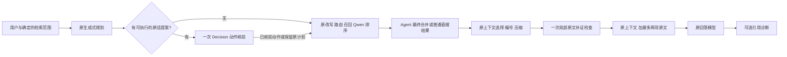

# 项目级 Decision 应用重设计

日期：2026-10-09。范围为普通直搜与现有 Agent 的共同检索管线；Pi 保持独立。上一轮 v3.1 和 incremental-v2 的协议、失败回执及负结果保留。本轮不是对原会话或某个关键词的特判。

## 决策依据

上一轮将任务分类、规划资格和全部模态的 13 个信号绑在一起。独立 10 题 holdout 中 Jev 完整接管 0 次、百炼 1 次；大部分请求仍要调用生成式规划，却先支付一次 Decision。补证还要求候选相对整套原始基线有信息增量，但回答上下文普通文档只呈现前 500 字符，并可能再次压缩。判断所比较的材料和回答模型真正看到的材料不一致。

本轮选择：**生成模型产生开放计划；Decision 校验有来源的有限动作、判断已有原文片段的用途；代码控制权限、预算、追加和回退。** 这也避免把模型给出的概率当作跨任务通用质量分数。

来源不是性能背书：[OpenAI Decisions 指南](https://developers.openai.com/api/docs/guides/decisions)建议明确独立问题及应用内阈值评估；[TypeSafe SDE cascade](https://docs.typesafe.ai/cookbooks/sde_cascade)先生成具体字段再局部核验；[候选值选择](https://docs.typesafe.ai/cookbooks/pre_parsed_value_extraction_cookbook)保留模型选择与原文身份的对应。RouteLLM、Self-RAG、Ragas 的固定提交审查与不可直接迁移的部分见 [研究来源](project-architecture-sources.md)。没有引入它们的训练模型或把它们的得分公式套到 Qwen 排序上。

## 本轮实现

### 1. 自适应意图采用 plan-first

`decision-plan-v1` 在一次原生成式规划中附加最多六个来源提案。每个提案有当前用户原话连续片段、出处、模态、require/forbid，以及 global/object 作用范围。代码先拒绝没有出处、重复 ID、相互矛盾的全局提案；对象级限制不能升级成全模态关闭。

只有可执行提案进入一次 Choice 批次（verified/contradicted/unresolved）。动作能否应用按服务商、请求/实际模型版本、核验模板 hash、require/forbid 用途的独立 profile 判断；未准入、失败或灰区不改该动作。原计划快照与 hash、提案、模型判断、before/after、applied/changed 分开记录。同值的禁止仍是有效约束，后续绑定和子查询不能重新开启。没有提案零 Decision 调用，不再先问 13 个问题来决定是否能省掉规划。

这没有让原 planner 的错误消失：漏提案仍会漏检查；当前用户字面出现也可能是引用或代码，必须由语义核验识别。生效禁止会改变原计划错误开启的媒体分支；承诺是保留原算法和快照，不是声称启用后结果逐项永远相同。启用路径添加提案指令，生成输出可能变化。关闭路径的原提示词与执行方式保持原行为。

### 2. 补证以最终可见上下文为检查点

生产 assist 不再在 reranker 中调用 Decision。它只携带候选池：先按原排序检查未保留项，再检查保留来源的未展示内容。Agent 从各轮候选轮转合并，最终上下文生成时统一检查，不改变子查询规划计数、预算、命中或停滞逻辑。

`visible-evidence-checkpoint-v1` 使用实际压缩后的上下文文字做本地去重，不把完整原始 chunk 当作已经提供的内容。候选是确定性选择的完整原文段落，最多扫描 80 项、单源 80,000 字符、提交 10 个片段，每片段最多 4,000 字符、请求最多 40KB、一次原生调用、阶段最多 3 秒。返回原 chunk ID、原文 offsets、来源与片段 hash、partial_source。

每个片段独立分类为 answer/qualification/counterevidence/inapplicable/irrelevant/uncertain；前面三类且对应概率至少 0.8 可供追加。代码按原候选顺序最多选两项，分数不融合、不重排原结果。原上下文、引用号和名额先冻结，再追加检查过的相同片段；允许同源未展示部分占新的引用编号。接口失败或格式化失败保留原上下文，取消传播，不重试。

本轮没有新建完整需求槽系统，没有生成式原文摘要，也没有证明全局语义新颖性。文本去重仍可能漏掉语义重复；超过候选/片段预算的材料仍可能漏检。回执明确 `comparison_scope=actual_visible_text_only` 和 `global_novelty=not_evaluated`，避免把局部检查包装成全库或全文结论。

### 3. 模式与引用的边界

- off：不运行 Decision，原路径。
- adaptive：保留生成式规划，择需核验来源动作。
- assist：最终上下文最多一次证据选择；Agent 子轮仅记录 deferred。
- force：保留旧独立前置实验及失败停止契约，不偷偷切为 plan-first，也不把严格解释成业务质量更高。
- shadow/replace 历史排序模式及 citation shadow 保留原语义。引用检查仍是已引用文本之间的局部支持诊断，不自动改写答案或认证整答；媒体只检查已有描述/转写。

记录分别展示模型完成、候选被接受、动作生效、证据实际进入上下文。设置不自动切换，已有会话不重放；不重启线上服务清空内存历史，不重建知识库或索引。

## 验证与接受条件

工程验证与质量实验分开：先证明关闭路径、原上下文/编号、范围、取消和失败契约；再使用冻结候选池及局部动作标注测试模型判断。补证增加同样两个名额的 Qwen-next2 / recall-next2 控制，不能把额外材料本身带来的召回提升归给 Decision。

历史 T2 数据用于诊断，已参加过旧研究，不能冒称新 holdout；小规模合成功能题与真实本地流程也不能证明通用质量或稳定 SLA。补证阈值仍是冻结工程门槛；来源动作已执行小规模开发选择与独立保留集准入，仍不是总体概率校准。

### 来源动作：开发选择与独立准入

初版统一 0.85 在 18 题开发诊断上让 Jev 只应用 2/9 个必要动作、Luna 0/9，尽管关系标签分别 18/18、17/18 正确；百炼却有 7 个高概率错误动作。保留该失败结果，没有把通用高概率当可靠性保障。

按用途在开发回执扫描固定 0.50–1.00、步长 0.05 网格：要求零错误动作且正例覆盖至少一半，再最大化正确采用数、并列选更高阈值。冻结选定阈值后，使用新 24 题（每用途 6 正、6 负）做一次独立保留集，预注册零误用且至少 4/6 正确采用才能准入；72/72 原生调用返回有效判断，没有重试、补录或保留集后调参。

| 具体用途 | Jev 1.13.0 | Luna Decisions 20261006 | 百炼 preview |
|---|---|---|---|
| 来源需求 require | 阈值 0.50，6/6 正例、0/6 误用，准入 | 阈值 0.55，5/6 正例、0/6 误用，准入 | 未找到合格开发阈值，只观察 |
| 全局排除 forbid | 阈值 0.70，5/6 正例、0/6 误用，准入 | 阈值 0.50，4/6 正例、0/6 误用，准入 | 未找到合格开发阈值，只观察 |

百炼在保留集原始关系判断中分别错认 5/6、6/6 个负例；表中“只观察”不能掩盖这一语义失败。其他未验证模型/返回版本在这两项用途也只观察，不禁用模型选择或其他阶段。新版本不能继承旧版本准入。

单人标注的小样本准入不代表人群误差率为零；真实生成式 planner 还可能漏提案。原文 span 的并列约束要求复用完整原句，代码不模糊修复不存在的引用。adaptive 保留原 planner 已给出的合法媒体枚举，避免旧关键词补正覆盖语义；off 保留原校验路径。详见 [plan-first 设计与实验](plan-first.md) 及 `evals/decision_plan_v2/` 中可复核的紧凑信号、阈值网格和准入结果。

### 最终上下文补证：改进与负结果一起保留

同一冻结池比较旧 v2、新 checkpoint，三种模型共 162 条 case/policy 记录。新策略每模型 26 个原生批次均成功，另一个纯重复案例不调用；旧策略超时/502 均保留在分母。第一次 runner 启动错误、随后预算混杂的运行也单独保留，没有补填。

| 指标 | Jev | Luna | 百炼 |
|---|---|---|---|
| 8 个功能补证目标：旧 → 新 | 0 → 5，误补 0 | 0 → 4，误补 0 | 1 → 3，误补 1 |
| 20 自然问题平均 Recall：原基线 → 新 | .700 → .725 | .700 → .725 | .700 → .775 |

相同两条额外配额下，Qwen-next2 为 .775，recall-next2 为 .800，新策略没有证明整体优于简单扩充。固定 qrels 存在相关性噪音，不能把所有负标签解释为事实错误；百炼把 H13 用于 H12 是明确功能错例。结论限于解除长基线跳过、减少批次并改善部分有明确标注的漏补，补证仍是按需试用功能。完整口径、控制组、失败和用量见 [checkpoint 评测](context-checkpoint-evaluation.md)。

### 真实管线与最终工程验证

冻结 `evals/decision_project_v2/protocol.json` 后执行三类真实问题 × off/Jev/Luna，共 9 次独立直搜/生成，原文件/知识库未重解析，保存配置哈希不变。论文文本范围题中开启组实际采用三项来源限制并保留文档，关闭组仍受原关键词覆盖影响只给图片；音乐范围题开启组只执行音频检索；`image/png` 字面量题开启组无来源提案、意图 Decision 零调用，不再被关键词强制开启图片。

这些变化包含保留 planner 合法语义的工程修复，不全是 Decision 分类贡献：上述真实限制动作均 `changed=false`，核验确认后阻止后续重新开启。两组 MIME 回答均报告当前库缺少相关证据；返回文档不代表问题已经答对或答全。

直搜开启组 4 次真实最终补证请求中，3 次完成且没有合格追加，Jev 论文题 1 次 `invalid_choice` 后原子回退；音乐两组无文本补证候选，零调用。没有重试补填。不能用公开池中的 78/78 成功覆盖真实管线这次失败。另一个独立 Agent off/Jev 配对验证了约束继承和一次最终 checkpoint，但未完整回答目标问题，并发生嵌入超时；详见 [Agent 实测](plan-first.md#真实-agent-最终上下文验收)。

原生直搜结束时源码 hash 无漂移，快照保存在 `ops/decision-project-v2/source-snapshot/`。随后独立审阅发现并修正两处确定性接线问题：格式化不再重排已经选定的追加片段；生成 error/异常/不完整流保留最终 checkpoint 的真实记录。这两处用专门管线回归验证，未修改或重填此前原生结果。

最终相关后端 **519 passed**，前端 **216 passed**，TypeScript/生产构建和 `git diff --check` 通过。浏览器使用真实 Vite UI 和受控 history 回执检查桌面/390px 手机亮暗主题、一次最终检查、动作原话、仅观察、已选未注入、旧历史与关闭状态；9 张截图已人工查看，修复表格重叠/溢出。该浏览器证据是 UI 契约验证，不是伪造真实聊天记录。

本轮保存配置仍为 TypeSafe、全关闭；未替用户切换。当前 8000 服务健康且有 3 个包含消息的内存会话，**没有重启它以避免清空这些历史，因此当前 3001 页面的运行中后端尚未加载本轮新代码**。新后端代码已在独立进程中完成上述真实调用，当前服务的载入是后续安全重启事项。未 commit；原有未提交工作一并保留。当前知识库、文档、原冻结实验均未重建或覆盖。
