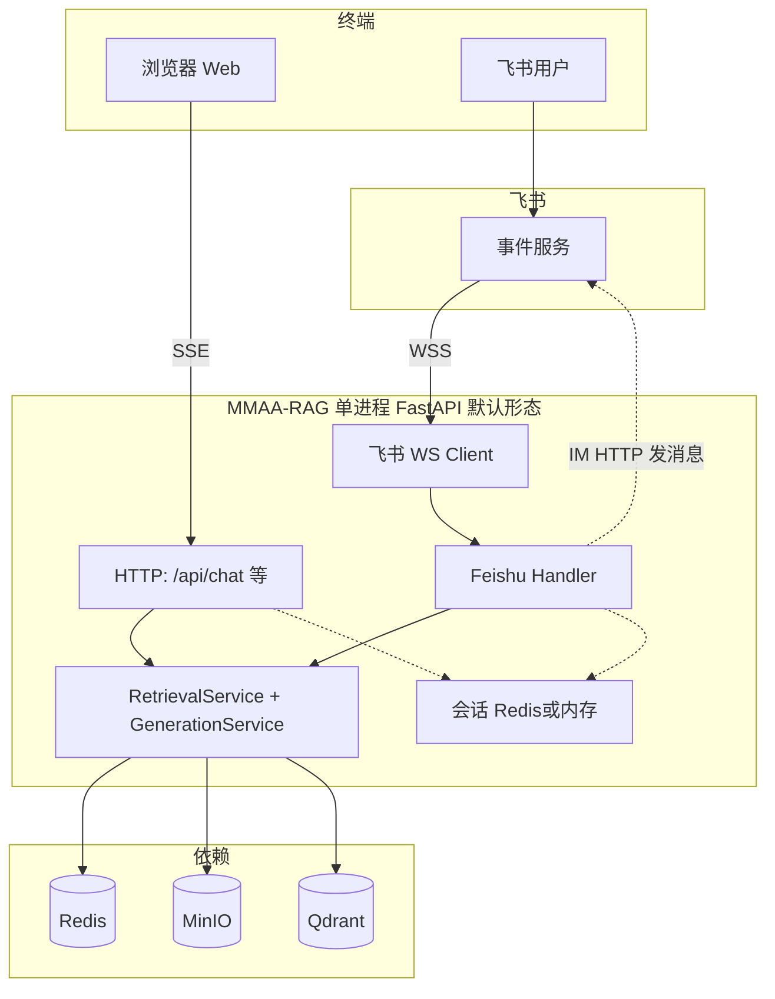

# MMAA-RAG 飞书接入实现方案（详细设计）

> **文档定位**：在 [飞书接入方案分析-websocket.md](./飞书接入方案分析-websocket.md) 的架构结论之上，结合本仓库 **FastAPI + 检索/生成服务 + 内存会话** 的现状，给出**可落地**的实现细则、模块划分、数据流、配置与运维要点。  
> **不包含代码**：仅作实施蓝图；与 [飞书接入方案分析-webhook.md](./飞书接入方案分析-webhook.md) 共享 IM 客户端、Token 缓存、会话与卡片等设计，**事件入口二选一**（Webhook 或长连接），勿重复订阅。

---

## 1. 现状对齐（本仓库事实）

| 模块 | 路径/说明 | 与飞书的关系 |
|------|-----------|--------------|
| 流式对话（Web） | `backend/app/api/chat.py` 的 `GET /api/chat/stream`：SSE，`retrieval_service.search_stream` + `generation_service.stream_generate_response` | 飞书**无 SSE**，需走**非流式**路径或内部消费流再拼接 |
| 非流式生成 | `backend/app/modules/generation/service.py` 的 `generate_response()` | **飞书回复主路径**：检索完成后一次性生成全文 |
| 检索 | `backend/app/modules/retrieval/service.py` 的 `search()` | 与 Web 共用；入参 `kb_context`、`session_context` 与 `chat.py` 一致 |
| 知识库路由 | `backend/app/modules/knowledge/router.py` 的 `KnowledgeRouter.route_query()` | **默认智能路由**：`kb_context` 为空或不带非空 `kb_ids` 时，基于 **kb 画像向量 TopN + 衰减加权 + 归一化决策**（见该文件注释）；仅当传入非空 `kb_ids` 时为 **显式指定**（`routing_method="explicit"`） |
| 会话 | `chat.py` 内全局 `sessions: Dict`（注释已写明生产应迁 Redis/DB） | 飞书需 `session_id = f"feishu_{chat_id}"`（或私聊用 `open_id` 维度，见下文） |
| Redis | `backend/app/core/config.py` 的 `redis_url`；`backend/app/core/portrait_trigger.py` 已有 `redis.Redis.from_url` 用法 | Token 缓存、事件去重、可选会话持久化、任务队列 |
| 异步任务 | `backend/celery_app.py` + 部分画像/导入任务 | **可选**：将「RAG+发消息」下沉为 Celery，避免进程重启丢任务 |
| 应用入口 | `backend/app/main.py`：当前无 `lifespan`；实现飞书后宜增加 **lifespan**，与同进程的 Web API 一起启停 | **默认期望**：**一次启动后端**（及前端照常构建/访问），**网页 SSE 对话与飞书机器人并行可用**，共用进程内检索/生成实例 |

**结论**：飞书适配层的核心是 **「事件 → 快速 ack → 异步 RAG → IM API 回复」**，业务上复用 `RetrievalService.search` + `GenerationService.generate_response`，不修改检索/生成内核即可 MVP。

---

## 2. 目标与非目标

### 2.1 目标（MVP → 增强）

1. **MVP**：用户在飞书单聊/群聊 @机器人发送**纯文本**，机器人**默认走与 Web 端一致的「智能路由策略」**（不固定单一知识库），由 `KnowledgeRouter` 自动选择目标 KB 后完成 RAG，并以**文本或简单卡片**回复。  
2. **回答展示**：在飞书侧**合理呈现与 Web 类似的语义**——正文可分段；**关键配图以内联图片消息送达**（服务端读 MinIO → 飞书发图，见第 7 节）；音视频以说明 + Web 深链为主。  
3. **体验**：可选「正在处理」提示、错误提示友好、重复事件不重复答。  
4. **一次启动、双端可用**：同一套启动方式（如 `uvicorn` / `docker compose up`）拉起服务后，**浏览器 Web 端**与**飞书机器人**均可提问；飞书 WS 与 `/api/chat` 等路由**同进程共生**（默认通过 lifespan + 后台线程，见第 13 节）。  
5. **部署**：开发机可连公网即可调试长连接；**多副本** API 时飞书 WS 须 **单消费者**（见第 9 节），与「单机一体」区分。  
6. **运维**：可观测（连接状态、最近心跳、处理失败率、发图失败率）。

### 2.2 非目标（首版可不做）

- 飞书内流式吐字（平台限制）。  
- 与 Web 端完全共享同一会话存储（若仍用内存 `sessions`，飞书与 Web 天然隔离，需接受或后续统一 Redis）。  
- **用户从飞书上传**图片/文件再做多模态 RAG 的完整链路（与「回答里带图」不同；后者见第 7 节，可作为更后阶段）。

---

## 3. 总体架构（长连接版）

### 3.1 一次启动：网页与飞书共用同一后端进程

**产品期望**：项目启动后，**不额外**再启一个「仅飞书」的进程，即可：

- **Web**：浏览器访问前端，经 `GET /api/chat/stream` 等现有接口对话（SSE）。  
- **飞书**：开放平台事件经 **WSS 进入同一 FastAPI 进程**内的 WS 客户端，异步 RAG 后走 IM API 回复。

**实现要点**：在 `main.py` 引入 **`lifespan`**：`startup` 里若 `FEISHU_WS_ENABLED=true` 则启动飞书 WS（**后台线程**托管 SDK 阻塞式 `start()`，见第 13 节方案 A）；`shutdown` 里优雅停止。Web 路由与飞书 handler **共用**同一套 `RetrievalService` / `GenerationService`（模块级单例或依赖注入，与当前 `chat.py` 实例化方式对齐即可）。

**何时拆进程**：仅当 **K8s 多 Pod 扩 API** 时，飞书长连接必须 **单副本**，再将 WS 拆为独立 worker（第 13 节方案 B）；**单机单副本**（含常见 Docker Compose 一键起）**保持同进程**即可满足「一次启动、双端提问」。

**与 Web 的差异**：入口从「HTTP SSE」变为「WS 事件 + HTTP 发消息」；**超时约束**从「用户等待」变为「事件 handler 须快速返回/SDK 尽快 ack」（官方常见约 3 秒量级，具体以飞书当前文档为准）。

---

## 4. 组件设计

### 4.1 目录与文件规划（建议）

| 路径 | 职责 |
|------|------|
| `backend/app/integrations/feishu_client.py` | `tenant_access_token` 获取与 Redis 缓存；`send_text` / `send_image`（或先上传图片再发送）/ `reply` / 卡片 JSON；HTTP 封装与错误重试 |
| `backend/app/integrations/feishu_presenter.py` | 将 `generate_response` 结果转为**有序飞书消息列表**（正文 Markdown 降级、引用编号占位、筛选配图、兜底深链）；见第 7 节 |
| `backend/app/integrations/feishu_ws.py`（或 `feishu_worker.py`） | 基于官方 SDK 注册 `im.message.receive_v1`；启动/停止；线程或 asyncio 与 FastAPI 的边界 |
| `backend/app/integrations/feishu_handler.py` | 解析事件体、过滤机器人自身消息、拼 `query`、按配置组装 `kb_context`（**默认不传 `kb_ids` 以启用智能路由**；仅显式配置时传入固定列表）、组装 `session_context`、调用 RAG、调用 client 回复 |
| `backend/app/integrations/feishu_parser.py` | 从飞书 `message` 结构提取纯文本（`text` / `post` 富文本等） |
| `backend/app/api/feishu.py`（可选） | `GET /api/feishu/health` 或 `ws-status`；**勿与长连接混用 Webhook 路由**（除非产品明确要求双模且控制台分开应用） |
| `backend/app/core/config.py` | 飞书相关 `Settings` 字段 |

**原则**：Integrations 层只做「飞书协议 ↔ 内部 DTO」，不把业务规则写进 client。

### 4.2 配置项（`Settings` 建议清单）

| 变量 | 说明 |
|------|------|
| `FEISHU_APP_ID` / `FEISHU_APP_SECRET` | 自建应用凭证 |
| `FEISHU_WS_ENABLED` | 是否在 **与 Web 同一进程** 内启动飞书 WS（**需要飞书+网页同时用时设为 `true`**；无飞书凭证的本地环境可 `false`） |
| `FEISHU_DEFAULT_KB_IDS` | **可选，默认留空**。非空时：解析为 `kb_context["kb_ids"]`，强制 **显式知识库**（关闭智能路由）；**空或未设置时**：调用检索时传入 `kb_context=None` 或不包含 `kb_ids` 字段，走 **`KnowledgeRouter` 智能路由** |
| `FEISHU_DEFAULT_CHAT_MODEL`（可选） | 若需与 Web 默认模型区分，可在 handler 里覆盖 `final_generation` 调用参数（需扩展 `llm_manager` 调用或环境变量，属增强项） |
| `FEISHU_REPLY_IN_THREAD`（可选） | 是否使用话题回复（群聊线程），取决于 API 能力与产品 |
| `FEISHU_DEDUP_TTL_SEC` | 去重 TTL，建议 300～600 |
| `FEISHU_SESSION_BACKEND` | `memory` / `redis`（建议生产 `redis`） |
| `FEISHU_IGNORE_BOT_MESSAGES` | 是否忽略来自机器人的消息，防止环路（默认 true） |
| `FEISHU_MAX_REPLY_IMAGES` / `FEISHU_IMAGE_SEND_ENABLED` / `FEISHU_WEB_BASE_URL` | 飞书展示与发图策略，详见 **第 7.6 节** |

**Webhook 专用**（仅当选用 Webhook 方案时）：`FEISHU_ENCRYPT_KEY`、`FEISHU_VERIFICATION_TOKEN`；长连接若全程走 SDK 且控制台加密策略允许，可暂不实现 HTTP 验签，**以飞书控制台与 SDK 文档为准**。

### 4.3 依赖

- 使用飞书官方 **Python SDK**（包名以[开放平台](https://open.feishu.cn)为准，常见为 `lark-oapi`），实现 WSS 鉴权、心跳、事件分发。  
- HTTP 发消息可用 SDK 自带 `im.v1` 封装，或 `httpx` 直连 OpenAPI（二选一，团队统一即可）。

### 4.4 知识库策略：默认智能路由（与代码契约）

与本仓库 `KnowledgeRouter.route_query()` 行为对齐（`backend/app/modules/knowledge/router.py`）：

| 调用方式 | 路由行为 |
|----------|----------|
| `kb_context=None` 或 `kb_context` 无 `kb_ids` / `kb_ids` 为空列表 | **智能路由**：查询向量化 → 在 `kb_portraits` 上 TopN 检索 → 按 KB 聚合打分（位置衰减）→ 归一化与阈值决策；得分整体偏低时走 **`low_confidence` 全库列表**；异常时 **`default_all`** 拉取知识库列表 |
| `kb_context["kb_ids"]` 为非空列表 | **显式指定**：`routing_method="explicit"`，仅检索这些 KB |

**飞书侧默认约定**：

- 未配置或清空 `FEISHU_DEFAULT_KB_IDS` 时，handler **不得**传入非空 `kb_ids`，即与 Web 端「未勾选具体知识库、交给路由」一致。  
- 若运维希望飞书渠道**只查固定库**（合规隔离、降低成本），再设置 `FEISHU_DEFAULT_KB_IDS`，此时为显式模式，**不再使用画像智能决策**。

**依赖与运维注意**：智能路由依赖 **知识库画像已写入向量库**（`kb_portraits`）。若画像缺失，可能出现 `no_portraits` 或走默认/全库分支；上线前应确认画像构建流程与飞书环境一致。

---

## 5. 事件处理流水线（逐步细化）

### 5.1 订阅事件

- 事件类型：**`im.message.receive_v1`**（与 Webhook 文档一致）。  
- 控制台选择 **长连接接收**，**不要**再配置请求 URL（避免双通道重复消费）。

### 5.2 Handler 同步阶段（必须快）

建议顺序：

1. **解析 envelope**：取出 `header.event_id`（或等价唯一键）、`event.message.message_id`、`chat_id`、`sender`、`message_type`。  
2. **去重**：`SET feishu:dedup:{event_id或message_id} NX EX TTL`。若 `NX` 失败 → 直接 return（已处理）。  
3. **过滤**：  
   - `@机器人` 与 **chat_type**（单聊/群聊）规则：群聊通常需判断 `mentions` 或命令前缀，避免机器人对每条群消息都答（见 5.5）。  
   - `message_type` 非文本且无解析能力时 → 回复简短说明或忽略。  
   - **机器人自己发的消息**：必须过滤，否则可能形成环路（依赖 `sender` 与 `app` 的 bot `open_id` 配置）。  
4. **投递异步任务**：`asyncio.create_task(...)` / `BackgroundTasks`（若在 HTTP 路径）/ **Celery `delay`**。  
5. **返回**：SDK 场景下遵循框架要求，确保不在此阶段 `await retrieval_service.search(...)`。

### 5.3 异步阶段（RAG）

1. **会话键**：`session_key = f"feishu:{chat_id}"`（若私聊无 `chat_id` 而用 `open_id`，则 `feishu:p2p:{open_id}`，以实际事件字段为准）。  
2. **读取会话历史**：从内存 `sessions` 或 Redis 读取最近 N 轮（与 `chat.py` 中 `-10` 条对齐即可），格式化为 `session_context: List[{"role","content"}]`。  
3. **知识库上下文**（**默认智能路由**）：  
   - 若未配置 `FEISHU_DEFAULT_KB_IDS`（或解析后列表为空）：传 **`kb_context=None`**（推荐）或仅含 `kb_names` 等辅助字段且**不包含** `kb_ids`，使 `KnowledgeRouter` 走画像智能路由。  
   - 若配置了非空默认 KB 列表：传 `kb_context = {"kb_ids": [...], "kb_names": []}`，与 `chat.py` 显式选库一致。  
4. **检索**：`retrieval_result = await retrieval_service.search(query=..., kb_context=..., session_context=...)`。  
5. **生成**：`result = await generation_service.generate_response(query=..., retrieval_result=retrieval_result, session_id=session_key, kb_context=kb_context)`（`kb_context` 与检索侧保持一致，便于上下文构建逻辑一致）。  
6. **更新会话**：追加 user/assistant 消息；若用内存需注意 **多 worker 不一致**（见第 9 节）。  
7. **下发回复**（与 **第 7 节** 展示策略一致）：  
   - 经 `feishu_presenter` 得到有序消息列表（文本 / 图片 / 卡片），再逐条调用 `feishu_client`。  
   - 优先 **回复消息** API（`reply` 带 `message_id`）以保持线程与引用关系；若不支持则 `send` 到 `chat_id`。  
   - 正文长度超限时 **拆分多条**（飞书单条消息有上限，需查当前文档，常见需分段发送）。

### 5.4 消息体解析（细节）

飞书 `message` 常见字段：

- **`text`**：JSON 字符串，需 `json.loads` 后取 `text`。  
- **`post`**：富文本结构，需递归提取纯文本或限定支持范围。  
- **图片/文件**：首版可回复「请发送文字描述」或仅下载「用户上传到飞书的文件」在取得 `im:resource` 等权限后再做，避免范围膨胀。

**建议**：在 `feishu_parser.py` 中集中实现，并写单元测试用**飞书样例 JSON**（可从开放平台文档复制）。

### 5.5 群聊 @ 与误触发策略

| 场景 | 策略 |
|------|------|
| 单聊 | 用户发给机器人，一般可直接处理 |
| 群聊 | 默认仅当 `mentions` 含本机器人 **或** 消息以触发前缀（如 `/rag `）时处理 |
| 全员通知 | 一般不应触发 RAG |

实现时从事件体读取 **mention 列表**（字段名以官方事件 schema 为准），与 **本机器人 open_id** 比对；`open_id` 可在应用启动时拉取一次并缓存。

---

## 6. 与 `chat.py` 的行为对齐

| 能力 | Web (`/api/chat/stream`) | 飞书建议 |
|------|--------------------------|----------|
| 知识库 | 前端可选中具体 KB；未选时由路由决定 | **默认与「未显式选库」一致**：不传 `kb_ids` → 智能路由；仅当配置 `FEISHU_DEFAULT_KB_IDS` 时等价于「始终勾选固定 KB」 |
| 检索 | `search_stream` + thought 事件 | MVP 用 `search()` 即可；若需「阶段提示」可对用户先发一条「正在检索…」再 `search()` |
| 生成 | `stream_generate_response` | `generate_response()` |
| 引用 | SSE 推送 citations | 卡片或文末「参考文献」列表；**图片**优先 **发图消息**（第 7.3 节）；音视频见第 7.4 节；避免仅依赖内网 MinIO 直链 |
| 多模态呈现 | Markdown 内联图/音视频 | **Presenter 分层**：文字 + 占位与编号 + 有限张图片消息 + 可选「完整版」深链 |
| 会话 | 内存 `sessions` | 同结构写入 `feishu:*` 键；生产用 Redis Hash/JSON |

**可选增强**：抽一层 `internal_chat_facade.py`，统一「query + kb + session → answer + citations」，供 `chat.py` 与飞书调用，减少重复；**首版可不复用重构**，直接调 service 即可。

---

## 7. 飞书侧答案与多模态展示（Markdown / 图片 / 音视频）

Web 端以 **Markdown 正文穿插图片、音频、视频引用** 为主；飞书 IM **不支持与浏览器等价的内联渲染**，且 **MinIO 预签名 URL** 往往对飞书服务端拉取图/卡片缩略图**不可达**或**易过期**。本节规定适配层的**展示契约**，实现时建议独立模块 **`feishu_presenter.py`（或 `feishu_render.py`）**：输入 `generate_response` 的 `answer` + `references_used` / `citations` 等结构化字段，输出「待发飞书消息序列」（文本条数、图片条数、可选卡片 JSON）。

### 7.1 总体原则

| 原则 | 说明 |
|------|------|
| **文字优先** | 用户应能**仅读文字**即理解结论；多模态为辅助，不阻塞主答案送达。 |
| **与网页解耦** | 不把整段网页 Markdown **原样**当作唯一真相；飞书侧做**可控子集**（列表、粗体、代码块尽量保留；复杂表格、嵌套列表降级为纯文本或多条消息）。 |
| **URL 可达性** | 凡需飞书**拉取资源**（图片预览、部分卡片图床）的链接，须对 **飞书服务器** 或 **用户客户端** 可 HTTPS 访问；内网对象存储直链默认**不作为**唯一手段。 |
| **多条消息有序** | 先发**主答案文本**（可分段），再发**关键图片**（见 7.3），再发**参考文献/补充链接**；避免单条消息体积过大被截断。 |

### 7.2 正文（Markdown → 飞书）

- **推荐默认**：将答案转为飞书兼容的 **纯文本或多段文本**；必要时使用 **`post` 富文本**（按开放平台 schema 构造），仅启用团队验证过的元素（段落、部分样式）。  
- **占位与引用编号**：正文中若存在「对应网页上的图/音视频」，在飞书正文里用**简短占位句** + **引用编号**对齐 Web 逻辑，例如：「*（示意图见下方引用 2）*」，避免用户误以为「没生成图」。  
- **长度**：超限时**分段发送**；文末可附一句「完整排版见 Web」并带 **深链**（见 7.5）。

### 7.3 图片：以合适方式送达用户（本方案明确要求）

目标：**在飞书里用户能直接看到关键配图**，而不是只有文字描述。

**推荐实现路径（按优先级）**

1. **服务端拉流 + 飞书发图 API（首选）**  
   - 从与 Web 相同的对象存储读取图片字节流（复用现有 MinIO 逻辑，**走内网**，不依赖飞书能否访问 MinIO）。  
   - 调用飞书 **发送图片消息** 能力（具体 API 以开放平台「发送消息 / 图片类型」为准：常见为 **上传图片资源得 `image_key` 再发送**，或等价流程）。  
   - **发送顺序**：主文字消息之后，按引用顺序或按「与答案相关性」排序，**限制条数**（见配置 `FEISHU_MAX_REPLY_IMAGES`，建议默认 3～5），避免刷屏与频率限制。  

2. **公网可访问的 HTTPS 图 URL + 图片消息/卡片**  
   - 若已有 **CDN / 对外静态域 / 带签名的短链网关**（对飞书可达），可将图片转为该 URL 再发送。  
   - 需处理 **过期**：链接 TTL 应长于用户典型阅读窗口，或在飞书侧已拉取缓存（仍以实际上传 `image_key` 更稳）。  

3. **兜底**  
   - 无法读取对象或上传飞书失败时：**不静默丢弃**——在正文或紧随其后的短消息中说明「图片未能发送到飞书」，并给出 **Web 深链** 或「引用条目中的标题与路径」。

**图片来源选取**

- 从 `references_used` / `citations` 中筛选 `mime` 或路径表明为**图片**的条目；可结合生成阶段返回的「文中引用顺序」。  
- 去重：同一 `file_path` / `object` 只发一次。

**权限与安全**

- 仅发送**当前 RAG 上下文已引用、且用户通过机器人提问所隐含授权范围内**的对象；不在飞书侧暴露未鉴权下载链接。  
- 日志中不对图片字节打 dump，可记录 `image_key`、kb_id、对象路径哈希。

### 7.4 音频与视频

- 飞书内联播放依赖 URL 与客户端能力；**默认策略**：正文说明 + **「在 Web 打开」按钮/深链**；若产品强需求再评估 **文件消息上传**（体积、时长、格式与 API 限制以官方为准）。  
- 不把仅内网可达的预签名 URL 作为唯一播放入口。

### 7.5 参考文献与「完整版」入口

- **参考文献**：以**第二条及以后消息**或**消息卡片**展示：编号、标题、短摘要、可选 `kb_id`/文档名；**避免**依赖 MinIO 长链作为唯一信息。  
- **Web 深链**（推荐配置 `FEISHU_WEB_BASE_URL` + 会话/消息标识策略）：按钮文案如「查看完整 Markdown 与多媒体」；深链落地到已登录 Web 的对话或只读分享页（具体路由由产品定，方案层预留配置）。

### 7.6 配置项补充（展示层）

| 变量 | 说明 |
|------|------|
| `FEISHU_MAX_REPLY_IMAGES` | 单次回答最多发送几张独立图片消息（默认如 `4`） |
| `FEISHU_IMAGE_SEND_ENABLED` | 是否启用「拉取对象 + 飞书发图」路径（默认 `true`；关闭则仅文字+深链） |
| `FEISHU_WEB_BASE_URL` | 前端站点根 URL，用于生成「完整版」链接（可选） |

（若走公网图 URL 再发图，可另设 `FEISHU_MEDIA_PUBLIC_BASE_URL` 等，与网关方案绑定。）

### 7.7 与流水线的衔接

- **5.3 异步阶段第 7 步「下发回复」**扩展为：先调用 **`feishu_presenter` 生成消息列表**，再按序调用 `feishu_client`（`send_text` / `send_image` / `send_card`）；**同一次用户提问**在业务上视为一轮回复，**去重键仍以事件为准**，不因多条发送而重复触发 RAG。  
- **单元测试**：对 presenter 输入固定 `generation_result` fixture，断言输出消息条数、图片条数上限、兜底文案。

---

## 8. Token 与 IM API 细节

### 8.1 `tenant_access_token`

- 接口：`auth/v3/tenant_access_token/internal`（自建应用）。  
- 缓存：Redis key 如 `feishu:tenant_access_token`，TTL 设为 **expires_in - 120 秒**（留出余量）。  
- 并发：多协程同时 miss 时，使用 **单飞（singleflight）** 或 Redis `SETNX` 锁，避免惊群换 token。

### 8.2 发消息

- `receive_id_type=chat_id` 与 `open_id` 的选用与**单聊/群聊**一致。  
- 除文本外，需支持 **图片消息**（上传换 `image_key` 再发送等，以开放平台为准），供第 7 节 presenter 调用。  
- 错误码：**token 过期**应刷新重试一次；**频率限制**应退避并记录日志。  
- **幂等**：业务层已通过去重保证不重复生成；IM 发送失败可有限次重试并告警。

---

## 9. 部署与多实例策略（必读）

飞书长连接：**多连接时同一条事件只会到其中一个连接**（集群推送）。因此：

| 部署形态 | 做法 |
|----------|------|
| 单机单进程（网页+飞书同启） | **方案 A**：`FEISHU_WS_ENABLED=true`，与 Uvicorn **同一进程**；Web 与飞书共用 RAG |
| K8s 多副本 API | **方案 B** 或 **仅 1 个 Pod** `FEISHU_WS_ENABLED=true`，其余 Pod 关闭 WS；或单独 `feishu-consumer` Deployment `replicas: 1` |
| 水平扩展 RAG | Consumer 收事件 → 推 **Redis Stream / Celery** → 多个 worker 消费任务；**consumer 仍为单副本** |

**进程重启**：内存队列中的 `create_task` 会丢失。生产建议：

- **至少**：接受「重启期间消息可能未答」（依赖飞书重推 + 去重）。  
- **更好**：任务入 **Celery** 或 **Redis Stream**，处理完成前 key `feishu:processing:{id}` 标记。

---

## 10. 安全与合规

- **密钥**：`APP_SECRET` 仅环境变量/密钥管理，不入库、不进日志。  
- **租户隔离**：若未来多租户，需在事件体中解析 `tenant_key` 并映射不同 KB/模型。  
- **敏感回复**：与 Web 端相同，依赖现有生成与审计；可对飞书渠道增加「免责声明」模板。  
- **权限最小化**：仅申请 `im:message`、`im:message:send_as_bot` 等必要 scope。

---

## 11. 可观测性

- **日志**：`event_id`、`message_id`、`chat_id` 打在同一行，便于与飞书后台对齐。  
- **指标**（可选 Prometheus）：`feishu_events_total`、`feishu_dedup_skipped_total`、`feishu_rag_duration_seconds`、`feishu_im_send_errors_total`、`feishu_image_upload_failures_total`（或按失败原因分 label）。  
- **探活**：`GET /api/feishu/ws-status` 返回 `connected`、`last_pong_at`、`last_event_at`（内存或 Redis）。

---

## 12. 测试计划

| 层级 | 内容 |
|------|------|
| 单元测试 | `feishu_parser` 对多种 `message` JSON；去重逻辑；**`feishu_presenter`** 对含 citations 的生成结果（条数上限、兜底文案） |
| 集成测试 | Mock IM API + 真实 `RetrievalService`（或 fixture KB）；**默认路径**断言未传 `kb_ids` 时路由非 `explicit`，且多 KB 场景下命中与查询语义一致的库；**发图路径** Mock 飞书上传接口 |
| 手工 | **单次启动**后同时验：Web 发一条、飞书发一条；控制台长连接；单聊/群聊 @；重复事件；断网重连；**含图回答在飞书内可见配图** |

---

## 13. 与 `main.py` 的集成方式（二选一）

### 方案 A：FastAPI `lifespan` + 后台线程（**默认：满足「一次启动，网页 + 飞书都能用」**）

- 在 `lifespan` 的 startup 中若 `FEISHU_WS_ENABLED`，启动 **daemon 线程** `cli.start()`（以 SDK 是否阻塞为准）。  
- **同一进程**内继续提供 `/api/chat/stream` 等 Web 接口，**无需**第二条启动命令。  
- shutdown：`stop_event` + SDK 停止方法。  
- **注意**：避免在同步 SDK 回调里直接跑重 CPU/阻塞 IO；应 `asyncio.run_coroutine_threadsafe` 或丢队列。

### 方案 B：独立进程 `python -m app.integrations.feishu_ws_worker`

- 与 API 进程分离，用于 **K8s 多副本 API**：多个 Pod 跑 Web，**仅 1 个** Pod/Deployment 跑飞书 WS（或专用 `feishu-consumer`）。  
- Worker 内初始化与 API 相同的 `Settings`、Redis、Retrieval/Generation 实例（或 worker 只调内部 HTTP `POST /internal/feishu/dispatch`，减少重复依赖，属架构取舍）。  
- **注意**：此模式下「一次启动」指 **Compose/K8s 编排同时拉起 api + feishu-worker**；对用户而言仍是一条 `docker compose up`，但进程数为 2+。

**推荐**：

- **本地开发、Docker Compose 单机、单副本生产**：**方案 A**，与产品目标「启动一次，网页和飞书都能提问」一致。  
- **API 水平多副本**：**方案 B**（或仅一个副本启用 WS，其余副本 `FEISHU_WS_ENABLED=false`），避免多条飞书连接抢同一租户事件。

---

## 14. 分阶段交付清单

| 阶段 | 交付物 | 验收标准 |
|------|--------|----------|
| **P0** | SDK 长连接 + 文本问答 + 去重 + **默认智能路由** + **与 Web 同进程 lifespan** | **同一启动**后：浏览器对话与飞书 @ 机器人均可通；飞书发一句收到 RAG 答案；日志中可见智能路由非 `explicit` 时结果（如 `low_confidence` / `default_all` 等） |
| **P1** | **`feishu_presenter` + 关键配图**：内网读对象 + 飞书发图、条数上限、失败兜底文案 | 引用中含图片时，飞书会话内**可见独立图片消息**（非仅文字）；上传失败时有说明 |
| **P2** | 卡片展示引用摘要、会话 Redis 化、可选 `FEISHU_WEB_BASE_URL` 深链 | 参考文献结构化；重启后会话可延续；用户可跳转 Web 看完整 Markdown |
| **P3** | Celery 异步、用户上传文件/图作为输入的多模态 RAG | 大并发与「飞书进、飞书出」全链路增强 |

---

## 15. 风险与对策

| 风险 | 对策 |
|------|------|
| RAG 过慢，用户无反馈 | 异步开始后立即发「正在检索与生成，请稍候…」 |
| 飞书重试导致重复答 | Redis 去重 + 可选 processing 锁 |
| 多实例重复连接 | 部署层保证单 consumer；HPA 不误扩 WS |
| 内存 `sessions` 与多进程 | 飞书 worker 单实例或改 Redis |
| 回答超长 | 分段发送 + 尾部省略说明 |
| 智能路由无画像或得分异常 | 确认 KB 画像任务已跑通；关注 `no_portraits` / 全库 fallback 的耗时与费用；必要时对飞书渠道改 `FEISHU_DEFAULT_KB_IDS` 显式限域 |
| 飞书发图/上传接口失败或限频 | 重试与退避；单轮配图数上限；降级为文字说明 + Web 深链；监控 `feishu_image_upload_failures_total` |

---

## 16. 文档与协作

- 运维文档：环境变量清单、控制台截图步骤；**单机一体**写清 `FEISHU_WS_ENABLED=true` 与同进程启动；**多副本**写清仅单实例 WS。  
- 与产品对齐：群聊触发规则、卡片模板、**单轮最多配图张数**、是否启用 Web 深链、错误时文案。  
- 保持与 [飞书接入方案分析-websocket.md](./飞书接入方案分析-websocket.md)、[飞书接入方案分析-webhook.md](./飞书接入方案分析-webhook.md) 交叉引用：**事件通道二选一**，业务内核一致。

---

## 17. 小结

本方案在不变更 `RetrievalService` / `GenerationService` 核心的前提下，通过 **integrations 适配层 + 异步流水线** 将 MMAA-RAG 接入飞书。**默认部署形态**为 **与 Web 同进程启动**（`lifespan` + 后台 WS 线程，`FEISHU_WS_ENABLED=true`），实现 **一次启动项目后，网页与飞书均可提问**，共用同一套 RAG 与依赖；仅在 API **多副本**时改为独立飞书 consumer 或单 Pod 开 WS。**知识库侧默认采用与系统一致的智能路由策略**（`KnowledgeRouter` + 画像检索），仅在需要时用 `FEISHU_DEFAULT_KB_IDS` 切换为显式固定库。**回答在飞书侧的展示**由 **`feishu_presenter`** 统一处理：正文为 Markdown 兼容子集 + 引用占位；**配图以内网读存储 + 飞书发图为主路径**，音视频与完整排版以 Web 深链为补充。实现时优先 **P0 文本闭环**，**P1 完成关键配图送达**，再迭代卡片、会话持久化与用户上传多模态输入。
